# 2023 年面向新生和有经验者的顶级核心 Java 面试问题

> 原文：<https://www.edureka.co/blog/interview-questions/java-interview-questions/>

在这篇 Java 面试问题博客中，我将列出一些对 Java 编程最重要的问题和答案，它们将使你在面试过程中脱颖而出。全世界大约有 1000 万开发人员使用 Java 为 150 亿台支持 Java 的设备开发应用程序。它还被用于创建将大数据等趋势技术应用到手机和 DTH 盒子等家用设备的应用程序。于是今天， **Java 到处都在用！**这就是为什么 [***Java 认证***](https://www.edureka.co/java-j2ee-training-course) 是编程领域最抢手的认证。

Let us start by taking a look at some of the most frequently asked Java interview questions,   

Q1。解释 JDK、JRE 和 JVM？ Q2。[解释 Java](#explain-public-static-void-main) 中的公共静态 void main(String args[])T5【Q3】。[为什么 Java 是平台无关的？](#java-platform-independent) Q4。[为什么 Java 不是 100%面向对象？](#why-java-100%-oriented) Q5。[Java 中有哪些包装类？](#wrapper-classes) Q6。[Java 中有哪些构造函数？](#constructors-in-java) Q7。[什么是 Java 中的 singleton 类，怎样才能让一个类成为 singleton？](#singleton-class) Q8。[Java 中数组列表和 vector 有什么区别？](#difference-between-arraylist-and-vector) Q9。[Java 中 equals()和==有什么区别？](#difference-between-equals-and==) Q10。[Java 中堆内存和栈内存有什么区别？](#difference-between-heap-and-stack)

Want to upskill yourself to get ahead in Career? Check out the ***[Top Trending Technologies](https://www.edureka.co/blog/top-10-trending-technologies/)**.*We have compiled a list of top Java interview questions which are classified into 7 sections, namely:

1.  [Java 基础面试试题](#basic)
2.  [Java OOPs 面试题](#OOPs)
3.  [JDBC 面试问题](#JDBC)
4.  [春季面试试题](#Spring)
5.  [冬眠面试问题](#hibernate)
6.  [JSP 面试题](#jsp)
7.  [Java 异常与线程面试题](#exception)

## **Java 面试问答| edu reka**

                                                               [https://www.youtube.com/embed/oYXivKMSEqM?version=3&rel=1&fs=1&autohide=2&showsearch=0&showinfo=1&iv_load_policy=1&wmode=transparent](https://www.youtube.com/embed/oYXivKMSEqM?version=3&rel=1&fs=1&autohide=2&showsearch=0&showinfo=1&iv_load_policy=1&wmode=transparent)

作为一名 Java 专业人员，了解正确的流行词汇、学习正确的技术以及准备常见 Java 面试问题的正确答案是至关重要的。这里有一个权威的 Java 面试问题列表，可以保证你轻松进入下一个阶段。

*如果你最近参加了 Java 面试，或者有我们没有涉及到的其他问题，我们鼓励你在我们的 **[QnA 论坛](https://www.edureka.co/community/)** 上发表。我们的专家团队将尽快回复您。*

那么让我们从第一组基本的 Java 面试问题开始吧。

## **大一学生基础 Java 面试题**

### **Q1。解释 JDK，JRE 和 JVM？**

 <caption>#### **JDK vs JRE vs JVM**</caption> 
| JDK | **JRE** | **JVM** |
| 它代表 Java 开发工具包。 | 它代表 Java 运行时环境。 | 它代表 Java 虚拟机。 |
| 是编译、文档化、打包 Java 程序的必备工具。 | JRE 指的是 Java 字节码可以在其中执行的运行时环境。 | 这是一台抽象的机器。它是一个提供运行时环境的规范，Java 字节码可以在这个环境中执行。 |
| 包含 JRE +开发工具。 | 这是物理上存在的 JVM 的一个实现。 | JVM 遵循三种符号:规范、**实现、**和**运行时实例**。 |

### **Q2。解释 Java 中的公共静态 void main(String args[])。**

Java 中的 main()是任何 Java 程序的入口点。它总是写成**public static void main(String[]args)**。

*   **public** : Public 是一个访问修饰符，用来指定谁可以访问这个方法。Public 意味着任何类都可以访问该方法。
*   **静态**:是 java 中的一个关键字，标识它是基于类的。main()在 Java 中是静态的，因此无需创建类的实例就可以访问它。如果 main 不是静态的，那么编译器将抛出一个错误，因为 JVM 在创建任何对象之前调用了 **main** ()并且只有静态方法可以通过该类直接调用。
*   **void** :是方法的返回类型。Void 定义了不会返回任何值的方法。
*   **main** :它是 JVM 搜索的方法的名称，作为一个只有特定签名的应用程序的起点。它是主要执行发生的方法。
*   **String args[]** :传递给 main 方法的参数。

### **Q3。为什么 Java 是平台无关的？**

Java 被称为平台无关的，因为它的字节码可以在任何系统上运行，而与它的底层操作系统无关。

### **Q4。为什么 Java 不是 100%面向对象？**

Java 不是 100%面向对象的，因为它使用了布尔、字节、字符、整数、浮点、双精度、长整型、短整型等八种原始数据类型，而这些类型都不是对象。

### **Q5。Java 中的包装类是什么？**

包装类将 Java 原语转换成引用类型(对象)。每种原始数据类型都有一个专用的类。这些被称为包装类，因为它们将原始数据类型“包装”到该类的对象中。参考下图，其中显示了不同的原始类型、包装类和构造函数参数。

### **Q6。Java 中的构造函数是什么？**

在 Java 中，构造函数指的是用来初始化对象的代码块。它必须与类的名称相同。此外，它没有返回类型，并且在创建对象时自动调用。

有两种类型的构造函数:

1.  **默认构造函数:**在 Java 中，默认构造函数是不接受任何输入的构造函数。换句话说，默认构造函数是无参数构造函数，如果用户没有定义其他构造函数，默认情况下会创建无参数构造函数。它的主要目的是用默认值初始化实例变量。此外，它主要用于对象创建。
2.  **参数化构造函数:**Java 中的参数化构造函数，是能够用提供的值初始化实例变量的构造函数。换句话说，接受参数的构造函数叫做参数化构造函数。

### **Q7。什么是 Java 中的 singleton 类，怎样才能让一个类成为 singleton？**

单例类是在一个 JVM 中，任何时候只能创建一个实例的类。通过使类的构造函数私有，可以使类成为单例类。

### **Q8。Java 中数组列表和 vector 有什么区别？**

| 阵列列表 | **矢量** |
| 数组列表不同步。 | 矢量被同步。 |
| 由于是非同步的，数组列表很快。 | 向量很慢，因为它是线程安全的。 |
| 如果一个元素被插入到数组列表中，它会增加 50%的数组大小。 | Vector 默认为其数组大小的两倍。 |
| 数组列表没有定义增量大小。 | 矢量定义了增量大小。 |
| 数组列表只能使用迭代器来遍历数组列表。 | Vector 可以使用枚举和迭代器进行遍历。 |

### **Q9。Java 中 equals()和==有什么区别？**

Equals()方法在 Java 的 Object 类中定义，用于检查业务逻辑定义的两个对象是否相等。

“= =”或 Java 中的等式运算符是 Java 编程语言提供的一种二元运算符，用于比较原语和对象。*public boolean equals(Object o)*是 Object 类提供的方法。默认实现使用==运算符来比较两个对象。例如:方法可以像字符串类一样被覆盖。equals()方法用于比较两个对象的值。

### **Q10。什么时候可以使用 super 关键字？**

在 Java 中，super 关键字是一个引用变量，它引用一个直接的父类对象。

当你创建一个子类实例时，你也创建了一个父类的实例，它被超级引用变量引用。

Java 超级关键字的用途是-

1.  若要引用直接父类实例变量，请使用 super。
2.  关键字 super 可以用来调用直接父类的方法。
3.  Super()可以用来调用直接父类的构造函数。

### **Q11。哈希表和树集的区别是什么？**

| **哈希集** | **树集** |
| 通过哈希表实现。 | TreeSet 实现了 SortedSet 接口，使用树来存储数据。 |
| 它允许空对象。 | 它不允许空对象。 |
| 它比 TreeSet 更快，尤其是在搜索、插入和删除操作方面。 | 对于这些操作，它比 HashSet 慢。 |
| 它不以有序的方式维护元素。 | 元素以排序的顺序维护。 |
| 它使用 equals()方法来比较两个对象。 | 它使用 compareTo()方法来比较两个对象。 |
| 它不允许异质对象。 | 它允许一个异质的物体。 |

**Q12。Java 中 HashMap 和 HashTable 有什么区别？**

| **HashMap** | **哈希表** |
| 它是不同步的。如果没有合适的同步代码，它就不能在多个线程之间共享。 | 它是同步的。它是线程安全的，可以被许多线程共享。 |
| 它允许一个空键和多个空值。 | 它不允许任何空键或空值。 |
| 是 JDK 1.2 中引入的新类。 | 它也存在于 java 的早期版本中。 |
| 它更快。 | 它比较慢。 |
| 它通过迭代器被遍历。 | 它通过枚举器和迭代器遍历。 |
| 它使用失败快速迭代器。 | 它使用非快速失败的枚举器。 |
| 它继承 AbstractMap 类。 | 它继承了字典类。 |

**Q13。Java 中反射的重要性是什么？**

反射是一个运行时 API，用于检查和更改方法、类和接口的行为。Java 反射是一个非常有用的强大工具。Java 反射允许您在运行时分析类、接口、字段和方法，而无需知道它们在编译时被调用了什么。反射还可以用于创建新对象、调用方法以及获取/设置字段值。用户定义的外部类可以通过创建具有完全限定名称的扩展性对象的实例来使用。调试器也可以使用反射来检查类的私有成员。

**Q14。如何在 Java 中不允许类的属性序列化？**

非序列化属性可用于防止成员变量被序列化。如果可能的话，你还应该使一个可能包含安全敏感数据的对象不可序列化。如果对象必须序列化，则将非序列化属性应用于存储敏感数据的某些字段。如果不从序列化中排除这些字段，它们存储的数据将对任何具有序列化权限的程序可见。

**Q15。你能在另一个构造函数内部调用一个类的构造函数吗？**

是的，我们可以在一个构造函数中调用另一个类的构造函数。这也称为构造函数链接。构造函数链接有两种方式

1.  **同类内:**对于同类的构造函数，可以使用 this()关键字。
2.  **从基类:**super()关键字用于从基类调用构造函数。构造函数链接遵循继承的过程。子类的构造函数首先调用超类的构造函数。因此，子类对象的创建从超类数据成员的初始化开始。构造函数链对任意数量的类都起着类似的作用。每个构造函数一直调用这个链，直到链的顶端。

**Q16。连续内存位置通常用于存储数组中的实际值，而不是数组列表中的值。解释一下。**

数组通常包含原始数据类型的元素，如 int、float 等。在这种情况下，数组直接将这些元素存储在连续的内存位置。而数组列表不包含原始数据类型。数组列表包含不同内存位置的对象的引用，而不是对象本身。这就是为什么对象不存储在连续的内存位置。

**Q17。使用 new()创建字符串与使用文字创建字符串有何不同？** 当我们使用 new()创建一个字符串时，一个新的对象就被创建了。然而，如果我们使用字符串语法创建一个字符串，它可能会返回一个已经存在的同名对象。

**Q18。为什么同步是必要的？借助一个相关的例子来解释。**

Java 允许多线程执行。他们可能正在访问同一个变量或对象。同步有助于一个接一个地执行线程。这很重要，因为它有助于同步执行所有并发线程。它可以防止由于访问共享内存而导致的内存一致性错误。同步代码的一个例子是-

```
public synchronized void increment()
{
a++;
}
```

因为我们已经同步了这个函数，所以这个线程只能在前一个线程使用了这个对象之后才能使用它。

**Q19。解释一下 Java 中“双括号初始化”这个术语？**

双括号初始化是一个 Java 术语，指的是两个独立进程的组合。这里使用了两个大括号。第一个大括号创建一个匿名内部类。第二个大括号是初始化块。当这两者一起使用时，称为双大括号初始化。内部类有一个对封闭外部类的引用，通常使用“this”指针。它用于在一条语句中完成创建和初始化。它通常用于初始化集合。它减少了代码，也使它更具可读性。

**Q20。为什么说 String 类的 length()方法不返回准确的结果？**

String 类的 length()方法不会返回准确的结果，因为它只是考虑了字符串中的字符数。换句话说，BMP(基本多语言平面)之外的代码点，即值为 U+10000 或以上的代码点，将被忽略。

这是有历史原因的。Java 最初的目标之一是将所有文本视为 Unicode 然而，当时 Unicode 并没有在 BMP 之外定义代码点。当 Unicode 指定这样的代码点时，修改 char 已经太晚了。

**Q21。Java 中堆内存和栈内存有什么区别？**

堆内存和栈内存的主要区别是:

| **特征** | **栈** | **堆** |
| *记忆* | 堆栈内存仅由一个执行线程使用。 | 应用程序的所有部分都使用堆内存。 |
| *访问* | 其他线程无法访问堆栈内存。 | 存储在堆中的对象是全局可访问的。 |
| *内存管理* | 遵循 LIFO 方式释放内存。 | 内存管理基于与每个对象相关联的层代。 |
| *终生* | 一直存在到线程执行结束。 | 堆内存从应用程序执行的开始一直存在到结束。 |
| *用法* | 堆栈内存只包含堆空间中对象的本地原语和引用变量。 | 无论何时创建一个对象，它总是存储在堆空间中。 |

### **Q22。****Java 中的包是什么？列出包装的各种优点。**

Java 中的包是捆绑在一起的相关类和接口的集合。通过使用包，开发人员可以轻松地模块化代码并优化其重用。此外，包中的代码可以被其他类导入并重用。下面我列举了它的几个优点:

*   包有助于避免名称冲突
*   它们为代码提供了更简单的访问控制
*   包也可以包含隐藏类，这些隐藏类对外部类不可见，只在包内使用
*   创建一个适当的层次结构，使相关类的定位更加容易

### **Q23。Java 中为什么不用指针？**

Java 不使用指针，因为它们不安全，而且会增加程序的复杂性。因为 Java 以代码简单著称，所以添加指针的概念将是矛盾的。此外，由于 JVM 负责隐式内存分配，因此为了避免用户直接访问内存，Java 中不鼓励使用指针。

### **Q24。****Java 中的 JIT 编译器是什么？**

JIT 代表 Java 中的实时编译器。它是一个帮助将 Java 字节码转换成直接发送给处理器的指令的程序。默认情况下，JIT 编译器在 Java 中是启用的，并且每当调用 Java 方法时都会被激活。然后，JIT 编译器将被调用方法的字节码编译成本机代码，编译成“实时”执行。一旦方法被编译，JVM 直接调用该方法的编译代码，而不是解释它。这就是为什么它经常负责 Java 应用程序在运行时的性能优化。

### **Q25。Java 中的访问修饰符是什么？**

在 Java 中，访问修饰符是特殊的关键字，用于限制一个类、构造函数、数据成员和另一个类中的方法的访问。Java 支持四种类型的访问修饰符:

1.  *默认*
2.  *私人*
3.  *被保护的*
4.  *公共*

| **修改** | **默认** | **私人** | **被保护的** | **公共** |
| *同类* | 是 | 是 | 是 | 是 |
| *同包子类* | 是 | 否 | 是 | 是 |
| *同包非子类* | 是 | 否 | 是 | 是 |
| *不同包子类* | 否 | 否 | 是 | 是 |
| *不同包的非子类* | 否 | 否 | 否 | 是 |

### **Q26。定义一个 Java 类。**

Java 中的一个类是一张蓝图，包含了你所有的数据。一个类包含描述对象行为的字段(变量)和方法。让我们来看看类的语法。

```
class Abc {
member variables // class body
methods}
```

### **Q27。Java 中的对象是什么，是如何创建的？**

对象是现实世界中具有状态和行为的实体。一个物体有三个特征:

1.  状态
2.  行为
3.  身份

使用“新建”关键字创建一个对象。比如:

class name obj = new class name()；

### **Q28。什么是面向对象编程？**

面向对象编程是一种编程模型或方法，其中程序是围绕对象而不是逻辑和功能来组织的。换句话说，OOP 主要关注的是需要被操作的对象，而不是逻辑。这种方法对于大型复杂代码的程序来说是理想的，并且需要积极地更新或维护。

### **Q29。Java 中 OOPs 的主要概念是什么？**

面向对象编程是一种编程风格，与如下概念相关联:

1.  *继承:*继承是一个类获得另一个类的属性的过程。
2.  *封装:*Java 中的封装是一种将数据和代码打包成一个单元的机制。
3.  *抽象:*抽象是对用户隐藏实现细节，只向用户提供功能的方法论。
4.  *多态性:*多态性是一个变量、函数或对象采取多种形式的能力。

### **Q30。局部变量和实例变量有什么区别？**

在 Java 中，**局部变量**通常用在方法、构造函数或者**块**中，并且只有局部作用域。因此，该变量只能在块的范围内使用。拥有局部变量的最大好处是，类中的其他方法甚至不知道这个变量。

#### 举例

```
if(x > 100)
{
String test = "Edureka";
}
```

而 Java 中的**实例变量**，是一个绑定到其对象本身的变量。这些变量在一个**类**中声明，但是在一个方法之外。该类的每个对象在使用变量时都会创建自己的副本。因此，对变量的任何更改都不会反映在该类的任何其他实例中，而只会绑定到该特定实例。

```
class Test{
public String EmpName;
public int empAge;
}
```

### **Q31。区分 Java 中的构造函数和方法？**

| **方法** | **构造者** |
| 1。用于表示一个对象的行为 | 1。用于初始化一个对象的状态 |
| 2。必须有返回类型 | 2。没有任何返回类型 |
| 3。需要显式调用 | 3。被隐式调用 |
| 4。编译器没有提供默认方法 | 4。如果类没有，编译器会提供一个默认的构造函数 |
| 5。方法名可能与类名相同，也可能不同 | 5。构造函数名必须始终与类名相同 |

如果你在这些核心 Java 面试问题上面临任何挑战，请在下面的部分评论你的问题。

### **Q32。Java 中的 final 关键字是什么？**

**final** 是 Java 中的一个特殊关键字，用作非访问修饰符。final 变量可以在不同的上下文中使用，例如:

*   **最终变量**

当 final 关键字与变量一起使用时，其值一旦赋值就不能更改。如果最后一个变量没有赋值，那么只使用类构造函数就可以给它赋值。

*   #### **Final method**

当一个方法被声明为 final 时，它不能被继承类覆盖。

*   #### **Final Class**

当一个类在 Java 中被声明为 final 时，它不能被任何子类扩展，但是它可以扩展其他类。

### **Q33。break 和 continue 语句的区别是什么？**

| **破** | **继续** |
| 1。可用于 switch 和 loop (for、while、do while)语句 | 1。只能与循环语句一起使用 |
| 2。它导致 switch 或 loop 语句在执行时终止 | 2。它不会终止循环，但会导致循环跳转到下一次迭代 |
| 3。它立即终止最里面的封闭循环或开关 | 3。嵌套了开关的循环中的 continue 将导致下一个循环迭代执行 |

***Example break:***

```
for (int i = 0; i < 5; i++)</div>
<div>
<pre>{
if (i == 3)
{
break;
}
System.out.println(i);
}
```

***Example continue:***

```
for (int i = 0; i < 5; i++)
{
if(i == 2)
{
continue;
}
System.out.println(i);
}
```

### **Q34。什么是 Java 中的无限循环？举例说明。**

无限循环是 Java 中的一个指令序列，当没有遇到函数出口时，它会无休止地循环。这种类型的循环可能是编程错误的结果，也可能是基于应用程序行为的故意行为。一旦应用程序退出，无限循环将自动终止。

例如:

```
public class InfiniteForLoopDemo
{
public static void main(String[] arg) {
for(;;)
System.out.println("Welcome to Edureka!");
// To terminate this program press ctrl + c in the console.
}
}
```

### **Q35。Java 中的 this()和 super()有什么区别？**

在 Java 中，super()和 this()都是用于调用构造函数的特殊关键字。

| **本()** | **超()** |
| 1。this()表示一个类的当前实例 | 1。super()表示父/基类的当前实例 |
| 2。用于调用同一个类的默认构造函数 | 2。用于调用父/基类的默认构造函数 |
| 3。用于访问当前类的方法 | 3。用于访问基类的方法 |
| 4。用于指向当前的类实例 | 4。用于指向超类实例 |
| 5。必须是块的第一行 | 5。必须是块的第一行 |

### **Q36。什么是 Java 字符串池？**

Java 字符串池指的是存储在堆内存中的字符串集合。在这种情况下，每当创建一个新对象时，String pool 首先检查该对象是否已经存在于池中。如果存在，那么相同的引用被返回到变量，否则新的对象将在字符串池中被创建，并且相应的引用将被返回。

**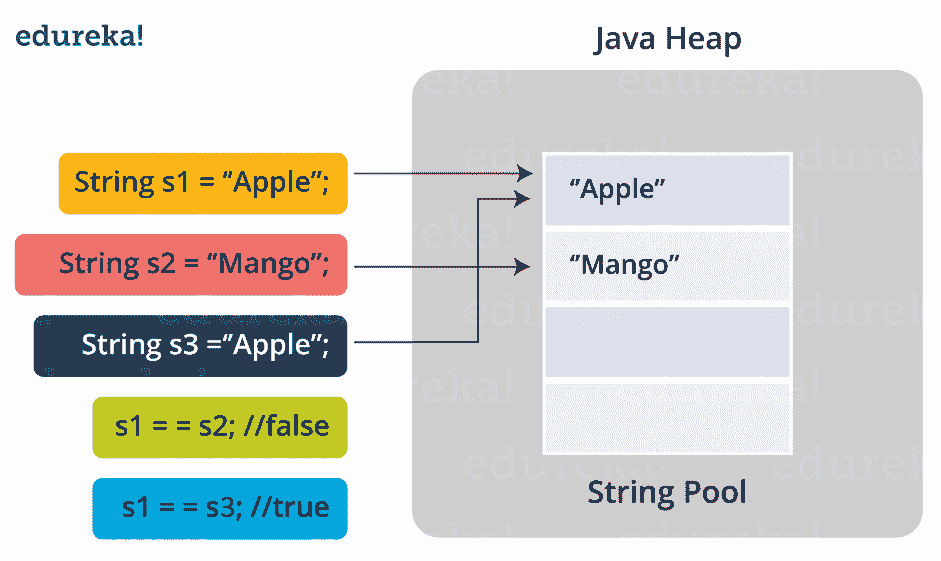**

### **Q37。区分 Java 中的静态和非静态方法。**

| **静法** | **非静态法** |
| 1。*静态的*关键字必须用在方法名之前 | 1。不需要在方法名前使用*s*static 关键字 |
| 2。使用类(className.methodName) 调用它 | 2。它可以像任何通用方法一样被调用 |
| 3。他们不能访问任何非静态的实例变量或方法 | 3。它可以访问任何静态方法和任何静态变量，而无需创建类的实例 |

### **Q38。解释一下 Java 中的术语“双括号初始化”？**

双括号初始化是一个 Java 术语，指的是两个独立进程的组合。这里使用了两个大括号。第一个大括号创建一个匿名内部类。第二个大括号是初始化块。当这两者一起使用时，称为双括号初始化。内部类有一个对封闭外部类的引用，通常使用“this”指针。它用于在一条语句中完成创建和初始化。它通常用于初始化集合。它减少了代码，也使它更具可读性。

### **Q39。什么是 Java 中的构造函数链？**

在 Java 中，构造函数链接是从一个构造函数调用另一个关于当前对象的构造函数的过程。构造函数链接只有通过遗留才是可能的，在遗留中，子类构造函数负责首先调用超类的构造函数。构造函数链中可以有任意数量的类。构造函数链接可以通过两种方式实现:

1.  在同一个类内使用 this()
2.  从基类使用 super()

**Q40。String、StringBuilder 和 StringBuffer 之间的区别。**

| **因子** | **弦** | **【string builder】** | **【字符串缓冲】** |
| *存储区* | 常量字符串池 | 堆区 | 堆区 |
| *易变性* | 不可变 | 可变的 | 可变的 |
| *线程安全* | 是 | 否 | 是 |
| *表现* | 快 | 更高效 | 效率较低 |

If you think this article on Java Interview Questions is helpful, you can check out Edureka’s [Java Training in Chennai](https://www.edureka.co/java-j2ee-training-course-chennai) as well.

### **Q41。Java 中的类加载器是什么？**

**Java 类加载器**是负责加载类文件的 JVM (Java 虚拟机)的子集。每当一个 Java 程序被执行时，它首先被类加载器加载。Java 提供了三个内置的类加载器:

1.  引导类加载器
2.  扩展类加载器
3.  系统/应用程序类加载器

### **Q42。为什么 Java 字符串本质上是不可变的？**

在 Java 中，字符串对象本质上是不可变的，这意味着一旦字符串对象被创建，它的状态就不能被修改。每当您试图更新该对象的值而不是更新该特定对象的值时，Java 都会创建一个新的 string 对象。Java 字符串对象是不可变的，因为字符串对象通常缓存在字符串池中。由于字符串通常在多个客户端之间共享，一个客户端的操作可能会影响其他客户端。它增强了应用程序的安全性、缓存、同步和性能。

### **Q43。数组和数组列表有什么区别？**

| 数组 | **阵列列表** |
| 不能包含不同数据类型的值 | 可以包含不同数据类型的值。 |
| 尺寸必须在声明时定义 | 大小可以动态改变 |
| 需要指定索引才能添加数据 | 无需指定索引 |
| 数组不是类型参数化的 | 数组列表是类型 |
| 数组可以包含原始数据类型以及对象 | 数组列表只能包含对象，不允许原始数据类型 |

### **Q44。Java 中的地图是什么？**

在 Java 中，Map 是 Util 包的一个接口，将唯一的键映射到值。Map 接口不是主集合接口的子集，因此它的行为与其他集合类型没有什么不同。下面是地图界面的几个特点:

1.  地图不包含重复的关键字。
2.  每个键最多可以映射一个值。

### **Q45。Java 中的集合类是什么？列出它的方法和接口。**

在 Java 中，集合是一个框架，充当存储和操作一组对象的架构。使用集合，您可以执行各种任务，如搜索、排序、插入、操作、删除等。Java 集合框架包括以下:

*   接口
*   跟班
*   方法

下图显示了 Java 集合的完整层次结构。

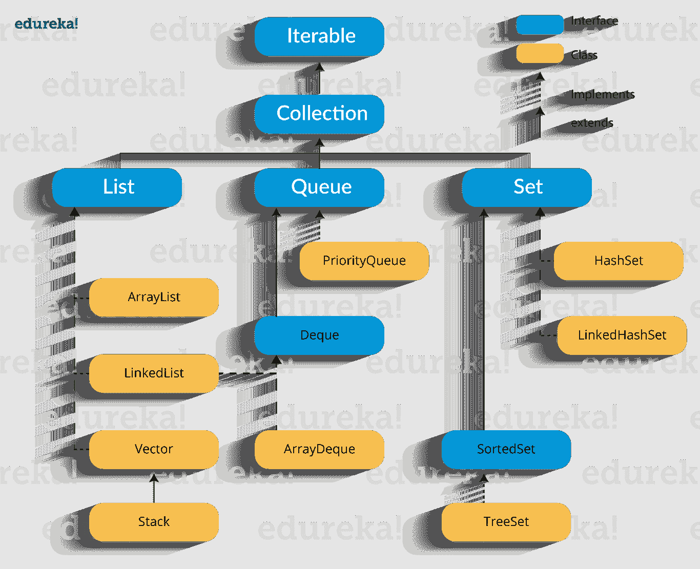

Want to upskill yourself to get ahead in Career? Check out this videoCore Java Interview Quesions And Answers for Freshers and Experienced This 120+ core java interview question and answer will help freshers and experience to crack the interview in 1st attempt[https://www.youtube.com/embed/M2NyXKxyUGc](https://www.youtube.com/embed/M2NyXKxyUGc)

## **哎呀 Java 面试题**

### **Q1。什么是多态性？**

多态性简单描述为“一个接口，多个实现”。多态性是一种能够在不同的上下文中赋予事物不同的含义或用法的特性——特别是，允许一个实体(如变量、函数或对象)有不止一种形式。多态性有两种: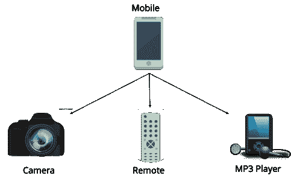

1.  编译时间多态性
2.  运行时间多态性

编译时多态性是方法重载，而运行时多态性是使用继承和接口完成的。

### **Q2。什么是运行时多态或动态方法调度？**

在 Java 中，运行时多态性或动态方法分派是一个过程，其中对被覆盖方法的调用在运行时而不是在编译时被解决。在这个过程中，通过超类的引用变量调用被覆盖的方法。让我们看看下面的例子来更好地理解它。

```
class Car {
void run()
{
System.out.println(&ldquo;car is running&rdquo;); 
}
}
class Audi extends Car {
void run()
{
System.out.prinltn(&ldquo;Audi is running safely with 100km&rdquo;);
}
public static void main(String args[])
{
Car b= new Audi();    //upcasting
b.run();
}
}

```

### **Q3。****Java 中的抽象是什么？**

抽象是指处理想法而不是事件的品质。它基本上处理的是隐藏细节，向用户展示本质的东西。因此，你可以说 Java 中的抽象是对用户隐藏实现细节，只向他们展示功能的过程。抽象可以通过两种方式实现:

1.  **抽象类**(可以达到 0-100%的抽象)
2.  **接口**(可以实现 100%的抽象)

### **Q4。Java 里的接口是什么意思？**

Java 中的接口是一个类的蓝图，或者你可以说它是抽象方法和静态常量的集合。在接口中，每个方法都是公共的和抽象的，但是它不包含任何构造函数。因此，接口基本上是一组具有空体的相关方法。示例:

public interface Animal {  public void eat();  public void sleep();  public void run();}

### **Q5。抽象类和接口有什么区别？**

| **抽象类** | **界面** |
| 抽象类可以提供完整的默认代码和/或仅仅是必须被覆盖的细节 | 一个接口根本不能提供任何代码，只能提供签名 |
| 在抽象类的情况下，一个类只能扩展一个抽象类 | 一个类可以实现几个接口 |
| 抽象类可以有非抽象方法 | 一个接口的所有方法都是抽象的 |
| 抽象类可以有实例变量 | 接口不能有实例变量 |
| 抽象类可以有任何可见性:公共的、私有的、受保护的 | 接口可见性必须是公共的(或)无 |
| 如果我们向抽象类添加一个新方法，那么我们可以选择提供默认实现，因此所有现有的代码都可以正常工作 | 如果我们向一个接口添加了一个新方法，那么我们必须跟踪该接口的所有实现，并为新方法定义实现 |
| 抽象类可以包含构造函数 | 接口不能包含构造函数 |
| 抽象类快 | 接口很慢，因为它需要额外的间接来找到实际类中相应的方法 |

**Q6。Java 中的继承是什么？**

Java 中的继承概念是一个类的属性可以被另一个类继承。它有助于重用代码和建立不同类之间的关系。在两种类型的类之间执行继承:

1.  父类(超类或基类)
2.  子类(子类或派生类)

继承属性的类称为子类，而属性被继承的类称为父类。

### **Q7。Java 中有哪些不同类型的继承？**

Java 支持四种类型的继承，分别是:

1.  **单一继承:**在单一继承中，一个类继承另一个类的属性，即只有一个父类和一个子类。
2.  **多级继承:**当一个类是从另一个类派生出来的，即一个类有不止一个父类，但在不同的级别，这种类型的继承称为多级继承。
3.  **分层继承:**当一个类有不止一个子类(子类)或者换句话说，不止一个子类有相同的父类，那么这种继承称为分层继承。
4.  **混合遗传:**混合遗传是两种*或两种以上*遗传的组合。

### **Q8。什么是方法重载和方法重写？**

#### **方法重载:**

*   在方法重载中，相同类的方法共享相同的名称，但是每个方法必须具有不同数量的参数或者具有不同类型和顺序的参数。
*   方法重载是对方法的行为进行更多的“添加”或“扩展”。
*   它是一个编译时多态。
*   这些方法必须有不同的签名。
*   方法重载中可能需要也可能不需要继承。

让我们看看下面的例子，以便更好地理解它。

```
class Adder {
Static int add(int a, int b)
{
return a+b;
}
Static double add( double a, double b)
{
return a+b;
}
public static void main(String args[])
{
System.out.println(Adder.add(11,11));
System.out.println(Adder.add(12.3,12.6));
}}
```

#### **方法覆盖:**

*   在方法覆盖中，子类拥有与超类相同的方法，具有相同的名称、完全相同的参数数量和类型以及相同的返回类型。
*   方法重写是为了“改变”方法的现有行为。
*   它是一个运行时多态。
*   这些方法必须有相同的签名。
*   在方法重写中总是需要继承。

让我们看看下面的例子，以便更好地理解它。

```
class Car {
void run(){
System.out.println(&ldquo;car is running&rdquo;); 
}
Class Audi extends Car{
void run()
{
System.out.prinltn("Audi is running safely with 100km");
}
public static void main( String args[])
{
Car b=new Audi();
b.run();
}
}

```

### **Q9。你能在 Java 中重写私有或静态方法吗？**

在 Java 中，你不能覆盖私有或静态的方法。如果你在子类中创建一个具有相同返回类型和相同方法参数的相似方法，那么它将隐藏超类方法；这就是所谓的方法隐藏。类似地，你不能覆盖子类中的私有方法，因为它在子类中是不可访问的。您可以做的是在子类中创建另一个同名的私有方法。让我们看看下面的例子来更好地理解它。

```
class Base {
private static void display() {
System.out.println("Static or class method from Base");
}
public void print() {
System.out.println("Non-static or instance method from Base");
}
class Derived extends Base {
private static void display() {
System.out.println("Static or class method from Derived");
}
public void print() {
System.out.println("Non-static or instance method from Derived");
}
public class test {
public static void main(String args[])
{
Base obj= new Derived();
obj1.display();
obj1.print();
}
}

```

### **Q10。什么是多重继承？Java 支持吗？**

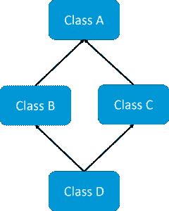如果一个子类继承了多个类的属性称为多重继承。Java 不允许扩展多个类。

多重继承的问题是，如果多个父类有相同的方法名，那么在运行时编译器很难决定从子类中执行哪个方法。

因此，Java 不支持多重继承。这个问题通常被称为钻石问题。

如果你在这些 java 面试问题上面临任何挑战，请在下面的部分评论你的问题。

### **Q11。****Java 中的封装是什么？**

封装是一种将数据(变量)和代码(方法)绑定在一起的机制。在这里，数据对外界是隐藏的，只能通过当前的类方法来访问。这有助于保护数据免受任何不必要的修改。我们可以通过在 Java 中实现封装

*   将类的变量声明为私有。
*   提供公共的 setter 和 getter 方法来修改和查看变量的值。

### **Q12。什么是协会？**

关联是一种关系，其中所有对象都有它们自己生命周期，且没有所有者。我们以老师和学生为例。多名学生可以与一名教师相关联，一名学生可以与多名教师相关联，但是对象之间没有所有权，两者都有自己的生命周期。这些关系可以是一对一、一对多、多对一和多对多。

### **Q13。聚合是什么意思？**

聚集是一种特殊形式的关联，其中所有对象都有自己的生命周期，但存在所有权，子对象不能属于另一个父对象。我们举个部门和老师的例子。单个教师不能属于多个部门，但是如果我们删除了部门教师对象也不会破坏。

### **Q14。Java 中的 composition 是什么？**

组合又是一种特殊形式的聚合，我们可以称之为“死亡”关系。这是一种强类型的聚集。子对象没有生命周期，如果父对象删除，所有子对象也将被删除。让我们再举一个房子和房间之间关系的例子。房子可以包含多个房间，没有独立生活的房间，任何房间都不能属于两个不同的房子，如果我们删除了房子房间就会自动删除。

**Q15。什么是标记接口？**

标记接口可以定义为没有数据成员和成员函数的接口。简单来说，空接口称为标记接口。Java 中标记接口最常见的例子是可串行化的、可克隆的等等。标记接口可以声明如下。

```
public interface Serializable{
}
```

**。什么是 Java 中的对象克隆？**

Java 中的对象克隆是创建对象的精确副本的过程。它基本上意味着创建与原始对象具有相似状态的对象的能力。为了实现这一点，Java 提供了一个方法 **clone** 、 () 来利用这一功能。此方法创建当前对象的类的新实例，然后用相应字段的完全相同的内容初始化其所有字段。为了 object clone()，必须实现标记接口 **java.lang.Cloneable** 以避免任何运行时异常。您必须注意的一点是 Object clone()是一个受保护的方法，因此您需要覆盖它。

### **Q17。Java 中的复制构造函数是什么？**

Copy constructor 是一个成员函数，用于使用同一个类的另一个对象初始化一个对象。尽管在 Java 中不需要复制构造函数，因为所有的对象都是通过引用传递的。而且，Java 甚至不支持自动传值。

### **Q18。什么是 Java 中的构造函数重载？**

在 Java 中，构造函数重载是一种向类中添加任意数量的构造函数的技术，每个构造函数都有不同的参数列表。编译器使用列表中参数的数量及其类型来区分重载的构造函数。

```
class Demo
{
int i;
public Demo(int a)
{
i=k;
}
public Demo(int a, int b)
{
//body
}
}
```

如果你在这些 java 面试问题上面临任何挑战，请在下面的部分评论你的问题。除了这个 Java 面试问题博客之外，如果你想从专业人士那里获得这方面的培训，你可以选择 edureka 的结构化培训！

## **servlet–Java 面试题**

### **Q1。什么是 servlet？**

*   Java Servlet 是服务器端技术，通过提供对动态响应和数据持久性的支持来扩展 web 服务器的功能。
*   javax.servlet 和 javax.servlet.http 包为编写我们自己的 servlet 提供了接口和类。
*   所有的 Servlet 都必须实现 javax.servlet.Servlet 接口，它定义了 servlet 生命周期方法。在实现通用服务时，我们可以扩展 Java Servlet API 提供的 GenericServlet 类。HttpServlet 类提供了一些方法，如 doGet()和 doPost()，用于处理特定于 HTTP 的服务。
*   大多数时候，web 应用程序是使用 HTTP 协议访问的，这就是为什么我们大多扩展 HttpServlet 类。下图显示了 Servlet API 层次结构。

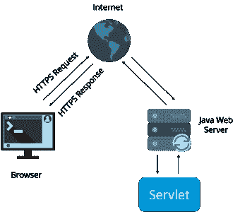

### **Q2。Get 和 Post 方法有什么区别？**

| **得到** | **岗位** |
| 由于数据是在报头中发送的，因此可以发送的数据量有限。 | 由于数据是以正文形式发送的，因此可以发送大量数据。 |
| 不安全，因为数据暴露在 URL 栏中。 | 安全，因为数据不在 URL 栏中公开。 |
| 可以加入书签 | 不能加入书签 |
| 等幂 | 非等幂 |
| 它比 Post 更高效，使用更方便 | 效率较低，已被使用 |

### **Q3。什么是请求调度程序？**

RequestDispatcher 接口用于将请求转发到另一个资源，该资源可以是 HTML、JSP 或同一应用程序中的另一个 servlet。我们还可以使用它将另一个资源的内容包含到响应中。

该接口定义了两种方法:

1.void forward()

2.void include()

## **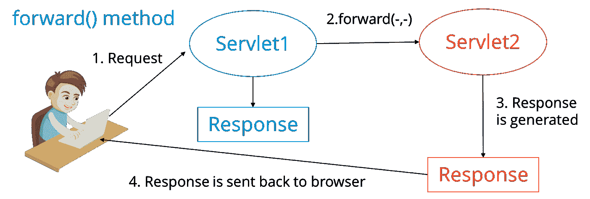**

## **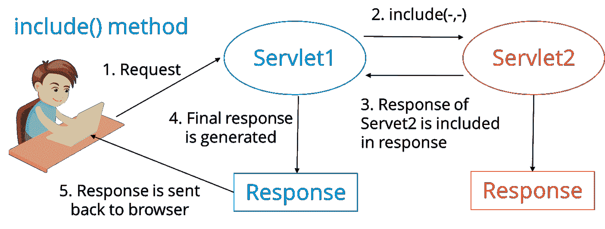**

### **Q4。forward()方法和 sendRedirect()方法有什么区别？**

| **前进()方法** | **SendRedirect()方法** |
| forward()向另一个资源发送相同的请求。 | sendRedirect()方法总是发送新请求，因为它使用了浏览器的地址栏。 |
| forward()方法在服务器端工作。 | sendRedirect()方法在客户端工作。 |
| forward()方法仅在服务器内有效。 | sendRedirect()方法在服务器内外都有效。 |

### **Q5。servlet 的生命周期是什么？**

servlet 的生命周期有 5 个阶段: **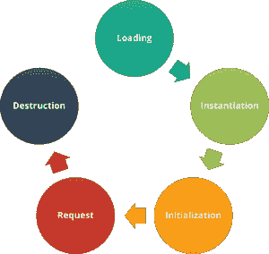** 

1.  Servlet 已加载
2.  Servlet 被实例化
3.  Servlet 被初始化
4.  服务请求
5.  Servlet 被破坏

### **Q6。cookies 在 Servlets 中是如何工作的？**

*   Cookies 是由服务器发送给客户端的文本数据，它保存在客户端的本地机器上。
*   Servlet API 通过实现可序列化和可克隆接口的 javax.servlet.http.Cookie 类提供 Cookie 支持。
*   提供了 HttpServletRequest getcookies()方法来从请求中获取 Cookie 数组，因为没有向请求中添加 Cookie，所以没有向请求中设置或添加 Cookie 的方法。
*   类似地，提供了 http servlet response add Cookie(Cookie c)方法以在响应头中附加 Cookie，Cookie 没有 getter 方法。

### **Q7。ServletContext 和 ServletConfig 有什么区别？**

Servlets JSP 中 ServletContext 和 ServletConfig 的区别如下表所示。

| **【servletconfig】** | **servlet context** |
| Servlet 配置对象代表单个 servlet | 它代表运行在特定 JVM 上的整个 web 应用程序，并为所有 servlet 所共用 |
| 与特定 servlet 相关联的本地参数 | 与整个应用程序相关联的类似全局参数 |
| 它是在 web.xml 文件的 servlet 部分中定义的名称值对，因此它具有 servlet 范围 | ServletContext 具有应用程序范围，因此在 web.xml 文件中的 servlet 标记之外定义。 |
| getServletConfig()方法用于获取配置对象 | getServletContext()方法用于获取上下文对象。 |
| 例如，用户的购物车是特定于特定用户的，因此我们可以使用 servlet 配置 | 获取 MIME 类型的文件或应用程序会话相关的信息是使用 servlet 上下文对象存储的。 |

### **Q8。servlets 中有哪些不同的会话管理方法？**

会话是客户端和服务器之间的对话状态，它可以由客户端和服务器之间的多个请求和响应组成。由于 HTTP 和 Web 服务器都是无状态的，维护会话的唯一方法是在每个请求和响应中在服务器和客户机之间传递一些关于会话的唯一信息(会话 id)。

servlet 中会话管理的一些常见方式有:

1.  用户认证
2.  HTML 隐藏字段
3.  饼干
4.  URL 重写
5.  会话管理 API

## ****

除了这个博客，如果你想接受专业人士的技术培训，你可以选择 edureka 的结构化培训！点击下方了解更多信息。

## **JDBC——Java 面试题**

### **1。什么是 JDBC 司机？**

JDBC 驱动程序是一个软件组件，它使 java 应用程序能够与数据库进行交互。有 4 种类型的 JDBC 司机:

1.  JDBC-ODBC 桥驱动程序
2.  原生 API 驱动程序(部分 java 驱动程序)
3.  网络协议驱动(全 java 驱动)
4.  瘦驱动(全 java 驱动)

### **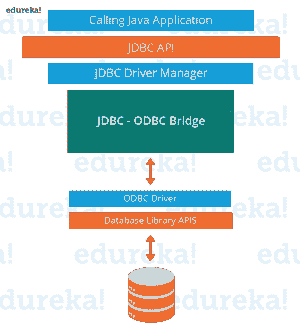 2。用 java 连接数据库的步骤有哪些？**

*   注册驱动程序类
*   创建连接
*   创建语句
*   执行查询
*   关闭连接

### **3。什么是 JDBC API 组件？**

java.sql 包包含 JDBC API 的接口和类。

#### **界面:**

*   连接
*   声明
*   准备报表
*   结果集
*   结果集元数据
*   数据库元数据
*   可调用语句等。

#### **类:**

*   驱动程序管理器
*   斑点
*   Clob
*   类型
*   SQLException 等。

### **4。JDBC 驱动程序管理器类的作用是什么？**

驱动管理器*类* 管理注册的驱动。它可以用来注册和注销驱动程序。它提供了返回连接实例的工厂方法。

### **5。什么是 JDBC 连接接口？**

连接接口维护与数据库的会话。它可用于事务管理。它提供了返回 Statement、PreparedStatement、CallableStatement 和 DatabaseMetaData 实例的工厂方法。

## ****

如果你在这些 java 面试问题上面临任何挑战，请在下面的部分评论你的问题。

### **6。JDBC 结果集接口的目的是什么？**

ResultSet 对象表示表格中的一行。它可以用来改变光标指针并从数据库中获取信息。

### **7。什么是 JDBC 结果集元数据接口？**

resultset metadata 接口返回表的信息，如总列数、列名、列类型等。

### **8。什么是 JDBC 数据库元数据接口？**

database metadata 接口返回数据库的信息，如用户名、驱动名、驱动版本、表数、视图数等。

### **9。你说的 JDBC 批量加工是什么意思？**

批处理帮助您将相关的 SQL 语句组合成一个批处理并执行它们，而不是执行单个查询。通过在 JDBC 中使用批处理技术，您可以执行多个查询，从而提高性能。

### **10。execute，executeQuery，executeUpdate 有什么区别？**

语句 ***execute(字符串查询)*** 用于执行任何 SQL 查询，如果结果是结果集，如运行 Select 查询，则返回 TRUE。当没有 ResultSet 对象(如运行插入或更新查询)时，输出为 FALSE。我们可以使用 *getResultSet()* 来获取结果集，并使用 *getUpdateCount()* 方法来检索更新计数。

语句 ***executeQuery(字符串查询)*** 用于执行选择查询并返回结果集。即使没有与查询匹配的记录，返回的结果集也不会为 null。当执行 select 查询时，我们应该使用 executeQuery 方法，这样如果有人试图执行 insert/update 语句，它将抛出 java.sql.SQLException，并显示消息“executeQuery 方法不能用于更新”。

语句 **executeUpdate(字符串查询**)用于执行插入/更新/删除(DML)语句或不返回任何内容的 DDL 语句。输出是 int，等于 SQL 数据操作语言(DML)语句的行数。对于 DDL 语句，输出为 0。

只有在不确定语句类型时，才应该使用 execute()方法，否则使用 executeQuery 或 executeUpdate 方法。

### **Q11。你对 JDBC 的陈述有什么理解？**

JDBC 语句基本上是用来向数据库发送 SQL 命令和从数据库检索数据的语句。像 execute()、executeUpdate()、executeQuery 等各种方法。由 JDBC 提供，用于与数据库交互。

JDBC 支持 3 种类型的语句:

1.  *语句:*用于对数据库的通用访问，在运行时执行静态 SQL 查询。
2.  *PreparedStatement:* 用于在执行过程中为查询提供输入参数。
3.  *CallableStatement:* 用于访问数据库存储过程，帮助接受运行时参数。

如果您在这些 java 面试问题上遇到任何挑战，请在下面的部分评论您的问题。除了这个 Java 面试问题博客之外，如果你想从专业人士那里获得这方面的培训，你可以选择 edureka 的结构化培训！

## **Spring 框架——Java 面试题**

### **Q1。春天是什么？**

维基百科将 Spring 框架定义为“Java 平台的应用框架和控制容器的反转。该框架的核心特性可以被任何 Java 应用程序使用，但也有用于在 Java EE 平台上构建 web 应用程序的扩展。”Spring 本质上是一个轻量级的集成框架，可用于用 java 开发企业应用程序。

### **Q2。说出 Spring 框架的不同模块。**

一些重要的 Spring 框架模块有:

*   Spring Context——用于依赖注入。
*   Spring AOP——面向方面编程。
*   Spring DAO–用于使用 DAO 模式的数据库操作
*   Spring JDBC——支持 JDBC 和数据源。
*   Spring ORM——对于 Hibernate 等 ORM 工具的支持
*   Spring Web 模块–用于创建 Web 应用程序。
*   Spring MVC——用于创建 web 应用程序、web 服务等的模型-视图-控制器实现。

### ** Q3。列出基于注释的 Spring 配置中的一些重要注释。**

重要的注释有:

*   @必选
*   @自动连线
*   @限定符
*   @资源
*   @后置结构
*   @PreDestroy

### **Q4。解释春豆，列出春豆的不同范围。**

Beans 是构成 Spring 应用程序主干的对象。它们由 Spring IoC 容器管理。换句话说，bean 是由 Spring IoC 容器实例化、组装和管理的对象。

在 Spring beans 中定义了五个作用域。


*   **Singleton** :每个容器只创建一个 bean 实例。这是 spring beans 的默认范围。在使用这个范围时，确保 spring bean 没有共享的实例变量，否则可能会导致数据不一致的问题，因为它不是线程安全的。
*   **原型**:每次请求 bean 时都会创建一个新的实例。
*   **请求**:这与原型作用域相同，但是它意味着用于 web 应用程序。将为每个 HTTP 请求创建一个新的 bean 实例。
*   **会话**:容器将为每个 HTTP 会话创建一个新的 bean。
*   **全局会话**:用于为 Portlet 应用程序创建全局会话 beans。

如果你在这些 java 面试问题上面临任何挑战，请在下面的部分评论你的问题。

### **Q5。解释 DispatcherServlet 和 ContextLoaderListener 的作用。**

**dispatcher servlet**基本上是 Spring MVC 应用程序中的前端控制器，它加载 spring bean 配置文件并初始化所有已配置的 bean。如果启用了注释，它还会扫描包来配置任何用@Component、@Controller、@Repository 或@Service 注释注释的 bean。

**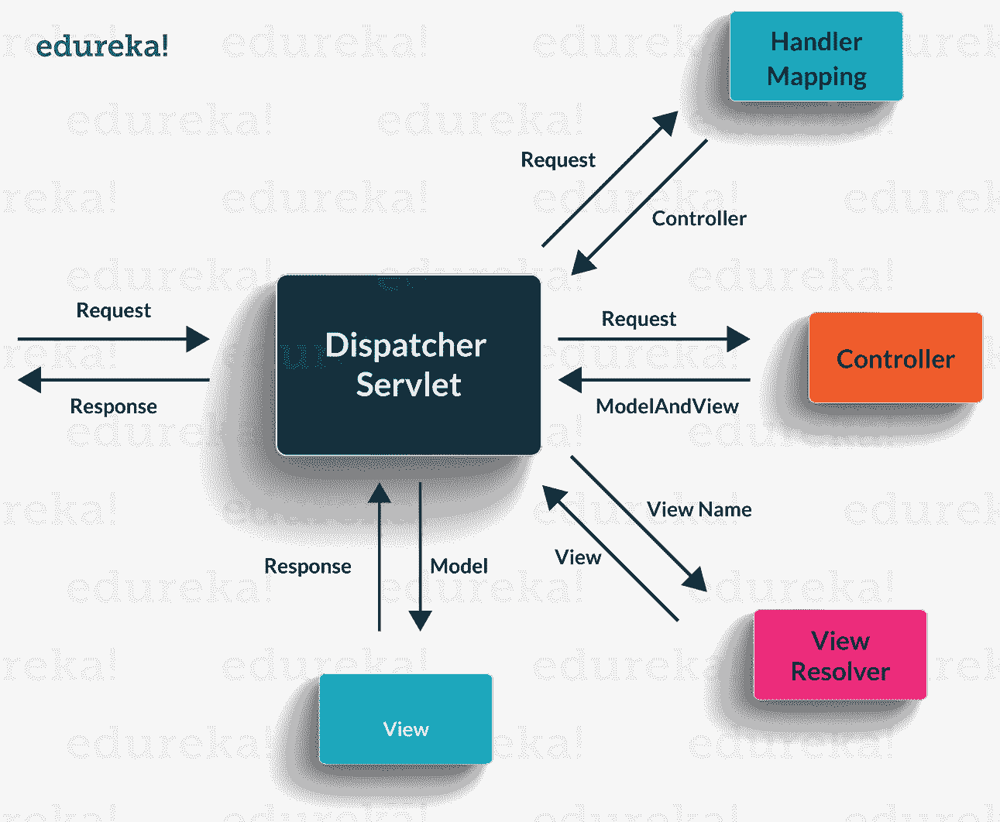ContextLoaderListener，** 则相反，是监听器启动和关闭 Spring 根中的 WebApplicationContext。它的一些重要功能包括将应用程序上下文的生命周期与 ServletContext 的生命周期联系起来，以及自动化应用程序上下文的创建。

### **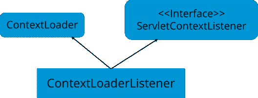**

### **Q6。构造函数注入和 setter 注入有什么区别？**

| **号**号 | **构造函数注入** | **二传手注射** |
| 1) | 无部分喷射 | 部分喷射 |
| 2) | 不覆盖 setter 属性 | 如果两者都定义了，则覆盖构造函数属性。 |
| 3) | 如果发生任何修改，创建一个新实例 | 如果您更改属性值，则不会创建新的实例 |
| 4) | 对太多属性更好 | 对少数属性更好。 |

### **Q7。什么是春季自动布线？什么是自动布线模式？**

Autowiring 使程序员能够自动注入 bean。我们不需要编写显式的注入逻辑。 让我们看看使用依赖注入来注入 bean 的代码。

1.  <bean id =【EMP】class=" com . Java point . employee "auto wire =【byName】/>

自动接线模式如下:

| **号**号 | **模式** | **描述** |
| 1) | 否 | 这是默认模式，意味着不启用自动布线。 |
| 2) | 别名 | 根据属性名注入 bean。它使用 setter 方法。 |
| 3) | byType | 根据属性类型注入 bean。它使用 setter 方法。 |
| 4) | 构造器 | 它使用构造函数注入 bean |

### **Q8。如何在 Spring MVC 框架中处理异常？**

Spring MVC 框架提供了以下方法来帮助我们实现健壮的异常处理。

#### **控制器基础:**

我们可以在控制器类中定义异常处理方法。我们只需要用@ExceptionHandler 注释来注释这些方法。

#### **全局异常处理:**

异常处理是一个跨领域的问题，Spring 提供了@ControllerAdvice 注释，我们可以用它来定义我们的全局异常处理程序。

#### **HandlerExceptionResolver 实现:**

对于一般的异常，大多数时候我们提供静态页面。Spring 框架提供了 HandlerExceptionResolver 接口，我们可以实现该接口来创建全局异常处理程序。这种定义全局异常处理程序的额外方法背后的原因是，spring framework 还提供了默认的实现类，我们可以在 spring bean 配置文件中定义这些类，以获得 Spring framework 异常处理的好处。

### **Q9。你用过哪些重要的 Spring 注释？**

我在项目中使用的一些 Spring 注释是:

**@控制器**–用于 Spring MVC 项目中的控制器类。

**@ request mapping**–用于在控制器处理程序方法中配置 URI 映射。这是一个非常重要的注释，所以你应该仔细阅读 Spring MVC RequestMapping 注释示例

**@ response body**–用于发送对象作为响应，通常用于发送 XML 或 JSON 数据作为响应。

**@ path variable**–用于将动态值从 URI 映射到处理程序方法参数。

**@自动连线**–用于 spring beans 中的自动连线依赖项。

**@限定符**–带有@Autowired 注释，以避免出现多个 bean 类型实例时的混淆。

**@服务**–用于服务类。

**@ Scope**–用于配置 spring bean 的范围。

**、@Configuration、@ComponentScan 和@ Bean**–用于基于 java 的配置。

用于配置方面和建议的 AspectJ 注释，@Aspect，@Before，@After，@Around，@Pointcut 等。

### **Q10。如何集成 Spring 和 Hibernate 框架？**

我们可以使用 Spring ORM 模块来集成 Spring 和 Hibernate 框架如果你使用的是 Hibernate 3+，其中 SessionFactory 提供当前会话，那么你应该避免使用Hibernate template或Hibernate DAO support类，最好使用带有依赖注入的 DAO 模式进行集成。

另外，Spring ORM 提供了对使用 Spring 声明式事务管理的支持，所以你应该利用这一点，而不是使用 hibernate 模板代码来进行事务管理。

### **Q11。说出 Spring 支持的事务管理类型。**

Spring 支持两种类型的事务管理。他们是:

1.  **程序化交易管理:**在此，借助编程来管理交易。它为您提供了极大的灵活性，但是很难维护。
2.  **声明式事务管理:**在此，事务管理与业务代码分离。只有注释或基于 XML 的配置用于管理事务。

除了这些为有经验的专业人士准备的核心 Java 面试问题，如果你想接受专业人士关于这项技术的培训，你可以选择 edureka 的结构化培训！

## **Hibernate——有经验专业人士的 Java 面试问题**

### **1。什么是 Hibernate 框架？**

对象关系映射或 ORM 是将应用领域模型对象映射到关系数据库表的编程技术。Hibernate 是基于 Java 的 ORM 工具，它提供了一个将应用程序域对象映射到关系数据库表的框架，反之亦然。

Hibernate 提供了 Java 持久性 API 的参考实现，这使得它成为 ORM 工具的绝佳选择，具有松耦合的优势。我们可以使用 Hibernate 持久性 API 进行 CRUD 操作。Hibernate 框架通过使用 JPA 注释和基于 XML 的配置，提供了将普通的旧 java 对象映射到传统数据库表的选项。

类似地，hibernate 配置也很灵活，既可以通过 XML 配置文件也可以通过编程来完成。

### **2。使用 Hibernate 框架有什么重要的好处？**

使用 hibernate 框架的一些重要好处是:

1.  Hibernate 消除了 JDBC 附带的所有锅炉板代码，并负责管理资源，因此我们可以专注于业务逻辑。
2.  Hibernate 框架提供了对 XML 和 JPA 注释的支持，这使得我们的代码实现是独立的。
3.  Hibernate 提供了一种类似于 SQL 的强大的查询语言(HQL)。然而，HQL 是完全面向对象的，理解继承、多态和关联等概念。
4.  Hibernate 是来自 Red Hat 社区的开源项目，在全球范围内广泛使用。这使它成为比其他软件更好的选择，因为学习曲线很小，而且有大量的在线文档，在论坛上很容易获得帮助。
5.  hibernate 很容易与其他 Java EE 框架集成，它如此受欢迎，以至于 Spring Framework 为 Hibernate 与 Spring 应用程序的集成提供了内置支持。
6.  Hibernate 支持使用代理对象的惰性初始化，只在需要时才执行实际的数据库查询。
7.  休眠缓存帮助我们获得更好的性能。
8.  对于数据库供应商特定的特性，hibernate 是合适的，因为我们也可以执行本地 sql 查询。

总的来说，hibernate 是目前市场上 ORM 工具的最佳选择，它包含了 ORM 工具中你需要的所有特性。

### **3。解释 Hibernate 架构。**

Hibernate 有一个分层的架构，可以帮助用户在不知道底层 API 的情况下进行操作。Hibernate 利用数据库和配置数据为应用程序提供持久性服务(和持久性对象)。它包括许多对象，如持久对象、会话工厂、事务工厂、连接工厂、会话、事务等。

Hibernate 架构分为四层。

*   Java 应用层
*   Hibernate 框架层
*   反手 API 层
*   数据库层

### **4。get 和 load 方法有什么区别？**

get()和 load()方法的区别如下。

| **号**号 | **get()** | **载入()** |
| 1) | 如果没有找到对象， 返回空值。 | 如果没有找到对象， 抛出 ObjectNotFoundException 。 |
| 2) | get()方法总是命中数据库。 | load()方法不会命中数据库。 |
| 3) | 它返回一个真实的对象，不是代理。 | 它返回一个代理对象。 |
| 4) | 如果不确定实例的存在，应该使用。 | 如果你确定实例存在，就应该使用。 |

### **5。Hibernate 比 JDBC 有什么优势？**

与 JDBC 相比，Hibernate 框架的一些重要优势是:

1.  Hibernate 删除了 JDBC API 附带的大量代码，代码看起来更干净，可读性更好。
2.  Hibernate 支持继承、关联和集合。这些功能是 JDBC API 所不具备的。
3.  Hibernate 隐式地提供了事务管理，事实上，大部分查询不能在事务之外执行。在 JDBC API 中，我们需要使用提交和回滚为事务管理编写代码。
4.  JDBC API 抛出 SQLException 那是一个被检查的异常，所以我们需要写很多 try-catch 块代码。大多数情况下，它在每个 JDBC 调用中都是冗余的，用于事务管理。Hibernate 包装了 JDBC 异常，抛出 JDBCException 或者hibernate exception未检查异常，我们不需要写代码来处理。Hibernate 内置的事务管理消除了 try-catch 块的使用。
5.  Hibernate 查询语言(HQL)更面向对象，更接近 Java 编程语言。对于 JDBC，我们需要编写本地 SQL 查询。
6.  Hibernate 支持缓存，这样性能会更好，JDBC 查询不被缓存，因此性能很低。
7.  Hibernate 也提供了创建数据库表的选项，因为 JDBC 表必须存在于数据库中。
8.  Hibernate 配置帮助我们使用类似 JDBC 的连接，以及连接池的 JNDI 数据源。这是企业应用程序中一个非常重要的特性，而在 JDBC API 中却完全没有。
9.  Hibernate 支持 JPA 注释，所以代码独立于实现，很容易用其他 ORM 工具替换。JDBC 代码与应用程序紧密结合。

如果你在这些 Java 面试问题上面临任何挑战，请在下面的部分评论你的问题。除了这个 Java 面试问题博客之外，如果你想从专业人士那里获得这方面的培训，你可以选择 edureka 的结构化培训！

## **JSP–Java 面试题**

### **1。jsp 的生命周期方法是什么？**

| **方法** | **描述** |
| public void jspInit() | 它只被调用一次，和 servlet 的 init 方法一样。 |
| 公共 void _jspService(ServletRequest 请求，ServletResponse)抛出 ServletException，IOException | 它在每次请求时被调用，与 servlet 的 service()方法相同。 |
| public void jspDestroy() | 它只被调用一次，和 servlet 的 destroy()方法一样。 |

### **2。JSP 隐式对象有哪些？**

JSP 默认提供 9 个隐式对象。它们如下:

| **对象** | **式** |
| 1) out | jspwritter |
| 2)请求 | HttpServletRequest |
| 3)响应 | HttpServletResponse |
| 4)配置 | ServletConfig |
| 5)会话 | http session |
| 6)应用 | ServletContext |
| 7)页面上下文 | 页面上下文 |
| 8)第页 | 物体 |
| 9)异常 | 可投掷的 |

### **3。include 指令和 include 动作有什么区别？**

| **包括指令** | **包括动作** |
| include 指令包括页面翻译时的内容。 | 包含动作在请求时包含内容。 |
| include 指令包含页面的原始内容，因此页面大小会在运行时增加。 | include 动作不包括原始内容，而是调用供应商提供的类的 include()方法。 |
| 静态页面更好。 | 最好是动态页面。 |

### **4。如何禁用浏览器后退按钮的缓存？**

**<**%response . set header(" Cache-Control "，" no-store ")；response . set header(" Pragma "，" no-cache ")；response . set header(" Expires "，" 0 ")；//防止在代理服务器上缓存%**>**

### **5。在 JSTL 有哪些不同的标签？**

JSTL 标签有 5 种类型。

1.  核心标签
2.  sql 标签
3.  xml 标签
4.  国际化标签
5.  功能标签

### **6。如何在 JSP 中禁用会话？**

1.  **<**%%会话 = 【假】%**>**

### **7。如何删除 JSP 中的 Cookie？**

下面的代码解释了如何删除 JSP 中的 Cookie:

```
Cookie mycook = new Cookie("name1","value1");

response.addCookie(mycook1);

Cookie killmycook = new Cookie("mycook1","value1");

killmycook . set MaxAge ( 0 );

killmycook . set Path ("/");

killmycook . addCookie ( killmycook 1 );

```

### **8。解释 jspDestroy()方法。**

每当一个 jsp 页面将要被销毁时，从**javax . servlet . JSP . JSP page**接口调用 jspDestry()方法。Servlets destroy 方法可以很容易地被覆盖来执行清理，比如在关闭数据库连接时。

### **9。JSP 怎么比 Servlet 技术好？**

JSP 是服务器端的一项技术，可以简化内容生成。它们是以文档为中心的，而 servlets 是程序。Java 服务器页面可以包含执行和实例化 Java 类的 Java 程序片段。但是，它们出现在 HTML 模板文件中。它为 Web 应用程序的开发提供了框架。

### **10。为什么不应该在 web.xml 中配置 JSP 标准标签？**

我们不需要在 web.xml 中配置 JSP 标准标签，因为当 container 加载 web 应用程序并找到 TLD 文件时，它会自动将它们配置为直接在应用程序 JSP 页面中使用。我们只需要使用 taglib 指令将它包含在 JSP 页面中。

### **11。您将如何使用 JSP EL 来获取 HTTP 方法名？**

使用 pageContext JSP EL 隐式对象，您可以获得请求对象引用，并利用点运算符来检索 JSP 页面中的 HTTP 方法名。用于此目的的 JSP EL 代码将类似于${pageContext.request.method}。

如果你在这些 java 面试问题上面临任何挑战，请在下面的部分评论你的问题。除了这个 Java 面试问题博客之外，如果你想从专业人士那里获得这方面的培训，你可以选择 edureka 的结构化培训！

## **异常与线程 Java 面试题**

### **Q1。错误和异常的区别是什么？**

错误是运行时出现的不可恢复的情况。例如内存不足错误。这些 JVM 错误不能在运行时修复。虽然可以在 catch 块中捕获错误，但是应用程序的执行将会停止并且不可恢复。

而异常是由于错误输入或人为错误等原因而发生的情况。例如，如果指定的文件不存在，将抛出 FileNotFoundException。或者，如果您尝试使用空引用，将会发生 NullPointerException。在大多数情况下，有可能从异常中恢复(可能是通过给用户输入正确值的反馈等。

### **Q2。如何处理 Java 异常？**

Java 中有五个关键字用于处理异常:

1.  试试
2.  接住
3.  最后
4.  投掷
5.  投掷

### **Q3。检查异常和未检查异常有什么区别？**

#### **检查出异常**

*   除了 RuntimeException 和 Error 之外，扩展 Throwable 类的类被称为检查异常。
*   编译时检查异常。
*   例如:IOException、SQLException 等。

#### **未检查的异常**

*   扩展 RuntimeException 的类被称为未检查异常。
*   编译时不检查未检查的异常。
*   例如:ArithmeticException、NullPointerException 等。

### **Q4。线程的使用方式有哪些不同？**

创建线程有两种方法:

*   扩展线程类

这通过创建一个扩展线程类的新类的实例来创建一个线程。扩展类必须覆盖 run()函数，这是线程的入口点。

*   实现可运行接口

这是创建线程最简单的方法，通过创建一个实现 runnable 接口的类。实现 runnable 接口后，该类必须实现公共的 void run()方法()

run()方法在你的程序中创建一个并行线程。当 run()返回时，线程将结束。

run()方法在你的程序中创建一个并行线程。当 run()返回时，线程将结束。

在 run()方法中，必须指定线程的代码。

像任何其他方法一样，run()方法可以调用其他方法，使用其他类，以及定义变量。

Java 工作时是“按值传递”还是“按引用传递”现象？

Java 总是按值传递。这意味着它会在内存中创建参数内容的副本。在 Java 中，对象变量总是指向内存堆的真实对象。

### **Q5。当 return 语句写在 try 块和 catch 块的末尾时，finally 块会被执行吗，如下所示？**

即使 return 语句写在 try 块和 catch 块的末尾，finally 块也总是被执行。不管有没有异常，它总是会执行。finally 块不执行的情况很少，比如 VM 崩溃、电源故障、软件崩溃等。如果不想执行 finally 块，需要在 finally 块中显式调用 System.exit()方法。

### **Q6。异常是如何在代码中传播的？**

如果一个异常没有被捕获，它将从栈顶抛出，并沿着调用栈向下到达前一个过程。如果在那里没有捕获到异常，它就退回到前一个函数，依此类推，直到它被捕获或者调用堆栈到达底部。这个术语叫做异常传播。

### **Q7。能解释一下 Java 线程的生命周期吗？**

Java 线程生命周期有以下状态-

**新-**

当线程被创建时，在程序启动线程之前，它处于新的状态。它也被称为天生螺纹。

**可运行的**

当一个线程启动时，它处于可运行状态。在这种状态下，线程正在执行它的任务。

**等待**

有时，一个线程进入等待状态，因为另一个线程正在执行，所以它保持空闲。当另一个线程完成时，等待线程再次进入运行状态。

**定时等待**

在定时等待中，线程进入等待状态。但是，它只在指定的时间间隔内保持等待状态，之后开始执行。它会一直等待，直到时间间隔结束或另一个线程完成。

**终止**

线程一旦终止，就处于这种状态。这可能是因为线程已经完成了它的任务或者由于任何其他原因。

### **Q8。关键字 final、final 和 finalize 的目的是什么？**

#### **决赛:**

Final 用于对类、方法和变量施加限制。final 类不能被继承，final 方法不能被覆盖，final 变量值不能被改变。让我们看看下面的例子来更好地理解它。

```
class FinalVarExample {
public static void main( String args[])
{
final int a=10;   // Final variable
a=50;             //Error as value can't be changed
}

```

#### **最后**

Finally 用于放置重要代码，无论异常是否被处理都会被执行。让我们看看下面的例子来更好地理解它。

```
class FinallyExample {
public static void main(String args[]){
try {
int x=100;
}
catch(Exception e) {
System.out.println(e);
}
finally {
System.out.println("finally block is executing");}
}}
}

```

#### **敲定**

Finalize 用于在对象被垃圾收集之前执行清理处理。让我们看看下面的例子来更好地理解它。

```
class FinalizeExample {
public void finalize() {
System.out.println("Finalize is called");
}
public static void main(String args[])
{
FinalizeExample f1=new FinalizeExample();
FinalizeExample f2=new FinalizeExample();
f1= NULL;
f2=NULL;
System.gc();
}
}
```

### **Q9。throw 和 throws 有什么区别？**

| **抛出关键词** | **抛出关键词** |
| Throw 用于显式抛出异常。 | Throws 用于声明一个异常。 |
| 仅使用 throw 不能传播检查的异常。 | 被检查的异常可以通过抛出来传播。 |
| Throw 后面跟着一个实例。 | 投掷之后是上课。 |
| Throw 在方法内使用。 | Throws 与方法签名一起使用。 |
| 你不能抛出多个异常 | 你可以声明多个异常，例如公共 void 方法()抛出 IOException，SQLException。 |

如果你在这些 java 面试问题上面临任何挑战，请在下面的部分评论你的问题。

### **Q10。java 中的异常层次是什么？**

层级如下:

Throwable 是所有异常类的父类。有两种类型的异常:已检查的异常和未检查的异常或运行时异常。两种类型的异常都扩展了异常类，而错误又进一步分为虚拟机错误和断言错误。

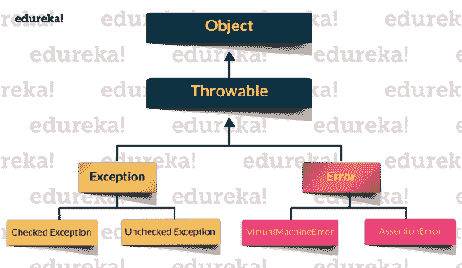

### **Q11。如何创建自定义异常？**

要创建你自己的异常，扩展异常类或它的任何子类。

*   类 New1Exception 扩展异常{ } //这将创建检查异常
*   类 NewException 扩展 IOException { } //这将创建检查异常
*   类 NewException 扩展了 nullponterexception { }//这将创建未检查的异常

### **Q12。Java 异常类的重要方法有哪些？**

Exception 及其所有子类没有提供任何特定的方法，所有方法都在基类 Throwable 中定义。

1.  **String getMessage()**–该方法返回 Throwable 的消息字符串，该消息可以在通过其构造函数创建异常时提供。
2.  **String getlocalized message(**)–提供此方法是为了让子类可以覆盖它，以便向调用程序提供特定于语言环境的消息。Throwable 类实现这个方法只需使用 getMessage() 方法返回异常消息。
3.  **Synchronized Throwable get cause()**–该方法返回异常的原因或原因未知的空 id。
4.  **String toString()**–该方法以字符串格式返回 Throwable 的信息，返回的字符串包含 Throwable 类的名称和本地化的消息。
5.  **void printStackTrace()**–此方法将堆栈跟踪信息打印到标准错误流，此方法是重载的，我们可以将 PrintStream 或 PrintWriter 作为参数传递，以将堆栈跟踪信息写入文件或流。

### **Q13。进程和线程有什么区别？**

|  | **流程** | **线程** |
| **定义** | 一个正在执行的程序实例被称为进程。 | 线程是进程的子集。 |
| **沟通** | 进程必须使用进程间通信来与同级进程通信。 | 线程可以直接与其进程的其他线程通信。 |
| **控制** | 进程只能控制子进程。 | 线程可以对同一进程的线程进行相当大的控制。 |
| **变化** | 父进程的任何变化都不会影响子进程。 | 主线程中的任何变化都可能影响进程中其他线程的行为。 |
| **记忆** | 运行在单独的内存空间。 | 在共享内存空间中运行。 |
| **受** 控制 | 进程由操作系统控制。 | 线程在程序中由程序员控制。 |
| **依赖** | 流程是独立的。 | 线程是依赖的。 |

### **Q14。什么是 finally 块？有没有最后不执行的情况？**

Finally block 是一个总是执行一组语句的块。无论是否发生任何异常，它总是与 try 块相关联。 是，如果程序通过调用 System.exit()或因导致进程中止的致命错误而退出，则最终不会执行。

### **Q15。什么是同步？**

同步是指多线程。一个同步的代码块一次只能由一个线程执行。由于 Java 支持多线程的执行，两个或多个线程可以访问相同的字段或对象。同步是一个保持所有执行中的并发线程同步的过程。同步避免了由于共享内存视图不一致而导致的内存一致性错误。当一个方法被声明为 synchronized 时，线程持有该方法对象的监视器。如果另一个线程正在执行 synchronized 方法，该线程将被阻塞，直到该线程释放监视器。


### **Q16。可以在单个 try 块下写多个 catch 块吗？**

是的，我们可以在单个 try 块下有多个 catch 块，但是方法应该从特定到一般。让我们通过一个编程示例来理解这一点。

```

public class Example {
public static void main(String args[]) {
try {
int a[]= new int[10];
a[10]= 10/0;
}
catch(ArithmeticException e)
{
System.out.println("Arithmetic exception in first catch block");
}
catch(ArrayIndexOutOfBoundsException e)
{
System.out.println("Array index out of bounds in second catch block");
}
catch(Exception e)
{
System.out.println("Any exception in third catch block");
}
}

```

### **Q17。Java 异常类的重要方法有哪些？**

方法是在基类 Throwable 中定义的。下面是 Java 异常类的一些重要方法。

1.  **String getMessage()**–该方法返回关于异常的消息字符串。消息可以通过其构造函数提供。
2.  **public stack trace element[]getstack trace()–**该方法返回一个数组，包含堆栈跟踪中的每个元素。索引 0 处的元素表示调用堆栈的顶部，而数组中的最后一个元素表示调用堆栈底部的方法。
3.  **Synchronized Throwable get cause()**–该方法返回异常的原因或由 Throwable 对象表示的空 id。

4.  **String toString()**–该方法返回字符串格式的信息。返回的字符串包含可抛出类的名称和本地化消息。
5.  **void printStackTrace()**–该方法将堆栈跟踪信息打印到标准错误流中。

### **Q18。Java 中的 OutOfMemoryError 是什么？**

OutOfMemoryError 是 java.lang.Error 的子类，通常发生在我们的 JVM 内存不足的时候。

### **Q19。什么是线程？**

线程是可由调度程序独立执行的最小程序指令。在 Java 中，所有的程序都至少有一个被称为主线程的线程。这个主线程是在程序开始执行时由 JVM 创建的。主线程用于调用程序的 main()。

### **Q20。创建线程的两种方法是什么？**

在 Java 中，线程可以通过以下两种方式创建:-

*   通过实现 Runnable 接口。
*   通过延长螺纹

### **Q21。Java 中有哪些不同类型的垃圾收集器？**

Java 中的垃圾收集一个帮助隐式内存管理的程序。因为在 Java 中，使用 new 关键字可以动态地创建对象，一旦创建了对象，就会消耗一些内存。一旦任务完成，并且不再有对对象的引用，Java 使用垃圾收集销毁对象并释放它所占用的内存。Java 提供了四种类型的垃圾收集器:

*   串行垃圾收集器
*   并行垃圾收集器
*   CMS 垃圾收集器
*   G1 垃圾收集工

如果你在这些 [java](https://www.java.com/en/) 面试问题上遇到任何挑战，请在下面的部分评论你的问题。除了这个博客，如果你想从专业人士那里获得这方面的培训，你可以选择 edureka 的结构化培训！

这就把我们带到了 Java 面试问题博客的结尾。你在这个核心 Java 面试问题博客中学到的主题是招聘人员在 Java 专业人员中寻找的最受欢迎的技能。这些 Java 面试问题一定会帮助你在面试中胜出。**祝你面试顺利！**

*查看 Edureka 提供的 Java 培训，edu reka 是一家值得信赖的在线学习公司，在全球拥有超过 250，000 名满意的学习者。我们在这里帮助你的旅程中的每一步，为了成为一个除了这个 java 面试问题，我们提出了一个课程，这是为学生和专业人士谁想要成为一个 Java 开发人员设计的。该课程旨在让你在 Java 编程方面有一个良好的开端，并训练你掌握核心和高级 Java 概念以及各种 Java 框架，如 Hibernate & Spring。*

*有问题吗？请在这个“* Java 面试问题”*的评论部分提出来，我们会尽快回复您，或者您也可以参加我们在班加罗尔的 [Java 培训。](https://www.edureka.co/java-j2ee-training-course-bangalore)*