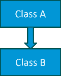
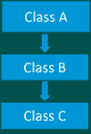
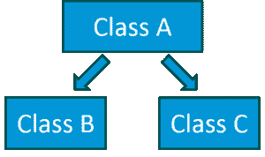
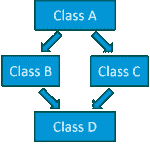
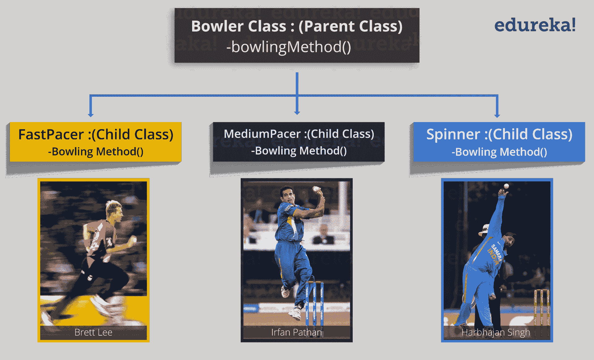

# 面向对象编程——Java OOPs 概念及示例

> 原文：<https://www.edureka.co/blog/object-oriented-programming/>

面向对象编程是一种编程风格，与类、对象、继承、封装、抽象、多态等概念相关联。大多数流行的编程语言，如 Java、C++、C#、Ruby 等。遵循面向对象的编程范式。

## **什么是面向对象编程？**

面向对象编程(OOP)是指程序员定义一个数据结构的数据类型和可以应用于该数据结构的操作类型的一种编程。

作为最受欢迎的技能，我们将讨论 Java 中面向对象的编程概念。Java 中基于对象的应用程序是基于声明类、从类中创建对象以及这些对象之间的交互。在我之前的博客[中，我已经讨论了 Java 类和对象，这也是面向对象编程概念的一部分。](https://www.edureka.co/blog/java-tutorial/#class)

*Edureka 2019 Tech Career Guide is out! Hottest job roles, precise learning paths, industry outlook & more in the guide.[**Download **](http://bit.ly/2KmDS3b)now.*

### OOP(面向对象编程)的四个基本原则/构建块是什么？

面向对象编程的基础是继承、封装、抽象和多态。让我们按照以下顺序来了解一下他们每一个:

1.  [传承](#inheritance)
2.  [封装](#encapsulation)
3.  [抽象](#abstraction)
4.  [多态](#polymorphism)

### 面向对象编程的好处是什么？

1.  提高软件开发过程中的生产力
2.  改进的软件可维护性
3.  更快的发展冲刺
4.  降低开发成本
5.  更高质量的软件

### **然而，有一些与 OOP 相关的挑战，即:**

1.  陡峭的学习曲线
2.  更大的程序大小
3.  较慢的程序执行
4.  这不是一个一刀切的解决方案

让我们以实例开始第一个 Java OOPs 概念，即继承。

## **面向对象编程:继承**

在面向对象的程序设计中，计算机程序是以这样一种方式设计的，即所有的东西都是一个相互作用的对象。 继承就是这样一个概念，其中一个类的属性可以被另一个类继承。它有助于重用代码和建立不同类之间的关系。


正如我们在图像中看到的，一个孩子从他父亲那里继承了财产。同样，在 Java 中，有两个类:

1。 父类(超类或基类)

2.子类(子类或派生类

继承属性的类称为子类，而属性被继承的类称为父类。

遗传进一步分为 4 种类型:


让我们从第一种类型的继承开始，即单一继承:

1.  **单继承:**



在单继承中，一个类继承另一个类的属性。它 使一个 派生类能够从单个父类继承属性和行为。这将反过来支持代码的可重用性，并为现有的代码添加新的特性。

这里， 类 A 是你的父类，B 类是你的子类，继承了父类的属性和行为。

让我们看看单一继承的语法:

```

Class A
{
---
}
Class B extends A {
---
}

```

**2。** **多级继承:**

当一个类是从另一个类派生出来的，即一个类有一个以上的父类，但在不同的层次上，这种类型的继承称为多级继承。

如果我们讨论 流程图 ，B 类继承 A 类的属性和行为，C 类继承 B 类的属性，这里 A 是 B 的父类，B 类是 C 的父类所以在这种情况下，C 类隐式继承 A 类和 B 类的属性和方法，这就是多级继承。

让我们看看 Java 中多级继承的语法:

```
Class A{
---
}
Class B extends A{
---
}
Class C extends B{
---
}

```

**3。** **分层继承:**

   当 一个类有多个子类(子类)或者换句话说，多个子类有同一个父类，那么这种继承就称为。

如果说 流程图，B 类和 C 类是继承父类的子类，即 a 类

让我们来看看 Java 中层次继承的语法:

```
Class A{
---
}
Class B extends A{
---
}
Class C extends A{
---
}
```

4.  **杂交遗传:**

杂交 继承是*多重*继承和*多级*继承的结合。因为多重继承在 Java 中不被支持，因为它会导致歧义，所以这种类型的继承只能通过使用接口来实现。

如果我们讨论流程图，A 类是 B 类和 C 类的父类，而 B 类和 C 类是 D 的父类，D 是 B 类和 C 的唯一子类。

现在我们已经了解了遗传及其不同的类型。让我们切换到 Java 中的另一个 OOPs 概念，例如封装。

## **面向对象编程:封装**

封装是一种将数据和代码作为一个单元绑定在一起的机制。 它也意味着隐藏你的数据 ，以使其免受任何修改。这是什么意思？ 理解胶囊化的最佳方式是看一个医用胶囊的例子，药物在胶囊内始终是安全的。类似地，通过封装，类的方法和变量被很好地隐藏和安全。


我们可以通过:来实现 Java 中的封装

*   将类的变量声明为私有。
*   提供公共的 setter 和 getter 方法来修改和查看变量值。

让我们看看下面的代码，以便更好地理解封装:

```
public class Employee {
 private String name;
 public String getName() {
 return name;
 }
 public void setName(String name) {
 this.name = name;
 }
 public static void main(String[] args) {
 }
}

```

让我们试着去理解上面的代码。我创建了一个雇员类，它有一个 私有变量 **名字** **。然后我们创建了一个 getter 和 setter 方法，通过它们我们可以获取和设置一个雇员的名字。通过这些方法，任何希望访问 name 变量的类都必须使用这些 getter 和 setter 方法。**

让我们前进到第三个基于 Java 的 OOPs 概念，即抽象。

## **面向对象编程:抽象**


抽象是指处理想法而不是事件的品质。它基本上处理的是隐藏细节，向用户展示本质的东西。如果你看这里的图像，每当我们接到一个电话，我们可以选择接听或拒绝。但实际上，有很多代码在后台运行。所以你不知道一个调用是如何产生的内部处理，这就是抽象的美妙之处。因此，抽象有助于降低复杂性。 你可以通过两种方式实现抽象:

a)抽象类

b)接口

让我们更详细地理解这些 Java OOPs 概念。

**抽象类:** 抽象Java 中的类包含了‘抽象’关键字。抽象关键字是什么意思？如果一个类被声明为抽象的，它就不能被实例化，这意味着你不能创建一个抽象类的对象。此外，抽象类可以包含抽象和具体的方法。 *注意*:使用抽象类可以实现 0-100%的抽象。

要使用一个抽象类，你必须从另一个类继承它，在那里你必须提供抽象方法的实现，否则它也将成为一个抽象类。

我们来看一个抽象 cl 的语法 ass:

```
Abstract class Mobile {   // abstract class mobile
Abstract void run();      // abstract method

```

**接口:**Java 中的接口是一个类的蓝图或者你也可以说它是抽象方法和静态常量的集合。在接口中，每个方法都是公共的和抽象的，但是它不包含任何构造函数。除了抽象，接口还有助于在 Java 中实现多重继承。 *注*:使用接口可以实现 100%的抽象。

所以一个接口基本上就是一组有空体的相关方法。 通过一个‘parent car’接口及其相关方法的例子，让我们更好地理解接口。

```

public interface ParentCar {
public void changeGear( int newValue);
public void speedUp(int increment);
public void applyBrakes(int decrement);
}

```

每辆车都需要这些方法，对吗？但是他们的工作会有所不同。

假设你正在使用手动挡汽车，你必须一个接一个地增加档位，但是如果你正在使用自动挡汽车，那时候你的系统决定如何根据速度改变档位。所以，并不是我所有的子类都有相同的逻辑写成 *变速* 。同样的情况也适用于 *加速* ，现在我们假设当你按下一个油门，它以 10 公里或 15 公里的速度加速。但是假设，其他人正在驾驶一辆超级汽车，它增加了 30 公里或 50 公里。逻辑又变了。Si *帘布层* *刹车* 

由于所有的功能对我的所有子类都是通用的，我创建了一个接口‘parent car ’,所有的功能都在这里。之后，我将创建一个实现这个接口的子类，其中所有这些方法的定义都不同。

N ext，让我们看看如何实现这个接口的功能。 所以要实现这个接口，你的类的名字就要改成任何特定品牌的汽车，比方说我要开一辆“奥迪”。 为了实现类接口，我将使用如下所示的‘implement’关键字:

```
public class Audi implements ParentCar {
int speed=0;
int gear=1;
public void changeGear( int value){
gear=value;
}
public void speedUp( int increment)
{
speed=speed+increment;
}
public void applyBrakes(int decrement)
{
speed=speed-decrement;
}
void printStates(){
System.out.println("speed:"+speed+"gear:"+gear);
}
public static void main(String[] args) {
// TODO Auto-generated method stub
Audi A6= new Audi();
A6.speedUp(50);
A6.printStates();
A6.changeGear(4);
A6.SpeedUp(100);
A6.printStates();
}
}

```

如你所见，我已经为我在接口类中声明的不同方法提供了功能。实现一个接口允许一个类对它承诺提供的行为变得更加正式。你也可以创建另一个类，比如说 BMW 类，它可以继承相同的接口“car ”,但具有不同的功能。

所以我希望你们都清楚这个接口，以及如何使用它来实现抽象。

最后，最后一个 Java OOPs 概念是多态性。

## **面向对象编程:多态性**

多态表示采取多种形式，其中‘poly’表示多种，‘morph’表示多种形式。它是变量、函数或对象呈现多种形式的能力。 换句话说，多态允许你定义一个接口 或者方法 并拥有多个实现。

让我们通过一个真实的例子 来理解这一点，以及这个概念如何适合面向对象编程。



让我们考虑一下板球中的这个真实世界场景，我们知道有不同类型的投球手，即快速投球手、中速投球手和旋转球手。如上图所示，有一个父类-**bowl rclass**，它有三个子类:**faspacer**、 **MediumPacer** 和 **Spinner** 。bow ler class 有【T54 **ing** 众所周知，快速投球手和中速投球手相比，在投球速度、长距离助跑和投球方式等方面会有所不同。同样一个中等步行者的 implementATI spinner 类也是如此。 以上讨论的观点简单来说就是一个同一个名字往往有多种形式。以上三类全部在 **()**但是它们的实现方式完全不同。 

Java 中的多态性有两种类型:

1.  运行时间多态性
2.  编译时间多态性

**运行时多态性:**在 Java 中，运行时多态性指的是对被覆盖方法的调用在运行时而不是编译时被解析的过程。在这种情况下，引用变量用于在运行时调用超类的重写方法。方法重写是运行时多态性的一个例子。 让我们看看下面的代码来理解方法重写是如何工作的:

```

public Class BowlerClass{
void bowlingMethod()
{
System.out.println(" bowler ");
}
public Class FastPacer{
void bowlingMethod()
{
System.out.println(" fast bowler ");
}
Public static void main(String[] args)
{
FastPacer obj= new FastPacer();
obj.bowlingMethod();
}
}

```

**编译时多态:**在 Java 中，编译时多态是指一个对重载方法的调用在编译时而不是运行时被解析的过程。方法重载是编译时多态性的一个例子。方法重载是一个特性，它允许一个类拥有两个或更多同名的方法，但是传递给这些方法的参数是不同的。与方法重写不同，参数可以有所不同:

1.  传递给方法的参数数量
2.  参数的数据类型
3.  传递给方法时的数据类型序列。

让我们看看下面的代码来理解方法重载是如何工作的:

```
class Adder {
Static int add(int a, int b)
{
return a+b;
}
static double add( double a, double b)
{
return a+b;
}

public static void main(String args[])
{
System.out.println(Adder.add(11,11));
System.out.println(Adder.add(12.3,12.6));
}
}
```

我希望你们都清楚所有的Java OOPs概念以及我们上面讨论过的例子，即继承、封装、抽象和多态。现在，您可以使用 Java OOPs 概念使您的 Java 应用程序更加安全、简单和可重用。请务必阅读我的下一篇关于 Java String***[的博客，在那里我将解释所有关于 String 及其各种方法和接口的内容。](https://www.edureka.co/blog/java-string)***

*既然您已经理解了 Java 中的面向对象编程(OOPs)概念，那么就来看看 Edureka 的 [**Java 培训**](https://www.edureka.co/java-j2ee-training-course)* *吧，edu reka 是一家值得信赖的在线学习公司，拥有遍布全球的 250，000 多名满意的学习者。Edureka 的 Java J2EE 和 SOA 培训和认证课程是为想成为 Java 开发人员的学生和专业人士设计的。该课程旨在为您提供 Java 编程的良好开端，并训练您掌握核心和高级 Java 概念以及各种 Java 框架，如 Hibernate & Spring。*

*有问题吗？请在这个“面向对象编程”博客的评论部分提到它，我们会尽快回复您。*