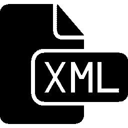
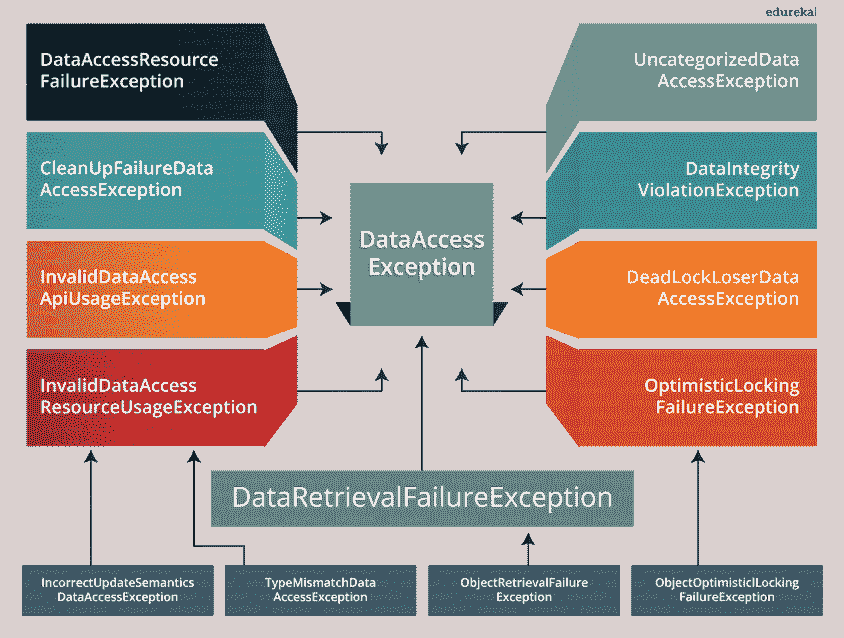
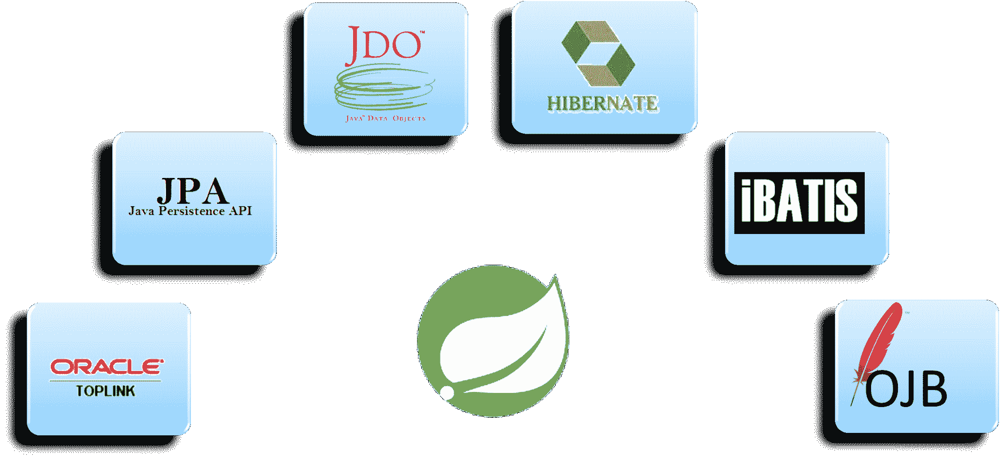
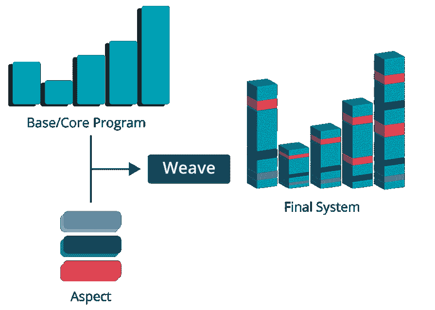
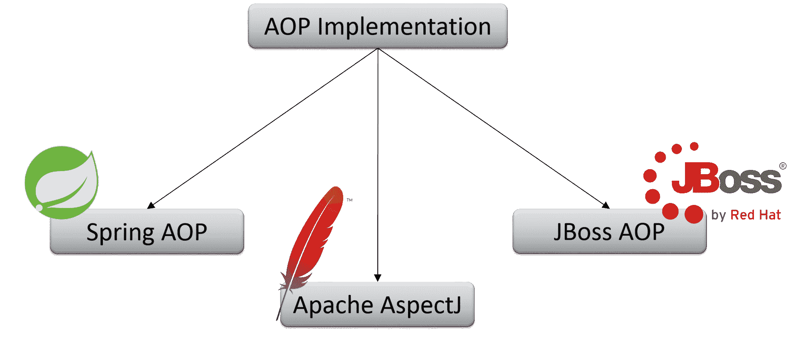
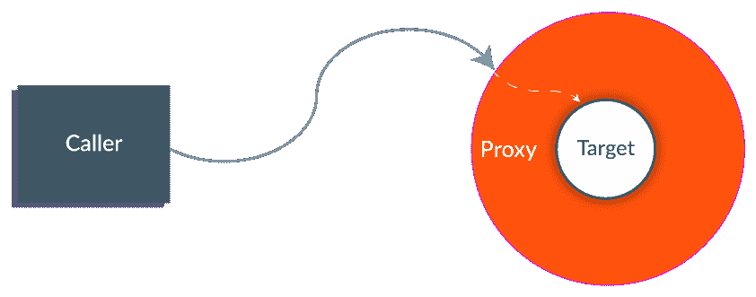
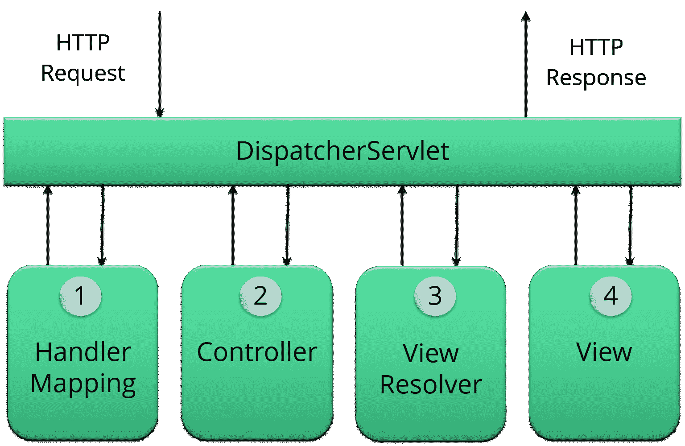

# 2023 年你必须准备的 50 个春季面试问题

> 原文：<https://www.edureka.co/blog/interview-questions/spring-interview-questions/>

您是否正在考虑在 Spring Framework 中发展您的职业生涯？你正在寻找一套合适的 QnA 来准备你的面试吗？这里有一个关于**春季面试问题**的博客，讨论了前 50 个问题，并有适当的解释和例子。这肯定会帮助你在面试中胜出。但是在开始讨论 Spring 面试问题之前，让我们快速了解一下 Spring Framework 的需求和市场地位。

**Spring 框架**自发布以来，在市场上持续开花。Spring 社区不断推出新的东西，并把扩展成一个巨大的生态系统。如今，它占据了框架市场的头把交椅。查看下图，该图显示了截至 2018 年 1 月市场上最常用的框架。

Want to Upskill yourself to get ahead in Career? Check out the ***[Top Trending Technologies](https://www.edureka.co/blog/top-10-trending-technologies/) Article.***


你可能会问为什么 [***春季认证***](https://www.edureka.co/spring-certification-course) 如此抢手？嗯，答案 是， b 因为它为现代基于 Java 的企业应用提供了全面的编程和配置模型。它与使用的部署平台无关。Spring 框架的一个关键元素是应用层的基础设施支持。随着更多主要版本的发布， 不太可能在近期退出市场 。

获得行业级项目认证&快速跟踪你的职业 [<button>看看吧！</button>](https://www.edureka.co/spring-framework)

在我们继续之前，让我们来看看春季面试中最常被问到的一些问题，

Q1。不同版本的 Spring Framework 有哪些主要特性？ Q2。[什么是 Spring 框架？](#WhatisaSpringFramework?)Q3。[列举 Spring 框架](#ListtheadvantagesofSpringFramework) Q4 的优点。[Spring 框架有哪些不同的特性？](#WhatarethedifferentfeaturesofSpringFramework?) Q5。[Spring 框架中有多少模块，分别是什么？](#HowmanymodulesarethereinSpringFrameworkandwhatarethey?) Q6。[什么是 Spring 配置文件？](#WhatisaSpringconfigurationfile?) Q7。[Spring 应用程序的不同组成部分是什么？](#WhatarethedifferentcomponentsofaSpringapplication?) Q8。[使用 Spring 框架的各种方法有哪些？](#WhatarethevariouswaysofusingSpringFramework?) Q9。[什么是 Spring IOC 容器？](#WhatisSpringIOCContainer?) Q10。依赖注入是什么意思？

## **春季面试问题**

所以，下面是**最有可能被面试官问到的 50 个春季面试问题**。如果你想在这个领域有所发展，这些问题一定会帮助你在面试中胜出。为了方便您的访问，我将问题分为几个主题，即:

*   [一般问题](#GeneralQuestion)
*   [依赖注入/ IoC](#DI)
*   [春豆](#Beans)
*   [春天注解](#Annotations)
*   [春季数据访问](#DA)
*   [春季 AOP](#AOP)
*   [春天 MVC](#MVC)

*你可以观看网上研讨会录制的春季面试问题，我们的讲师分享了他的经验和专业知识，将帮助你解决任何春季面试。*

## **2022 年春季面试问答| edu reka**

[https://www.youtube.com/embed/yNY8HLk1hNM?rel=0&showinfo=0](https://www.youtube.com/embed/yNY8HLk1hNM?rel=0&showinfo=0)

我们先从春季面试的第一节题开始，也就是一般题。

## **一般问题——春季面试问题**

### **1。不同版本的 Spring Framework 有哪些主要特性？**

 <caption>#### **弹簧框架的特点**</caption> 
| **版本** | **标志** | **特色** |
| **春天 2.5** |  | 该版本发布于 2007 年。这是第一个支持注释的版本。 |
| **春天 3.0** |  | 该版本发布于 2009 年。 It 充分利用了 Java5 中的改进，也为 JEE6 提供了支持。 |
| **春天 4.0** |  | 这个版本是 2013 年发布的。这是第一个完全支持 Java 8 的版本。 |

### **2。** **什么是****Spring 框架？**

*    Spring 是一个强大的开源应用框架，旨在降低企业应用开发的复杂性。
*   它是轻量级的，松散耦合的。
*   它具有分层架构，允许您选择要使用的组件，同时还为 J2EE 应用程序开发提供了一个内聚的框架。
*   Spring 框架也被称为框架的框架，因为它提供了对各种其他框架的支持，如 Struts、Hibernate、Tapestry、EJB、JSF 等等。

### **3。列举 Spring 框架的优点。**

*   由于 Spring 框架的分层架构，你可以使用你需要的，留下你不需要的。
*   Spring 框架支持 POJO (Plain Old Java Object)编程，这反过来又支持持续集成和可测试性。
*   由于依赖注入和控制反转，JDBC 得到简化。
*   它是开源的，没有供应商限制。

### **4。Spring 框架有哪些不同的特性？**

下面是 Spring 框架的一些主要特性:

*   **轻量级:** Spring 在大小和透明度上是轻量级的。
*   **控制反转(IOC):** 对象给出它们的依赖关系，而不是创建或寻找依赖对象。这叫做控制反转。
*   **面向方面编程(AOP):**Spring 中的面向方面编程通过将应用程序业务逻辑与系统服务分离来支持内聚开发。
*   **容器:** Spring Framework 创建并管理应用对象的生命周期和配置。
*   **MVC 框架:** Spring Framework 的 MVC web 应用框架是高度可配置的。也可以轻松使用其他框架代替 Spring MVC 框架。
*   **事务管理:**Spring 框架提供了事务管理的通用抽象层。Spring 的事务支持也可以用在无容器环境中。
*   **JDBC 异常处理:**Spring 的 JDBC 抽象层提供了一个异常层次，简化了错误处理策略。

### **5。Spring 框架有多少个模块，分别是什么？**

大约有 20 个模块，概括为核心容器、数据访问/集成、Web、AOP(面向方面的编程)、工具和测试。

*   **Spring 核心容器——**这一层基本上是 Spring 框架的核心。 它包含以下模块:

1.  弹簧芯
2.  春豆
3.  SpEL (Spring 表达式语言)
4.  春天的语境

*   **——**这一层 提供了与数据库交互的支持。它包含以下模块:

1.  JDBC (Java 数据库连接)
2.  ORM(对象关系映射)
3.  OXM(对象 XML 映射器)
4.  JMS (Java 消息服务)
5.  交易

*   **Web—**这一层提供了创建 Web 应用的支持。 它包含以下模块:

1.  网页
2.  Web–MVC
3.  网络插座
4.  网络门户

*   **面向方面编程(AOP)–**在这一层 你可以使用建议、 切入点等。，对 代码进行解耦。
*   **插装—**这一层 提供了对类插装和类加载器实现的支持。
*   **Test—**This 层提供了对 JUnit 和 TestNG 进行测试的支持。

下面给出几个杂项模块:

*   **消息传递-**这个 模块提供了对 STOMP 的支持。它还支持用于路由和处理来自 WebSocket 客户端的 STOMP 消息的注释编程模型。
*   **方面—**该模块提供与 AspectJ 的集成支持。

### **6。什么是 Spring 配置文件？【T2**

Spring 配置文件是一个 XML 文件。这个文件主要包含类信息。它 描述了这些类是如何配置以及如何相互介绍的。然而，XML 配置文件更详细，也更干净。如果没有正确地计划和编写，在大项目中管理起来会变得非常困难。

### **7。Spring 应用程序的不同组件是什么？**

一个 Spring 应用程序，一般由以下组件组成:

*   接口:定义函数。
*   Bean 类:它包含属性，它的 setter 和 getter 方法，函数等等。
*   Spring 面向方面编程(AOP):提供横切关注点的功能。
*   Bean 配置文件:包含类的信息以及如何配置它们。
*   用户程序:使用功能。

### **8。Spring 框架的各种使用方法有哪些？**

Spring 框架可以以多种方式使用。它们列出如下:

1.  作为一个成熟的 Spring web 应用。
2.  作为第三方 web 框架，使用 Spring 框架中间层。
3.  用于远程使用。【T2
4.  作为企业 Java Bean，可以包装现有的 POJOs(普通旧 Java 对象)。

下一部分春季面试问题是关于*依赖注入和 IoC 容器*。

## **依赖注入/ IoC 容器****——春季面试题**

### **9。什么是 Spring IOC 容器？**

## ****

Spring 框架的核心是 Spring 容器。容器 c 创建对象，将它们连接在一起，配置它们并管理它们的完整生命周期。Spring 容器利用依赖注入来管理组成应用程序的组件。容器接收指令 ，通过读取所提供的配置元数据来实例化、配置和组装哪些对象 。这些元数据可以由 XML、Java 注释或 Java 代码提供。

### **10。依赖注入是什么意思？**

在依赖注入中，你不必创建你的对象，但必须描述它们应该如何被创建。您没有在代码中将组件和服务直接连接在一起，而是在配置文件中描述哪些组件需要哪些服务。IoC 容器会将它们连接在一起。

### **11。依赖注入有多少种方式？**

一般来说，依赖注入有三种方式，即:

*   构造函数注入
*   设定器喷射
*   接口注入

在 Spring 框架中，只使用构造器和设置器注入。

### **12。区分构造函数注入和设置器注入。**

#### 构造函数注入与设置器注入

| **构造函数注入** | **二传手注射** |
| 没有局部注射。 | 可以有局部注射。 |
| 它不会覆盖 setter 属性。 | 它的 覆盖了 的构造函数属性。 |
| 如果做了任何修改，它将创建一个新的实例。 | 如果做了任何修改，It 将不会 创建新的实例。 |
| 对很多人来说很管用es。 | 它对少数属性更有效。 |

### **13。春季有多少种国际奥委会集装箱？**

1.  **beans factory**:bean factory 就像一个包含一组 bean 的工厂类。每当客户端请求时，它都会实例化 bean。
2.  **application context**:application context 接口构建在 BeanFactory 接口之上。它在 BeanFactory 之上提供了一些额外的 功能 。

### **14。区分 BeanFactory 和 ApplicationContext。**

#### BeanFactory 与应用程序上下文

| **豆制品厂** | **应用上下文** |
| 是 org . spring framework . beans . factory 中定义的接口**bean factory** | org . spring framework . context 中定义的接口**application context** |
| 它使用惰性初始化 | 它使用急切/积极的初始化 |
| 它使用语法明确地提供了一个资源对象 | 它自己创建并管理 资源对象 |
| 不支持国际化 | 支持国际化 |
| 不支持基于注释的依赖 | 支持基于标注的依赖 |

### **15。列举国际奥委会的一些好处。**

国际奥委会的一些好处是:

*   这将最大限度地减少应用程序中的代码量。
*   这将使你的应用程序易于测试，因为它在你的单元测试用例中不需要任何单例或 JNDI 查找机制。
*   它以最小的努力和最少的介入机制促进了松散耦合。
*   它支持服务的即时实例化和延迟加载。

让我们进入下一段春季面试问题，那就是*春豆面试问题*。

## **春豆——春季面试试题**

### **16。解释春豆？**

*   它们是构成 用户的 ap 应用主干的对象。
*   Beans 由 Spring IoC 容器管理。
*   它们被一个 Spring IoC 容器实例化、配置、连接和管理
*   bean 是用用户提供给容器的配置元数据创建的。

### **17。配置元数据是如何提供给 Spring 容器的？**

配置元数据可以通过以下方式提供给 到 Spring 容器:

*   **基于 XML 的配置:**在 Spring 框架中，beans 需要的依赖关系和服务是在 XML 格式的配置文件中指定的。这些配置文件通常包含许多 bean 定义和特定于应用程序的配置选项。他们一般以一个豆标记开头。 例如:

```
<bean id="studentbean" class="org.edureka.firstSpring.StudentBean">
 <property name="name" value="Edureka"></property>
</bean>

```

*   **基于注释的配置**:您可以通过使用相关类、方法或字段声明上的注释，将 bean 配置到组件类本身中，而不是使用 XML 来描述 bean 连接。默认情况下，Spring 容器中的注释连接是不打开的。因此，在使用它之前，您需要在 Spring 配置文件中启用它。例如:

```
<beans>
<context:annotation-config/>
<!-- bean definitions go here -->
</beans>

```

*   **基于 Java 的配置:**Spring Framework 新的 Java 配置支持中的关键特性是@Configuration 注释类和@Bean 注释方法。

*1\. @Bean annotation plays the same role as the <bean/> element. ****2.@Configuration classes allows to define inter-bean dependencies by simply calling other @Bean methods in the same class.*******For example:

```
@Configuration 
public class StudentConfig 
{ 
@Bean
public StudentBean myStudent() 
{ return new StudentBean(); }
}

```

### **18。Spring 支持多少个 bean 作用域？**

Spring 框架支持五个范围。他们是:

*   **Singleton:** 这为 bean 定义每个 Spring IoC 容器的单个实例提供了范围。
*   **原型:**这为单个 bean 定义提供了拥有任意数量的对象实例的范围。
*   **请求:**这为 HTTP 请求提供了 bean 定义的范围。
*   **会话:**这为 HTTP 会话提供了 bean 定义的范围。
*   **全局会话:**这为全局 HTTP 会话提供了 bean 定义的范围。

只有当用户使用网络感知 应用上下文 时，后三种才可用。

### **19。Spring Bean Factory 容器中的 Bean 生命周期是怎样的？**

Spring Bean Factory 容器中的 Bean 生命周期如下:

1.  Spring 容器从 XML 文件中的 bean 定义实例化 bean。
2.  Spring 使用依赖注入来填充所有属性，正如 bean 定义中所指定的。
3.  如果 bean 实现了 BeanNameAware 接口，那么工厂通过传递 bean 的 ID 来调用 setBeanName()。
4.  如果 bean 实现了 BeanFactoryAware 接口，工厂通过传递自身的实例来调用 setBeanFactory()。
5.  如果有任何 BeanPostProcessors 与 bean 相关联，则调用 preprocessbeforeininitial ization()方法。
6.  如果为 bean 指定了 init-method，那么它将被调用。
7.  最后，如果有任何与 bean 相关联的 bean postProcessAfterInitialization()方法将被调用。

为了更好地理解它，请查看下图:


### **20。春季讲解内豆。**

只有当一个 bean 被用作另一个 bean 的属性时，它才能被声明为内部 bean。为了定义一个 bean，Spring 的基于 XML 的配置元数据提供了在<属性>或<构造函数-参数>中使用< bean >元素。 内部 beans 总是匿名的，并且它们总是被作为原型。例如，假设我们有一个引用 Person 类的学生类。这里我们将只创建 Person 类的一个实例，并在 Student 中使用它。

下面是一个学生类，后面是 bean 配置文件:

Student.java

```
public class Student
{
private Person person;
//Setters and Getters
}
public class Person
{
private String name;
private String address;
//Setters and Getters
}

```

学生豆. xml

```
<bean id=&ldquo;StudentBean" class="com.edureka.Student">
<property name="person">
<!--This is inner bean -->
<bean class="com.edureka.Person">
<property name="name" value=&ldquo;Scott"></property>
<property name="address" value=&ldquo;Bangalore"></property>
</bean>
</property>
</bean>

```

### **21。定义 Bean 连接。**

当 bean 在 Spring 容器中组合在一起时，这被称为连接或 bean 连接。在连接 bean 时，Spring 容器需要知道需要什么 bean，以及容器应该如何使用依赖注入将 bean 绑定在一起。


### **22。你对自动布线的理解是什么，并说出它的不同模式？**

Spring 容器能够自动连接协作 beans 之间的关系。也就是说，通过检查 BeanFactory 的内容，可以让 Spring 自动为您的 bean 解析协作者。bean 自动布线的不同模式有:

1.  **否:**这是默认设置，表示没有自动布线。应该使用显式 bean 引用进行连接。
2.  **byName:** 根据 bean 的名称注入对象依赖。它将其属性与 XML 文件中相同名称定义的 beans 进行匹配和连接。
3.  **byType:** 根据类型注入对象依赖。如果属性的类型与 XML 文件中的一个 beans 名称完全匹配，它就匹配并连接一个属性。
4.  **构造函数:**通过调用类的构造函数注入依赖。它 有大量的参数。
5.  **自动检测:**首先，容器通过*构造器*尝试使用自动连线，如果不能，则通过*通过类型*尝试自动连线。

### **23。自动布线的局限性是什么？**

以下是你在使用自动布线时可能会遇到的一些限制:

*   **覆盖可能性:**您可以始终使用<构造函数参数>和<属性>设置来指定依赖关系，这将覆盖自动布线。
*   **原语数据类型:**原语、字符串、类等简单属性不能自动连线。
*   **迷惑性:**总是喜欢使用显式布线，因为自动布线没有 精确 。

在下一节中，我们将讨论关于*春天注解面试问题*。

## **春天注解——春天面试试题**

### **24。基于注释的容器配置是什么意思？**

开发人员不使用 XML 来描述 bean 连接，而是通过使用相关类、方法或字段声明上的注释将配置移入组件类本身。 它作为 XML 设置的替代。 例如:

```
@Configuration 
public class AnnotationConfig
{
@Bean 
public MyDemo myDemo()
 { return new MyDemoImpll(); }
}

```

### **25。****如何在春天开启注释布线？**

默认情况下，Spring 容器中的注释连接是不打开的。 T hus，要使用基于注释的连接 我们必须在我们的 Spring 配置文件中通过配置 **<** **上下文:annotation-config****/>**元素来启用它。 例如:

```
<beans  xmlns:xsi="http://www.w3.org/2001/XMLSchema-instance" xmlns:context="http://www.springframework.org/schema/context">
<context:annotation-config/>
<beans &hellip;&hellip;&hellip;&hellip; />
</beans>

```

### **26。Spring 中的@Component、@Controller、@ Repository&@ Service annotations 有什么区别？【T2**

**@Component:** 这将一个 java 类标记为 bean。它是任何 Spring 管理的组件的通用原型。spring 的组件扫描机制现在可以把它捡起来，放到应用程序上下文中。

**@Controller:** 这标志着一个类是 Spring Web MVC 控制器。用它标记的 Beans 会自动导入依赖注入容器。

**@Service:** 这个标注是组件标注的专门化。它没有在@Component 注释上提供任何附加行为。您可以在服务层类中使用@ Service over @ Component，因为它以更好的方式指定了意图。

**@Repository:** 这个注释是@Component 注释的一个专门化，具有相似的用途和功能。它特别为 Dao 提供了额外的好处。它将 Dao 导入到 DI 容器中，使未检查的异常有资格转换为 Spring DataAccessException。

### **27。@必选标注你是怎么理解的？**

@Required 应用于 bean 属性 setter 方法。该注释只是表明受影响的 bean 属性必须在配置时借助 bean 定义中的显式属性值或自动连接来填充。如果受影响的 bean 属性尚未填充，容器将抛出 BeanInitializationException。

例如:

```
public class Employee
{
private String name;
@Required
public void setName(String name)
{this.name=name; }
public string getName()
{ return name; }
}

```

### **28。你对@Autowired 注释的理解是什么？**

**@****自动连线**注释提供了对自动连线的位置和方式的更精确的控制。该注释用于在 setter 方法、构造函数、属性或具有任意名称或多个参数的方法上自动连接 bean。默认情况下，它是类型驱动注射。

例如:

```
public class Employee
{
private String name;
@Autowired
public void setName(String name)
{this.name=name; }
public string getName()
{ return name; }
}

```

### **29。@限定词注释你是怎么理解的？**

当您创建了多个相同类型的 bean，并且想要仅连接其中一个 bean 的属性时，您可以使用 **@Qualifier** 注释和 **@** **Autowired** 来通过指定应该连接哪个 bean 来消除歧义。

例如，这里我们有两个类，分别是 Employee 和 EmpAccount。在 EmpAccount 中，使用@Qualifier 指定必须连接 id 为 emp1 的 bean。

Employee.java

```
public class Employee
{
private String name;
@Autowired
public void setName(String name)
{ this.name=name; }
public string getName()
{ return name; }
}
```

EmpAccount.java

```
public class EmpAccount
{
private Employee emp;
@Autowired
@Qualifier(emp1)
public void showName()
{
System.out.println(&ldquo;Employee name : &rdquo;+emp.getName);
}
}

```

### **30。你对@RequestMapping 注释的理解是什么？**

@RequestMapping 注释用于将特定的 HTTP 请求方法映射到将处理相应请求的控制器中的特定类/方法。此注释可应用于两个级别:

*   **<u>类级</u>** :映射请求的 URL
*   **<u>方法级</u>** :映射 URL 以及 HTTP 请求方法

下一节春季面试问题是关于*数据访问*。

## **数据访问****——春季面试试题**

### **31。形容弹簧刀支持？**

Spring 中的数据访问对象(DAO)支持使得以一致的方式使用 JDBC、Hibernate 或 JDO 等数据访问技术变得容易。这使得人们可以很容易地在持久性技术之间切换。它还允许你不用担心捕捉特定于每一个这些技术的异常。

### **32。说出 Spring DAO 类抛出的异常。**

见下图，按层次顺序描绘了所有的弹簧刀类。



### **33。spring JDBC API 中有哪些类？**

JDBC API 中的等级如下:

1.  JdbcTemplate
2.  简单 JDBC 模板
3.  namedparameterdbctemplate
4.  单纯 JdbcInsert
5.  简单 JDBC 调用

### **34。使用 Spring 可以通过哪些方式访问 Hibernate？**

有两种 o 方式 by w 我们可以使用 Spring:

1.  用 Hibernate 模板控制反转和回调
2.  扩展 HibernateDAOSupport 并应用 AOP 拦截器节点

### **35。说出 Spring 支持的事务管理类型。**

Spring 支持两种类型的事务管理。他们是:

1.  **程序化交易管理:**在此，借助编程来管理交易。它为您提供了极大的灵活性，但是很难维护。
2.  **声明式事务管理:**在此，事务管理与业务代码分离。只有注释或基于 XML 的配置用于管理事务。

### **36。Spring 支持哪些不同的 ORM？**

Spring 支持的不同 ORM 通过下图描述:

 下一节春季面试试题讨论关于*春季 AOP 面试试题*。

## **【面向方面编程(AOP)****——春季面试试题**

### **37。描述 AOP。**

面向方面编程(Aspect-oriented programming)或 AOP 是一种编程技术，它允许程序员模块化横切关注点或跨越典型职责划分的行为。横切关注点的例子可以是日志和事务管理。AOP 的核心是一个 *方面* 。它将影响多个类的行为封装到可重用的模块中。



### **38。你说的方面是什么意思？**

方面是关注点的模块化，它跨越多个对象。事务管理是 J2EE 应用程序中横切关注点的一个好例子。方面是使用 Spring Framework 中的常规类或用@Aspect 注释标注的常规类实现的。

### **39。解释连接点。**

程序执行过程中的一个点叫做连接点，比如一个方法的执行或者一个异常的处理。 在 Spring AOP 中，一个 连接点 总是代表一个方法的执行。 

### **40。什么是建议？**

某个方面在某个特定的 连接点 采取的动作被称为建议。Spring AOP 使用通知作为拦截器，在连接点“周围”维护一系列拦截器。


### **41。有哪些不同类型的建议？**

Spring AOP 中不同类型的建议有:

1.  **Before:** 这些类型的通知在连接点方法之前执行，使用 **@Before** 注释标记进行配置。
2.  **返回后:**这类通知在连接点方法完成正常执行后执行，使用@AfterReturning 注释标记配置。
3.  **抛出后:**这些类型的建议只有在连接点方法通过抛出异常退出并使用@AfterThrowing 注释标记进行配置时才执行。
4.  **(finally):**这些类型的通知在连接点方法之后执行，不管该方法是正常退出还是异常返回，都使用@After 注释标记进行配置。
5.  **Around:** 这些类型的建议在一个 连接点 一个 nd 前后执行，使用@Around 注释标记进行配置。

### **42。指出 Spring AOP 中关注点和横切关注点的区别？**

关注点是我们希望在应用程序的特定模块中拥有的行为。它可以被定义为我们想要实现的功能。

横切关注点是适用于整个应用程序的关注点。这会影响整个应用程序。例如，日志、安全和数据传输是应用程序几乎每个模块都需要关注的问题，因此它们是横切关注点。


### **43。有哪些不同的 AOP 实现？**

下图描述了不同的 AOP 实现:



### **44。Spring AOP 和 AspectJ AOP 有什么区别？**

#### Spring AOP vs AspectJ AOP

| **春季 AOP** | **AspectJ AOP** |
| 通过代理进行运行时编织 | 通过 AspectJ Java 工具进行编译时编织 |
| 它只支持方法级切入点 | 它支持字段级切入点 |
| 它是基于 DTD 的 | 它是基于模式和注释的配置 |

### **45。Spring 框架中的代理是什么意思？**

将建议应用到目标对象后创建的对象称为代理。在客户端对象的情况下，目标对象和代理对象是相同的。


### **46。春天，什么是编织？**

将一个方面与其他应用程序类型或对象链接起来以创建一个建议对象的过程称为编织。在 Spring AOP 中，编织是在运行时执行的。参考下图:

 春季面试最后一段题在*春季 MVC 面试题*上。 

## **【MVC(模型-视图-控制器)****——春季面试试题**

### **47。Spring MVC 框架是什么意思？**

Spring web MVC 框架提供了模型-视图-控制器架构，并准备好使用组件来开发灵活且松散耦合的 web 应用程序。MVC 模式有助于分离应用程序的不同方面，如输入逻辑、业务逻辑和 UI 逻辑，同时提供所有这些元素之间的松散耦合。[Spring MVC](https://spring.io/guides/gs/serving-web-content/)入门 

### **48。描述 DispatcherServlet。**

DispatcherServlet 是 Spring Web MVC 框架的核心。它处理所有的 HTTP 请求和响应。DispatcherServlet 从配置文件接收处理程序映射条目，并将请求转发给控制器。控制器然后返回模型和视图的对象。DispatcherServlet 检查配置文件中的视图解析器条目，并调用指定的视图组件。



### **49。解释 WebApplicationContext。**

WebApplicationContext 是普通应用程序上下文的扩展。它有一些 web 应用程序所必需的额外特性。就解析主题的能力和决定与哪个 servlet 相关联而言，它不同于普通的 ApplicationContext。

### **50。在 Spring MVC 框架中，控制器是什么？**

控制器提供对应用程序行为的访问。这些行为通常通过服务接口来定义。控制器解释用户输入并将其转换成由视图呈现给用户的模型。在 Spring 中，控制器是以一种非常抽象的方式实现的。它还使您能够创建各种各样的控制器。


我希望这一套春季面试问答能帮助你准备面试。万事如意！

*如果您想学习 Spring 并希望在开发 Java 应用程序时使用它，那么请查看 Edureka 的 [**Spring 认证**](https://www.edureka.co/spring-certification-course) 培训，edu reka 是一家值得信赖的在线学习公司，拥有遍布全球的 250，000 多名满意的学习者。*

*有问题吗？请在评论区提到它，我们会给你回复。*****