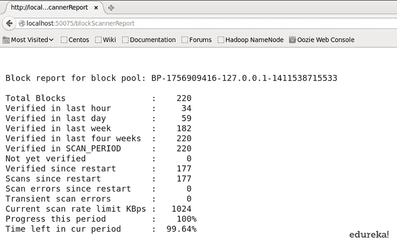

# 2023 年需要准备的 Hadoop 面试问题——HDFS

> 原文：<https://www.edureka.co/blog/interview-questions/hadoop-interview-questions-hdfs-2/>

如果你正在寻找 Hadoop HDFS 面试问题，并渴望成为 [Hadoop 课程](https://www.edureka.co/big-data-hadoop-training-certification)的 Hadoop 认证开发人员或 [Hadoop 管理课程](https://www.edureka.co/hadoop-administration-training-certification)的 Hadoop 认证管理员，那你来对地方了。这份 HDFS 面试问题清单将帮助你达到雇主的期望。在继续这篇 Hadoop HDFS 面试问题博客之前，让我们了解一下  Hadoop 领域的趋势和需求。

## **大数据和 Hadoop 工作趋势:**

根据 Forrester 的预测，在未来 **5** **年**内，大数据市场将以近 **13%的速度**增长，这比一般 IT 预测增长的**两倍多**。Hadoop 已经证明了自己是解决大数据相关问题的事实上的解决者。所以看到 it 行业对 Hadoop 专业人才的巨大需求也就不足为奇了。现在，让我们看一下下图，该图显示了过去几年 Hadoop 职位发布的上升趋势:

**来源:**

从上图中，你可以清楚地推断出  Hadoop 是就业中最受欢迎的技能，不仅现在如此，未来几年也是如此。因此，现在是 卷起袖子准备即将到来的 Hadoop 面试的时候了。

在这里，我为您提供了一份最常被问到的 Hadoop HDFS 面试问题列表，这将有助于您 抓住大数据和 Hadoop 领域产生的机遇。从 [数据工程师认证](https://www.edureka.co/microsoft-azure-data-engineering-certification-course) 了解更多大数据及其应用。

## **Hadoop HDFS 面试题**

## **1。Hadoop 的核心组件有哪些？**

 <caption>#### **Hadoop 核心组件**</caption> 
| **分量** | **描述** |
|  | ***[Hadoop](https://www.edureka.co/blog/hadoop-tutorial/)***分布式文件系统或 ***[HDFS](https://www.edureka.co/blog/hdfs-tutorial)*** 是一个基于 Java 的分布式文件系统，它允许我们在一个 Hadoop 集群中跨多个节点存储  大数据。 |
| ***纱*** | YARN 是 Hadoop 中的处理框架，允许多个数据处理引擎管理存储在单个平台上的数据，并提供资源管理。 |

## **2。HDFS 的主要特征是什么？**

♣ **提示**:在列举不同 HDFS 特性的同时，你也应该简要解释一下这些特性。

HDFS 的一些突出特点如下

*   ***性价比高，可扩展:*** HDFS，一般来说，是部署在一个商品硬件上。因此，就项目的拥有成本而言，这是非常经济的。此外，用户可以通过添加更多节点来扩展群集。
*   ***数据种类和数量:***【HDFS】都是关于  存储海量数据，即 TB 级&Pb 级数据和不同种类的数据。因此，我可以将任何类型的数据存储到 HDFS 中，无论是结构化、非结构化还是半结构化的。
*   ***可靠性和容错:*** HDFS 将给定的数据分成数据块，复制并以分布式方式存储在整个 Hadoop 集群中。 这使得 HDFS 非常可靠和容错。
*   ***高吞吐量:*** 吞吐量是单位时间内完成的工作量。HDFS 提供对应用程序数据的高吞吐量访问。

## **3。解释 HDFS 架构并列出 HDFS 集群中的各种 HDFS 守护进程？**

在列出各种 HDFS 守护进程的同时，您还应该简单地谈谈它们的角色。你应该这样回答这个问题:

Apache Hadoop[***HDFS 架构***](https://www.edureka.co/blog/apache-hadoop-hdfs-architecture/) 遵循主/从拓扑结构，其中一个集群包含一个 NameNode(主节点或守护进程)，所有其他节点都是 DataNodes(从节点或守护进程)。以下守护程序在 HDFS 集群中运行:

*   **NameNode:** 它是维护和管理数据节点中的数据块的主守护进程。
*   **DataNode:**DataNode 是 HDFS 的从节点。与 NameNode 不同，DataNode 是一种商用硬件，负责将数据存储为块。
*   **次 NameNode:** 次 NameNode 作为*助手* *守护进程*与主 NameNode 同时工作。它执行检查点操作。

## **4。Hadoop 中的检查点是什么？**

检查点是将编辑日志与 FsImage(文件系统映像)相结合的过程。它由辅助 NameNode 执行。

## **5。Hadoop 中的 NameNode 是什么？**

NameNode 是管理所有 DataNodes(从节点)的主节点。它记录了关于存储在集群中的所有文件的元数据信息(在数据节点上) ，例如，存储块的位置、文件的大小、权限、层次结构等。

## **6。什么是 DataNode？**

DataNodes 是 HDFS 中的从节点。它是为数据提供存储的商用硬件。它服务于 HDFS 客户端的读写请求。

## **7。Namenode 机器和 DataNode 机器在硬件方面相同吗？**

与 DataNodes 不同，NameNode 是一个高度可用的服务器，它管理文件系统名称空间并维护 元数据信息。因此，NameNode 需要更高的 RAM 来存储与内存中数百万个 HDFS 文件相对应的元数据 信息，而 DataNode 需要更高的磁盘容量来存储巨大的数据集。

## **8。NAS(网络连接存储)和 HDFS 有什么区别？**

以下是 NAS 和 HDFS 的主要区别:

*   网络附加存储(NAS)是连接到计算机网络的文件级计算机数据存储服务器，为不同种类的客户端组提供数据访问。NAS 可以是提供存储和访问文件服务的硬件或软件。而 Hadoop 分布式文件系统(HDFS)是一个使用商用硬件存储数据的分布式文件系统。

*   在 HDFS，数据块分布在集群中的所有机器上。而在 NAS 中，数据存储在专用硬件上。

*   HDFS 被设计为使用 MapReduce 范式，将计算转移到数据上。 NAS 不适合 MapReduce，因为数据是与计算分开存储的。

*   HDFS 使用经济高效的商用硬件，而 NAS 是一种高端存储设备，成本很高。

## **9。传统的 RDBMS 和 Hadoop 有什么区别？**

这个问题看起来很简单，但是在面试中这些简单的问题很重要。所以，你可以这样回答这个问题:

|  | **Hadoop** |
| **数据类型** | RDBMS 依赖于结构化数据，而数据的模式总是已知的。 | 任何类型的数据都可以存储到 Hadoop 中，无论是结构化、非结构化还是半结构化。 |
| **处理** | RDBMS 提供有限的处理能力或不提供处理能力。 | Hadoop 允许我们以并行方式处理分布在集群中的数据。 |
| **模式上** **读 vs .** | RDBMS 基于“写入模式”,即在加载数据之前进行模式验证。 | 相反，Hadoop 在读取策略上遵循模式。 |
| **读写速度** | 在 RDBMS 中，读取速度很快，因为数据的模式是已知的。 | HDFS 的写入速度很快，因为在 HDFS 写入期间没有进行模式验证。 |
| **成本** | 因此，我必须为软件付费。 | Hadoop 是一个开源框架。所以，我不需要为软件付费。 |
| **最佳适合用例** | RDBMS 用于联机事务处理系统。 | Hadoop 用于数据发现、数据分析或 OLAP 系统。 |

## **10。什么是吞吐量？HDFS 如何提供良好的吞吐量？**

吞吐量是单位时间内完成的工作量。HDFS 提供了良好的吞吐量，因为:

*   HDFS 基于一写多读模式 ，它简化了数据一致性问题，因为一次写入的数据无法修改，因此提供了高吞吐量的数据访问。

*   在 Hadoop 中，计算部分移向数据，这减少了网络拥塞，因此提高了整体系统吞吐量。

## **11。什么是辅助 NameNode？它是 NameNode 的替代节点还是备份节点？**

在这里，为了清楚起见，在回答这个问题的后半部分时，你还应该提到次 NameNode 的功能:

第二个命名节点 是在 HDFS 执行检查点 的辅助守护进程。不，它不是 NameNode 的备份或替代节点。它定期从 NameNode 获取编辑 日志(元数据文件),并将其与 FsImage(文件系统映像)合并，以生成更新的 FsImage，并防止编辑日志变得过大。

## **12。你说的 HDFS 元数据是什么意思？列出与元数据相关的文件。**

HDFS 中的元数据代表 HDFS 目录和文件的结构。它还包括有关 HDFS 目录和文件的各种信息，如所有权、权限、配额和复制因子。

♣ **提示:**在列出与元数据相关的文件时，给每个元数据文件一行定义。

NameNode 中存在两个与元数据相关联的文件:

*   **FsImage:** 它包含了从 NameNode 开始的文件系统命名空间的完整状态。

*   **EditLogs:** 它包含最近对文件系统所做的关于最近 FsImage 的所有修改。

## **13。在 HDFS 有很多小文件有什么问题？**

众所周知，NameNode 在 RAM 中存储关于文件系统的元数据信息。因此，内存量限制了我的 HDFS 文件系统中的文件数量。换句话说，太多的文件将导致产生太多的元数据，将这些元数据存储在 RAM 中将成为一个挑战。根据经验，文件、数据块或目录的元数据需要 150 字节。

## **14。什么是 HDFS 的心跳？**

HDFS 中的心跳是由 DataNodes 发送给 NameNode 的信号，表示它运行正常(存活)。默认情况下，心跳间隔为 3 秒，可以使用 hdfs-site.xml 中的 dfs.heartbeat.interval 进行配置。

## **15。你如何检查你的 NameNode 是否工作？**

有许多方法可以检查 NameNode 的状态。最常见的是，使用 **jps 命令**来检查 HDFS 中运行的所有守护进程的状态。或者，你也可以访问 NameNode 的 Web 用户界面。

## **16。什么是街区？**

你应该从街区的一般定义开始回答。然后，你应该简单解释一下 HDFS 的区块，并提及它们的默认大小。

***[块](https://www.edureka.co/blog/apache-hadoop-hdfs-architecture/)*** 是硬盘上存储数据的最小连续位置。HDFS 将每个文件存储为块，并将其分布在整个 Hadoop 集群中。在 HDFS 中，块的默认大小是 128 MB (Hadoop 2.x)和 64 MB (Hadoop 1.x ),与块大小为 4KB 的 Linux 系统相比，这要大得多。具有这种巨大块大小的原因是为了最小化查找成本并减少每个块生成的元数据信息。

**17。假设有一个大小为 514 MB 的文件存储在 HDFS (Hadoop 2.x)中，使用默认的数据块大小配置和默认的复制因子。那么，总共会创建多少个块，每个块的大小是多少？**

Hadoop 2 . x 中的默认块大小为 128 MB。因此，大小为 514 MB 的文件将被分成 5 个块(514 MB/128 MB)，其中前四个块的大小为 128 MB，最后一个块的大小仅为 2 MB。因为我们使用默认的复制因子，即 3，所以每个数据块将复制三次。因此，我们总共有 15 个数据块，其中 12 个数据块的大小为 128 MB，3 个数据块的大小为 2 MB。

## **18。如何将数据块大小不同于现有数据块大小配置的文件拷贝到 HDFS？**

♣ **提示:**你应该以改变块大小的命令开始回答，然后，你应该用一个例子来解释整个过程。你应该这样回答这个问题:

是的，用户可以使用'-Ddfs.blocksize=block_size '将不同块大小的文件复制到 HDFS，其中 block_size 以字节为单位。

让我用一个例子来解释一下:假设，我想将一个名为 test.txt 的文件(比如 120 MB)复制到 HDFS 中，我希望这个文件的块大小为 32 MB (33554432 字节)，而不是默认的 128 MB。因此，我将发出以下命令:

*Hadoop fs-DDFS . block size = 33554432-copy from local/home/edu reka/test . txt/sample _ HDFS*

现在，我可以通过检查与该文件相关的 HDFS 块大小

*Hadoop fs-stat % o/sample _ HDFS/test . txt*

另外，我也可以使用 NameNode web 用户界面来查看 HDFS 目录。

你可以通过博客上的 [***Hadoop Shell 命令***](https://www.edureka.co/blog/hdfs-commands-hadoop-shell-command) 在那里你会找到各种 Hadoop 命令，用一个例子解释。

## **19。你能改变 HDFS 文件的块大小吗？**

是的，我可以通过更改 hdfs-site.xml 中的默认大小参数来更改 HDFS 文件的块大小。但是，我必须重新启动集群才能使此属性更改生效。

## **20。在 HDFS 什么是块扫描器？**

块扫描器在每个 DataNode 上定期运行，以验证存储的数据块是否正确。当块扫描器检测到损坏的数据块时，将发生以下步骤:

*   首先，DataNode 将向 NameNode 报告损坏的块。

*   然后，NameNode 将使用其他数据节点中损坏数据块的正确副本开始创建新副本的过程。

*   在正确副本的复制计数与复制因子(默认为 3)匹配之前，损坏的数据块不会被删除。

整个过程允许 HDFS 在客户端执行读取操作时保持数据的完整性。用户可以使用 DataNode 的 web 界面-**localhost:50075/blockScannerReport**检查块扫描器报告，如下所示:

**图**–*Block Scanner 报告——Hadoop HDFS 面试问题*

## **21。HDFS 使用商用硬件存储数据，这种硬件出现故障的几率更高。那么，HDFS 如何保证系统的容错能力呢？**

♣ **提示:**基本上，这个问题是关于 Hadoop 中的数据块复制，以及它如何帮助提供容错。

HDFS 通过复制数据块并将其分布到集群中的不同数据节点来提供容错能力。默认情况下，此复制因子设置为 3，这是可配置的。因此，如果我在 HDFS 存储一个 1 GB 的文件，其中复制因子设置为默认值，即 3，由于复制，它最终将占用 3 GB 的总空间。现在，即使一个 DataNode 失败或一个数据块损坏，我也可以从存储在不同 DataNode 中的其他副本中检索数据。

## **22。复制造成数据冗余，消耗大量空间，那么为什么在 HDFS 还在推行呢？**

为了提供容错功能，HDFS 采用了复制技术。是的，这将导致大量空间的消耗，但是如果需要的话，您总是可以向群集中添加更多的节点。顺便说一句，在实际的集群中，很少会出现自由空间问题，因为部署 HDFS 的首要原因是存储巨大的数据集。此外，可以更改复制因子以节省 HDFS 空间，或者使用 Hadoop 提供的不同编解码器来压缩数据。

## **23。我们可以对 HDFS 的现有文件使用不同的复制因子吗？**

♣ **提示:**回答这类问题时，你应该举一个例子来说明清楚。

是的，对于 HDFS 现有的文件，可以有不同的 ***[复制因子](https://www.edureka.co/blog/apache-hadoop-hdfs-architecture/)*** 。假设我 有一个名为 test.xml 的文件存储在我的 HDFS 的 sample 目录中，复制因子设置为 1。现在，将 text.xml 文件的复制因子改为 3 的命令是 :

*Hadoop fs-set rwp-w3/sample/test . XML*

最后，我可以使用下面的命令检查复制因子是否已经改变:

*Hadoop fs-ls/sample*

或

*Hadoop fsck/sample/test . XML-files*

## **24。什么是机架感知算法，为什么在 Hadoop 中使用它？**

Hadoop 中的 [***机架感知***](https://www.edureka.co/blog/apache-hadoop-hdfs-architecture/) 算法保证所有 th e 块副本不存储在同一个机架或单个机架上。考虑到复制因子为 3，机架感知算法 m 表示，数据块的第一个副本将存储在本地机架上，接下来的两个副本将存储在不同的(远程)机架上，但存储在该(远程)机架内的不同 DataNode 上。使用机架感知有两个原因:

*   **提高网络性能:**一般来说，你会发现*同一机架的机器之间的网络带宽*比驻留在不同机架的机器之间的网络带宽【】更大。因此，机架感知有助于减少不同机架之间的写入流量，从而提供更好的写入性能。

*   **防止数据丢失:**即使因为交换机故障或电源故障导致整个机架出现故障，我也不必担心数据。而且一想就有道理，就像是说*永远不要把所有的鸡蛋放在同一个篮子里。*

## **25。数据或文件是如何写入 HDFS 的？**

回答这个问题的最佳方式是以一个客户端为例，列出在执行写入时将会发生的步骤，而不涉及太多细节:

假设一个客户想要将一个文件写入 HDFS。因此，在整个 HDFS 写入过程中，将在内部执行以下步骤:

*   客户端会将文件分成块，并向 NameNode 发送写请求。

*   对于每个数据块，NameNode 将向客户端提供一个列表，其中包含数据块最终必须复制到的数据节点的 IP 地址(取决于复制因子，默认为 3)。
*   客户端将第一个数据块复制到第一个 DataNode 中，然后数据块的其他副本将由 DataNode 自己以顺序方式复制。

从 Pune 的 [Hadoop 管理培训中了解更多关于 Hadoop 架构、节点等的信息。](https://www.edureka.co/hadoop-administration-training-certification-pune)

## **26。你能修改 HDFS 的文件吗？**

不，我不能修改已经存在于 HDFS 的文件，因为 HDFS 遵循一写多读模式。但是，我总是可以将数据追加到现有的 HDFS 文件中。

## **27。多个客户端可以并发写入一个 HDFS 文件吗？**

不可以，多个客户端不能同时写入一个 HDFS 文件。HDFS 遵循单作者多读者模式。打开文件进行写入的客户机被 NameNode 授予租约。现在，假设与此同时，某个其他客户机想要写入该文件，并向 NameNode 请求写权限。首先，NameNode 将检查写入该特定文件的租约是否已经授予其他人。然后，如果租约已被其他人获得，并且当前正在写入该文件，它将拒绝另一个客户端的写入请求。

澳洲 [数据工程认证](https://www.edureka.co/microsoft-azure-data-engineering-certification-course-australia) 了解更多大数据及其应用。

## **29。HDFS 允许客户端读取一个已经打开的文件吗？**

基本上，问这个问题的目的是为了了解与读取某个客户端当前正在编写的文件相关的约束。你可以用下面的方式回答这个问题:

是的，人们可以阅读已经打开的文件。但是，读取当前正被写入的文件的问题在于数据的一致性，即，HDFS 不保证在文件被关闭之前，已被写入文件的数据将对新的读取器可见。为此，可以显式调用 hflush 操作，该操作会将缓冲区中的所有数据推入写入管道，然后 hflush 操作会等待来自 DataNodes 的确认。因此，通过这样做，在 hflush 操作之前已经写入文件的数据将肯定对读者可见。

## **30。定义数据完整性？HDFS 如何确保存储在 HDFS 的数据块的数据完整性？**

数据完整性讲的是数据的正确性。对我们来说，保证存储在 HDFS 的数据是正确的是非常重要的。但是，在对磁盘进行 I/O 操作时，数据总有可能被损坏。默认情况下，HDFS 会为写入其中的所有数据创建校验和，并在读取操作期间使用校验和来验证数据。此外，每个 DataNode 都会定期运行一个块扫描程序，以验证存储在 HDFS 中的数据块的正确性。

## **31。名称节点的高可用性是什么意思？是如何实现的？**

NameNode 曾经是 Hadoop 1.x 中的单点故障，一旦 NameNode 停机，整个 Hadoop 集群将变得不可用。换句话说，NameNode 的 ***[高可用性](https://www.edureka.co/blog/how-to-set-up-hadoop-cluster-with-hdfs-high-availability/)*** 谈到了 NameNode 主动服务 Hadoop 客户端请求的必要性。

为了解决 NameNode 的单点故障问题，Hadoop 2.x 中引入了高可用性功能，我们的 HDFS 集群中有两个 NameNode，采用主动/被动配置。因此，如果主动 NameNode 出现故障，另一个被动 NameNode 可以接管出现故障的 NameNode 的职责，并保持 HDFS 正常运行。

## **32。定义 Hadoop 归档？在 HDFS 归档一组文件的命令是什么？**

Hadoop Archive 的引入是为了解决由于小文件过多而导致存储元数据信息的 NameNode 的内存使用量增加的问题。基本上，它允许我们将许多小的 HDFS 文件打包成一个归档文件，因此减少了元数据信息。最终的存档文件跟在。har 扩展名，可以将其视为 HDFS 之上的分层文件系统。

归档一组文件的命令:

hadoop 归档–归档名称 edureka _ 归档 。har//输入///位置//输出//位置

## **33。您将如何在 HDFS 执行集群间数据复制工作？**

可以使用如下给出的分布式复制命令来执行集群间数据复制:

*hadoop distcp hdfs:// <源 NameNode > hdfs:// <目标 NameNode>*

我希望这篇关于 Hadoop HDFS 面试问题的博客对你很有帮助，也很有启发。要成为 Hadoop 专家，除了具备扎实的理论知识之外，你还需要参与各种 Hadoop 相关项目。我们设计了一个课程，涵盖了 Hadoop 框架的所有方面以及大量实践经验。行业专家将向您传授他们在各种 Hadoop 相关项目中的宝贵经验。Edureka 的[大数据工程课程](https://www.edureka.co/masters-program/big-data-architect-training)使用零售、社交媒体、航空、旅游、金融领域的实时用例，帮助学习者成为 HDFS、Yarn、MapReduce、Pig、Hive、HBase、Oozie、Flume 和 Sqoop 领域的专家。

最后但同样重要的是，我想说 HDFS 只是 Hadoop 框架中众多组件中的一个。我们为与每个 Hadoop 组件相对应的重要面试问题创建了专门的博客。因此，我建议你按照下面提供的链接，享受阅读:

*   [***50 强 Hadoop 面试问题***](https://www.edureka.co/blog/interview-questions/top-50-hadoop-interview-questions-2016/)
*   [***Hadoop 集群面试题***](https://www.edureka.co/blog/interview-questions/hadoop-interview-questions-hadoop-cluster/)
*   [***Hadoop MapReduce 面试题***](https://www.edureka.co/blog/interview-questions/hadoop-interview-questions-mapreduce/)
*   ***[猪面试问题](https://www.edureka.co/blog/interview-questions/hadoop-interview-questions-pig/)***
*   [***蜂巢面试问题***](https://www.edureka.co/blog/interview-questions/hive-interview-questions/)
*   [***HBase 面试题***](https://www.edureka.co/blog/interview-questions/hbase-interview-questions/)

*有问题吗？请在这个 Hadoop HDFS 面试问题的评论部分提到它，我们会回复您。*