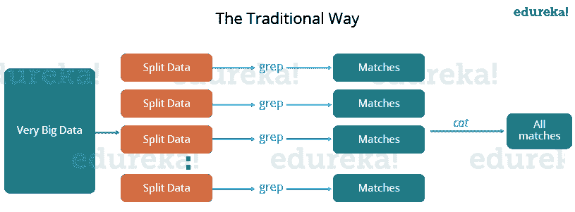
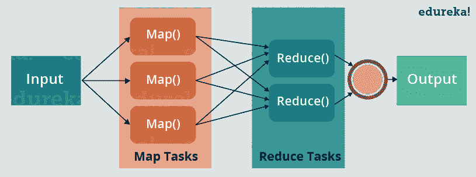
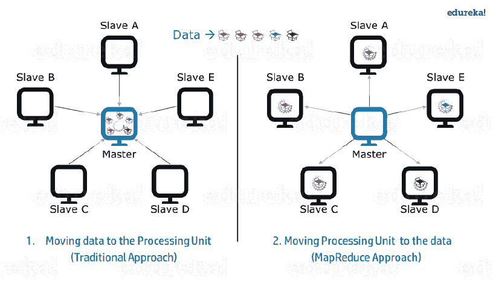
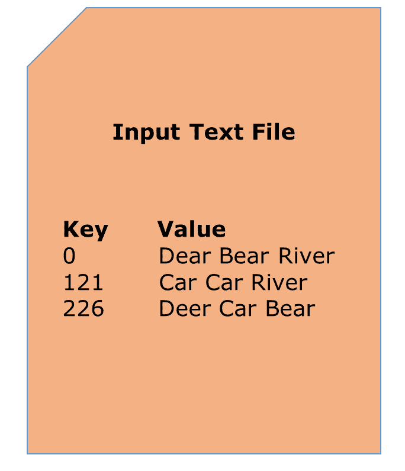

# MapReduce 教程–MapReduce 基础和 MapReduce 示例

> 原文：<https://www.edureka.co/blog/mapreduce-tutorial/>

## **MapReduce 教程:简介**

在这篇 MapReduce 教程博客中，我将向您介绍 MapReduce，它是 Hadoop 框架中处理的核心构建块之一。在继续之前，我建议你先熟悉一下 HDFS 的概念，我在之前的***[【HDFS 教程】](https://www.edureka.co/blog/apache-hadoop-hdfs-architecture/)*** 博客中已经提到过。这将有助于您快速轻松地理解 MapReduce 概念。

在我们开始之前，让我们简要了解以下内容。

**什么是大数据？**


大数据可以被定义为使用传统数据处理单元难以处理的海量数据。大数据的一个更好的例子是目前流行的社交媒体网站，如脸书、Instagram、WhatsApp 和 YouTube。


**什么是 Hadoop？**

Hadoop 是 Apache Foundation 设计和部署的大数据框架。它是一个开源软件实用程序，在计算机网络中并行工作，以找到大数据的解决方案，并使用 MapReduce 算法处理它。

谷歌在 2004 年 12 月发布了一篇关于 MapReduce 技术的论文。这成为了 Hadoop 处理模型的起源。因此，MapReduce 是一种编程模型，它允许我们对巨大的数据集执行并行和分布式处理。我在这篇 MapReduce 教程博客中涉及的主题如下:

*   [**传统方式进行并行和分布式处理**](#traditional_way)
*   [**什么是 MapReduce？**](#what_is_mapreduce)
*   [**MapReduce 示例**](#mapreduce_word_count_example)
*   **[MapReduce 优点](#mapreduce_advantages)T5**
*   [**MapReduce 程序**](#mapreduce_example_program)
*   [**MapReduce 程序解释**](#explanation_of_mapreduce_program)
*   [**MapReduce 用例:KMeans 算法**](#usecase)

## **MapReduce 教程:传统方式**



让我们了解一下，当 MapReduce 框架还没有出现的时候，并行和分布式处理是如何以传统的方式发生的。让我们举一个例子，我有一个包含 2000 年到 2015 年每日平均温度的天气日志。这里，我想计算一年中温度最高的一天。

因此，就像传统方式一样，我会将数据分割成更小的部分或块，并存储在不同的机器中。然后，我会找到存储在相应机器中的每个零件的最高温度。最后，我将组合从每台机器收到的结果，得到最终输出。让我们看看与这种传统方法相关的挑战:

1.  **关键路径问题:**是在不延误下一个里程碑或实际完工日期的情况下，完成工作所花费的时间量。所以，如果任何一台  机器延误了工作，整个工作都会被延误。
2.  **可靠性问题:**如果任何一台处理部分数据的机器出现故障怎么办？这种故障转移的管理成为一项挑战。
3.  **平均分割问题:**我如何将数据分割成更小的数据块，以便每台机器都能得到部分数据来处理。换句话说，如何平均分配数据，使每台机器都不会过载或利用不足。
4.  **单次拆分可能失败:**如果任何一台机器无法提供输出，我将无法计算结果。因此，应该有一种机制来确保系统的这种容错能力。
5.  **结果的聚合:**应该有一种机制来聚合每台机器生成的结果，以产生最终的输出。

这些是我在使用传统方法并行处理大量数据集时必须单独注意的问题。

为了克服这些问题，我们有了 MapReduce 框架，它允许我们执行这样的并行计算，而不必担心可靠性、容错等问题。因此，MapReduce 为您提供了编写代码逻辑的灵活性，而无需关心系统的设计问题。通过 [蔚蓝数据工程认证](https://www.edureka.co/microsoft-azure-data-engineering-certification-course) 可以更好的了解。

## **MapReduce 教程:什么是 MapReduce？**



MapReduce 是一个编程框架，它允许我们在分布式环境中对大型数据集执行分布式和并行处理。

*   MapReduce 由两个不同的任务组成——映射和简化。
*   顾名思义，MapReduce 阶段发生在 mapper 阶段完成之后。
*   所以，第一个是映射作业，读取并处理数据块，产生键值对作为中间输出。
*   映射器或映射作业(键值对)的输出被输入到缩减器。
*   reducer 从多个 map 作业接收键值对。
*   然后，reducer 将这些中间数据元组(中间键-值对)聚集成一个更小的元组或键-值对集，这是最终的输出。

让我们更多地了解 MapReduce 及其组件。MapReduce 主要有以下三个类。他们是，

**映射器类**

使用 MapReduce 进行数据处理的第一个阶段是 **Mapper 类。**这里，RecordReader 处理每个输入记录并生成各自的键值对。Hadoop 的 Mapper 存储将这些中间数据保存到本地磁盘中。

*   **输入拆分**

它是数据的逻辑表示。它表示 MapReduce 程序中包含单个地图任务的工作块。

*   **记录阅读器**

它与输入 split 交互，并将获得的数据转换成**键-值**对的形式。

**减速器类别**

从映射器生成的中间输出被馈送到减速器，减速器对其进行处理并生成最终输出，然后保存在 **HDFS 中。**

**驱动程序类**

MapReduce 作业中的主要组件是一个**驱动程序类。**它负责设置一个 MapReduce 作业来运行 Hadoop。我们用数据类型和它们各自的作业名来指定**映射器**和**缩减器**类的名称。

*同时，您可以浏览一下这个 MapReduce 教程视频，我们来自 [**Hadoop 在线培训**](https://www.edureka.co/big-data-hadoop-training-certification) 的专家在视频中讨论了所有与 MapReduce 相关的概念，并使用示例进行了清晰的解释:*

## **Hadoop MapReduce 教程| MapReduce 示例| Edureka**

## **MapReduce 教程:MapReduceT3 的一个字数统计例子**

让我们通过一个例子来理解 MapReduce 是如何工作的，我有一个名为 example.txt 的 文本文件，其内容如下 :

**Dea****r****、熊、河、车、车、河、鹿、车、熊**

现在，假设我们必须使用 MapReduce 对 sample.txt 进行字数统计。因此，我们将找到独特的词，以及这些独特的词出现的次数。


*   首先，我们将输入分成三部分，如图所示。这将在所有地图节点之间分配工作。
*   然后，我们对每个映射器中的单词进行标记，并给每个标记或单词一个硬编码值(1)。硬编码值等于 1 的基本原理是，每个单词本身都会出现一次。
*   现在，将创建一个键-值对列表，其中键只是单个单词，值是 1。因此，对于第一行(亲爱的 Bear River ),我们有 3 个键值对——亲爱的，1；熊，1；河，1。所有节点上的映射过程保持不变。
*   在映射阶段之后，进行一个分区过程，在该过程中进行排序和改组，以便将具有相同关键字的所有元组发送到相应的缩减器。
*   因此，在排序和洗牌阶段之后，每个 reducer 将拥有一个唯一的键和一个与该键对应的值列表。比如熊，[1，1]；汽车，[1，1，1]..等。
*   现在，每个缩减器对该值列表中的值进行计数。如图所示，reducer 得到一个值列表，对于 key Bear 是[1，1]。然后，它计算列表中 1 的数量，并给出最终输出——Bear，2。
*   最后，所有的输出键/值对被收集并写入输出文件。

## **MapReduce 教程:MapReduce 的优点**

MapReduce 最大的两个优势是:

### **1。并行处理:**

在 MapReduce 中，我们将任务分配给多个节点，每个节点同时处理任务的一部分。因此，MapReduce 基于分而治之的范式，帮助我们使用不同的机器处理数据。由于数据是由多台机器而不是单台机器并行处理的，处理数据所需的时间大大减少，如下图(2)所示。

  *** 图:*** 传统方式 Vs. MapReduce 方式——MapReduce 教程

### **2。数据地点:**T3

我们不是将数据移动到处理单元，而是将处理单元移动到 MapReduce 框架中的数据。在传统系统中，我们通常将数据带到处理单元并对其进行处理。但是，随着数据的增长和变得非常庞大，将如此大量的数据带到处理单元会带来以下问题:

*   将大量数据转移到处理过程中不仅成本高昂，还会降低网络性能。
*   处理需要时间，因为数据由单个单元处理，这成为了瓶颈。
*   主节点可能负担过重，并可能出现故障。

现在，MapReduce 允许我们通过将处理单元引入数据来克服上述问题。因此，正如您在上图中看到的，数据分布在多个节点中，每个节点处理驻留在其上的部分数据。这让我们拥有了以下优势:

*   把处理单元搬到数据上是非常划算的。
*   由于所有节点都在并行处理它们的数据部分，因此处理时间减少了。
*   每个节点都有一部分数据要处理，因此不会出现节点负担过重的情况。

## **MapReduce 教程:MapReduce 示例程序**

在进入细节之前，让我们看一下 MapReduce 示例程序，对 MapReduce 环境中的实际工作有一个基本的概念。我举了同一个单词计数的例子，我必须找出每个单词出现的次数。不要担心伙计们，如果你们第一次看的时候不理解代码，请耐心听我讲解 MapReduce 代码的每一部分。在亚特兰大 [蔚蓝数据工程培训](https://www.edureka.co/microsoft-azure-data-engineering-certification-course-atlanta) 可以更好的理解。

## **MapReduce 教程:MapReduce 程序讲解**

整个 MapReduce 程序基本上可以分为三个部分:

*   映射器阶段代码
*   减速器相位代码
*   驱动代码

我们将依次理解这三个部分的代码。

## **映射器代码:**

```
public static class Map extends Mapper&amp;lt;LongWritable,Text,Text,IntWritable&amp;gt; {
     public void map(LongWritable key, Text value, Context context) throws IOException,InterruptedException {
          String line = value.toString();
          StringTokenizer tokenizer = new StringTokenizer(line);
          while (tokenizer.hasMoreTokens()) {
                value.set(tokenizer.nextToken());
                context.write(value, new IntWritable(1));
           }

```

*   我们已经创建了一个类别映射，它扩展了已经在 MapReduce 框架中定义的类别映射器。
*   我们使用尖括号在类声明之后定义输入和输出键/值对的数据类型。
*   映射器的输入和输出 都是一个键/值对。
*   输入:
    *   *键*不过是文本文件中每行的偏移量:*long writable*
    *   *值*为各单行(如右图所示): *正文*
*   Outp ut:
    *   *键*是分词:*正文*
    *   我们有硬编码的*值*，在我们的例子中是 1: *IntWritable*
    *   举例——亲爱的 1，熊 1 等。
*   我们已经编写了一个 java 代码，其中我们对每个单词进行了标记化，并给它们分配了一个硬编码值，等于 *1* 。

## **减速器代码:**

```
public static class Reduce extends Reducer&amp;lt;Text,IntWritable,Text,IntWritable&amp;gt; {
     public void reduce(Text key, Iterable&amp;lt;IntWritable&amp;gt; values,Context context)
           throws IOException,InterruptedException {
                int sum=0;
                for(IntWritable x: values)
                {
                      sum+=x.get();
                }
                context.write(key, new IntWritable(sum));
           }
      }

```

*   我们创建了一个类 Reduce，它像 Mapper 一样扩展了类 Reduce。
*   我们在类声明后使用尖括号定义输入和输出键/值对的数据类型，就像对映射器所做的那样。
*   减速器的输入和输出都是一个键-值对。
*   输入:
    *   *键*除了在排序和洗牌阶段后生成的那些独特的单词之外什么都没有:*文本*
    *   *值*是每个键对应的整数列表: *IntWritable*
    *   举例——熊，[1，1]等。
*   输出:
    *   *键*是输入文本文件中存在的所有唯一单词:*文本*
    *   *值*是每个唯一字的出现次数: *IntWritable*
    *   举例——熊，2；车，3 等。
*   我们已经汇总了与每个关键字对应的每个列表中的值，并生成了最终答案。
*   通常，为每个唯一的单词创建一个缩减器，但是，您可以在 mapred-site.xml 中指定缩减器的数量。

## **司机编码:**

```
Configuration conf= new Configuration();
Job job = new Job(conf,"My Word Count Program");
job.setJarByClass(WordCount.class);
job.setMapperClass(Map.class);
job.setReducerClass(Reduce.class);
job.setOutputKeyClass(Text.class);
job.setOutputValueClass(IntWritable.class);
job.setInputFormatClass(TextInputFormat.class);
job.setOutputFormatClass(TextOutputFormat.class);
Path outputPath = new Path(args[1]);
//Configuring the input/output path from the filesystem into the job
FileInputFormat.addInputPath(job, new Path(args[0]));
FileOutputFormat.setOutputPath(job, new Path(args[1]));

```

*   在驱动程序类中，我们将 MapReduce 作业的配置设置为在 Hadoop 中运行。
*   我们指定作业的名称、映射器和缩减器的输入/输出的数据类型。
*   我们还指定了映射器和缩减器类的名称。
*   输入和输出文件夹的路径也被指定。
*   方法 setInputFormatClass()用于指定映射器将如何读取输入数据或什么将是工作单元。这里，我们选择了 TextInputFormat，这样映射器就可以从输入文本文件中一次读取一行。
*   main()方法是驱动程序的入口点。在这个方法中，我们为作业实例化一个新的配置对象。

### **出处 c** **颂** **:**

```
package co.edureka.mapreduce;
import java.io.IOException;
import java.util.StringTokenizer;
import org.apache.hadoop.io.IntWritable;
import org.apache.hadoop.io.LongWritable;
import org.apache.hadoop.io.Text;
import org.apache.hadoop.mapreduce.Mapper;
import org.apache.hadoop.mapreduce.Reducer;
import org.apache.hadoop.conf.Configuration;
import org.apache.hadoop.mapreduce.Job;
import org.apache.hadoop.mapreduce.lib.input.TextInputFormat;
import org.apache.hadoop.mapreduce.lib.output.TextOutputFormat;
import org.apache.hadoop.mapreduce.lib.input.FileInputFormat;
import org.apache.hadoop.mapreduce.lib.output.FileOutputFormat;
import org.apache.hadoop.fs.Path;

public class WordCount{
    public static class Map extends Mapper&amp;amp;lt;LongWritable,Text,Text,IntWritable&amp;amp;gt; {
        public void map(LongWritable key, Text value,Context context) throws IOException,InterruptedException{
            String line = value.toString();
            StringTokenizer tokenizer = new StringTokenizer(line);
            while (tokenizer.hasMoreTokens()) {
                 value.set(tokenizer.nextToken());
                 context.write(value, new IntWritable(1));
            }
        }
    }
    public static class Reduce extends Reducer&amp;amp;lt;Text,IntWritable,Text,IntWritable&amp;amp;gt; {
        public void reduce(Text key, Iterable&amp;amp;lt;IntWritable&amp;amp;gt; values,Context context) throws IOException,InterruptedException {
           int sum=0;
           for(IntWritable x: values)
           {
               sum+=x.get();
           }
           context.write(key, new IntWritable(sum));
        }
    }
    public static void main(String[] args) throws Exception {
        Configuration conf= new Configuration();
        Job job = new Job(conf,"My Word Count Program");
        job.setJarByClass(WordCount.class);
        job.setMapperClass(Map.class);
        job.setReducerClass(Reduce.class);
        job.setOutputKeyClass(Text.class);
        job.setOutputValueClass(IntWritable.class);
        job.setInputFormatClass(TextInputFormat.class);
        job.setOutputFormatClass(TextOutputFormat.class);
        Path outputPath = new Path(args[1]);
        //Configuring the input/output path from the filesystem into the job
        FileInputFormat.addInputPath(job, new Path(args[0]));
        FileOutputFormat.setOutputPath(job, new Path(args[1]));
        //deleting the output path automatically from hdfs so that we don't have to delete it explicitly
        outputPath.getFileSystem(conf).delete(outputPath);
        //exiting the job only if the flag value becomes false
        System.exit(job.waitForCompletion(true) ? 0 : 1);
    }
}

```

## **运行 MapReduce 代码:**

运行 MapReduce 代码的命令是:

```
hadoop jar hadoop-mapreduce-example.jar WordCount /sample/input /sample/output
```

现在，我们将研究一个基于 MapReduce 算法的使用案例。

## **用例:使用 Hadoop 的 MapReduce 的 KMeans 集群。**

**KMeans 算法**是一种最简单的无监督机器学习算法。通常，无监督算法仅使用输入向量从数据集进行推断，而不参考已知或标记的结果。

使用带有较小的**数据集**或**的 Python 执行 KMeans 算法。csv** 文件很容易。但是，当涉及到在大数据级别执行数据集时，正常的过程就不再方便了。

这正是你用大数据工具处理大数据的时候。Hadoop 的 **MapReduce。**下面的代码片段是 MapReduce 执行**映射器、缩减器**和**驱动程序**工作的组件

**//映射器类**

```
public void map(LongWritable key, Text value, OutputCollector&amp;lt;DoubleWritable, DoubleWritable&amp;gt; output,	Reporter reporter) throws IOException {
			String line = value.toString();
			double point = Double.parseDouble(line);
			double min1, min2 = Double.MAX_VALUE, nearest_center = mCenters.get(0);
			for (double c : mCenters) {
				min1 = c - point;
				if (Math.abs(min1) &amp;lt; Math.abs(min2)) {
					nearest_center = c;
					min2 = min1;
				}
			}
			output.collect(new DoubleWritable(nearest_center),
					new DoubleWritable(point));
		}
	}
```

**//减速器类**

```
public static class Reduce extends MapReduceBase implements
			Reducer&amp;lt;DoubleWritable, DoubleWritable, DoubleWritable, Text&amp;gt; {
			@Override
			public void reduce(DoubleWritable key, Iterator&amp;lt;DoubleWritable&amp;gt; values, OutputCollector&amp;lt;DoubleWritable, Text&amp;gt; output, Reporter reporter)throws IOException {
			double newCenter;
			double sum = 0;
			int no_elements = 0;
			String points = "";
			while (values.hasNext()) {
				double d = values.next().get();
				points = points + " " + Double.toString(d);
				sum = sum + d;
				++no_elements;
			}
			newCenter = sum / no_elements;
			output.collect(new DoubleWritable(newCenter), new Text(points));
		}
	}
```

**//驱动程序类**

```
public static void run(String[] args) throws Exception {
		IN = args[0];
		OUT = args[1];
		String input = IN;
		String output = OUT + System.nanoTime();
		String again_input = output;
		int iteration = 0;
		boolean isdone = false;
		while (isdone == false) {
			JobConf conf = new JobConf(KMeans.class);
			if (iteration == 0) {
				Path hdfsPath = new Path(input + CENTROID_FILE_NAME);
				DistributedCache.addCacheFile(hdfsPath.toUri(), conf);
			} else {
				Path hdfsPath = new Path(again_input + OUTPUT_FIE_NAME);
				DistributedCache.addCacheFile(hdfsPath.toUri(), conf);
			}
			conf.setJobName(JOB_NAME);
			conf.setMapOutputKeyClass(DoubleWritable.class);
			conf.setMapOutputValueClass(DoubleWritable.class);
			conf.setOutputKeyClass(DoubleWritable.class);
			conf.setOutputValueClass(Text.class);
			conf.setMapperClass(Map.class);
			conf.setReducerClass(Reduce.class);
			conf.setInputFormat(TextInputFormat.class);
			conf.setOutputFormat(TextOutputFormat.class);
			FileInputFormat.setInputPaths(conf,	new Path(input + DATA_FILE_NAME));
			FileOutputFormat.setOutputPath(conf, new Path(output));
			JobClient.runJob(conf);
			Path ofile = new Path(output + OUTPUT_FIE_NAME);
			FileSystem fs = FileSystem.get(new Configuration());
			BufferedReader br = new BufferedReader(new InputStreamReader(fs.open(ofile)));
			List&lt;Double&gt; centers_next = new ArrayList&lt;Double&gt;();
			String line = br.readLine();
			while (line != null) {
				String[] sp = line.split("t| ");
				double c = Double.parseDouble(sp[0]);
				centers_next.add(c);
				line = br.readLine();
			}
			br.close();
			String prev;
			if (iteration == 0) {
				prev = input + CENTROID_FILE_NAME;
			} else {
				prev = again_input + OUTPUT_FILE_NAME;
			}
			Path prevfile = new Path(prev);
			FileSystem fs1 = FileSystem.get(new Configuration());
			BufferedReader br1 = new BufferedReader(new InputStreamReader(fs1.open(prevfile)));
			List&lt;Double&gt; centers_prev = new ArrayList&lt;Double&gt;();
			String l = br1.readLine();
			while (l != null) {
				String[] sp1 = l.split(SPLITTER);
				double d = Double.parseDouble(sp1[0]);
				centers_prev.add(d);
				l = br1.readLine();
			}
			br1.close();
			Collections.sort(centers_next);
			Collections.sort(centers_prev);

			Iterator&lt;Double&gt; it = centers_prev.iterator();
			for (double d : centers_next) {
				double temp = it.next();
				if (Math.abs(temp - d) &lt;= 0.1) {
					isdone = true;
				} else {
					isdone = false;
					break;
				}
			}
			++iteration;
			again_input = output;
			output = OUT + System.nanoTime();
		}
	}
```

现在，我们将浏览完整的可执行代码

**//源代码**

```
import java.io.IOException;
import java.util.*;
import java.io.*;
import org.apache.hadoop.conf.Configuration;
import org.apache.hadoop.filecache.DistributedCache;
import org.apache.hadoop.fs.FileSystem;
import org.apache.hadoop.fs.Path;
import org.apache.hadoop.io.*;
import org.apache.hadoop.mapred.*;
import org.apache.hadoop.mapred.Reducer;

@SuppressWarnings("deprecation")
public class KMeans {
	public static String OUT = "outfile";
	public static String IN = "inputlarger";
	public static String CENTROID_FILE_NAME = "/centroid.txt";
	public static String OUTPUT_FILE_NAME = "/part-00000";
	public static String DATA_FILE_NAME = "/data.txt";
	public static String JOB_NAME = "KMeans";
	public static String SPLITTER = "t| ";
	public static List&lt;Double&gt; mCenters = new ArrayList&lt;Double&gt;();
	public static class Map extends MapReduceBase implements Mapper&lt;LongWritable, Text, DoubleWritable, DoubleWritable&gt; {
		@Override
		public void configure(JobConf job) {
			try {
				Path[] cacheFiles = DistributedCache.getLocalCacheFiles(job);
				if (cacheFiles != null &amp;&amp; cacheFiles.length &gt; 0) {
					String line;
					mCenters.clear();
					BufferedReader cacheReader = new BufferedReader(
							new FileReader(cacheFiles[0].toString()));
					try {
						while ((line = cacheReader.readLine()) != null) {
							String[] temp = line.split(SPLITTER);
							mCenters.add(Double.parseDouble(temp[0]));
						}
					} finally {
						cacheReader.close();
					}
				}
			} catch (IOException e) {
				System.err.println("Exception reading DistribtuedCache: " + e);
			}
		}
		@Override
		public void map(LongWritable key, Text value, OutputCollector&lt;DoubleWritable, DoubleWritable&gt; output,	Reporter reporter) throws IOException {
			String line = value.toString();
			double point = Double.parseDouble(line);
			double min1, min2 = Double.MAX_VALUE, nearest_center = mCenters.get(0);
			for (double c : mCenters) {
				min1 = c - point;
				if (Math.abs(min1) &lt; Math.abs(min2)) {
					nearest_center = c;
					min2 = min1;
				}
			}
			output.collect(new DoubleWritable(nearest_center),
					new DoubleWritable(point));
		}
	}
	public static class Reduce extends MapReduceBase implements
			Reducer&lt;DoubleWritable, DoubleWritable, DoubleWritable, Text&gt; {
			@Override
			public void reduce(DoubleWritable key, Iterator&lt;DoubleWritable&gt; values, OutputCollector&lt;DoubleWritable, Text&gt; output, Reporter reporter)throws IOException {
			double newCenter;
			double sum = 0;
			int no_elements = 0;
			String points = "";
			while (values.hasNext()) {
				double d = values.next().get();
				points = points + " " + Double.toString(d);
				sum = sum + d;
				++no_elements;
			}
			newCenter = sum / no_elements;
			output.collect(new DoubleWritable(newCenter), new Text(points));
		}
	}
	public static void main(String[] args) throws Exception {
		run(args);
	}
	public static void run(String[] args) throws Exception {
		IN = args[0];
		OUT = args[1];
		String input = IN;
		String output = OUT + System.nanoTime();
		String again_input = output;
		int iteration = 0;
		boolean isdone = false;
		while (isdone == false) {
			JobConf conf = new JobConf(KMeans.class);
			if (iteration == 0) {
				Path hdfsPath = new Path(input + CENTROID_FILE_NAME);
				DistributedCache.addCacheFile(hdfsPath.toUri(), conf);
			} else {
				Path hdfsPath = new Path(again_input + OUTPUT_FIE_NAME);
				DistributedCache.addCacheFile(hdfsPath.toUri(), conf);
			}
			conf.setJobName(JOB_NAME);
			conf.setMapOutputKeyClass(DoubleWritable.class);
			conf.setMapOutputValueClass(DoubleWritable.class);
			conf.setOutputKeyClass(DoubleWritable.class);
			conf.setOutputValueClass(Text.class);
			conf.setMapperClass(Map.class);
			conf.setReducerClass(Reduce.class);
			conf.setInputFormat(TextInputFormat.class);
			conf.setOutputFormat(TextOutputFormat.class);
			FileInputFormat.setInputPaths(conf,	new Path(input + DATA_FILE_NAME));
			FileOutputFormat.setOutputPath(conf, new Path(output));
			JobClient.runJob(conf);
			Path ofile = new Path(output + OUTPUT_FIE_NAME);
			FileSystem fs = FileSystem.get(new Configuration());
			BufferedReader br = new BufferedReader(new InputStreamReader(fs.open(ofile)));
			List&lt;Double&gt; centers_next = new ArrayList&lt;Double&gt;();
			String line = br.readLine();
			while (line != null) {
				String[] sp = line.split("t| ");
				double c = Double.parseDouble(sp[0]);
				centers_next.add(c);
				line = br.readLine();
			}
			br.close();
			String prev;
			if (iteration == 0) {
				prev = input + CENTROID_FILE_NAME;
			} else {
				prev = again_input + OUTPUT_FILE_NAME;
			}
			Path prevfile = new Path(prev);
			FileSystem fs1 = FileSystem.get(new Configuration());
			BufferedReader br1 = new BufferedReader(new InputStreamReader(fs1.open(prevfile)));
			List&lt;Double&gt; centers_prev = new ArrayList&lt;Double&gt;();
			String l = br1.readLine();
			while (l != null) {
				String[] sp1 = l.split(SPLITTER);
				double d = Double.parseDouble(sp1[0]);
				centers_prev.add(d);
				l = br1.readLine();
			}
			br1.close();
			Collections.sort(centers_next);
			Collections.sort(centers_prev);

			Iterator&lt;Double&gt; it = centers_prev.iterator();
			for (double d : centers_next) {
				double temp = it.next();
				if (Math.abs(temp - d) &lt;= 0.1) {
					isdone = true;
				} else {
					isdone = false;
					break;
				}
			}
			++iteration;
			again_input = output;
			output = OUT + System.nanoTime();
		}
	}
}
```

现在，你们已经对 MapReduce 框架有了基本的了解。你应该已经意识到 MapReduce 框架是如何帮助我们编写代码来处理 HDFS 的海量数据的。与 Hadoop 1.x 相比，Hadoop 2.x 中的 MapReduce 框架发生了重大变化。这些变化将在本 MapReduce 教程系列的下一篇博客中讨论。我将在博客中分享一个可下载的综合指南，它解释了 MapReduce 程序的每个部分。

*现在您已经了解了什么是 MapReduce 及其优势，请查看 Edureka 在钦奈举办的 **[Hadoop 培训](https://www.edureka.co/big-data-and-hadoop-training-chennai)*** *，edu reka 是一家值得信赖的在线学习公司，拥有遍布全球的 250，000 多名满意的学习者。Edureka 大数据 Hadoop 认证培训课程使用零售、社交媒体、航空、旅游和金融领域的实时用例，帮助学员成为 HDFS、Yarn、MapReduce、Pig、Hive、HBase、Oozie、Flume 和 Sqoop 领域的专家。*

*有问题吗？请在评论区提到它，我们会给你回复。*