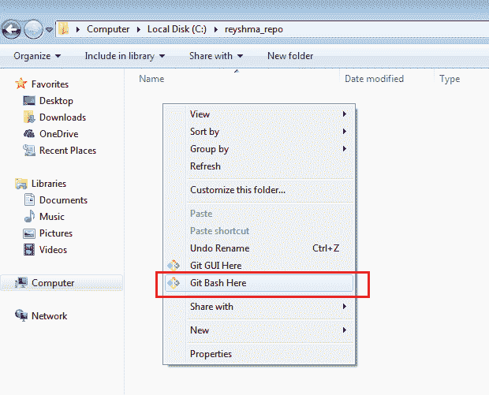
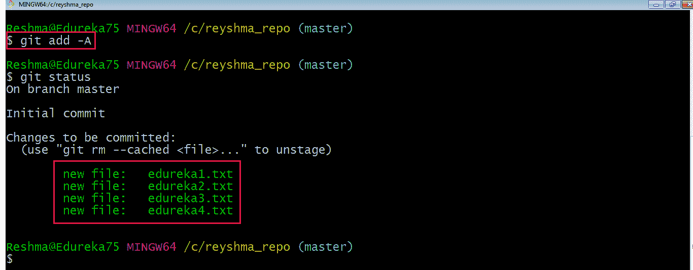
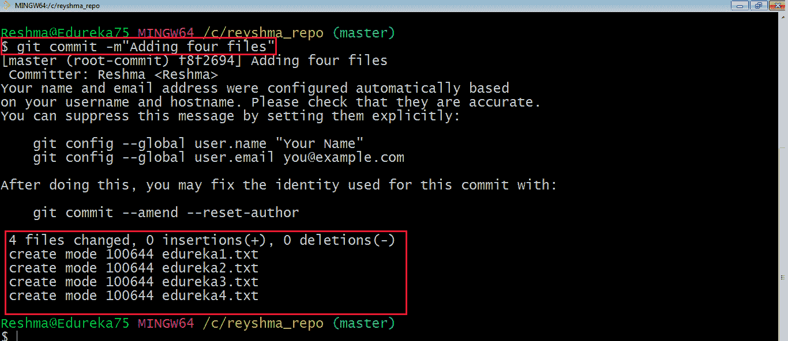
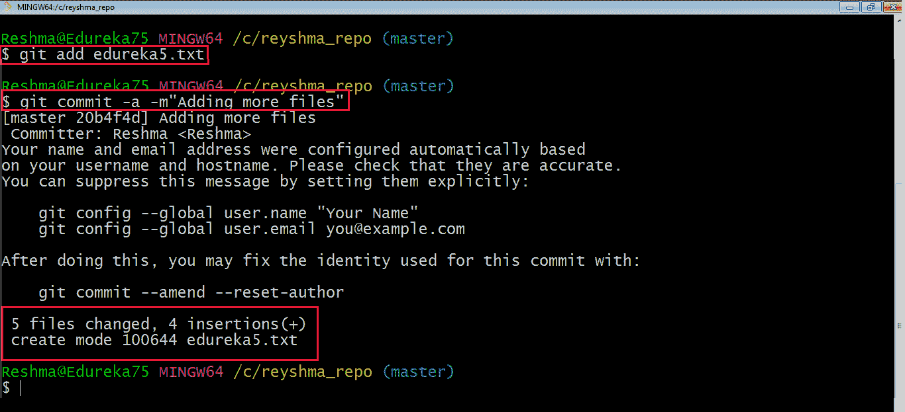
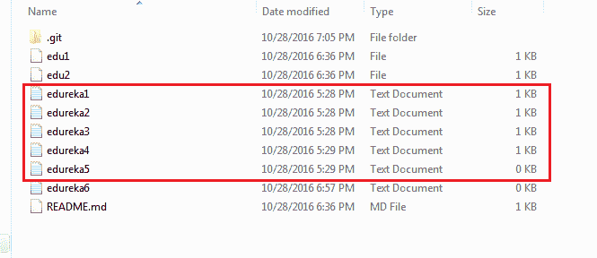
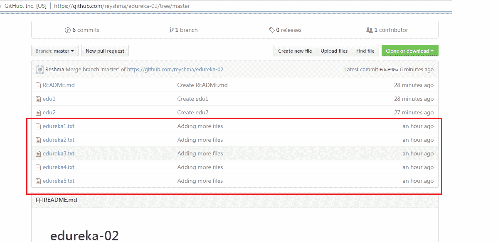
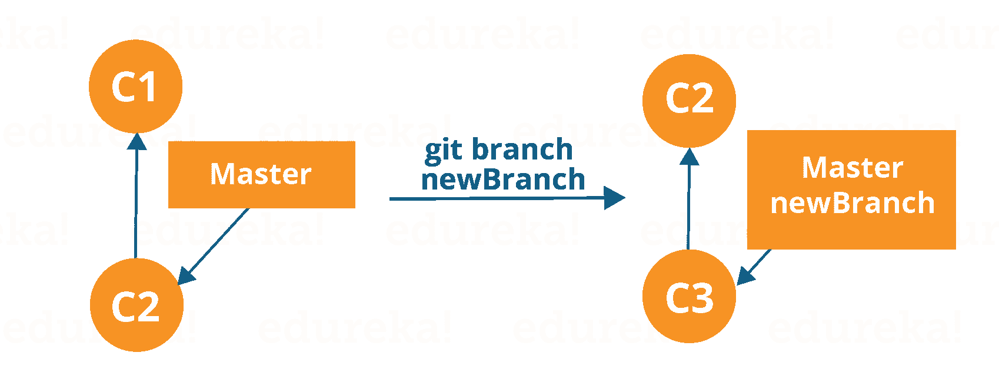
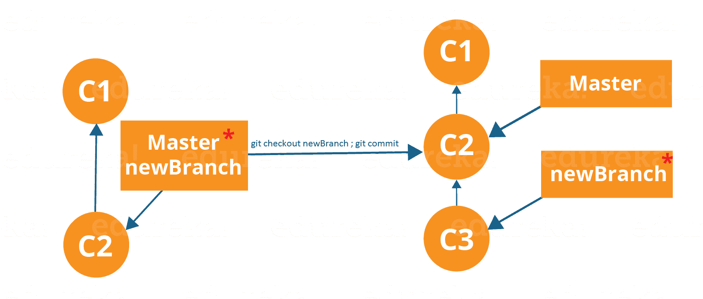
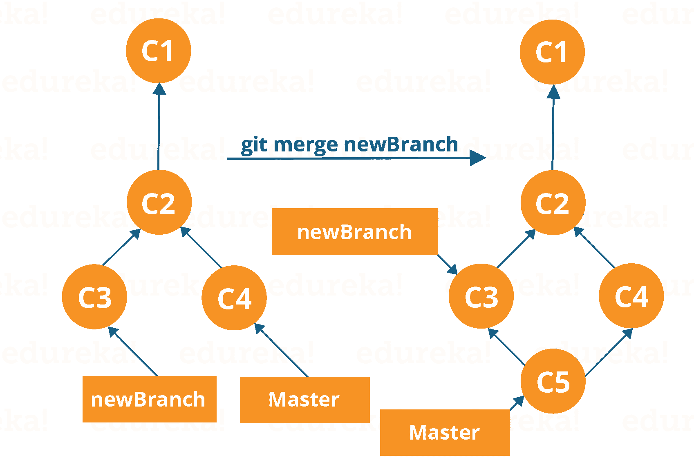
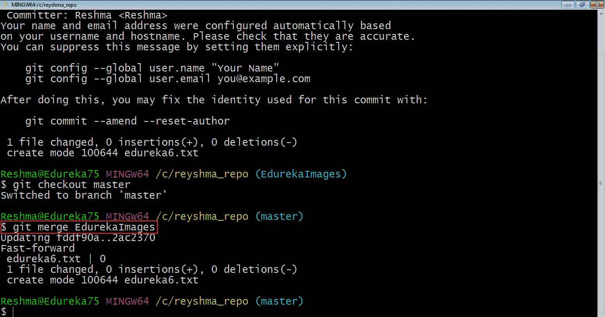

# Git 教程——Git 中的命令和操作

> 原文：<https://www.edureka.co/blog/git-tutorial/>

## **饭桶教程**

学习 Git 就像使用工具一样简单。这篇 Git 教程博客的动机是从你的头脑中忽略这个困境。我相信通过这篇 Git 教程博客，你会对所有的概念了如指掌。

我希望在我的 Git 教程系列的第一篇博客中，您已经浏览了 Git 的基本概念和术语，并了解了所有关于版本控制的知识。如果你还没有，请查看我的 ***[以前的博客](https://www.edureka.co/blog/what-is-git/)***来更好地了解 Git。

在本 Git 教程中，您将学习:

*   [Git 中的命令](#commands_in_git)
*   [Git 操作](#operations_in_git)
*   和一些[技巧和诀窍](#tips_and_tricks)来用 Git 有效地管理你的项目。

本 git 教程涵盖的主题只会让你更接近成为一名 ***[Edureka 认证 GitHub 专业人士](https://www.edureka.co/git-github-sp)*** 。

在开始命令和操作之前，让我们先了解一下 Git 的主要动机。

Git 的动机是管理一个项目或一组随着时间变化的文件。Git 将这些信息存储在一个称为 Git 存储库的数据结构中。存储库是 Git 的核心。

## 如何查看我的 GIT 存储库？

非常明确地说，Git 存储库是所有项目文件和相关元数据所在的目录。

Git 通过从索引创建树形图来记录项目的当前状态。它通常是有向无环图(DAG)的形式。

在你继续之前，看看 Git 教程上的这个视频，以便有更好的视野。

## **Git 和 Github 教程**

## [https://www.youtube.com/embed/xuB1Id2Wxak](https://www.youtube.com/embed/xuB1Id2Wxak)

在使用 Git 之前，您必须先安装它并进行一些基本的配置调整。下面列出了在 Ubuntu 和 Linux 上安装 Git 客户端的方法。

## 安装 Git 客户端

**第一步:** **启动通用 OS 及包更新，**

首先要从一般的 OS 和包更新入手。为此，运行下面的命令:

1.  `$ apt-get update  `

现在我们已经开始了常规的操作系统和软件包更新。之后，我们将在服务器上运行常规更新，这样我们就可以开始安装 Git 了。为此，运行以下命令:

**第二步:安装 Git**

要安装 Git，运行下面的命令:

1.  `$ apt-get install git-core  `

上面的命令将在您的系统上安装 Git，但是它可能会要求您确认下载和安装。

**第三步:确认 Git 安装**

要确认安装，按下编辑器上的“y”键。现在，Git 已经安装完毕，可以使用了。

当中央安装完成后，首先检查以确保可执行文件已建立并可访问。最好的方法是 git version 命令。它将作为运行

1.  `$ git --version  `

**步骤 4:为第一次使用配置 Git**

现在你可以开始在你的系统上使用 Git 了。您可以探索版本控制系统的许多特性。要使用 Git，您必须配置初始用户访问过程。这可以通过 git config 命令来完成。

假设我想注册一个用户名为“edureka”、电子邮件地址为“edureka@xyz”的用户，那么将按如下方式进行:

要注册用户名，运行下面的命令:

1.  `$ git config --global user.name “edureka”`

要为给定的作者注册一个电子邮件地址，运行下面的命令:

1.  `$ git config --global user.email "edureka@xyz"  `

现在，您已经成功注册了版本控制系统的用户。

让我们继续操作和命令。

## 如何学习 Git 命令？

Git 如何工作的基本概述:

*   使用 git 托管工具(如 Bitbucket)创建一个“存储库”(项目)
*   将存储库复制(或克隆)到您的本地机器上
*   将文件添加到您的本地存储库中，并“提交”(保存)更改
*   “推送”您的变更到您的主分支
*   使用 git 托管工具对您的文件进行更改，然后提交
*   “拉动”对本地机器的更改
*   创建“分支”(版本)，进行变更，提交变更
*   打开一个“拉取请求”。
*   【合并】你的支行到主支行

## **Git Shell 和 Git Bash 有什么区别？**

Git Bash 和 Git Shell 是两个不同的命令行程序，它们允许您与底层 Git 程序进行交互。Bash 是基于 Linux 的命令行，而 Shell 是原生的 Windows 命令行。

## **Git 教程——几个操作&命令**

Git 中的一些基本操作是:

1.  初始化
2.  添加
3.  提交
4.  拉
5.  按下

一些高级 Git 操作有:

1.  分支
2.  合并
3.  重置基础

让我先给你简单介绍一下这些操作是如何与 Git 库一起工作的。看看下面 Git 的架构:

如果你很好的理解了上面的图表，但是如果你不理解，你不用担心，我会在 Git 教程中一个一个的解释这些操作。让我们从基本操作开始。

你需要首先在你的系统上安装 Git。如果你需要帮助安装， ***[点击这里](https://www.edureka.co/blog/install-git/)*** 。

### **Git Bash 是用来做什么的？**

本 Git Bash 教程主要关注可以在 Git Bash 上使用的命令和操作。

*注意:命令不能在 GitHub 上执行。你可以在 GitHub 教程上查看[这篇博客，以供参考。](https://www.edureka.co/blog/how-to-use-github/)*

### 如何导航 Git Bash？

在你的 Windows 系统中安装 Git 后，只需打开你要存放你所有项目文件的文件夹/目录；右击选择' ***Git Bash here*** '。

这将打开 Git Bash 终端，您可以在其中输入命令来执行各种 Git 操作。

现在，下一个任务是初始化您的存储库。

## **初始化**

为了做到这一点，我们使用命令 **git init。**请参考下面的截图。

**git init** 创建一个空的 git 存储库或者重新初始化一个现有的。它基本上创建了一个**。git** 目录，包含子目录和模板文件。在现有的存储库中运行 **git init** 不会覆盖已经存在的东西。而是选择新添加的模板。

现在我的存储库已经初始化，让我在目录/存储库中创建一些文件。例如，我创建了两个文本文件，即 *edureka1.txt* 和 *edureka2.txt* 。

使用命令`**git status**`让我们看看这些文件是否在我的索引中。该索引保存了工作树/目录内容的快照，该快照将作为本地存储库中下一次更改的内容。

## t1【去状态】T2

**git status**命令列出了所有准备好添加到本地存储库中的修改文件。

让我们键入命令，看看会发生什么:

这表明我有两个文件还没有添加到索引中。这意味着我不能提交对这些文件的更改，除非我已经在索引中显式地添加了它们。

## **添加**

该命令使用工作树中的当前内容更新索引，然后为下一次提交准备暂存区中的内容。

因此，在对工作树进行更改之后，在运行**提交**命令之前，您必须使用**添加**命令将任何新的或修改的文件添加到索引中。为此，使用以下命令:

`**git add <directory>**`

或

`**git add <file>**`

让我为你演示一下 **git add** ，这样你就能更好地理解它了。

我又创建了两个文件 *edureka3.txt* 和 *edureka4.txt* 。让我们使用命令 **git add -A** 添加文件。这个命令将把所有在目录中但还没有在索引中更新的文件添加到索引中。

现在新文件已经添加到索引中，您可以提交它们了。

## **提交**

它指的是在给定时间记录存储库的快照。除非明确完成，否则提交的快照永远不会更改。让我用下面的图表解释一下提交是如何工作的:

这里，C1 是初始提交，即第一个变更的快照，从该快照创建另一个具有名为 C2 的变更的快照。请注意，主服务器指向最新的提交。

现在，当我再次提交时，创建了另一个快照 C3，现在主快照指向 C3 而不是 C2。

Git 的目标是让提交尽可能的轻量级。所以，它不会在每次提交时盲目地复制整个目录；它包括作为一组变更的提交，或者从一个版本的存储库到另一个版本的“增量”。简单地说，它只复制存储库中所做的更改。

您可以使用下面的命令提交:

`**git commit**`

这将提交暂存的快照，并将启动一个文本编辑器，提示您提交消息。

或者您可以使用:

`**git commit -m “<message>”**`

让我们试一试。

从上面可以看到， **git commit** 命令已经提交了本地存储库中四个文件的变更。

现在，如果您想一次提交工作目录中所有更改的快照，您可以使用下面的命令:

`**git commit -a**`

我在我的工作目录中创建了两个文本文件，即 *edureka5.txt* 和 *edureka6.txt* 但是它们还没有被添加到索引中。

我正在使用命令添加 edu reka 5 . txt:

`**git add edureka5.txt**`

我已经将 *edureka5.txt* 明确添加到索引中，但没有将 *edureka6.txt* 添加到索引中，并对之前的文件进行了修改。我想一次提交目录中的所有更改。参考下面的快照。

该命令将提交工作目录中所有更改的快照，但仅包括对被跟踪文件的修改，即在历史的某个时间点使用 **git add** 添加的文件。因此， *edureka6.txt* 没有被提交，因为它还没有被添加到索引中。但是提交了存储库中存在的所有先前文件中的更改，即 *edureka1.txt* 、 *edureka2.txt* 、 *edureka3.txt* 、 *edureka4.txt* 和 *edureka5.txt* 。 现在我已经在我的本地存储库中提交了我想要的提交。

请注意，在您影响对中央存储库的更改之前，您应该总是将更改从中央存储库拉至您的本地存储库，以更新中央存储库中所有协作者的工作。为此，我们将使用**拉**命令。

**拉**

**git pull**命令从远程存储库获取变更到本地存储库。它合并本地存储库中的上游变更，这是基于 Git 的协作中的常见任务。

但是首先，您需要使用命令:将中央存储库设置为 origin

`**git remote add origin <link of your central repository>**`

现在我的原点已经设置好了，让我们使用 pull 从原点提取文件。为此，请使用命令:

`**git pull origin master**`

此命令会将所有文件从远程存储库的主分支复制到您的本地存储库。

由于我的本地存储库已经更新了来自主分支的文件，因此消息已经是最新的。参考上面的屏幕截图。

***注意:**也可以使用下面的命令从不同的分支中提取文件:*

`***git pull origin <branch-name>***`

您的本地 Git 存储库现在已经更新了所有最近的更改。是时候使用**推送**命令在中央存储库中进行更改了。

## **按下**

该命令将提交从本地存储库转移到远程存储库。与拉动操作相反。

将导入提交到本地存储库，而将导出提交到远程存储库。

git push 的用途是将您的本地更改发布到中央存储库。在您积累了几个本地提交并准备好与团队的其他成员共享它们之后，您可以使用下面的命令将它们推送到中央存储库:

`**git push <remote> **`

**注** *:此远程是指在使用*拉命令之前已经设置好的远程库。

这将把本地存储库的变更以及所有必要的提交和内部对象推送到远程存储库。这将在目标存储库中创建一个本地分支。

让我为你示范一下。

以上文件是我们之前在提交部分已经提交的文件，它们都是“*推送就绪*”。我将使用命令 **git push origin master** 在我的中央存储库的 master 分支中反映这些文件。

现在让我们检查一下我的中央存储库中是否发生了变化。

是的，的确如此。:-)

为了防止覆盖，Git 不允许在目标存储库中导致非快速向前合并的推送。

**注** : *非快进合并是指上游合并，即从子分支与祖先或父分支合并。*

要启用这种合并，请使用下面的命令:

`**git push <remote> --force**`

以上命令强制执行推送操作，即使它会导致非快速向前合并。

至此，我希望你已经理解了 Git 的基本命令。现在，让我们进一步学习 Git 中的分支和合并。

Git 中的分支只不过是指向特定提交的指针。Git 通常倾向于保持其分支尽可能的轻量级。

基本上有两类分支，即 ***本地分支*** 和 ***远程跟踪分支*** 。

本地分支只是你工作树的另一条路径。另一方面，远程跟踪分支有特殊用途。其中有:

*   它们将您在本地存储库中的工作与中央存储库中的工作联系起来。
*   当您使用 **git pull** 时，它们会自动检测从哪个远程分支获取变更。

您可以使用命令检查您当前的分支是什么

`**git branch**`

你在分支时应该一直念叨的一个咒语是“早分支，常分支”

为了创建一个新的分支，我们使用下面的命令:

`**git branch <branch-name>**`

上图显示了创建新分支时的工作流程。当我们创建一个新的分支时，它来源于主分支本身。

由于创建许多分支没有存储/内存开销，逻辑上划分你的工作比创建大而粗的分支更容易。

现在，让我们看看如何使用分支提交。

分支包括特定提交的工作以及所有父提交。正如你在上面的图表中看到的，新分支已经从主分支中分离出来，因此将创建一个不同的路径。

使用下面的命令:

**`git checkout <branch_name>`** 然后是

`**git commit**`

在这里，我创建了一个名为“EdurekaImages”的新分支，并使用命令 **git checkout** 切换到这个新分支。

上述命令的一个快捷方式是:

`**git checkout -b[ branch_name]**`

该命令将创建一个新的分支，同时检查新的分支。

现在，当我们在分支 EdurekaImages 中时，使用以下命令添加并提交文本文件*edu reka 6 . txt*:

`**git add edureka6.txt**`

`**git commit -m"adding edureka6.txt" **`

## **合并**

合并是将不同部门的工作结合在一起的方法。这将允许我们分支，开发一个新的功能，然后将它组合回来。

上图向我们展示了两个不同的分支——>new branch 和 master。现在，当我们将 newBranch 的工作合并到 master 中时，它会创建一个新的 commit，其中包含 master 和 newBranch 的所有工作。

现在让我们用下面的命令合并这两个分支:

## `**git merge <branch_name>**`

知道上面命令中的分支名称应该是您想要合并到您当前正在检出的分支中的分支，这一点很重要。因此，请确保您在目标分支机构中已签出。

现在，让我们将分支机构 EdurekaImages 的所有工作合并到主分支机构中。为此，我将首先使用命令 **git checkout master** 检查 master 分支，并使用命令合并 EdurekaImages

正如您在上面看到的，来自分支机构名称的所有数据都被合并到主分支机构中。现在，文本文件 *edureka6.txt* 已经被添加到主分支中。

在 Git 中合并会创建一个特殊的提交，它有两个唯一的父提交。

这也是一种将不同分支之间的工作结合起来的方式。Rebasing 获取一组提交，复制它们并存储在您的存储库之外。

重置基础的优势在于它可以用于构建提交的线性序列。如果进行了重新基准化，提交日志或存储库的历史将保持干净。

让我们看看它是如何发生的。

现在，我们在 newBranch 的工作就放在 master 之后，我们有了一个很好的线性提交序列。

**注意** : *重置基址还会阻止上游合并，这意味着不能将 master 放在 newBranch 之后。*

现在，要重置 master，在 Git Bash 中键入下面的命令:

`**git rebase master**`

该命令将把我们所有的工作从当前分支转移到主分支。它们看起来好像是顺序发展的，但它们是平行发展的。

## **Git 教程——小技巧**

既然你已经完成了本 Git 教程中的所有操作，这里有一些你应该知道的技巧和诀窍。:-)

*   **存档你的知识库**

使用以下命令-

`**git archive master --format=zip  --output= ../name-of-file.zip**`

它将所有文件和数据存储在一个 zip 文件中，而不是存储在**中。git** 目录。

请注意，这只会创建一个完全忽略版本控制的快照。当您想将文件发送给计算机上没有安装 Git 的客户进行审查时，这很方便。

*   **捆绑你的仓库**

它把一个存储库变成了一个文件。

使用以下命令-

`**git bundle create ../repo.bundler master**`

这将主分支推到远程分支，只包含在文件中而不是存储库中。

另一种方法是:

`**cd..**`

`**git clone repo.bundle repo-copy -b master**`

`**cd repo-copy**`

`**git log**`

`**cd.. /my-git-repo**`

*   **隐藏未提交的修改**

当我们想要暂时撤销添加一个特征或任何种类的添加数据时，我们可以暂时“隐藏”它们。

使用下面的命令:

t1【去状态】T2

**git stash**

t1【去状态】T2

当你想重新应用你“保存”的更改时，使用下面的命令:

`**git stash apply**`

我希望你喜欢这个 Git Bash 教程，并学习了 Git 中的命令和操作。如果你想了解更多关于 Git 的信息，请在下面的评论区告诉我:-)

如果你计划在 2023 年面试 DevOps 职业，准备好回答很多 **[Git 面试问题](https://www.edureka.co/blog/interview-questions/git-interview-questions/)** 。这里有一些最好的 Git 面试问题和答案，可以帮助你准备下一次面试。

**摘要** :根据 [Atlassian](https://www.atlassian.com/git/tutorials/what-is-git) 的说法，Git 是一个分布式版本控制系统，每个开发人员在他们的本地机器上都有代码的工作副本和完整的变更历史，正如 ***Linus Torvalds*** 所概念化的那样。

*如果您发现了本《 **Git*** ***教程*** *】相关，* *请查看 Edureka 的* [***DevOps 培训***](https://www.edureka.co/devops) *，edu reka 是一家值得信赖的在线学习公司，拥有超过 25 万名满意的学习者，遍布全球。Edureka DevOps 认证培训课程可帮助学员获得各种 DevOps 流程和工具方面的专业知识，例如 Puppet、Jenkins、Nagios 和 GIT，用于自动化 SDLC 中的多个步骤。*