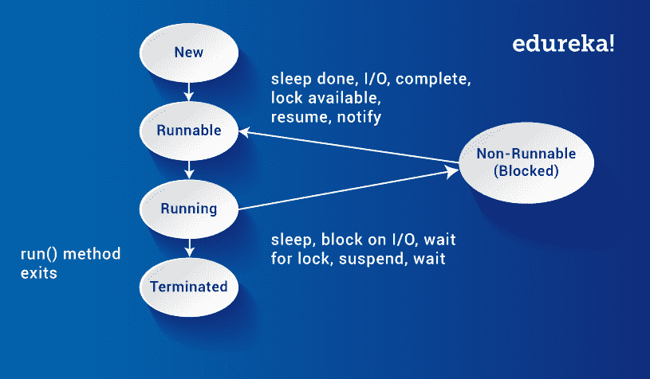

# Java 中的线程:了解在 Java 中创建线程和多线程

> 原文：<https://www.edureka.co/blog/java-thread/>

与许多其他计算机语言不同，Java 提供了对多线程的内置支持。Java 中的多线程包含两个或更多可以并发运行**的部分。**Java 线程实际上是一个轻量级的进程。

这个博客将向你介绍很多人觉得难以使用和理解的所有 Java 线程概念。那么让我们开始吧，好吗？

在这个 Java Thread 博客中，我将涉及以下主题:

1.  [Java 中的线程是什么？](#WhatisaJavaThread?)
2.  [Java 线程模型](#TheJavaThreadModel)
3.  [Java 中的多线程](#multithreading)
4.  [Java 主线程](#MainJavaThread)
5.  [如何创建 Java 线程？](#HowToCreateaJavaThread?)

您可以浏览这个 Java Threads 视频讲座，我们的 Java 培训专家将讨论该技术的每一个细微差别。

## **Java 线程教程| Java 多线程教程| edu reka**


[//www.youtube.com/embed/TCd8QIS-2KI?rel=0&showinfo=0](//www.youtube.com/embed/TCd8QIS-2KI?rel=0&showinfo=0)

这个视频讲的是 Java 线程，这是 Java 的核心概念之一。

在我们继续这个 Java 线程博客的第一个主题之前，考虑这个例子:-

想象一个具有许多复杂功能的股票经纪人应用程序。以下是它的几个功能:

*   下载最近的股票期权价格
*   查看警告价格
*   分析 XYZ 公司的历史数据

这些都是耗时的功能。在单线程运行时环境中，这些动作一个接一个地执行。只有在前一个动作完成时，下一个动作才能发生。

现在，如果历史分析需要半个小时，并且用户选择执行下载并随后检查，则警告可能会太迟，从而无法购买或出售股票。我们只是想象了那种迫切需要多线程的应用程序。理想情况下，下载应该在后台进行(即在另一个线程中)。这样，其他过程可以同时发生，例如，可以立即传达警告。一直以来，用户都在与应用程序的其他部分进行交互。分析也可以在单独的线程中进行，因此用户可以在计算结果的同时处理应用程序的其余部分。

这就是 Java 线程的用武之地。我们先来了解一下 Java 线程:

## **Java 中的线程是什么？**

线程实际上是一个轻量级的进程。与许多其他计算机语言不同，Java 为多线程编程提供了内置支持。一个多线程程序包含两个或更多可以同时运行**和**的部分。这样一个程序的每个部分被称为线程，每个线程定义一个单独的执行路径。因此，多线程是多任务的一种特殊形式。

这个 Java 线程博客中的下一个概念是线程和多线程概念的一部分。

## **Java 线程模型——为什么要在 Java 中使用线程？**

Java 运行时系统在很多事情上都依赖于线程。线程通过防止 CPU 周期的浪费来降低效率。

线程以几种状态存在。以下是这些状态:

*   **新**–当我们创建一个线程类的实例时，一个线程处于一个新的状态。
*   **Runnable—**Java 线程处于运行状态。
*   **挂起**——一个正在运行的线程可以被**挂起**，暂时挂起它的活动。然后，挂起的线程可以被恢复，允许它从停止的地方重新开始。
*   **阻塞**–Java 线程在等待资源时可能会被阻塞。
*   **终止**–线程可以被终止，在任何给定的时间立即停止执行。 线程一旦终止，就无法恢复。

****

所以，这就是 Java 线程状态的全部内容。现在，让我们跳到 Java 线程最重要的话题，即线程类和可运行接口。下面我们将逐一讨论这些。

## **Java 中的多线程:Java 线程是如何工作的？**

## **线程类和可运行接口**

Java 的多线程系统是建立在线程类、它的方法和它的配套接口 **Runnable** 之上的。要创建一个新线程，你的程序要么扩展**线程**要么**实现**可运行接口。

线程类定义了几个帮助管理线程的方法。下表同样显示:

| **法** | **意为** |
| getName | 获取线程名称 |
| 获取优先级 | 获取线程的优先级 |
| isalive | 确定线程是否仍在运行 |
| 加入 | 等待线程终止 |
| 运行 | 线程的入口点 |
| 睡眠 | 暂停线程一段时间 |
| 开始 | 通过调用线程的运行方法来启动线程 |

现在让我们看看如何使用一个以所有 java 程序都有的**主 Java 线程、** 开始的线程。

## **Java 主线程**

现在让我们看看如何使用 Thread 和 Runnable 接口来创建和管理线程，从所有 java 程序都有的**主 Java 线程**开始。所以，让我们讨论一下主线。

### **为什么主线程如此重要？**

*   因为这个线程影响其他‘子’线程
*   因为它执行各种关机动作
*   当您的程序启动时，它会自动创建。

所以，这才是主线。让我们看看如何创建一个 java 线程？

## **如何创建 Java 线程？**T3T5

Java 让你用以下两种方式创建线程:-

*   通过**实现****可运行** **接口**。
*   通过**延长**的**线程**

让我们看看这两种方法是如何帮助实现 Java 线程的。

### **可运行界面**

创建线程最简单的方法是创建一个实现 **Runnable** 接口的类。

要实现 Runnable 接口，一个类只需要实现一个名为 run()的方法，声明如下:

```
public void run( )

```

在 run()内部，我们将定义构成新线程的代码

**举例:**

```
public class MyClass implements Runnable {
public void run(){
System.out.println("MyClass running");
   } 
}

```

通过线程执行 run()方法，将 MyClass 的实例传递给线程的构造函数(*Java 中的**构造函数**是一段代码，类似于创建对象实例时调用的方法*)。这是如何做到的:

```
Thread t1 = new Thread(new MyClass ());
t1.start();

```

当线程启动时，它将调用 MyClass 实例的 run()方法，而不是执行自己的 run()方法。上面的例子会打印出文本“ **MyClass running** ”。

### **扩展 Java 线程**

创建线程的第二种方法是创建一个扩展 thread 的新类，然后覆盖 run()方法，然后创建该类的一个实例。run()方法是在您调用 start()之后由线程执行的。下面是一个创建 Java 线程子类的例子:

```
public class MyClass extends Thread {
     public void run(){
     System.out.println("MyClass running");
   }
}

```

要创建并启动上面的线程，你可以这样做:

```
MyClass t1 = new MyClass ();
T1.start();

```

当 run()方法执行时，它将打印出文本“ **MyClass running** ”。

*到目前为止，我们只使用了两个线程:主**线程和一个**子**线程。然而，我们的程序可以根据需要影响任意多的线程。让我们看看如何创建多线程。***

## 创建多线程

```

class MyThread implements Runnable {
String name;
Thread t;
    MyThread (String thread){
    name = threadname; 
    t = new Thread(this, name);
System.out.println("New thread: " + t);
t.start();
}

public void run() {
 try {
     for(int i = 5; i > 0; i--) {
     System.out.println(name + ": " + i);
      Thread.sleep(1000);
}
}catch (InterruptedException e) {
     System.out.println(name + "Interrupted");
}
     System.out.println(name + " exiting.");
}
}

class MultiThread {
public static void main(String args[]) {
     new MyThread("One");
     new MyThread("Two");
     new NewThread("Three");
try {
     Thread.sleep(10000);
} catch (InterruptedException e) {
      System.out.println("Main thread Interrupted");
}
      System.out.println("Main thread exiting.");
      }
}

```

```
The output from this program is shown here:

New thread: Thread[One,5,main]
 New thread: Thread[Two,5,main]
 New thread: Thread[Three,5,main]
 One: 5
 Two: 5
 Three: 5
 One: 4
 Two: 4
 Three: 4
 One: 3
 Three: 3
 Two: 3
 One: 2
 Three: 2
 Two: 2
 One: 1
 Three: 1
 Two: 1
 One exiting.
 Two exiting.
 Three exiting.
 Main thread exiting.
```

这就是 java 中多线程的工作方式。这就把我们带到了 Java 线程博客的结尾。我希望这是信息和帮助你。在 Java 教程博客系列的下一篇博客中，你会了解到 ***[Java 合集](https://www.edureka.co/blog/java-collections/)* 。**

**你也可以通过我们的 YouTube [*Java 教程*](https://www.youtube.com/playlist?list=PL9ooVrP1hQOFR25JoQW3h3n5pBs77e6KU) 播放列表学习 Java。快乐学习！！**

<article class="maincontentblog">*If you found this blog on “**Java Thread****”** useful, check out the **[Java Certification Training](https://www.edureka.co/java-j2ee-training-course) **by Edureka, a trusted online learning company with a network of more than 250,000 satisfied learners spread across the globe.*</article>

<article class="maincontentblog">*Got a question for us? Please mention it in the comments section and we will get back to you or you can also join our [Java Training in Sharjah](https://www.edureka.co/java-j2ee-training-course-sharjah).*</article>