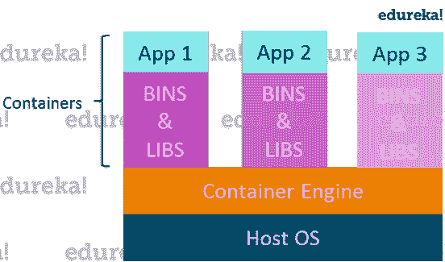
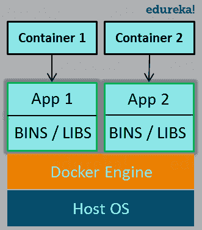
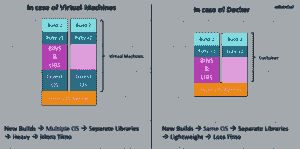
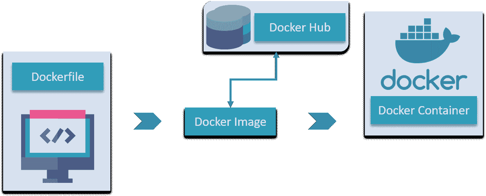

# 坞站教程-坞站简介

> 原文：<https://www.edureka.co/blog/docker-tutorial>

我希望你没有错过更早的 DevOps 教程博客系列。  在这里浏览 **[DevOps 教程博客系列](https://www.edureka.co/blog/devops-tutorial)** 。Docker 容器不可阻挡的趋势正在增长，机构正在寻找拥有***[Docker 认证](https://www.edureka.co/docker-training)*** 的专业人士。 现在，我们将带您浏览 Docker 教程，从虚拟化和容器化的概述开始。

## **【对接教程】**

这个 Docker 教程博客将为您提供 Docker 的概念和实践知识，这是一种尖端的集装箱化技术。

在这篇博客中，我们将关注以下主题:

*   **[什么是虚拟化？](#virtualization)**
*   **[什么是集装箱化](#containerization)**
*   **[容器化相对于虚拟化的优势](#advantages)**
*   **[码头工人简介](#docker)**
*   **[码头工人的好处](#benefits)**
*   [**码头工人的特征**](#features)
*   **[虚拟化 vs 容器化](#versus)**
*   **[码头工人安装](#installationg)**
*   **[Dockerfile，Docker Image&Docker Container](#components)**
*   **[什么是 Docker Hub？](#dockerhub)**
*   **[Docker 架构](#architecture)**
*   **[坞站组成](#compose)**

Docker 越来越受欢迎，它的使用也像野火一样蔓延。Docker 越来越受欢迎的原因是它可以在 it 组织中使用的程度。很少有工具具有对开发人员和系统管理员都有用的功能。Docker 就是这样一个工具，它真正实现了它的承诺:T1 构建 T2，T3 发布 T4，T5 运行 T6。

简单地说，Docker 是一个软件容器化平台，这意味着你可以构建你的应用程序，将它们和它们的依赖项打包到一个容器中，然后这些容器可以很容易地被运送到其他机器上运行。

*例如:*让我们考虑一个用 Ruby 和 Python 编写的基于 linux 的应用程序。该应用程序需要特定版本的 linux、Ruby 和 Python。为了避免用户端的任何版本冲突，可以创建一个 linux docker 容器，并在应用程序中安装所需的 Ruby 和 Python 版本。现在，最终用户可以通过运行这个容器轻松地使用应用程序，而不用担心依赖性或任何版本冲突。

这些容器使用容器化，这可以被认为是虚拟化的进化版本。使用虚拟机也可以完成相同的任务，但是效率不是很高。

在这一点上，我通常会收到一个问题，即虚拟化和容器化之间有什么区别？这两个术语非常相似。那么，让我先告诉你什么是虚拟化？

## **什么是虚拟化？**

虚拟化是在主机操作系统上导入客户操作系统的技术。这项技术在一开始是一个启示，因为它允许开发人员在同一台主机上运行的不同虚拟机上运行多个操作系统。这消除了对额外硬件资源的需求。虚拟机或虚拟化的优势有:

*   同一台机器上可以运行多个操作系统
*   出现故障时，维护和恢复容易
*   由于对基础设施的需求减少，总拥有成本也降低了


在右侧的图表中，您可以看到有一个主机操作系统，上面运行着 3 个客户操作系统，除了虚拟机之外没有其他操作系统。

众所周知，没有什么是完美的，虚拟化也有一些缺点。在同一主机操作系统中运行多个虚拟机会导致性能下降。这是因为来宾操作系统运行在主机操作系统之上，主机操作系统将拥有自己的内核、一组库和依赖项。这占用了大量系统资源，即硬盘、处理器，尤其是 RAM。

使用虚拟化的虚拟机的另一个问题是启动几乎需要一分钟。 这在实时应用的情况下非常关键。

以下是虚拟化的缺点:

*   运行多个虚拟机导致性能不稳定
*   虚拟机管理程序不如主机操作系统高效
*   启动过程漫长且耗时

这些缺点导致了一种叫做集装箱化的新技术的出现。现在让我告诉你集装箱化。

## **什么是集装箱化？**

容器化是将虚拟化带到操作系统级别的技术。虚拟化给硬件带来了抽象，而容器化给操作系统带来了抽象。请注意，容器化也是一种虚拟化。然而，容器化更有效，因为这里没有客户操作系统，而是利用主机的操作系统，与虚拟机不同，在需要时共享相关的库&资源。特定于应用程序的二进制文件和容器库在主机内核上运行，这使得处理和执行速度非常快。甚至启动一个容器也只需要几分之一秒。因为所有的容器共享、托管操作系统，并且只保存应用程序相关的二进制文件&库。它们是轻量级的，比虚拟机更快。

## **容器化优于虚拟化:**

*   同一个 OS 内核上的容器更轻更小
*   与虚拟机相比，资源利用率更高
*   启动过程很短，只需几秒钟



在右图中，您可以看到所有容器共享一个主机操作系统。容器只包含应用程序特定的库，这些库对于每个容器都是独立的，它们速度更快，并且不会浪费任何资源。

所有这些容器都由容器化层处理，容器化层不是主机操作系统的本地层。因此需要一个软件，它能让你在你的主机操作系统上创建&运行容器。

查看这段 Docker 教程视频，深入了解 Docker。

## **Docker 新手教程| Docker 是什么？| DevOps 工具| edu reka**

## [//www.youtube.com/embed/h0NCZbHjIpY?rel=0&showinfo=0](//www.youtube.com/embed/h0NCZbHjIpY?rel=0&showinfo=0)

现在，让我向您介绍一下 Docker。

## **对接教程–对接导言**

Docker 是一个容器化平台，它以容器的形式将您的应用程序及其所有依赖项打包在一起，以确保您的应用程序在任何环境下都能无缝工作。



正如你在右图中看到的，每个应用程序都将在一个单独的容器上运行，并拥有自己的一组库和依赖项。这也确保了进程级的隔离，这意味着每个应用程序都独立于其他应用程序，让开发人员确信他们可以构建不会相互干扰的应用程序。

作为一名开发人员，我可以构建一个安装了不同应用程序的容器，并将其交给我的 QA 团队，他们只需要运行该容器来复制开发人员环境。

## **码头工人教程——码头工人的好处**

现在，QA 团队不需要安装所有相关软件和应用程序来测试代码，这有助于他们节省大量时间和精力。这也确保了从开发到部署，工作环境在过程中涉及的所有个人之间是一致的。系统的数量可以很容易地扩大，代码可以毫不费力地部署在这些系统上。

**Docker 教程–Docker 的特性**

*   Docker 能够通过容器提供更小的操作系统空间来减少开发规模。
*   有了容器，不同部门的团队，如开发、QA 和运营部门，可以更容易地跨应用程序无缝协作。
*   你可以在任何地方部署 Docker 容器，在任何物理和虚拟机上，甚至在云上。
*   由于 Docker 容器非常轻量级，它们非常容易扩展。

## **虚拟化 vs 容器化**

虚拟化和容器化都可以让你在一台主机上运行多个操作系统。

虚拟化处理在单个主机上创建许多操作系统。另一方面，容器化将根据需要为每种类型的应用程序创建多个容器。

 **图:** *什么是大数据分析——虚拟化 vs 容器化* 

正如我们从图中看到的，主要区别在于虚拟化中有多个客户操作系统，而容器化中则没有。容器化最好的部分是，与繁重的虚拟化相比，它是非常轻量级的。

现在，让我们安装 Docker。

## **【码头教程】–安装码头:**

我将在我的 Ubuntu 20.04.1 机器上安装 Docker。也可以在 windows 和 CentOS 上 docker。你可以按照下面的视频按照你想要的环境安装 Docker。

**[Docker 安装| Install Docker | Docker 安装在 CentOS | devo PS Tools | Edureka](https://www.youtube.com/watch?v=CPQUgDyTd6g)**

### **如何在 Windows 10 上安装 Docker【最新 2023】|在 Ubuntu 上安装 Docker | edu reka**

[https://www.youtube.com/embed/HLMFa4Iofpg?version=3&rel=1&fs=1&autohide=2&showsearch=0&showinfo=1&iv_load_policy=1&wmode=transparent](https://www.youtube.com/embed/HLMFa4Iofpg?version=3&rel=1&fs=1&autohide=2&showsearch=0&showinfo=1&iv_load_policy=1&wmode=transparent)

以下是在 Ubuntu 上安装 Docker 的步骤:

1.  安装所需的软件包
2.  设置 Docker 存储库
3.  在 Ubuntu 上安装坞站

### **1。安装所需软件包:**

您的系统中需要某些软件包来安装 Docker。执行下面的命令来安装这些软件包。

```
sudo apt-get install  curl  apt-transport-https ca-certificates software-properties-common
```


### **2。设置 Docker 库:**

现在，在用 apt-get 安装软件包之前，导入 Dockers 官方 GPG 密钥来验证软件包签名。在终端上运行以下命令:

```
curl -fsSL https://download.docker.com/linux/ubuntu/gpg | sudo apt-key add
```


现在，在你的 Ubuntu 系统上添加 Docker 库，其中包含 Docker 包及其依赖项，执行下面的命令:

```
sudo add-apt-repository "deb [arch=amd64] https://download.docker.com/linux/ubuntu $(lsb_release -cs) stable"
```


### **3。在 Ubuntu 上安装坞站:**

现在您需要升级 apt 索引并安装 Docker 社区版，为此执行以下命令:

```
sudo apt-get update
sudo apt-get install docker-ce
```


恭喜你！您已经成功安装了 Docker。另外，查看几个常用的 **[Docker 命令](https://www.edureka.co/blog/docker-commands/)** 。

现在让我们看看几个重要的 Docker 概念。

## **Docker 文件、Docker 图像和 Docker 容器:**

1.  Docker 映像是由一个名为 Dockerfile 的文件中的命令序列创建的。
2.  当使用 docker 命令执行该 Docker 文件时，会产生一个带有名称的 Docker 图像。
3.  当这个映像由“docker run”命令执行时，它将自己启动它在执行时必须启动的任何应用程序或服务。

## **坞站枢纽:**

Docker Hub 就像 Docker 图片的 GitHub。它基本上是一个云注册表，你可以在那里找到不同社区上传的 Docker 图片，你也可以开发自己的图片并上传到 DockerHub，但首先，你需要在 Docker Hub 上创建一个帐户。



## **码头教程–码头建筑:**T3]

它由 Docker 引擎组成，Docker 引擎是一个客户端-服务器应用程序，有三个主要组件:

1.  服务器是一种长期运行的程序，称为守护进程(docker 命令)。
2.  一个 REST API，它指定了程序可以用来与守护进程对话并指示它做什么的接口。
3.  命令行界面(CLI)客户端(docker 命令)。
4.  CLI 使用 Docker REST API 通过脚本或直接 CLI 命令来控制 Docker 守护程序或与之交互。许多其他 Docker 应用程序使用底层 API 和 CLI。

参考这个博客，阅读更多关于 **[Docker 架构](https://www.edureka.co/blog/what-is-docker-container)** 的内容。

最后，在这篇 Docker 教程博客中，我将谈谈 Docker Compose。

## **【复合坞站:**

Docker Compose 主要用于将多个 Docker 容器作为单个服务器运行。我举个例子:

假设我有一个需要 WordPress、Maria DB 和 PHP MyAdmin 的应用程序。我可以创建一个文件，将两个容器作为服务启动，而不需要分别启动每个容器。如果你有微服务架构，这真的很有用。

参考我在 **[码头集装箱](https://www.edureka.co/blog/docker-container/)** 的博客，了解如何实际执行。

另外，你可以阅读这篇关于如何使用 Docker Compose 封装一个平均堆栈应用程序的博客。

至此，我们结束了码头工人教程，介绍了码头工人&集装箱化。

浏览我们下一篇关于 Docker 的博客:[什么是 Docker 和 Docker 容器？](https://www.edureka.co/blog/what-is-docker-container)

*既然你已经了解了什么是 DevOps，那就来看看我们的* ***[DevOps 认证培训](https://www.edureka.co/devops/)** 由 Edureka 提供，edu reka 是一家值得信赖的在线学习公司，拥有遍布全球的 250，000 多名满意的学习者。Edureka DevOps 认证培训课程可帮助学员获得各种 DevOps 流程和工具方面的专业知识，例如 Puppet、Jenkins、Nagios、Ansible、Chef、Saltstack 和 GIT，用于自动化 SDLC 中的多个步骤。*

*有问题吗？请在评论区提到它，我们会给你回复。*