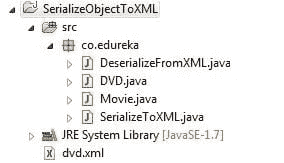

# 使用 XMLEncoder/Decoder 将 Java 对象序列化为 XML

> 原文：<https://www.edureka.co/blog/serialization-of-java-objects-to-xml-using-xmlencoder-decoder/>

可以使用 XMLEncoder、XMLDecoder 将 Java 对象序列化为 XML。Java 对象序列化特性是在 JDK 1.1 中引入的。串行化将 Java 对象或 Java 对象的图形转换成字节数组，该数组可以存储在文件中或通过网络传输。这是获得 ***[Java 认证](https://www.edureka.co/java-j2ee-training-course)*** 的一个至关重要的概念。

稍后，我们可以将这些字节转换回 Java 对象。所有这些都是使用 java.io.ObjectOutputStream 和 java.io.ObjectInputStream 类完成的。ObjectOutputStream 类提供了将 Java 对象的原始数据类型和图形写入 OutputStream 的方法。可以使用 ObjectInputStream 读取(重构)这些对象。

然而，这种 Java 对象序列化的方法存在一些问题。其中一些列举如下:

*   保存和恢复序列化对象的逻辑基于组成类的内部结构。从保存对象到检索对象之间对这些类的任何更改都可能导致反序列化过程失败。

*   可能会出现版本问题。如果使用该类的一个版本保存对象，但尝试使用该类的一个更新的不同版本对其进行反序列化，反序列化可能会失败。

我们可以将 Java 对象序列化为人类可读的 XML 文档，而不是将其序列化为二进制格式。

**项目结构:**

[](https://www.edureka.co/blog/wp-content/uploads/2015/06/projectsturcture.jpg)**XMLEncoder**

java.beans.XMLEncoder 的工作原理是克隆对象图并记录创建克隆所需的步骤。这样，XMLEncoder 就有了一个对象图的“工作副本”,它模拟了 XMLDecoder 解码文件的步骤。让我们看看如何使用 XMLEncoder 序列化 Java 对象。

下面给出的是一个 DVD 类，它有一个列表<movie>作为成员。</movie>

```
public class DVD {	
	private List movies=new ArrayList();	
	public DVD(){}
	public List getMovies() {
		return movies;
	}
	public void setMovies(List movies) {
		this.movies = movies;
	}	
	public String toString(){
		String movies="";
		for(Movie movie:getMovies()){
			movies += movie.getName()+", ";
		}
		return movies; 
	}	
 }
```

电影类的成员包括名称、运行时间、导演、上映年份和演员。

```
public class Movie {	
	private String name;
	private int runtime;
	private String directors;
	private int released; 
	private String cast;	
	public Movie(){}	

	public Movie(String name, int runtime, String directors,int released, String cast) {		
		this.name = name;
		this.runtime = runtime;
		this.directors = directors;
		this.released = released;
		this.cast = cast;
	}
	public String getName() {
		return name;
	}
	public void setName(String name) {
		this.name = name;
	}
	public int getRuntime() {
		return runtime;
	}
	public void setRuntime(int runtime) {
		this.runtime = runtime;
	}
	public String getDirectors() {
		return directors;
	}
	public void setDirectors(String directors) {
		this.directors = directors;
	}
	public int getReleased() {
		return released;
	}
	public void setReleased(int released) {
		this.released = released;
	}
	public String getCast() {
		return cast;
	}
	public void setCast(String cast) {
		this.cast = cast;
	}

}
```

我们想要保存构成列表<movie>的 DVD 对象。序列化 DVD 对象也需要序列化电影对象。</movie>

**将对象序列化为 XML**

SerializeToXML 类具有创建四个电影对象的 main 方法。将它们放入一个列表中，然后将该列表设置为 DVD 实例值。一旦有了要序列化的对象，我们就创建一个 XMLEncoder 实例，然后编写该对象并调用 Encoder 实例上的 close 方法。

```
public class SerializeToXML {	

	private static final String SERIALIZED_FILE_NAME="dvd.xml";

	public static void main(String args[]){

		Movie bourneIndentity=new Movie("The Bourne Identity",119,"Doug Liman",2002,"Matt Damon, Franka Potente");
		Movie bourneSupermacy=new Movie("The Bourne Supremacy",108,"Paul Greengrass",2004,"Matt Damon, Franka Potente, Joan Allen");
		Movie bourneUltimatum=new Movie("The Bourne Ultimatum",115,"Paul Greengrass",2007,"Matt Damon, Edgar Ramirez, Joan Allen");
		Movie bourneLegacy=new Movie("The Bourne Legacy",135,"Tony Gilroy",2012,"Jeremy Renner, Rachel Weisz, Edward Norton");

		List moviesList=new ArrayList();
		moviesList.add(bourneIndentity);
		moviesList.add(bourneSupermacy);
		moviesList.add(bourneUltimatum);
		moviesList.add(bourneLegacy);

		DVD bourneSeries=new DVD();
		bourneSeries.setMovies(moviesList);

		XMLEncoder encoder=null;
		try{
		encoder=new XMLEncoder(new BufferedOutputStream(new FileOutputStream(SERIALIZED_FILE_NAME)));
		}catch(FileNotFoundException fileNotFound){
			System.out.println("ERROR: While Creating or Opening the File dvd.xml");
		}
		encoder.writeObject(bourneSeries);
		encoder.close();

	}

}
```

在执行 SerializeToXML 类时，它会将 java 对象序列化为 dvd.xml 文件(在 Eclipse IDE 中，您可能需要刷新项目才能看到新创建的 dvd.xml 文件)

```
< ?xml version="1.0" encoding="UTF-8"?>
< java version="1.7.0_75" class="java.beans.XMLDecoder">
 < object class="co.edureka.DVD" id="DVD0">
  < void property="movies">
   < void method="add">
    < object class="co.edureka.Movie">
     < void property="cast">
      < string>Matt Damon, Franka Potente< /string>
     < /void>
     < void property="directors">
      < string>Doug Liman< /string>
     < /void>
     < void property="name">
      < string>The Bourne Identity< /string>
     < /void>
     < void property="released">
      < int>2002< /int>
     < /void>
     < void property="runtime">
      < int>119< /int>
     < /void>
    < /object>
   < /void>
   < void method="add">
    < object class="co.edureka.Movie">
     < void property="cast">
      < string>Matt Damon, Franka Potente, Joan Allen< /string>
     < /void>
     < void property="directors">
      < string>Paul Greengrass< /string>
     < /void>
     < void property="name">
      < string>The Bourne Supremacy< /string>
     < /void>
     < void property="released">
      < int>2004< /int>
     < /void>
     < void property="runtime">
      < int>108< /int>
     < /void>
    < /object>
   < /void>
   < void method="add">
    < object class="co.edureka.Movie">
     < void property="cast">
      < string>Matt Damon, Edgar Ramirez, Joan Allen< /string>
     < /void>
     < void property="directors">
      < string>Paul Greengrass< /string>
     < /void>
     < void property="name">
      < string>The Bourne Ultimatum< /string>
     < /void>
     < void property="released">
      < int>2007< /int>
     < /void>
     < void property="runtime">
      < int>115< /int>
     < /void>
    < /object>
   < /void>
   < void method="add">
    < object class="co.edureka.Movie">
     < void property="cast">
      < string>Jeremy Renner, Rachel Weisz, Edward Norton< /string>
     < /void>
     < void property="directors">
      < string>Tony Gilroy< /string>
     < /void>
     < void property="name">
      < string>The Bourne Legacy< /string>
     < /void>
     < void property="released">
      < int>2012< /int>
     < /void>
     < void property="runtime">
      < int>135< /int>
     < /void>
    < /object>
   < /void>
  < /void>
 < /object>
< /java>
```

**从 XML 反序列化对象**

为了从 XML 文件中获取 DVD 对象，我们将使用 java.beans.Decoder 类。

我们创建一个 XMLDecoder 实例并调用 readObject 方法。由于 readObject()返回一个对象类型，因此需要显式强制转换

```
public class DeserializeFromXML {	
	private static final String SERIALIZED_FILE_NAME="dvd.xml";

	public static void main(String[] args) {
		XMLDecoder decoder=null;
		try {
			decoder=new XMLDecoder(new BufferedInputStream(new FileInputStream(SERIALIZED_FILE_NAME)));
		} catch (FileNotFoundException e) {
			System.out.println("ERROR: File dvd.xml not found");
		}
		DVD bourneSeries=(DVD)decoder.readObject();
		System.out.println(bourneSeries);

	}
}
```

**输出** [](https://www.edureka.co/blog/wp-content/uploads/2015/06/deserial.jpg)

我们将 Java 对象序列化为 XML 文档，然后反序列化它以获得实际的 Java 对象。

注意:我们在 DVD 和 Movie 类中都有无参数构造函数。如果要序列化的对象的对象图中涉及的每个类都没有无参数构造函数，您将得到 Java . lang . instantiation exception。

如果您有兴趣亲自尝试该代码，请下载它:

【button leads form _ title = " Download Code " redirect _ URL = https://edu reka . wistia . com/medias/jqusavrxbs/Download？media _ file _ id = 79202719 course _ id = 44 button _ text = "下载代码"]

有问题要问我们吗？请在评论区提到它，我们会给你回复。

**相关帖子:**

[Java 入门/J2EE](https://www.edureka.co/java-j2ee-soa-training)

[使用 JSP Servlet 创建在线测验应用程序](https://www.edureka.co/blog/creating-an-online-quiz-application-using-jsp-servlet/)