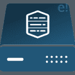
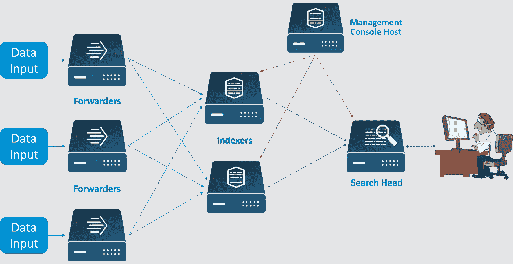

# Splunk 架构:转发器、索引器和搜索头教程

> 原文：<https://www.edureka.co/blog/splunk-architecture/>

**[免费下载 Splunk 电子书](https://resources.edureka.co/splunk-ebook/)**

对 Splunk 认证专业人员的需求大幅增长，这主要是因为几乎每一项正在塑造当今世界的先进技术都产生了不断增长的机器生成日志数据。如果您想在您的基础设施中实施 Splunk，那么了解 Splunk 的内部工作方式非常重要。我写这篇博客是为了帮助您理解 Splunk 架构，并告诉您不同的 Splunk 组件如何相互作用。

如果您想更清楚地了解什么是 Splunk，请参考 [Splunk 认证](https://www.edureka.co/splunk-certification-training)， 将让您了解 Splunk，并告诉您为什么它是拥有庞大基础架构的公司的必需品。

在我讲述不同 Splunk 组件如何工作之前，让我提一下每个组件所属的数据管道的各个阶段。

### **数据管道中的不同阶段**

Splunk 主要有三个不同的阶段:

*   数据输入阶段
*   数据存储阶段
*   数据搜索阶段

### **数据输入阶段**

在这一阶段，Splunk 软件使用来自其来源的原始数据流，将其分成 64K 个块，并用元数据关键字注释每个块。元数据关键字包括主机名、数据源和数据源类型。这些键还可以包括内部使用的值，例如数据流的字符编码，以及在索引阶段控制数据处理的值，例如应该存储事件的索引。

### **数据存储阶段**

数据存储包括两个阶段:解析和索引。

1.  在解析阶段，Splunk 软件检查、分析和转换数据，以仅提取相关信息。这也称为事件处理。在此阶段，Splunk 软件会将数据流分解为单个事件。解析阶段有许多子阶段:
    1.  将数据流分成单独的行
    2.  识别、解析和设置时间戳
    3.  用从源范围键复制的元数据注释单个事件
    4.  根据正则表达式转换规则转换事件数据和元数据
2.  在索引阶段，Splunk 软件将解析的事件写入磁盘上的索引。它写入压缩的原始数据和相应的索引文件。索引的好处是在搜索过程中可以方便地访问数据。

### **数据搜索阶段**

此阶段控制用户如何访问、查看和使用索引数据。作为搜索功能的一部分，Splunk 软件存储用户创建的知识对象，如报告、事件类型、仪表板、警报和字段提取。搜索功能还管理搜索过程。

## **Splunk 组件**

如果您看下图，您会理解各种 Splunk 组件所属的不同数据管道阶段。

Splunk 中有 3 个主要组件:

*   Splunk Forwarder，用于数据转发
*   Splunk 索引器，用于解析和索引数据
*   搜索头，是用于搜索、分析和报告的图形用户界面

## **Splunk 待**

Splunk 转发器是您必须用来收集日志的组件。假设您想要从远程机器收集日志，那么您可以通过使用独立于主 Splunk 实例的 Splunk 远程转发器来完成。

事实上，您可以在多台机器上安装多个这样的转发器，它们会将日志数据转发到 Splunk 索引器进行处理和存储。如果要对数据做实时分析呢？Splunk 转发器也可用于此目的。您可以将转发器配置为实时向 Splunk 索引器发送数据。您可以将它们安装在多个系统中，同时从不同的机器上实时收集数据。

*要了解数据的实时转发是如何发生的，你可以阅读我的* [*博客*](https://www.edureka.co/blog/splunk-use-case) *关于达美乐如何使用 Splunk 来获得运营效率。*

与其他传统监控工具相比，Splunk Forwarder 消耗的 cpu 非常少，仅为 1-2%。您可以轻松地将它们扩展到数万个远程系统，并在对性能影响最小的情况下收集万亿字节的数据。

## 现在，让我们了解不同类型的 Splunk 货代。

**通用转发器**–如果您想要转发在源位置收集的原始数据，您可以选择通用转发器。它是一个简单的组件，在将传入的数据流转发到索引器之前，对它们执行最少的处理。

数据传输是市场上几乎所有工具的主要问题。由于在转发数据之前对数据的处理很少，所以大量不必要的数据也会被转发到索引器，从而导致性能开销。

为什么要大费周章地将所有数据转移到索引器上，然后只过滤掉相关的数据呢？只将相关数据发送给索引器，节省带宽、时间和金钱，不是更好吗？这可以通过使用我在下面解释的重型货代来解决。

**重型转发器**–您可以使用重型转发器，并消除一半的问题，因为在将数据转发到索引器之前，一级数据处理发生在源本身。重型转发器通常在源处进行解析和索引，并且还智能地将数据路由到索引器，从而节省带宽和存储空间。所以当一个重转发器解析数据时，索引器只需要处理索引段。

## **Splunk 索引器**

索引器是 Splunk 组件，您必须使用它来索引和存储来自转发器的数据。Splunk 实例将传入数据转换为事件，并将其存储在索引中，以便高效地执行搜索操作。如果您从通用转发器接收数据，那么索引器将首先解析数据，然后对其进行索引。解析数据是为了消除不需要的数据。但是，如果您从一个重转发器接收数据，索引器将只索引数据。

随着 Splunk 实例索引您的数据，它会创建大量文件。这些文件包含以下内容之一:

*   压缩形式的原始数据
*   指向原始数据的索引(索引文件，也称为 tsidx 文件)，加上一些元数据文件

这些文件驻留在称为桶的目录组中。

现在让我告诉你索引是如何工作的。

Splunk 处理传入的数据以实现快速搜索和分析。它以各种方式增强数据，例如:

*   将数据流分成单独的可搜索事件
*   创建或识别时间戳
*   提取主机、源、源类型等字段
*   对传入的数据执行用户定义的操作，例如识别自定义字段、屏蔽敏感数据、写入新的或修改过的密钥、对多行事件应用破坏规则、过滤不想要的事件以及将事件路由到指定的索引或服务器

这个索引过程也称为事件处理。

Splunk 索引器的另一个优势是数据复制。您不必担心数据丢失，因为 Splunk 保留了索引数据的多个副本。这个过程称为索引复制或索引器群集。这是在索引器集群的帮助下实现的，索引器集群是一组索引器，用于复制彼此的数据。

## **Splunk 搜索头**

搜索头是用于与 Splunk 交互的组件。它为用户提供了一个图形用户界面来执行各种操作。您可以通过输入搜索词来搜索和查询存储在索引器中的数据，您将获得预期的结果。

您可以在不同的服务器上安装搜索头，也可以在同一台服务器上安装其他 Splunk 组件。搜索头没有单独的安装文件，您只需在 Splunk 服务器上启用 splunkweb 服务即可。

Splunk 实例既可以充当搜索头，也可以充当搜索对等体。仅执行搜索而不执行索引的搜索头被称为专用搜索头。而搜索对等体执行索引并响应来自其他搜索头的搜索请求。

在 Splunk 实例中，搜索头可以向一组索引器或搜索对等体发送搜索请求，这些索引器或搜索对等体对其索引执行实际搜索。搜索头然后合并结果，并将它们发送回用户。这是一种更快的数据搜索技术，称为分布式搜索。

搜索头集群是协调搜索活动的搜索头组。集群协调搜索头的活动，根据当前负载分配工作，并确保所有搜索头都可以访问同一组知识对象。

## **具有部署服务器/管理控制台主机的高级 Splunk 架构**

查看上图，了解 Splunk 的端到端工作方式。图像显示了几个将数据发送到索引器的远程转发器。根据索引器中显示的数据，您可以使用搜索头来执行搜索、分析、可视化和创建知识对象等功能，以实现运营智能。

管理控制台主机充当集中式配置管理器，负责向部署客户端分发配置、应用程序更新和内容更新。部署客户端是转发器、索引器和搜索头。

## **Splunk 架构**

如果您已经理解了上面解释的概念，您可以很容易地联想到 Splunk 架构。查看下图，获得流程中涉及的各种组件及其功能的综合视图。

*   你可以通过**运行脚本**自动转发数据从各个**网口**接收数据
*   您可以**监控进入的文件**并实时检测变化
*   **转发器**能够智能地**路由**数据，**克隆**数据，并在数据到达索引器之前对其进行**负载平衡**。克隆是为了在数据源上创建一个事件的多个副本，在数据源上进行负载平衡，这样即使一个实例失败，数据也可以转发到另一个托管索引器的实例
*   正如我前面提到的，**部署服务器**用于管理整个部署、配置和策略
*   当接收到该数据时，它被存储在**索引器**中。然后索引器被分解成不同的逻辑数据存储，在每个数据存储中，您可以设置权限，控制每个用户**查看、访问和使用**的内容
*   一旦数据进入，你可以搜索索引数据，也可以**将搜索**分配给其他搜索对等点，结果将被合并并发送回搜索头
*   除此之外，您还可以进行**预定搜索**并创建**警报**，当某些条件与保存的搜索匹配时就会触发
*   您可以使用保存的搜索创建**报告**并通过使用**可视化仪表盘** 进行**分析**
*   最后，您可以使用**知识对象**来丰富现有的非结构化数据
*   可以从 **Splunk CLI** 或 **Splunk Web 界面**访问搜索头和知识对象。这种通信通过一个 **REST API** 连接进行

我希望您喜欢阅读这篇关于 Splunk 架构的博客，它讨论了各种 Splunk 组件及其工作原理。请继续关注我在 Splunk Knowledge Objects 上的下一篇博客，同时，您可以通过点击下面的链接来阅读我在 Splunk 教程系列中以前的博客。

*要不要学习 Splunk 并在业务中实施？点击此处查看我们的 [Splunk 培训](https://www.edureka.co/splunk-certification-training)，该培训包含讲师指导的现场培训和真实项目体验。*

还可以下载 [Splunk 教程系列电子书](https://resources.edureka.co/splunk-ebook/)。