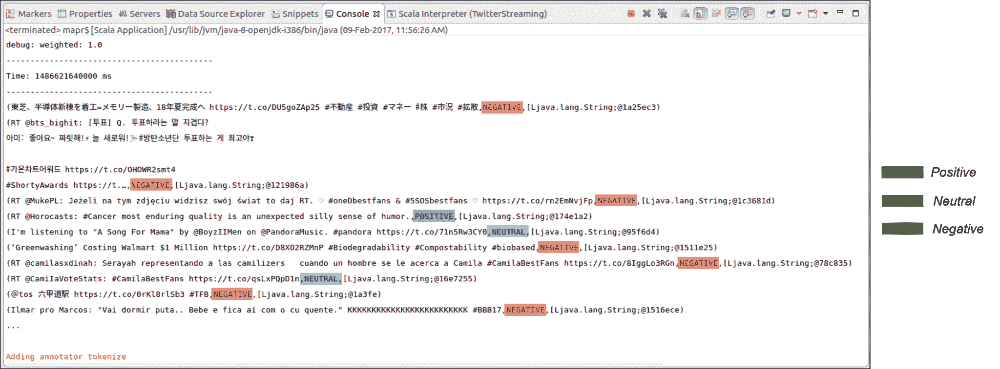
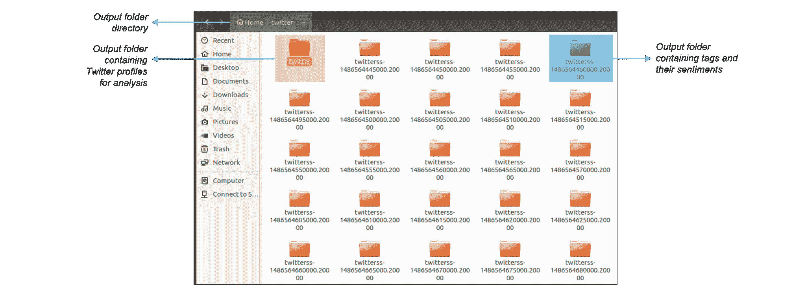
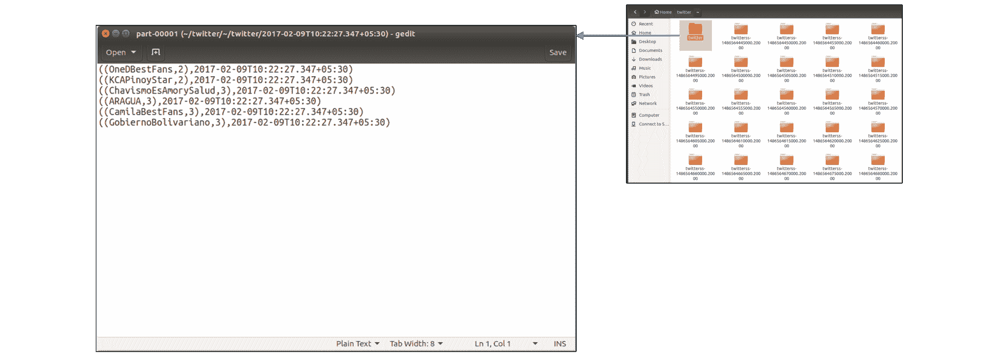
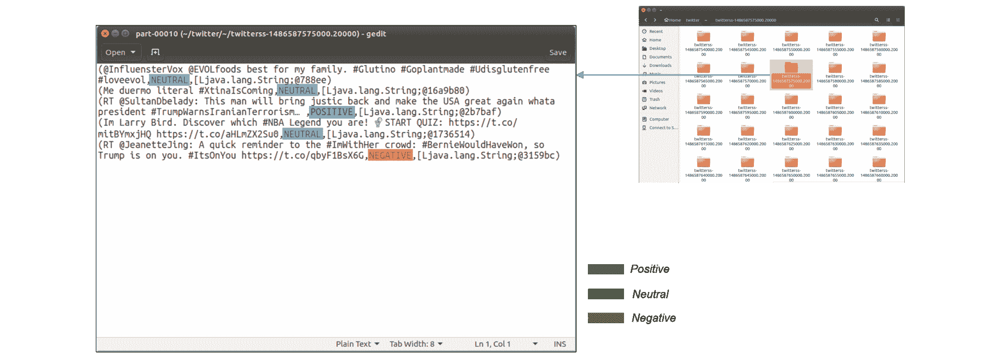
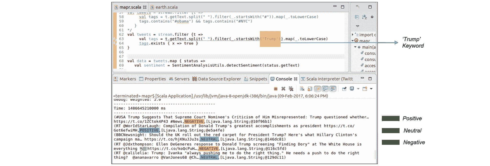

# Spark 流媒体教程–使用 Apache Spark 进行情感分析

> 原文：<https://www.edureka.co/blog/spark-streaming/>

Spark Streaming 是核心 Spark API 的扩展，支持实时数据流的可扩展、高吞吐量、容错流处理。Spark Streaming 可用于传输实时数据，处理可以实时进行。Spark Streaming 不断增长的用户群包括优步、网飞和 Pinterest 等家喻户晓的名字。

说到实时数据分析，Spark Streaming 提供了一个单一平台来摄取数据以进行快速实时处理，而 ***[Spark 认证](https://www.edureka.co/apache-spark-scala-training)*** 同样证明了您的技能。通过这篇博客，我将向您介绍 Spark Streaming 这一令人兴奋的新领域，我们将浏览一个完整的使用案例，*使用 Spark Streaming 进行 Twitter 情绪分析*。

以下是本博客将涉及的主题:

1.  [什么是流媒体？](#What_Is_Streaming)
2.  [为什么火花四溅？](#Why_Spark_Streaming)
3.  [火花流概述](#Spark_Streaming_Overview)
4.  [火花流特征](#Spark_Streaming_Features)
5.  [Spark 流基础](#Spark_Streaming_Fundamentals) 5.1 [流上下文](#Streaming_Context)5.2[DStream](#DStream)5.3[缓存/持久化](#Caching)5.4[累加器、广播变量和检查点](#Accumulators_BroadcastVariables_Checkpoints)
6.  [用例——推特情绪分析](#Use_Case_Twitter_Sentiment_Analysis)

## **什么是流媒体？**

数据流是一种传输数据的技术，以便可以作为稳定和连续的流进行处理。随着互联网的发展，流媒体技术变得越来越重要。

**  图:  ** *什么是流媒体？* 

## **为什么火花四溅？**

我们可以使用 Spark Streaming 从 Twitter、股票市场和地理系统等各种来源传输实时数据，并执行强大的分析来帮助企业。

**  图:  ** * 为什么火花四溅？*

## **火花流概述**

*火花流*用于处理实时流数据。它是对核心 Spark API 的有益补充。Spark Streaming 支持实时数据流的高吞吐量和容错流处理。

 **图:** *溪流中火花四溅* 

基本流单元是数据流，它基本上是一系列用于处理实时数据的 rdd。

## **火花流特征**

1.  **扩展:** Spark Streaming 可以轻松扩展到数百个节点。
2.  **速度:**它的一个首领潜伏时间低。
3.  **容错:** Spark 具有从故障中高效恢复的能力。
4.  **集成:** Spark 集成了批处理和实时处理。
5.  **经营分析:** Spark Streaming 是 u sed 跟踪客户的行为，可用于经营分析。

**火花流工作流程**

Spark 流工作流程有四个高级阶段。首先是从各种来源传输数据。这些源可以是流数据源，如 Akka、Kafka、Flume、AWS 或用于实时流的 Parquet。第二类来源包括 HBase、MySQL、PostgreSQL、Elastic Search、Mongo DB 和 Cassandra，用于静态/批处理流。一旦发生这种情况，Spark 可以通过其 MLlib API 对数据进行机器学习。此外，Spark SQL 用于对这些数据执行进一步的操作。最后，流式输出可以存储到各种数据存储系统中，如 HBase、Cassandra、MemSQL、Kafka、Elastic Search、HDFS 和本地文件系统。


**图:** *火花流概述*

## **火花串流基础**

1.  流媒体环境
2.  ds stream
3.  缓存
4.  累加器、广播变量和检查点

**流媒体上下文**

*流上下文*在 Spark 中消耗一个数据流。它注册一个*输入数据流*以产生一个*接收器*对象。它是 Spark 功能的主要入口。Spark 提供了许多像 Twitter、Akka Actor 和 ZeroMQ 这样的源代码的默认实现，可以从上下文中访问它们。

  可以从 SparkContext 对象创建 StreamingContext 对象。SparkContext 表示到 Spark 集群的连接，可用于在该集群上创建 rdd、累加器和广播变量。

```
import org.apache.spark._
import org.apache.spark.streaming._
var ssc = new StreamingContext(sc,Seconds(1))

```

**【ds stream】**

*离散化流* (DStream)是 Spark Streaming 提供的基本抽象。它是一个连续的数据流。它是从数据源或通过转换输入流生成的处理过的数据流接收的。

 **图:** *从输入数据流中提取单词* 

在内部，数据流由一系列连续的 RDD 表示，每个 RDD 包含某个区间的数据。

**输入数据流:** *输入数据流*是表示从流源接收的输入数据流的数据流。

 **图:** *接收机将数据发送到输入数据流上，其中每一批包含 RDDs * 

每个输入数据流都与一个接收对象相关联，该接收对象从数据源接收数据，并将其存储在 Spark 的存储器中进行处理。

**数据流上的变换:**

应用于数据流的任何操作都将转化为对底层 rdd 的操作。转换允许来自输入数据流的数据像 RDDs 一样被修改。数据流支持普通 Spark RDDs 上可用的许多转换。

** 图: ** * DStream 变换* 

下面是一些流行的数据流转换:

| 地图( *func* ) | map( *func* )通过函数 *func 传递源数据流的每个元素，返回新的数据流。* |
| 平面地图( *func* ) | flatMap( *func* )类似于 map( *func* )，但是每个输入项可以映射到 0 个或多个输出项，并通过函数 *func 传递每个源元素来返回一个新的数据流。* |
| 滤波器( *func* ) | filter( *func* )通过只选择源数据流中 *func* 返回 true 的记录，返回一个新的数据流。 |
| 减少( *func* ) | reduce( *func* )通过使用函数 *func* 聚合源数据流的每个 RDD 中的元素，返回单元素 rdd 的新数据流。 |
| groupBy( *func* ) | groupBy( *func* )返回新的 RDD，它基本上由该组的一个键和相应的项目列表组成。 |

**输出数据流:**

输出操作允许将 DStream 的数据推出到外部系统，如数据库或文件系统。输出操作触发所有数据流转换的实际执行。

**  图:  ** * 对数据流 * 的输出操作

**缓存**

*数据流*允许开发者在内存中缓存/保存数据流的数据。如果数据流中的数据将被计算多次，这是很有用的。这可以使用 DStream 上的 *persist()* 方法来完成。

 **图:** *缓存成 2 个节点* 

用于通过网络接收数据的输入流(如 Kafka、Flume、Sockets 等。)，默认的持久性级别设置为将数据复制到两个节点，以实现容错。

**累加器，广播变量和检查点**

**累加器:** *累加器*是只通过一个结合和交换运算相加的变量。它们用于实现计数器或求和。在用户界面中跟踪累加器有助于了解运行阶段的进度。Spark 本身支持数字累加器。我们可以创建命名或未命名的累加器。

**广播变量:** *广播变量*允许程序员在每台机器上缓存一个只读变量，而不是随任务发送一个副本。它们可用于以高效的方式为每个节点提供大型输入数据集的副本。Spark 还尝试使用高效的广播算法来分发广播变量，以降低通信成本。

**关卡:** *关卡*类似于博彩中的关卡。它们使它 24/7 全天候运行，并使它对与应用程序逻辑无关的故障具有弹性。

**  图:  ** * 特征检查点*

## **用例——推特情绪分析**

现在我们已经了解了 Spark 流的核心概念，让我们用 Spark 流来解决一个现实生活中的问题。

**问题陈述:**设计一个 Twitter 情绪分析系统，我们在其中填充实时情绪，用于危机管理、服务调整和目标营销。

**情感分析的应用:**

*   预测一部电影的成功
*   预测政治竞选成功
*   决定是否投资某家公司
*   定向广告
*   审查产品和服务

**火花分流实现:**

找到下面的伪代码:

```

//Import the necessary packages into the Spark Program
import org.apache.spark.streaming.{Seconds, StreamingContext}
import org.apache.spark.SparkContext._
...
import java.io.File

object twitterSentiment {

def main(args: Array[String]) {
if (args.length < 4) {
System.err.println("Usage: TwitterPopularTags <consumer key> <consumer secret> " + "<access token> <access token secret> [<filters>]")
System.exit(1)
}

StreamingExamples.setStreamingLogLevels()
//Passing our Twitter keys and tokens as arguments for authorization
val Array(consumerKey, consumerSecret, accessToken, accessTokenSecret) = args.take(4)
val filters = args.takeRight(args.length - 4)

// Set the system properties so that Twitter4j library used by twitter stream
// Use them to generate OAuth credentials
System.setProperty("twitter4j.oauth.consumerKey", consumerKey)
...
System.setProperty("twitter4j.oauth.accessTokenSecret", accessTokenSecret)

val sparkConf = new SparkConf().setAppName("twitterSentiment").setMaster("local[2]")
val ssc = new Streaming Context
val stream = TwitterUtils.createStream(ssc, None, filters)

//Input DStream transformation using flatMap
val tags = stream.flatMap { status => Get Text From The Hashtags }

//RDD transformation using sortBy and then map function
tags.countByValue()
.foreachRDD { rdd =>
val now = Get current time of each Tweet
rdd
.sortBy(_._2)
.map(x => (x, now))
//Saving our output at ~/twitter/ directory
.saveAsTextFile(s"~/twitter/$now")
}

//DStream transformation using filter and map functions
val tweets = stream.filter {t =>
val tags = t. Split On Spaces .filter(_.startsWith("#")). Convert To Lower Case
tags.exists { x => true }
}

val data = tweets.map { status =>
val sentiment = SentimentAnalysisUtils.detectSentiment(status.getText)
val tagss = status.getHashtagEntities.map(_.getText.toLowerCase)
(status.getText, sentiment.toString, tagss.toString())
}

data.print()
//Saving our output at ~/ with filenames starting like twitters
data.saveAsTextFiles("~/twitters","20000")

ssc.start()
ssc.awaitTermination()
 }
}

```

**结果:**

下面是运行 Twitter 情感流程序时在 Eclipse IDE 中显示的结果。



**图:***Eclipse IDE 中的情绪分析输出*

在截图中我们可以看到，所有的推文根据推文内容的情绪分为积极、中立和消极。

根据创建时间，推文的情感输出被存储到文件夹和文件中。这个输出可以根据需要存储在本地文件系统或 HDFS 上。输出目录如下所示:

  **图:** *输出文件夹在我们的‘推特’项目文件夹里面*

在这里，在 twitter 目录中，我们可以找到 Twitter 用户的用户名以及每条推文的时间戳，如下所示:

  **图:** *输出包含带有时间戳* 的 Twitter 用户名的文件

现在我们已经获得了 Twitter 用户名和时间戳，让我们看看存储在主目录中的情感和推文。在这里，每条推文后面都跟着感悟情绪。存储的这种情绪被公司进一步用于分析大量的见解。

  **图:** *输出包含带有情绪的推文的文件*

**调整代码:**

现在，让我们稍微修改一下我们的代码，以获得特定标签(主题)的情感。目前，美国总统唐纳德·特朗普正在新闻频道和在线社交媒体上流行。让我们看看与关键字' ***川普*** 相关的情绪。

 **图:** *对带有‘川普’关键字* 的推文进行情感分析

**向前移动:**

正如我们从情感分析演示中看到的，我们可以提取特定主题的情感，就像我们对“Trump”所做的那样。同样，情感分析可以被世界各地的公司用于危机管理、服务调整和目标营销。

使用 Spark Streaming 进行情感分析的公司采用了相同的方法来实现以下目标:

1.  提升客户体验
2.  获得竞争优势
3.  获取商业智能
4.  重振失败的品牌

至此，我们结束了这个 *Spark 流媒体教程*的博客。到现在为止，你一定已经很好的理解了什么是火花流。Twitter 情绪分析用例将为您在 Spark Streaming 和 Apache Spark 中遇到的任何未来项目提供所需的信心。实践是掌握任何主题的关键，我希望这篇博客能让你对 Apache Spark 产生足够的兴趣。

*我们推荐以下来自 Edureka 的 Spark 流媒体 YouTube 教程作为开始:*

## **Spark Streaming | Twitter 情绪分析示例| edu reka**

*Spark Tutorial 上的这个视频系列提供了这些组件的完整背景，以及真实生活中的用例，如 [Twitter 情绪分析](https://www.youtube.com/watch?v=uD_q4Rm4i2Q&amp;amp;amp;amp;amp;list=PL9ooVrP1hQOGyFc60sExNX1qBWJyV5IMb)、 [NBA 游戏预测分析](https://www.youtube.com/watch?v=zeDUx_Jf154&amp;amp;amp;amp;amp;list=PL9ooVrP1hQOGyFc60sExNX1qBWJyV5IMb)、[地震检测系统](https://www.youtube.com/watch?v=9mELEARcxJo&amp;amp;amp;amp;amp;list=PL9ooVrP1hQOGyFc60sExNX1qBWJyV5IMb)、[飞行数据分析](https://www.youtube.com/watch?v=BQlgZaKvfac&amp;amp;amp;amp;amp;list=PL9ooVrP1hQOGyFc60sExNX1qBWJyV5IMb)和[电影推荐系统](https://www.youtube.com/watch?v=qX1kYJ6h7j8&amp;amp;amp;amp;amp;list=PL9ooVrP1hQOGyFc60sExNX1qBWJyV5IMb)。我们亲自设计了用例，以便为运行代码的任何人提供全面的专业知识。*

*有问题吗？请在评论区提到它，我们会尽快回复您。* *如果您希望学习 Spark 并在 Spark 领域建立职业生涯，并积累使用 RDD、Spark Streaming、SparkSQL、MLlib、GraphX 和 Scala 执行大规模数据处理的专业知识，并在实际生活中使用案例，请查看我们的在线互动直播* *[Apache Spark 认证培训](https://www.edureka.co/apache-spark-scala-training)此处，* *它将提供 24*7 支持，在整个学习期间为您提供指导。*