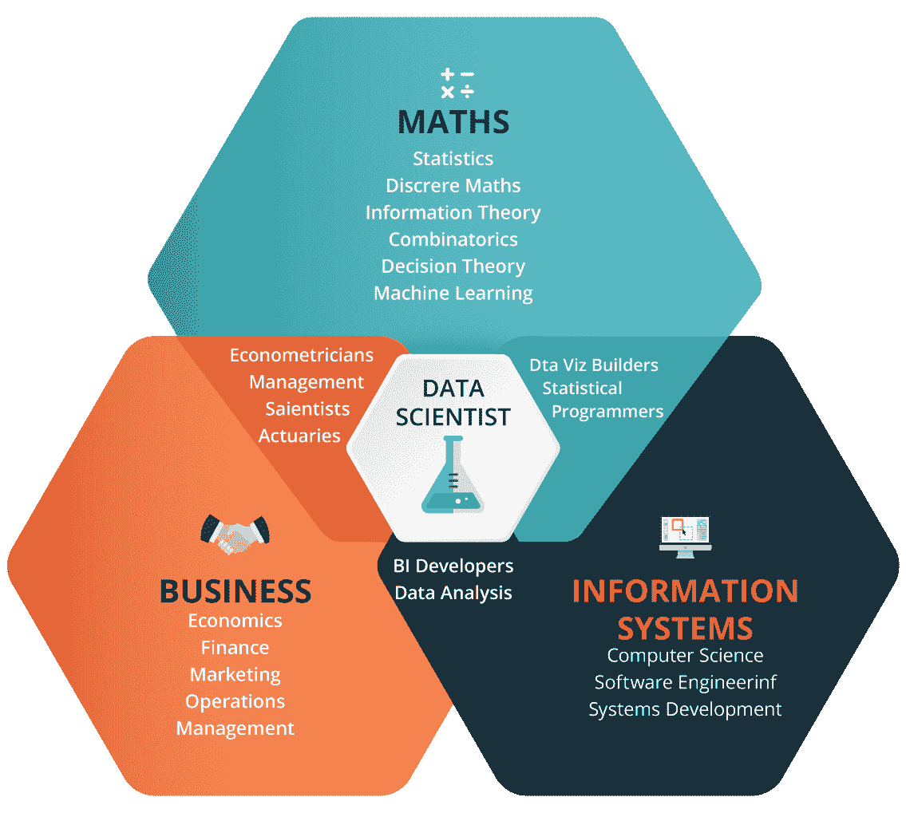
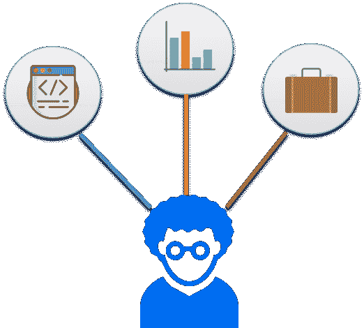
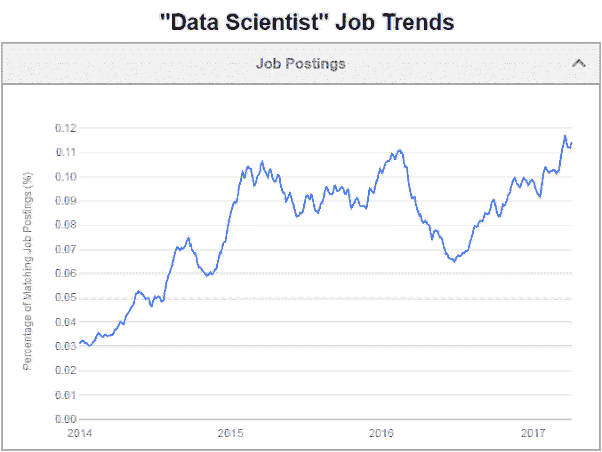
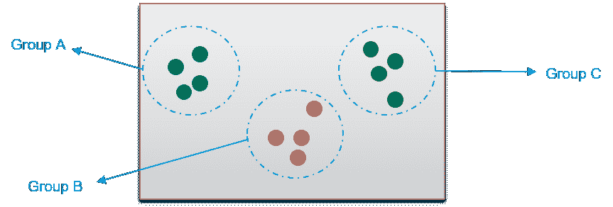
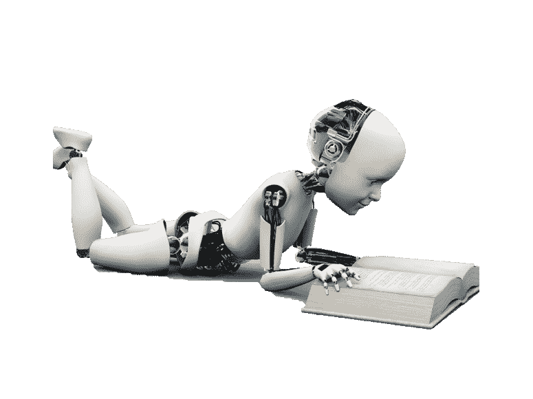
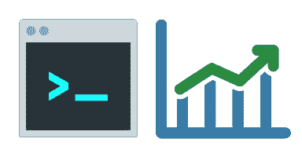

# 数据科学教程–从头开始学习数据科学！

> 原文：<https://www.edureka.co/blog/data-science-tutorial/>

想开始数据科学家的职业生涯，但不知道从哪里开始？你来对地方了！嘿，伙计们，欢迎来到这个令人敬畏的数据科学教程博客，它将让你开始进入数据科学世界。要获得深入的数据科学知识，您可以报名参加 Edureka 提供的使用 Python 的实时 *[**数据科学**](https://www.edureka.co/data-science-python-certification-course) 认证培训*，该培训提供全天候支持和终身访问。让我们看看今天我们将学习什么:

## **为什么是数据科学？**

有人说数据科学家是“21 世纪最性感的工作”。为什么？因为在过去的几年里，公司一直在存储他们的数据。每个公司都在这么做，这突然导致了数据爆炸。数据已经成为今天最丰富的东西。

但是，你将如何处理这些数据呢？让我们用一个例子来理解这一点:

比方说，你有一家制造手机的公司。你发布了你的第一个产品，它大受欢迎。每种技术都有生命，对吗？所以，现在是时候想出新的东西了。但你不知道应该创新什么，才能满足用户的期望，他们正急切地等待你的下一个版本？

你公司的某人想出了一个利用用户反馈的主意，并挑选出我们认为用户在下一个版本中期待的东西。

在数据科学中，您应用各种数据挖掘技术，如情感分析等，并获得想要的结果。

不仅如此，您还可以做出更好的决策，通过想出高效的方法来降低生产成本，并为客户提供他们真正想要的东西！

有了这些，数据科学可以带来无数的好处，因此你的公司拥有一个数据科学团队是绝对必要的。 诸如此类的需求导致了今天“数据科学”成为一门学科，因此我们为你写了这篇关于数据科学教程的博客。:)

## ****

## **数据科学教程:什么是数据科学？**

随着数理统计和数据分析的发展，最近出现了术语数据科学。这一旅程令人惊叹，我们今天在数据科学领域取得了如此多的成就。

麻省理工学院的研究人员声称，在未来几年，我们将能够预测未来。他们已经用他们令人敬畏的研究达到了预测未来的里程碑。他们现在可以用他们的机器预测电影的下一个场景会发生什么！怎么会？现在你可能有点难以理解，但是不要担心，在这篇博客结束时，你也会有答案的。

回来，我们讨论了数据科学，它也被称为数据驱动科学，利用科学方法、流程和系统从各种形式的数据中提取知识或见解，例如结构化或非结构化数据。

[https://www.youtube.com/embed/ku_VGr-NaBc](https://www.youtube.com/embed/ku_VGr-NaBc)

这些方法和流程是什么，是我们今天这期数据科学教程要讨论的内容。

展望未来，谁在进行头脑风暴，或者谁在实践数据科学？一位数据科学家。

报名参加[数据科学培训](https://www.edureka.co/masters-program/data-scientist-certification)，这是 Edureka 的一个硕士项目，旨在提升您的职业生涯。

## **对数据科学的需求**

*   **关于我们拥有多少数据、我们生成多少数据的事实**
    *   据**福布斯**报道，从 2010 年到 2020 年，全球创建、复制、捕获和吸收的数据总量从 1.2 万亿千兆字节增长到 59 万亿千兆字节，几乎是 5000%的增长。

*   **关于公司如何从数据科学中获利的事实**
    *   数据科学正在蓬勃发展。有大量的公司在进行数据转型(将他们的旧 IT 基础设施转变为支持数据科学的基础设施)，到处都有数据训练营，等等。当然，原因很简单:数据科学提供了有意义的见解。
    *   一群高管根据直觉做出本能决定来驱动公司的日子即将结束。他们正在被应用数据驱动决策的组织击败。例如，让我们看看 2006 年面临 126 亿美元亏损的福特公司。亏损之后，他们引入了首席数据科学家来领导转型，并进行了为期三年的大规模整改。这最终导致了超过 230 万辆汽车的销售，并在 2009 年结束时实现了盈利。

*   **需求&数据科学家的平均工资**

*   **根据玻璃门:**
    *   **印度数据科学家的平均工资:10 卢比/年**
    *   **美国数据科学家的平均工资:1L/年美元**

## **谁是数据科学家？**

## 

如图所示，数据科学家是所有行业的大师！他应该精通数学，应该在商业领域出类拔萃，还应该拥有高超的计算机科学技能。害怕吗？不要这样。尽管你需要在所有这些领域都做得很好，但是即使你不是，你也不是一个人！没有所谓的“完全的数据科学家”。如果我们谈论在公司环境中工作，工作是在团队中分配的，其中每个团队都有自己的专长。但问题是，你至少应该精通其中一个领域。另外，即使这些技能对你来说是新的，也要冷静！这可能需要时间，但是这些技能是可以培养的，相信我，你所投入的时间是值得的。为什么？好吧，让我们看看就业趋势。

## **数据科学家工作趋势**

嗯，图表说明了一切，数据科学家不仅有很多工作机会，而且工资也很高！不，我们的博客不会报道工资数据，去谷歌吧！

嗯，我们现在知道，学习数据科学实际上是有意义的，不仅因为它非常有用，而且在不久的将来你会在 it 领域有一个很好的职业生涯。

让我们现在就开始学习数据科学，从开始

## **数据科学岗位类型**

*   **数据科学家–**数据科学家知道如何从数据中提取有意义的模式&推论，也知道如何解释数据，这需要统计学和机器学习的工具和方法。

*   **数据分析师—**数据分析师提取、清理和解释数据集，以回答问题或解决业务问题。他们可以在许多行业工作，包括金融、商业、刑事司法、科学、医疗保健和政府。

*   **业务分析师—**业务分析师负责弥合业务& IT 之间的差距，使用数据分析来评估流程、确定需求，并向高管和利益相关者提供数据驱动的建议和报告。

业务分析师与业务领导和用户接触，了解数据驱动的流程、服务、产品、软件和硬件变革如何提高效率和增加价值。BAs 必须清楚地表达这些想法，同时还要根据技术上的可行性、功能上的合理性和经济上的合理性来权衡这些想法。

*   **数据工程师—**数据工程师在各种不同的环境中工作，构建管理、收集原始数据并将其转化为有用信息的系统，供数据科学家和业务分析师解读。他们的最终目标是使数据可访问，以便组织可以使用它来优化和评估他们的绩效。

*   **商业智能分析师–**商业智能分析师或 BI 分析师将数据转化为推动商业价值的洞察力。通过使用数据可视化、数据分析和数据建模技术和技巧，BI 分析师可以确定有助于其他部门、高管和经理做出业务决策的趋势，以改善组织中的流程并使其现代化。

*   **机器学习工程师-** 机器学习工程师是一名计算机程序员，但他们的关注点超出了专门为机器编写程序以执行特定任务。他们创造程序，使机器能够采取行动，而不需要特别指导去执行那些任务。

*   **统计员—**从高层次来说，统计员是将统计方法和建模技术应用于现实世界问题的专业人士。他们收集、解释和分析数据，以帮助许多业务决策过程。统计学家是许多行业中有价值的员工，通常在商业、医疗保健、政府、环境科学和物理科学等领域寻求职位。

## **数据科学家职责**

1.  通过探索性研究解决业务问题，构建开放式行业问题
2.  收集海量的非结构化和结构化数据。他们必须使用 SQL 等编程语言从关系数据库中查询结构化数据。他们还通过 API、web 抓取和调查收集非结构化数据。
3.  采用完善的分析方法、统计和机器学习方法来准备可用于预测和规定建模的数据。
4.  严格清洗数据，丢弃无关信息，为建模和预处理做好数据准备。
5.  进行探索性数据分析(EDA ),以了解如何处理缺失数据并寻找趋势和/或机会。
6.  发现新算法解决复杂问题，构建程序自动化重复工作。
7.  通过有效的报告和数据可视化向管理层和 IT 部门传达发现和预测。
8.  建议对现有程序和策略进行具有成本效益的变更

## **数据科学的必备条件:**

*   ### Technology

    *   **数学建模:**需要数学建模来根据可用数据进行快速的数学计算和预测。数据科学所需的主要数学概念是统计学、概率&线性代数。
    *   **对编程的理解:**对于数据科学来说，至少需要掌握其中一种编程语言的知识。Python，R Spark 是数据科学的一些必需的计算机编程语言。
    *   **数据可视化:**这是一个在可视环境中翻译和交流数据和信息的过程，通常使用图表、图形、条形图或其他可视辅助工具。可视化还利用图像来传达不同数据集之间的关系。
    *   **机器学习:**为了理解数据科学，还需要理解机器学习的概念，因为数据科学使用机器学习的算法来解决各种问题。
    *   **深度学习:**可以认为是机器学习的子集。这是一个基于通过检查计算机算法进行自我学习和改进的领域。虽然机器学习使用更简单的概念，但深度学习与人工神经网络(ANN)一起工作，人工神经网络旨在模仿人类的思维和学习方式。直到最近，神经网络受到计算能力的限制，因此在复杂性方面也受到限制。然而，大数据分析的进步已经允许更大、更先进的神经网络，使计算机能够比人类更快地观察、学习和应对复杂情况。深度学习已经辅助了图像分类、语音识别和语言翻译。它可以用来解决任何模式识别问题，无需人工干预。
    *   **数据库理解:**对数据库设计和 SQL 等数据库的深入理解，对于数据科学获取数据和处理数据至关重要。
*   ### Non-technical

    *   **业务问题解决:**现实世界中的业务问题很少被很好地定义。数据科学家需要理解开放式业务问题，并将其转化为数据科学问题。此外，对于特定的业务场景，理解每个模型的优缺点也很重要。
    *   **批判性思维:**这是一个数据科学家必须具备的能力，这样才能找到多种新的方法来有效地解决问题&。
    *   **沟通技巧:**沟通技巧对于数据科学家来说是最重要的，因为在解决了一个业务问题之后，你还需要与团队进行沟通。

## **数据科学 Vs 数据分析**

| **特色** | **数据科学** | **数据分析** |
| 定义 | 数据科学使用科学方法、算法、流程和系统从结构化和非结构化数据中提取见解和知识，并将算法和可操作的见解应用于广泛的应用领域。 | 数据分析是一个对数据进行检查、清理、探索、转换和建模的过程，目的是发现有用的信息&模式、提供结论并支持决策。 |
| 工作 | The main difference between a data analyst and a data scientist is heavy coding which the Data Scientists need to be skilled in. 数据科学家可以同时使用多种工具排列未定义的数据集，并构建自己的自动化系统和框架。 | Data analysts, analyze well-defined sets of data using a collection of different tools to answer substantial business needs 例如，为什么某个地区的销售额下降，为什么某个季度的营销活动进行得更好，一些内部特征如何影响收入。 |
| 主要领域 | 机器学习、人工智能、特征工程、企业分析、统计建模。 | 医疗保健、游戏、旅游、工业、具有即时数据需求的电子商务 |
| 技能 | 机器学习、深度学习、NLP、软件开发、Hadoop、统计学、数据挖掘/数据仓库、数据分析、Python。 | 数据挖掘/数据仓库、数据建模、R 或 SAS、SQL、统计分析、数据可视化、数据库管理&报告和数据分析。 |
| 角色&职责 | 数据科学家的任务是设计数据建模流程，以及创建机器学习算法和预测模型，以提取&组织机构解决复杂业务问题所需的信息。 | 数据分析师负责设计和维护数据系统和数据库，使用统计工具解释数据集，并根据相关发现准备有效传达趋势、模式和预测的报告。 |
| 工作任务 | 数据清理、模式识别、提取有意义的见解&使用机器学习技术从数据中获取商业见解 | 数据处理、数据清理、探索性数据分析、模式识别、数据库设计、开发可视化& KPI。 |

## **数据科学 Vs 商业智能**

| **特色** | **数据科学** | **商业智能** |
| 定义 | 数据科学使用科学的方法、流程、算法和系统从结构化和非结构化数据中提取知识和见解，并将算法和可操作的见解应用于广泛的应用领域。 | 商业智能包括组织用于商业信息数据分析的策略和技术。BI 技术提供了业务运营的历史、当前和预测视图。 |
| 数据 | 它既处理结构化的&非结构化的数据。 | 它主要处理结构化数据。 |
| 方法 | 这是一种科学的方法。 | 这是一种分析方法。 |
| 复杂度 | 高度复杂 | 相对简单 |
| 灵活 | 数据科学更加灵活，因为可以根据需要添加数据源。 | 在商业智能的情况下，由于数据源需要预先计划，因此灵活性较低。 |

## **如何解决数据科学中的一道题？**

现在，让我们讨论如何用数据科学来处理和解决问题。数据科学中的问题是用算法解决的。但是，最需要判断的是用哪种算法，什么时候用？

基本上，在数据科学领域，你可能会面临 5 种问题。

让我们逐一解决这些问题和相关算法:

**这是 A 还是 B？**

对于这个问题，我们指的是有明确答案的问题，就像在有固定解决方案的问题中，答案可以是是或不是，1 或 0，感兴趣，也许或不感兴趣。

**例如:**

你想喝点什么，茶还是咖啡？

在这里，你不能说你想要一杯可乐！因为这个问题只提供茶或咖啡，所以你只能回答其中之一。

当我们只有两种类型的答案时，即是或否，1 或 0，这被称为二级分类。如果有两个以上的选项，则称为多类分类。

总之，无论何时你遇到问题，答案都是明确的，在数据科学中，你将使用分类算法来解决这些问题。

本数据科学教程中的下一个问题，您可能会遇到，可能是这样的，

**这是不是很诡异？**

类似这样的问题涉及模式，可以使用异常检测算法来解决。

**例如:**

尝试将问题与“这很奇怪吗？”对此图，

上面的图案有什么怪异之处？那个红色的家伙，是不是？

每当模式出现中断，算法就会标记出特定的事件供我们查看。信用卡公司已经实现了该算法的实际应用，其中，用户的任何异常交易都被标记以供审查。从而实现安全性并减少人的监视工作。

让我们看看这个数据科学教程中的下一个问题，不要害怕，它涉及数学！

**多少或多少？**

不喜欢数学的你们可以放心了！回归算法来了！

因此，每当有可能需要数字或数值的问题时，我们就用回归算法来解决。

**例如:**

明天的温度是多少？

由于我们希望这个问题的答案是一个数值，我们将使用回归算法来解决它。

在本数据科学教程中，我们继续讨论下一个算法，

**这是怎么组织的？**

假设你有一些数据，现在你没有任何想法，如何从这些数据中找到意义。因此，问题是，这是如何组织的？

嗯，你可以用聚类算法来解决这个问题。他们是如何解决这些问题的？我们来看看:

聚类算法根据共同的特征对数据进行分组。例如，在上图中，点是根据颜色组织的。类似地，无论是任何数据，聚类算法都试图理解它们之间的共同点，从而将它们“聚类”在一起。

在本数据科学教程中，您可能会遇到的下一个也是最后一个问题是，

**接下来该怎么办？**

每当你遇到一个问题，你的计算机必须根据你给它的训练做出决定，这就涉及到强化算法。

**例如:**

你的温度控制系统，当它必须决定是否应该降低或提高室内温度时。

**这些算法是如何工作的？**

这些算法是基于人类的心理。我们喜欢被欣赏，对吗？计算机实现这些算法，并期望在接受训练时得到赏识。怎么会？让我们看看。

你不是教计算机做什么，而是让它决定做什么，在行动结束时，你给出正面或负面的反馈。因此，你让你的系统“决定”做什么，并最终给出反馈，而不是在你的系统中定义什么是对的，什么是错的。

就像训练你的狗一样。你不能控制你的狗做什么，对不对？但是他做错了你可以骂他。同样，当他做了别人期望的事情时，也许拍拍他的背。

让我们把这种理解应用到上面的例子中，想象你正在训练温度控制系统，所以当房间里的人数增加时，系统必须采取行动。要么降低温度，要么提高温度。由于我们的系统什么都不懂，它采取随机决策，让我们假设，它提高了温度。因此，你给出了一个负面的反馈。有了这个，电脑就知道无论何时房间里的人数增加，都不会提高温度。

类似地，对于其他行动，你也应该给出反馈。 随着每一次反馈，你的系统都在学习，并因此在下一次决策中变得更加准确，这种类型的学习被称为强化学习。

现在，我们在本数据科学教程中学习的算法涉及一个常见的“学习实践”。我们在让机器学习，对吗？

## **什么是机器学习？**

它是一种人工智能，使计算机能够自主学习，即无需明确编程。通过机器学习，机器可以在遇到新情况时更新自己的代码。

在本数据科学教程中，我们现在知道数据科学是由机器学习及其分析算法支持的。我们如何做分析，在哪里做。数据科学还有一些组件可以帮助我们解决所有这些问题。

在此之前，让我来回答麻省理工学院是如何预测未来的，因为我想你们现在可能能够联系起来。因此，麻省理工学院的研究人员用电影训练他们的模型，计算机学习人类如何反应，或者在采取行动之前如何行动。

例如，当你要和某人握手时，你会把手从口袋里拿出来，或者向那个人靠过去。基本上，我们做的每一件事都有一个“预先行动”。在电影的帮助下，电脑接受了这些“预先动作”的训练。通过观察越来越多的电影，他们的计算机能够预测角色的下一步行动。

很简单，不是吗？在这个数据科学教程中，让我再问你一个问题！他们在这里面一定实现了机器学习的哪种算法？

## **数据科学流程:**

*   **数据提取—**数据提取是从各种来源收集或检索不同类型数据的过程，其中许多来源可能组织混乱或完全无组织。数据提取使得处理、合并和提炼数据成为可能，以便可以将数据存储在一个集中的位置以便修改。这些位置可能是基于云的、现场的或两者的混合。数据提取是 ELT(提取、加载、转换)和 ETL(提取、转换、加载)任务中最初始的步骤。ETL/ELT 本身是绝对数据集成策略的一部分。
*   **数据准备—**数据一旦提取出来，就进入数据准备阶段。数据准备，通常被称为“预处理”，是对原始数据进行清理和组织以便进行下一阶段数据处理的阶段。在准备过程中，会严格检查原始数据是否存在任何错误。此步骤的目的是消除不良数据(冗余、不完整或不正确的数据),并开始为最佳商业智能创建优质数据。
*   **探索性数据分析(EDA)—**它指的是对数据进行初步调查的严格过程，以发现有意义的模式、检测异常、测试假设并在图形表示和汇总统计的支持下检查假设。首先理解数据，并尝试从中收集尽可能多的有意义的见解，这是一个很好的做法。EDA 就是让手头的数据变得有意义，然后再用它玷污它们。
*   **预测分析–**它查看历史和当前数据模式，以确定这些模式是否可能再次出现。这使得投资者和企业能够调整他们使用资源的地方，以利用未来可能发生的事件。预测分析还可用于降低风险和提高运营效率。预测分析是一种独特的技术，可以对未来的某些未知进行预测。它利用一系列技术来做出这些决定，包括人工智能(AI)、数据挖掘、机器学习、建模和统计。
*   **模型构建–**在这一步中，模型构建过程实际开始。在这里，数据科学家分发数据集进行训练和测试。对训练数据集应用回归、分类和聚类等技术。当模型准备好了，它就被“测试”数据集测试了。以下是一些常见的模型构建工具:

*   **模型部署:**在模型部署中，模型以期望的渠道和格式进行部署。在仔细评估和修改之后，数据模型将准备好实时提供结果。
*   **结果沟通:**在这个阶段，我们将检查我们是否达到了我们在初始阶段设定的目标。然后，我们将与业务团队交流调查结果和最终结果。

## **数据科学组件**

**1。数据集**

你会分析什么？数据，对吧？你需要大量可以分析的数据，这些数据被输入到你的算法或分析工具中。你可以从过去进行的各种研究中获得这些数据。

**2。r 工作室**T3T5

R 是由 R 基金会支持的用于统计计算和图形的开源编程语言和软件环境。R 语言在一个叫做 R Studio 的 IDE 中使用。

为什么用？

*   **编程与统计语言** **** 
    *   除了用作统计语言，它还可以用作分析目的的编程语言。

*   ****数据分析与可视化
    *   除了是最主要的分析工具之一，R 也是最流行的数据可视化工具之一。

*   ****简单易学
    *   R 简单易学，读&写

****

*   **免费开源**
    *   R 是一个 FLOSS(自由/Libre 和开源软件)的例子，这意味着一个人可以自由地分发这个软件的拷贝，阅读它的源代码，修改它，等等。

R Studio 对于分析来说已经足够了，直到我们的数据集变得巨大，同时也是非结构化的。这种数据被称为大数据。

**3。大数据**

大数据是指如此庞大和复杂的数据集集合，以至于难以使用现有的数据库管理工具或传统的数据处理应用程序进行处理。

现在，为了驯服这些数据，我们必须想出一个工具，因为没有传统的软件可以处理这种数据，因此我们想出了 Hadoop。

**4。Hadoop**

Hadoop 是一个框架，它帮助我们以并行和分布式的方式**存储**和**处理**大型数据集。

让我们把重点放在 Hadoop 的存储和处理部分。

**商店**

Hadoop 中的存储部分由 HDFS 处理，即 Hadoop 分布式文件系统。它在分布式生态系统中提供高可用性。它的工作方式是这样的，它将传入的信息分成块，并将它们分发到集群中的不同节点，从而实现分布式存储。

**流程**

MapReduce 是 Hadoop 处理的核心。这些算法执行两项重要的任务，映射和归约。映射器将任务分成并行处理的更小的任务。一旦所有的映射器完成了它们的工作，它们就聚集它们的结果，然后这些结果被 Reduce 过程简化为一个更简单的值。要了解更多关于 Hadoop 的信息，您可以通过我们的 ***[Hadoop 教程博客系列](https://www.edureka.co/blog/hadoop-tutorial/)*** 。

如果我们在数据科学中使用 Hadoop 作为存储，那么使用 R Studio 处理输入会变得很困难，因为它无法在分布式环境中很好地运行，因此我们有了 Spark R。

## **5。火花 R**

这是一个 R 包，它提供了一种轻量级的方式来使用 Apache Spark 和 R。为什么你要使用它而不是传统的 R 应用程序呢？因为，它提供了一个分布式数据框架实现，支持选择、过滤、聚合等操作，但是是在大型数据集上。

现在休息一下吧！我们已经完成了本数据科学教程中的技术部分，现在让我们从您的工作角度来看一下。我想你现在应该已经在谷歌上搜索了数据科学家的薪水，但是，让我们来讨论一下数据科学家的工作角色。

## **数据科学家工作角色**

一些著名的数据科学家职位有:

*   数据科学家
*   数据工程师
*   数据架构师
*   数据管理员
*   数据分析师
*   商业分析师
*   数据/分析经理
*   商业智能经理

下面的数据科学教程中的 Payscale.com 图表显示了美国和印度数据科学家的平均薪资。

提升数据科学和大数据分析技能的时机已经成熟，您可以利用数据科学职业机会。这就把我们带到了数据科学教程博客的结尾。我希望这篇博客能给你带来信息和附加值。现在是时候进入数据科学世界，成为一名成功的数据科学家了。

还有，如果你正在寻找数据科学的在线结构化培训，edureka！拥有专门策划的 [数据科学课程](https://www.edureka.co/executive-programs/advanced-program-data-science-course-iitg) ，帮助您获得统计学、数据争论、探索性数据分析以及机器学习算法(如 K-Means 聚类、决策树、随机森林和朴素贝叶斯)方面的专业知识。您还将学习时间序列、文本挖掘的概念，以及深度学习的介绍。本课程的新批次即将开始！！

*在数据科学教程中有问题问我们吗？请在评论区提到它，我们会给你回复。*