# 信息教程:理解信息“从里到外”

> 原文：<https://www.edureka.co/blog/informatica-tutorial>

在上一篇博客中，我们学习了关于 [什么是 Informatica](https://www.edureka.co/blog/what-is-informatica/) 及其实际应用。让我们深入了解这个 Informatica 教程博客，了解 Informatica、它的架构和一个用例。 ***[Informatica 认证](https://www.edureka.co/informatica)*** 是当今市场上最引人注目的技能之一，因为它是一个独特的、公正的数据集成平台，可以在各种不同的标准、系统和应用程序之间进行互操作。正如在上一篇博客中所讨论的，Informatica PowerCenter 是 Informatica 的旗舰产品，通常可以互换使用。简而言之，Informatica Powercenter 是一个单一、统一的企业数据集成平台，允许各种规模的公司和政府组织访问、发现和集成来自几乎任何业务系统的任何格式的数据，并以任何速度在整个企业中交付这些数据。它是一个 ETL 工具(提取、转换和加载)，与其他 ETL 工具相比，它的主要优势如下:

*   它很健壮，可以在基于 windows 和 UNIX 的系统中使用
*   它性能卓越，但开发、维护和管理非常简单

## **Informatica 教程:了解 Informatica PowerCenter**

为了实时了解 Informatica，我们应该深入了解 Informatica 架构和 Informatica 的其他组件。所以在这篇 Informatica 教程博客的结尾，你将能够理解以下内容:

1.  什么是信息架构？
    1.  信息的客户端组件
        1.  Informatica PowerCenter 存储库管理器
        2.  Informatica power center Designer
        3.  PowerCenter 工作流管理器
        4.  PowerCenter 工作流监控程序
        5.  管理员控制台
    2.  Informatica 的服务器组件
        1.  储存库服务
        2.  集成服务
        3.  SAP 带宽服务
        4.  网络服务中心
2.  信息中的数据流
3.  信息域&节点
4.  信息服务&服务经理
5.  用例:如何使用 SCD 加载产品维度表

## **什么是信息架构？**

Informatica PowerCenter 的架构基于面向服务的架构(SOA)概念。面向服务的架构(SOA)可以定义为一组服务，它们相互通信。通信过程要么涉及简单的数据传输，要么可能涉及两个或多个协调相同活动的服务。

Informatica 的开发基于基于组件的开发技术。基于组件的开发是一种技术，在这种技术中，具有特定功能的预定义组件或功能单元或两者被用于组装最终产品。PowerCenter 遵循基于组件的开发方法，允许构建从源到目标的数据流，使用不同的组件(称为转换)并根据需要将它们相互链接。一个好的方法是首先理解 Informatica 的组成部分，然后我们将通过一个用例学习如何应用 Informatica 来解决典型的业务问题。

因此，Informatica PowerCenter 工具由两部分组成。他们是:

*   客户端组件
*   服务器组件

<figure id="attachment_38087" aria-describedby="caption-attachment-38087" style="width: 528px" class="wp-caption aligncenter">

<figcaption id="caption-attachment-38087" class="wp-caption-text">**                             Fig: Informatica Architecture Overview**</figcaption>

</figure>

## **Informatica power center 客户端组件:**

*   ### **动力中心仓库管理员:**

存储库管理器用于管理存储库。它可以管理用户和组。我们可以创建、删除和编辑存储库用户和用户组。我们还可以分配和撤销存储库权限和文件夹权限。

存储库管理器有以下窗口:

*   **导航器:**它显示您在存储库管理器、设计器和工作流管理器中创建的所有对象。它首先按存储库组织，然后按文件夹组织。
*   **Main:** 提供导航器中选中对象的属性。此窗口中的列会根据在导航器中选择的对象而变化。
*   **输出:**它提供了在存储库管理器中执行的任务的输出。

<figure id="attachment_37325" aria-describedby="caption-attachment-37325" style="width: 500px" class="wp-caption aligncenter">

<figcaption id="caption-attachment-37325" class="wp-caption-text">                            **Fig: Repository Manager**</figcaption>

</figure>

*   ### **信息动力中心设计师**

PowerCenter Designer 是我们指定如何在各种源和目标之间移动数据的客户端。 这是我们通过使用称为转换的不同 PowerCenter 组件来解释各种业务需求，并通过它们传递数据(转换)的地方。设计器用于创建源定义、目标定义和转换，这些可以进一步用于开发映射。

<figure id="attachment_37327" aria-describedby="caption-attachment-37327" style="width: 528px" class="wp-caption aligncenter">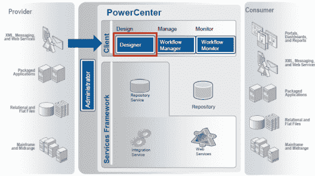

<figcaption id="caption-attachment-37327" class="wp-caption-text">                         **Fig: Informatica PowerCenter Designer**</figcaption>

</figure>

*   ### **Informatica power center 工作流管理器**

    它是一个或多个会话和其他任务的有序集合，旨在完成总体操作目的。它 执行一系列映射(如会话)和其他任务。

<figure id="attachment_51083" aria-describedby="caption-attachment-51083" style="width: 678px" class="wp-caption aligncenter">

<figcaption id="caption-attachment-51083" class="wp-caption-text">                                                                    **Fig: Workflow Manager**</figcaption>

</figure>

Workflow Manager 是一款 PowerCenter 应用程序，可帮助设计人员构建和运行工作流。可以按如下方式打开:

*   可通过点击“W”图标从设计器启动
*   可以从路径开始独立打开>所有程序>Informatica power center 9 . 6 . 1>客户端> PowerCenter 客户端> PowerCenter 工作流管理器
*   可以从工作流设计器中打开——你用来创建工作流对象的工具

<figure id="attachment_38090" aria-describedby="caption-attachment-38090" style="width: 528px" class="wp-caption aligncenter">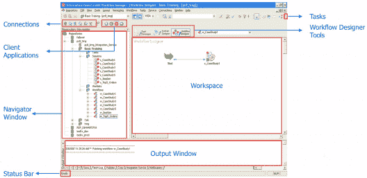

<figcaption id="caption-attachment-38090" class="wp-caption-text">                           **Fig: Workflow Manager Interface**</figcaption>

</figure>

工作流管理器显示以下窗口，帮助您创建和组织工作流:

*   您可以连接到多个存储库和文件夹并在其中工作。在导航器中，工作流管理器会在无效对象上显示一个红色图标。
*   您可以创建、编辑和查看任务、工作流和工作小程序。
*   它包含显示不同类型输出信息的标签。输出窗口包含以下选项卡:
    *   保存工作流程、工作小程序或任务时显示消息。当您保存工作流或工作小程序时,“保存”选项卡会显示验证摘要。
    *   获取日志。当工作流管理器从存储库中获取对象时，显示消息。
    *   验证工作流程、工作小程序或任务时显示消息。
    *   复制存储库对象时显示消息。
    *   显示来自集成服务的消息。
    *   显示来自存储库服务的消息。

**Informatica 工作流设计器**

它为 Informatica 服务器映射会话、任务和工作流的执行顺序和相关性

<figure id="attachment_38098" aria-describedby="caption-attachment-38098" style="width: 718px" class="wp-caption aligncenter">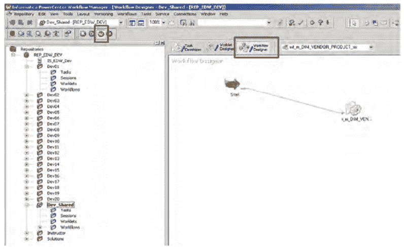

<figcaption id="caption-attachment-38098" class="wp-caption-text">                                  **                  Fig: Workflow Designer**</figcaption>

</figure>

*   #### **Task Developer**

它创建会话、Shell 命令和电子邮件任务。在任务开发器中创建的任务可重复使用

*   #### **Workpiece designer**

它创建代表一组任务的对象。Worklet 对象是可重用的。

工作流管理器还会显示一个状态栏，显示您所执行操作的状态。

下图显示了典型工作流的外观，包括开始任务、链接和会话任务组件。

<figure id="attachment_37349" aria-describedby="caption-attachment-37349" style="width: 734px" class="wp-caption aligncenter">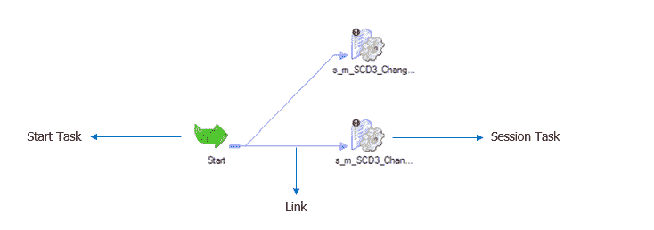

<figcaption id="caption-attachment-37349" class="wp-caption-text">                                                                  ** Fig: Example of Workflow Manager**</figcaption>

</figure>

*   ### **信息动力中心工作流监控器**

PowerCenter 工具 Workflow Monitor 用于监控工作流和任务的执行。

工作流监控程序可用于:

*   在甘特图视图或任务视图中查看工作流或任务运行的详细信息
*   运行、停止、中止和恢复工作流或任务
*   工作流监视器显示至少运行过一次的工作流。
*   工作流监视器不断地从集成服务和存储库服务接收信息。它还从存储库中获取信息以显示历史信息。

<figure id="attachment_37351" aria-describedby="caption-attachment-37351" style="width: 486px" class="wp-caption aligncenter">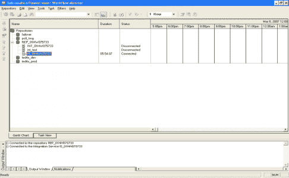

<figcaption id="caption-attachment-37351" class="wp-caption-text">                                              **Fig: Workflow Monitor **</figcaption>

</figure>

#### **如何打开 Informatica 工作流监控器:**

要打开工作流监视器，请转到:

启动>所有程序>信息动力中心 9.6.1 >客户端>动力中心客户端>动力中心工作流监控

监视器也可以打开:

*   从工作流管理器导航器
    *   工作流管理器可以配置为当工作流从工作流管理器运行时打开工作流监视器
    *   从工具>设计器、工作流管理器或存储库管理器中的工作流监视器
*   或者，通过工具工具栏上的工作流监视器图标

<figure id="attachment_37352" aria-describedby="caption-attachment-37352" style="width: 466px" class="wp-caption aligncenter">

<figcaption id="caption-attachment-37352" class="wp-caption-text">**                                Fig: Workflow monitor-sections **</figcaption>

</figure>

*   ### **Administrator console**

Informatica 管理员控制台(管理员工具)是管理 Informatica 域和 Informatica 安全的管理工具。 Informatica 管理员控制台(管理员工具)在 Informatica 安装后可用。

<figure id="attachment_37353" aria-describedby="caption-attachment-37353" style="width: 528px" class="wp-caption aligncenter">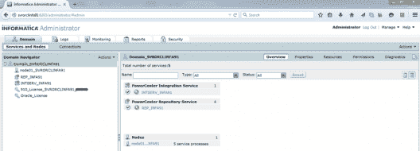

<figcaption id="caption-attachment-37353" class="wp-caption-text">**                      Fig: Informatica Administrator Console**</figcaption>

</figure>

管理控制台在域中执行以下任务:

*   **管理应用服务:**管理域中所有的应用服务，包括集成服务和存储库服务。
*   **配置节点:**配置节点属性，包括备份目录和资源。它允许关闭节点，然后在需要时重新启动。
*   **管理域对象:**它创建并管理服务、节点、许可证和文件夹等对象。
*   **查看和编辑域对象属性:**允许查看和编辑域中所有对象的属性。
*   **安全管理任务:**管理用户、组、角色和权限。
*   **查看日志事件:**使用日志查看器查看域、集成服务、SAP BW 服务、web 服务中心以及存储库服务的日志事件。

<figure id="attachment_37354" aria-describedby="caption-attachment-37354" style="width: 528px" class="wp-caption aligncenter">

<figcaption id="caption-attachment-37354" class="wp-caption-text">**                                  Fig: Administrator console-Interface**</figcaption>

</figure>

因此，简而言之，Informatica 的客户端组件由 5 个组件组成，即 Informatica Repository Manager、Informatica PowerCenter Designer、Informatica Workflow Manager、Informatica Workflow Monitor 和 Informatica Administrator 控制台。它构成了整个工具的模板。现在让我们试着理解 Informatica PowerCenter 的服务器组件。

## **Informatica power center 的服务器组件**

power center 服务器组件包括以下服务:

*   **储存库服务:**储存库服务管理储存库。它检索、插入和更新存储库数据库表中的元数据。
*   **集成服务:**集成服务运行会话和工作流。
*   **SAP BW 服务:**SAP BW 服务寻找来自 SAP BW 的 RFC 请求，并启动工作流以从 SAP BW 提取数据或将数据加载到 SAP BW 中。
*   **Web 服务中心:**Web 服务中心接收来自 Web 服务客户端的请求，并将 PowerCenter 工作流公开为服务。

现在我们已经了解了 Informatica 的客户端和服务器组件，下面的信息图将解释 Informatica 中的数据流，即数据是如何处理的:

<figure id="attachment_37355" aria-describedby="caption-attachment-37355" style="width: 881px" class="wp-caption aligncenter">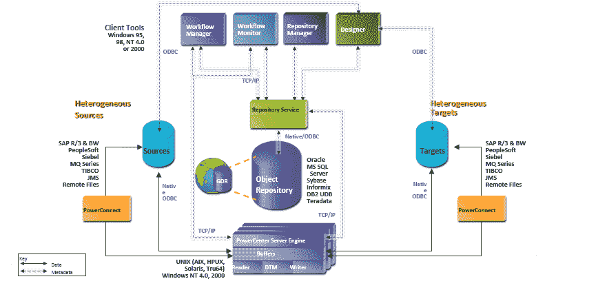

<figcaption id="caption-attachment-37355" class="wp-caption-text">**                                                         Fig: Data flow in Informatica**</figcaption>

</figure>

在这一点上，理解 Informatica 中的其他基本单元是非常合乎逻辑的，例如域&节点、服务&服务管理器。因此，在我们动手操作 Informatica 之前，让我们花点时间来理解它们。

## **信息域&节点:**

一个领域的显著特征如下:

*   域是节点和服务的逻辑集合或集合
*   PowerCenter 域是 power center 的基本管理单元
*   一个域可以是一个 PowerCenter 安装，也可以由多个 PowerCenter 安装组成

节点的显著特征如下:

*   节点是物理机器的逻辑表示。它有物理属性，如主机名和端口号
*   每个节点运行一个服务管理器，负责应用和核心服务
*   一个节点可以是网关节点或工作者节点，但它只能属于一个域

<figure id="attachment_37356" aria-describedby="caption-attachment-37356" style="width: 528px" class="wp-caption aligncenter">

<figcaption id="caption-attachment-37356" class="wp-caption-text">**                                          Fig: Informatica Domain n Node**</figcaption>

</figure>

## **信息服务&服务经理:**

服务是提供专门功能的资源。所有 PowerCenter 进程都作为服务在一个节点上运行。

Informatica PowerCenter 有两种类型的服务:

*   应用服务代表基于服务器的功能，包括存储库和集成服务。
*   核心服务代表管理和维护 PowerCenter 运行环境的功能，包括日志服务、许可服务和域服务等服务。

**服务经理**

*   服务管理器是管理所有域操作的服务，在域内的每个节点上运行
*   在网关节点上，服务管理器负责以下工作:
    *   控制域
    *   管理在域上运行的服务
    *   提供服务查找
*   在所有节点上，服务管理器控制核心服务和应用服务

power center 的不同组件如何交互:

<figure id="attachment_37357" aria-describedby="caption-attachment-37357" style="width: 528px" class="wp-caption aligncenter">

<figcaption id="caption-attachment-37357" class="wp-caption-text">**                            Fig: Informatica Component Interaction**</figcaption>

</figure>

## **用例:如何使用 SCD** 加载产品维度表

**问题陈述:**我们的目标是使用生效日期加载使用渐变维度(SCDs)类型 2 的产品维度表。

给定一个包含客户 ID、姓名、城市、州和国家详细信息的客户源系统，我们需要在目标维度表中创建一个新的条目，每次一个客户带来不同的值。

为了更好地理解这一点，如果客户返回的州或城市值与目标维度表中已经存在的值不同，则必须使用更新后的值创建一个新条目。这通过使用基于 SCD 解决方案的目标表来实现。

下面是使用 SCD 加载产品维度表的逐步过程。

**第一步** **:** 打开 PowerCenter Designer。

**第二步** **:** 连接到资源库

<figure id="attachment_38357" aria-describedby="caption-attachment-38357" style="width: 624px" class="wp-caption aligncenter">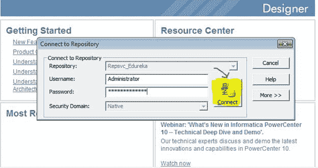

<figcaption id="caption-attachment-38357" class="wp-caption-text">**                            Fig: Establishing connection to Repository**</figcaption>

</figure>

**第三步** **:** 启动设计器

<figure id="attachment_38335" aria-describedby="caption-attachment-38335" style="width: 528px" class="wp-caption aligncenter">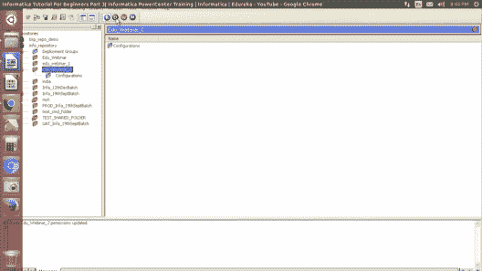

<figcaption id="caption-attachment-38335" class="wp-caption-text">**                            Fig: Launching PowerCenter Designer**</figcaption>

</figure>

**第四步 :** 从数据库加载源

<figure id="attachment_38336" aria-describedby="caption-attachment-38336" style="width: 528px" class="wp-caption aligncenter">

<figcaption id="caption-attachment-38336" class="wp-caption-text">**                            Fig: Various options to load Source data set**</figcaption>

</figure>

**第五步 :** 连接数据库

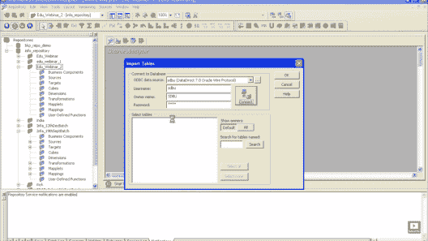

**第六步:** 选择 SCD_INPUT_DATA 表

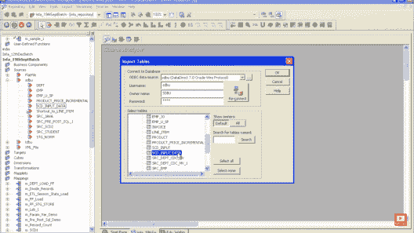

**第七步:** 同样从数据库加载目标设置

<figure id="attachment_38343" aria-describedby="caption-attachment-38343" style="width: 528px" class="wp-caption aligncenter">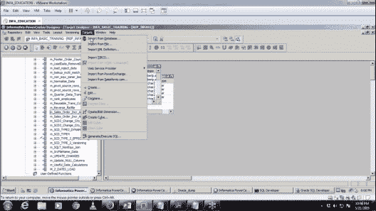

<figcaption id="caption-attachment-38343" class="wp-caption-text">**                            Fig: Various options to Target sets**</figcaption>

</figure>

**第八步** :设计一个工作流程来执行所需的操作，如下图

<figure id="attachment_38345" aria-describedby="caption-attachment-38345" style="width: 528px" class="wp-caption aligncenter">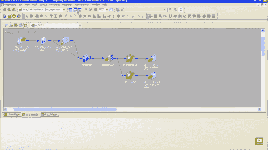

<figcaption id="caption-attachment-38345" class="wp-caption-text">**                            Fig: Workflow Design for Database**</figcaption>

</figure>

**第九步** :启动 Oracle SQL Developer，加载 **SCD_CUSTOMER** 表

<figure id="attachment_38349" aria-describedby="caption-attachment-38349" style="width: 528px" class="wp-caption aligncenter">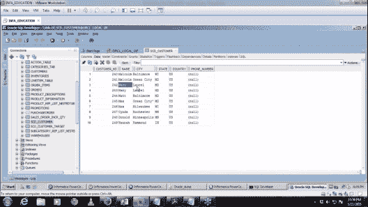

<figcaption id="caption-attachment-38349" class="wp-caption-text">**                            Fig: SCD_CUSTOMER table**</figcaption>

</figure>

**第十步** :修改客户玛丽和汉娜的状态值

<figure id="attachment_38350" aria-describedby="caption-attachment-38350" style="width: 528px" class="wp-caption aligncenter">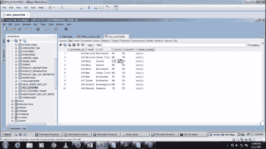

<figcaption id="caption-attachment-38350" class="wp-caption-text">**                            Fig: Modifying values of Mary**</figcaption>

</figure>

<figure id="attachment_38351" aria-describedby="caption-attachment-38351" style="width: 528px" class="wp-caption aligncenter">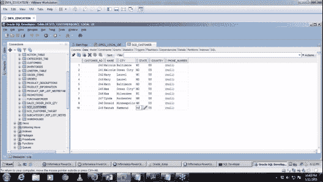

<figcaption id="caption-attachment-38351" class="wp-caption-text">**                                Fig: Modifying values of Hannah**</figcaption>

</figure>

**步骤 11** :启动工作流监控器，执行工作流

<figure id="attachment_38352" aria-describedby="caption-attachment-38352" style="width: 528px" class="wp-caption aligncenter">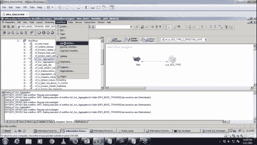

<figcaption id="caption-attachment-38352" class="wp-caption-text">**                                          Fig: Executing workflow**</figcaption>

</figure>

<figure id="attachment_38353" aria-describedby="caption-attachment-38353" style="width: 528px" class="wp-caption aligncenter">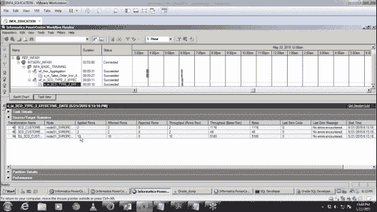

<figcaption id="caption-attachment-38353" class="wp-caption-text">**                                          Fig: Workflow Output**</figcaption>

</figure>

**第十二步:**执行下面的命令，获取目标数据库

*   select * from SCD _ customer _ target

<figure id="attachment_38354" aria-describedby="caption-attachment-38354" style="width: 528px" class="wp-caption aligncenter">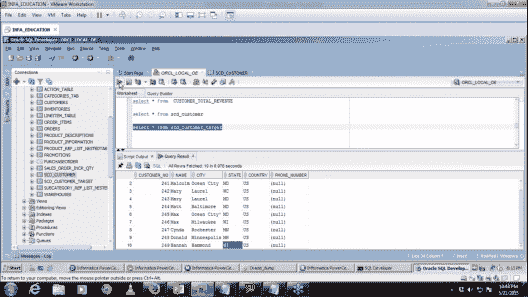

<figcaption id="caption-attachment-38354" class="wp-caption-text">**                          Fig: Executing SQL query for targeted output**</figcaption>

</figure>

**第十三步:**产品尺寸表输出

<figure id="attachment_38358" aria-describedby="caption-attachment-38358" style="width: 528px" class="wp-caption aligncenter">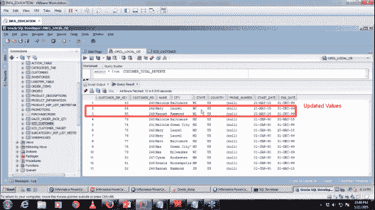

<figcaption id="caption-attachment-38358" class="wp-caption-text">**                                Fig: Product Dimension table Output**</figcaption>

</figure>

总之，加载的产品表包含数据的历史值，包括当前值的变化，这是通过使用 Informatica PowerCenter 获得的。

我希望这个 Informatica 教程博客有助于建立你的 Informatica 基础，并产生足够的兴趣来学习更多的 Informatica 知识。

如果你已经决定以信息学为职业，我会推荐你为什么不看看我们的[信息学培训](https://www.edureka.co/informatica)课程页面。Edureka 的 Informatica 认证培训将通过现场讲师指导课程和使用真实案例的实践培训，使您成为 Informatica 专家。

有问题要问我们吗？请在评论区提到它，我们会给你回复。