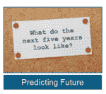
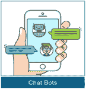
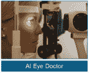
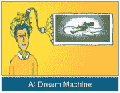
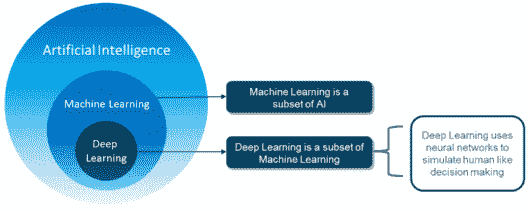
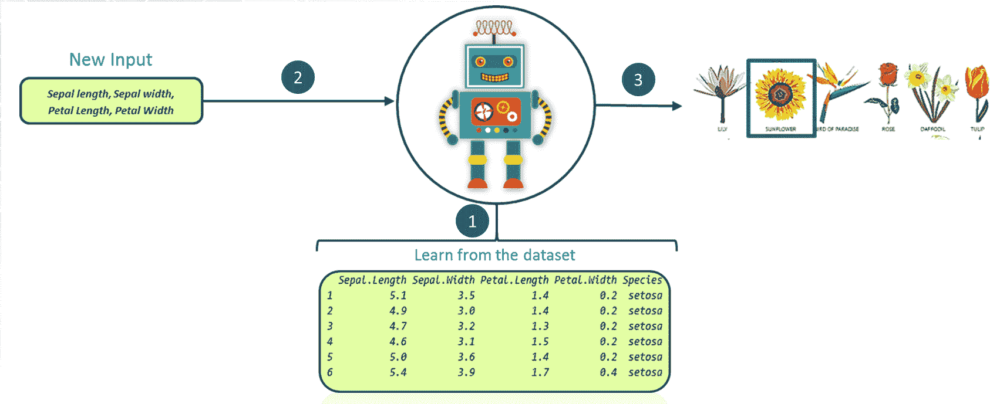
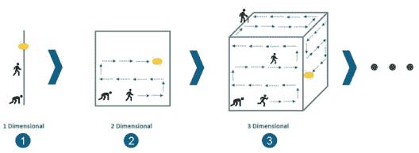
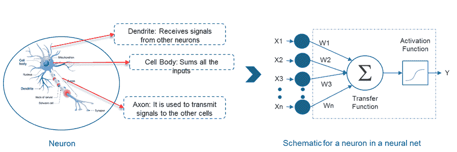
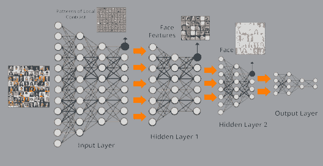

# 深度学习教程:使用深度学习的人工智能

> 原文：<https://www.edureka.co/blog/deep-learning-tutorial>

作为机器学习的一个重要子集，对 ***[深度学习认证](https://www.edureka.co/ai-deep-learning-with-tensorflow)*** 的需求已经大幅上升，尤其是在那些对释放人工智能的无限可能性感兴趣的人中间。受深度学习越来越受欢迎的启发，我想到了一系列博客，这些博客将向你介绍人工智能领域的这一新趋势，并帮助你理解这是怎么回事。这是 as-**深度学习教程**系列众多博客中的第一篇。

## **深度学习教程**

在这个深度学习教程博客中，我将带你经历以下事情，这些事情将作为即将到来的博客的基础:

*   是什么让深度学习产生了
*   什么是深度学习，它是如何工作的？

你可以浏览一下深度学习教程的录音，我们的讲师已经用例子详细解释了这些主题，这将有助于你更好地理解这个概念。

## **深度学习教程|深度学习神经网络|爱德华卡**

[https://www.youtube.com/embed/nl_4WFHQ4LU?rel=0&showinfo=0](https://www.youtube.com/embed/nl_4WFHQ4LU?rel=0&showinfo=0)

## **人工智能的应用&深度学习**

现在想一想，代替你做所有的工作，你有一台机器替你完成，或者它能做一些你认为根本不可能的事情。比如:

|  | **预测未来:**它可以帮助我们预测地震、海啸等。以便能够采取预防措施，拯救许多生命，使其免于落入自然灾害的魔掌。 |

| 聊天机器人:你们都应该听说过 Siri，它是苹果公司的语音控制虚拟助手。相信我，在深度学习的帮助下，这些虚拟援助一天比一天聪明。事实上，Siri 可以根据用户进行自我调整，并提供更好的个性化帮助。 |  |

|  | **自动驾驶汽车:**想象一下，对于身体残疾、难以独立驾驶的老年人来说，这将是多么不可思议的事情。除此之外，它将拯救每年因人为失误而遭遇交通事故的数百万无辜生命。 |

| 谷歌人工智能眼科医生:这是谷歌最近采取的一项举措，他们与印度一家眼科护理连锁店合作开发一种人工智能软件，该软件可以检查视网膜扫描，并识别一种称为糖尿病视网膜病变的疾病，这种疾病可能导致失明。 |  |

|  | **AI 音乐作曲:**嗯，谁想到我们能有一个使用深度学习的 AI 音乐作曲。因此，当我听到下一首最好的音乐是由机器演奏的时候，我不会感到惊讶。 |

| **一台读梦机:**这是我的最爱之一，一台可以用视频什么的形式捕捉你的梦境的机器。到目前为止，我们已经看到了这么多人工智能&深度学习的不现实应用，我毫不惊讶地发现，几年前在日本对三个测试对象进行了尝试，他们能够达到接近 60%的准确率。这是令人难以置信的事情，但却是事实。 |  |

我非常肯定人工智能的一些现实生活应用会让你起鸡皮疙瘩。好了，这为你奠定了基础，现在，我们准备在这个深度学习教程中进一步深入，了解什么是人工智能。

## **什么是人工智能？**

人工智能只不过是机器模仿人类智能行为的能力。人工智能是通过模仿人脑来实现的，通过理解人脑在试图解决问题时是如何思考、学习、决策和工作的。

**例如:**一台下棋的机器，或者一个语音激活的软件，它可以帮助你处理你的 iPhone 中的各种事情，或者一个车牌识别系统，它可以捕捉超速车辆的车牌，并对其进行处理，以提取注册号码并识别车主。在**深度学习**之前，这些都不是很容易实现的。现在，让我们了解人工智能的各种子集。

## **人工智能子集**

到目前为止，你应该听说过很多关于人工智能、机器学习和深度学习的东西。但是，你知道他们三个之间的关系吗？基本上，深度学习是机器学习的一个子领域，机器学习是人工智能的一个子领域，如下图所示:

当我们看到像 ***[AlphaGo](https://en.wikipedia.org/wiki/AlphaGo)*** 这样的东西时，它经常被描绘成深度学习的巨大成功，但它实际上是人工智能和机器学习的几个不同领域的想法的结合。事实上，听到深度神经网络背后的想法并不新鲜，而是可以追溯到 20 世纪 50 年代，你会感到惊讶。然而，由于当今可用的高端资源能力，它变得有可能实际实施。

因此，在这篇深度学习教程博客中，让我们探索机器学习及其局限性。

## **什么是机器学习？**

机器学习是人工智能的一个子集，它为计算机提供了无需显式编程就能学习的能力。在机器学习中，我们不需要像任何其他编程应用一样明确定义所有步骤或条件。相反，机器在一个足够大的训练数据集上接受训练，以创建一个模型，这有助于机器根据其学习做出决策。

**例如:**我们想利用机器学习，根据一朵花的花瓣和萼片长度(一朵花的叶子)来确定它的种类。那么，我们将如何做呢？

|  | 我们将把包含不同花卉及其各自种类的各种特征的花卉数据集输入我们的机器，如上图所示。使用这个输入数据集，机器将创建并训练一个模型，该模型可用于将花分类成不同的类别。 |

|  | 一旦我们的模型被训练，我们将传递一组特征作为模型的输入。 |

|  | 最后，我们的模型将输出新输入数据集中的花卉种类。这个训练机器创建模型并将其用于决策的过程被称为**机器学习**。然而，这个过程有一些限制。 |

## **机器学习的局限性**

机器学习不能处理输入&输出相当大的高维数据。处理和加工这种类型的数据变得非常复杂，而且会耗尽资源。这被称为**维度的诅咒**。为了更简单地理解这一点，让我们考虑下面的图像:

 

|  | 假设有一条 100 码的线，你在这条线上的某个地方丢了一枚硬币。现在，你只要走在这条线上就能很方便地找到硬币。这条线是一个一维实体。 |

|  | 接下来，假设你有一个边长为 100 码的正方形，如上图所示，你又在两者之间的某个地方扔了一枚硬币。现在，很明显，与之前的场景相比，你要花更多的时间来找到方块内的硬币。这个正方形是一个二维实体。 |

|  | 让我们进一步考虑一个边长为 100 码的立方体，你在两者之间的某个地方扔了一枚硬币。现在，这次更难找到硬币了。这个立方体是一个三维实体。 |

因此，你可以观察到复杂度随着维度的增加而增加。 在现实生活中，我们谈论的高维数据有数千个维度，这使得处理起来非常复杂。高维数据很容易在图像处理、自然语言处理、图像翻译等用例中找到。

机器学习无法解决这些用例，因此深度学习来拯救我们。深度学习能够处理高维数据，并且也能够有效地集中于正确的特征。这个过程称为特征提取。现在，让我们在这个深度学习教程中继续前进，了解深度学习是如何工作的。

## **深度学习是如何工作的？**

在试图重新设计人类大脑的过程中，深度学习研究了大脑的基本单元，称为脑细胞或神经元。受神经元的启发，人工神经元或感知器被开发出来。现在，让我们了解生物神经元的功能，以及我们如何在感知器或人工神经元中模仿这种功能:

*   如果我们关注生物神经元的结构，它有用来接收输入的树突。这些输入在细胞体中相加，并通过轴突传递给下一个生物神经元，如上图所示。

*   类似地，感知器接收多个输入，应用各种变换和功能，并提供输出。

*   正如我们知道我们的大脑由多个连接的神经元组成，称为神经网络，我们也可以拥有一个称为感知机的人工神经元网络，以形成深度神经网络。所以，让我们在这个深度学习教程中继续前进，了解深度神经网络是什么样子的。

## **深度学习教程:什么是深度学习？**

*   任何深度神经网络都将由三种类型的层组成:
    *   输入层
    *   隐藏层
    *   输出层

|  | 在上图中，第一层是接收所有输入的输入层，最后一层是提供所需输出的输出层。 |

|  | 这些层之间的所有层称为隐藏层。由于目前可用的高端资源，可以有 n 个隐藏层。 |

|  | 隐藏层的数量和每层中感知器的数量将完全取决于你试图解决的用例。 |

现在你已经有了深度神经网络的图片，让我们在这个深度学习教程中继续前进，以获得深度神经网络如何解决图像识别问题的高级视图。

## **深度学习用例**

我们想用深度网络进行图像识别:

|  | 这里，我们将高维数据传递到输入层。为了匹配输入数据的维度，输入层将包含多个感知器子层，以便它可以使用整个输入。 |

|  | 从输入层接收的输出将包含图案，并且只能根据对比度识别图像的边缘。 |

|  | 该输出将被输入到隐藏层 1，在那里它将能够识别各种面部特征，如眼睛、鼻子、耳朵等。 |

|  | 现在，这将被输入到隐藏层 2，在那里它将能够形成整个脸。然后，第 2 层的输出被发送到输出层。 |

|  | 最后，输出层根据上一层得到的结果进行分类，并预测名称。 |

*我问你一个问题，如果这几层缺了任何一层或者神经网络不够深会怎么样？*简单，我们不能够准确地识别图像。这就是为什么这些用例在深度学习之前这么多年都没有解决方案的原因。为了更进一步，我们将尝试在 MNIST 数据集上应用深度网络。

 

*   Mnist 数据集由 60，000 个训练样本和 10，000 个手写数字图像测试样本组成。这里的任务是训练一个模型，它可以准确地识别图像上出现的数字。

*   为了解决这个用例，将创建一个具有多个隐藏层的深度网络，以逐个像素地处理所有 60，000 幅图像，最终我们将获得一个输出层。
*   输出层将是一个索引为 0 到 9 的数组，其中每个索引对应相应的数字。索引 0 包含数字 0 出现在输入图像上的概率。
*   类似地，具有值 0.1 的索引 2 实际上表示 2 是出现在输入图像上的数字的概率。因此，如果我们看到这个数组中的最高概率是 0.8，它出现在数组的索引 7 处。因此，图像上显示的数字是 7。

## **结论**

伙计们，简而言之，这就是深度学习。在这篇深度学习教程中，我们看到了深度学习的各种应用，了解了它与 AI 和机器学习的关系。然后，我们了解了如何使用感知器或人工神经元基本构件来创建深度神经网络，该网络可以执行复杂的任务，如。最后，我们经历了深度学习的一个用例，其中我们使用深度神经网络执行图像识别，并理解了场景背后发生的所有步骤。如果你想获得深度学习的认证，并在数据科学的同行中获得额外的优势，只需查看[深度学习课程](https://www.edureka.co/ai-deep-learning-with-tensorflow)并获得认证！

现在，在这个深度学习教程系列的下一篇博客中，我们将学习如何使用 TensorFlow 实现一个感知机，这是一个基于 Python 的深度学习库。

***有问题吗？请在评论区提到它，我们会给你回复。或者，在芝加哥参加[深度学习培训](https://www.edureka.co/ai-deep-learning-with-tensorflow-chicago)并获得认证！***