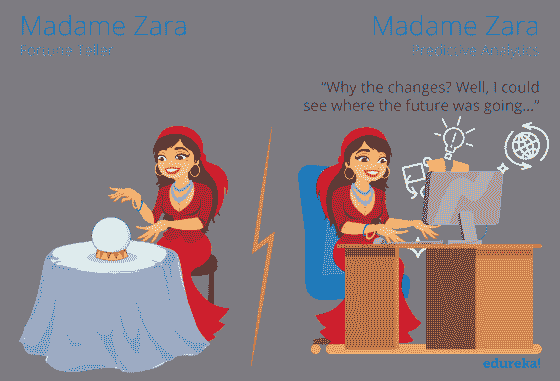
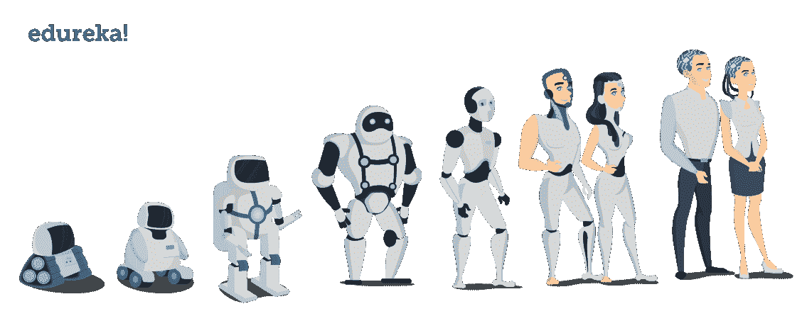
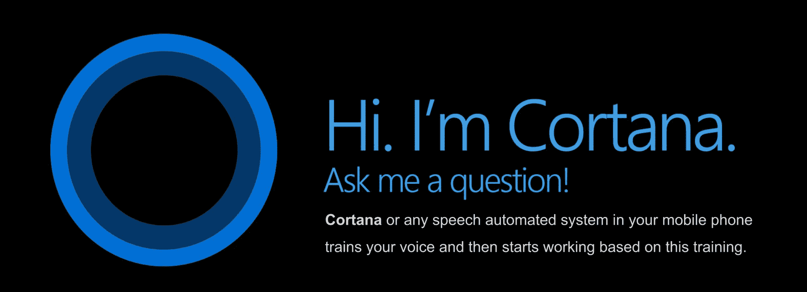
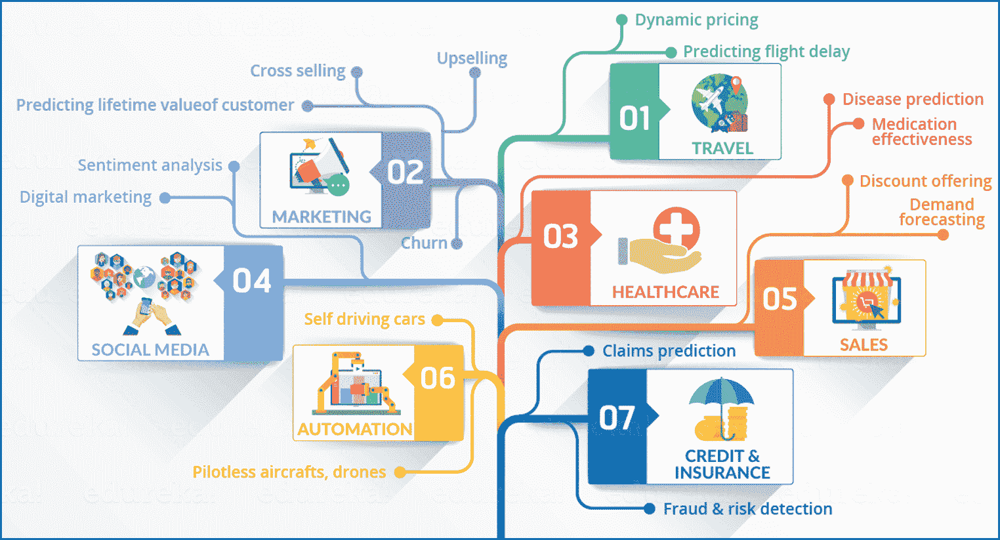

# 什么是机器学习？面向初学者的机器学习

> 原文：<https://www.edureka.co/blog/what-is-machine-learning/>

**什么是机器学习？**嗯，机器学习是一个允许机器从例子和经验中学习的概念，这也不需要显式编程。因此，你要做的不是编写代码，而是向通用算法提供数据，算法/机器根据给定的数据构建逻辑。

这个关于什么是机器学习的博客会让你的理解更加清晰，也会为 *[**机器学习认证**](https://www.edureka.co/machine-learning-certification-training) 培训*打下基础。这个博客将告诉你:

*   [什么是机器学习？](#ML)

*   [进化机器](#EvolutionOfMachines)

*   [机器学习是如何工作的？](#MachineLearningWorking)

*   [什么是监督学习？](#SupervisedLearning)

*   [什么是无监督学习？](#UnsupervisedLearning)

*   [什么是强化学习？](#ReinforcementLearning)

*   [机器学习用例](#MachineLearningUsecase)

## 什么是机器学习？

你曾经在网上购物吗？因此，在查找产品时，您是否注意到它推荐的产品与您正在寻找的产品相似？或者你有没有注意到“买了这个产品的人也买了这个”的产品组合。他们是怎么做这个推荐的？这是机器学习。

你是否曾接到任何银行或金融公司的电话，要求你贷款 或

保险单？你觉得呢，他们会给每个人打电话吗？不，他们只给一些他们认为会购买他们产品的精选客户打电话。他们如何选择？这是目标营销，可以通过聚类来应用。这是机器学习。

**什么是机器学习？**机器学习是人工智能的一个子集，主要专注于从经验中进行机器学习，并根据经验进行预测。

是做什么的？它使计算机或机器能够做出数据驱动的决策，而不是通过显式编程来执行某项任务。这些程序或算法的设计方式是，当暴露于新数据时，它们会随着时间的推移而学习和改进。

## 什么是机器学习——机器的进化

众所周知，我们生活在人类和机器的世界里。人工智能和机器学习使你能够通过[人工智能课程](https://www.edureka.co/executive-programs/machine-learning-and-ai)转变为高技能专业人士。几百万年以来，人类一直在进化，并从他们过去的经历中学习。另一方面，机器和机器人的时代才刚刚开始。你可以这样考虑，目前我们生活在机器的原始时代，而机器的未来是巨大的，超出了我们的想象范围。

在当今世界，这些机器或机器人在开始执行你的指令之前，必须先被编程。但是，如果机器开始根据自己的经验学习，像我们一样工作，像我们一样感觉，做事情比我们更准确，会怎么样呢？这些东西听起来很吸引人，对吧？好吧，记住这只是新时代的开始。

如果您想了解更多关于什么是机器学习的信息，请观看此视频:

## **什么是机器学习？|机器学习基础知识| Edureka**

[https://videoken.com/embed/Pj0neYUp9Tc](https://videoken.com/embed/Pj0neYUp9Tc)[https://videoken.com/embed/Pj0neYUp9Tc](https://videoken.com/embed/Pj0neYUp9Tc)

这个关于“什么是机器学习”的 Edureka 视频介绍了机器学习及其各种类型。

## 机器学习是如何工作的？

使用训练数据集来训练机器学习算法，以创建模型。 当新的输入数据被引入到 ML 算法中时，它在模型的基础上做出预测。

评估预测的准确性，如果准确性是可接受的，则部署机器学习算法。如果精度不可接受，则用扩充的训练数据集反复训练机器学习算法。

这只是一个很高层次的例子，因为涉及到许多因素和其他步骤。

## 机器学习的类型

机器学习被细分为三种类型:

*   *监督学习——训练我！*
***   *无监督学习——我在学习中自给自足****   *强化学习——我的生活我的规则！(点击&试用)*****

## ******什么是监督学习？******

******监督学习是一种，你可以认为学习是由老师指导的。我们有一个充当教师的数据集，它的作用是训练模型或机器。一旦模型得到训练，当新的数据提供给它时，它可以开始作出预测或决定。******

********了解我们在顶级城市的机器学习认证培训课程********

| 印度 | 美国 | 其他国家 |
| [班加罗尔的机器学习课程](https://www.edureka.co/masters-program/machine-learning-engineer-training-bangalore) | [达拉斯的机器学习培训](https://www.edureka.co/masters-program/machine-learning-engineer-training-dallas) | [多伦多的机器学习培训](https://www.edureka.co/machine-learning-certification-training-toronto) |
| [海德拉巴的机器学习课程](https://www.edureka.co/masters-program/machine-learning-engineer-training-hyderabad) | [华盛顿的机器学习培训](https://www.edureka.co/masters-program/machine-learning-engineer-training-washington) | [伦敦的机器学习培训](https://www.edureka.co/machine-learning-certification-training-london) |
| [孟买的机器学习认证](https://www.edureka.co/machine-learning-certification-training-mumbai) | [纽约的机器学习认证](https://www.edureka.co/machine-learning-certification-training-new-york-city) | [迪拜的机器学习课程](https://www.edureka.co/masters-program/machine-learning-engineer-training-dubai) |

## ******什么是无监督学习？******

******模型通过观察学习，并在数据中找到结构。一旦为模型提供了数据集，它就会通过在数据集中创建分类来自动查找数据集中的模式和关系。它不能做的是给聚类添加标签，就像它不能说这是一组苹果或芒果，但它会把所有的苹果和芒果分开。******

******假设我们向模型呈现苹果、香蕉和芒果的图像，那么它会根据一些模式和关系创建聚类，并将数据集分成这些聚类。现在，如果一个新数据被提供给模型，它会将它添加到一个已创建的分类中。******

## ******什么是强化学习？******

******这是一种智能体与环境互动并找出最佳结果的能力。它遵循击中和试验方法的概念。代理人的正确或错误答案会得到一分奖励或惩罚，基于获得的正奖励分，模型会训练自己。并且一旦被训练，它就准备好预测呈现给它的新数据。******

************

## ******机器学习用例******

******滚动图片查看不同的机器学习用途，其中包括人脸检测、 cortana 、网飞推荐系统等等。******

*   ************
*   ************
*   ************
*   ************

******I hope by now you have a proper understanding of What is Machine Learning. If you wanna learn about machine learning in depth, then stay tuned for my next blog on Machine Learning Tutorial.*“Your FUTURE is decided by what you do TODAY, not TOMORROW”*

**兴奋地用数据科学学习 Python，探索机器学习的神奇世界？别担心。我们在 Edureka，为您设计了一个面向行业的 **[机器学习课程](https://www.edureka.co/masters-program/machine-learning-engineer-training)硕士项目**和**终身访问**。在 Edureka 的课程定期更新，充满了现实生活中的使用案例，你可以在行业中应用。不要着急，浏览我们的登录页面、博客、Youtube 视频，进行您的研究，如果您真的对内容感到满意并希望成为数据科学专家，请点击按钮，在 Edureka 的在线直播 Python 与数据科学培训和认证会议中预订您的席位，并向在该领域拥有 10 多年工作经验的专业人士学习。********