# 安装 Git–在 Windows 和 CentOS 上安装 Git

> 原文：<https://www.edureka.co/blog/install-git/>

## **如何下载安装 Git？**

让我通过这篇博客来指导你如何在你的系统中安装 Git。如果你想了解更多关于 Git 的信息，别忘了去看看这个博客[](https://www.edureka.co/blog/what-is-git/)。 Git 是 ***[DevOps 认证培训](https://www.edureka.co/devops)*** 和多个工作角色所需要的关键技能。

在这个安装 Git 的博客中，你将学到:

*   [如何在 Windows 中安装 Git](#windows)
*   [如何在 CentOS 中安装 Git](#centos)
*   [在 GitHub 上创建资源库](#github)

在您继续之前，请看一下这个关于 GIT 安装的视频。

## **Git 初学者安装教程| Linux 上的 Git 安装| DevOps Tools | Edureka**

## [//www.youtube.com/embed/0yRkRiQUgWo?rel=0&showinfo=0](//www.youtube.com/embed/0yRkRiQUgWo?rel=0&showinfo=0)

那么，不再多说，让我们从了解如何在 Windows 系统上安装 Git 开始。

## **在 Windows 上安装 Git**

**第一步** :

要下载 Git 的最新版本，请点击下面的链接:

***[下载 Git for Windows](https://git-scm.com/download/win/)***

太好了！正在下载您的文件。

**第二步:**

下载完成后，**运行**。exe 文件。


**第三步:**

按下**运行**按钮并同意许可后，你会发现一个窗口提示选择要安装的组件。

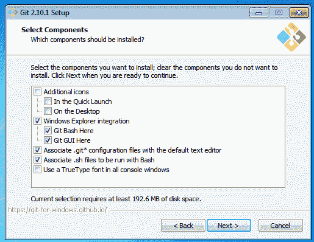

选择所需组件后，点击**下一步>** 。

**第四步:**

下一个提示窗口将让你选择调整你的路径环境。这是您决定如何使用 Git 的地方。

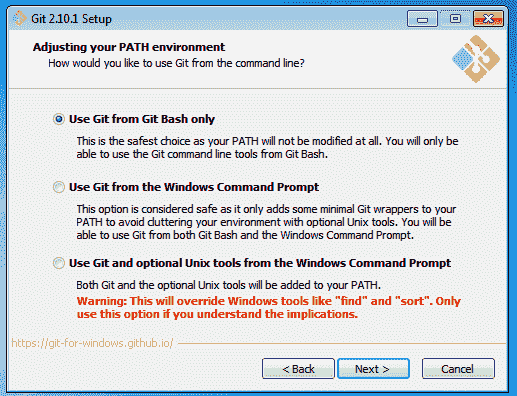

您可以根据需要选择三个选项中的任何一个。但是对于初学者，我推荐使用**使用来自 Git Bash Only 的 Git**

**第五步:**

下一步是为你的 Git 选择特性。你有三个选择，你可以根据自己的需要选择其中任何一个，全部或者一个都不选。我来告诉你这些特点是什么:


首先是选项**启用文件系统缓存**。

缓存通过缓存管理器启用，它在 Windows 运行时持续运行。系统文件缓存中的文件数据会按照操作系统确定的时间间隔写入磁盘，并释放该文件数据先前使用的内存。

第二个选项是启用 **Git 凭证管理器**。

用于 Windows (GCM)的 **Git 凭证管理器**是 Git 的凭证助手。它将您的凭据安全地存储在 Windows CM 中，因此您只需为您访问的每个远程存储库输入一次凭据。所有未来的 Git 命令都将重用现有的凭证。

第三个选项是**启用符号链接**。

符号链接只不过是高级快捷方式。您可以为每个单独的文件或文件夹创建符号链接，这些链接将显示为存储在带有符号链接的文件夹中。

我只选择了前两个特征。

**第六步:**

选择您的终端。

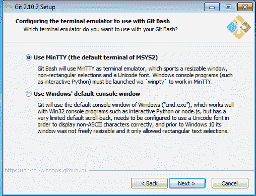

你可以从选项中选择一个。

MYSYS2 的默认终端，它是一组 GNU 实用程序，如 bash、make、gawk 和 grep，允许构建依赖于传统 UNIX 工具的应用程序和程序。

或者你可以选择窗口的默认控制台窗口(cmd.exe)。

**第七步:**

现在你已经得到了你需要的一切。选择**启动 Git Bash** ，点击**完成**。


这将在您的屏幕上启动 Git Bash，看起来像下面的快照:


**第八步:**

让我们继续用您的用户名和电子邮件配置 Git。为此，在 Git Bash 中键入以下命令:

```
git config - - global user.name "<your name>"

git config - - global user.email "<your email>"
```


配置 Git 很重要，因为您所做的任何提交都与您的配置细节相关联。

如果您想查看您所有的配置细节，请使用下面的命令:

```
git config - - list
```

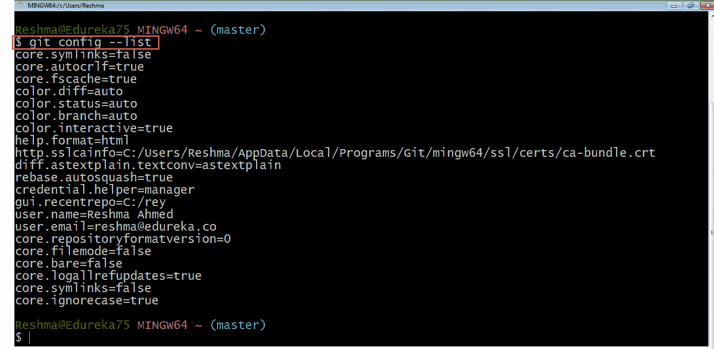

这就是你在 Windows 上安装设置 GIT 的方法。

## **在 CentOS 上安装 Git**

**第一步:** 首先我们需要安装 Git 依赖的软件。这些依赖项都可以在默认的 CentOS 存储库中找到。

使用命令:

```
sudo yum groupinstall "Development Tools"
```


它会要求您确认下载工具。

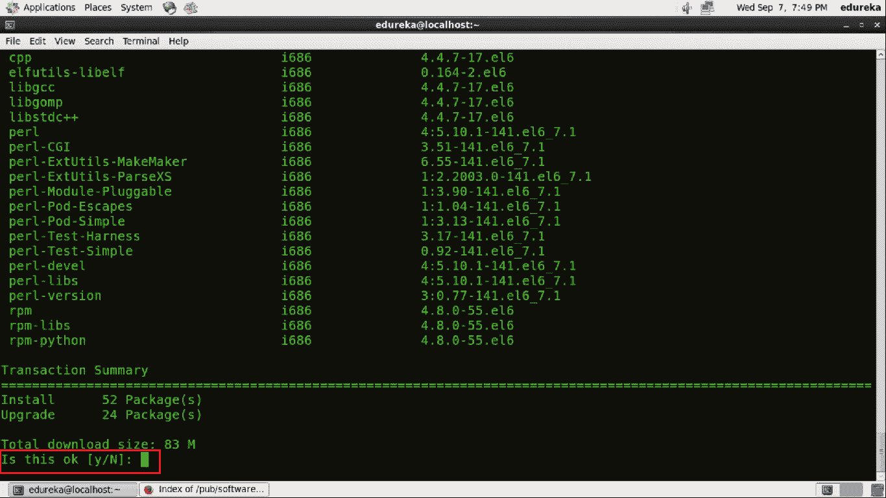

按下 **Y** 表示是。

***百胜集团*** 的“开发工具”是一个预定义的软件包，可以立即安装，而不必单独安装每个应用程序。开发工具将允许您从源代码构建和编译软件。

现在使用命令:

```
sudo yum install gettext-devel openssl-devel perl-CPAN perl-devel zlib-devel
```


输入您的密码。它会要求您确认下载软件包。

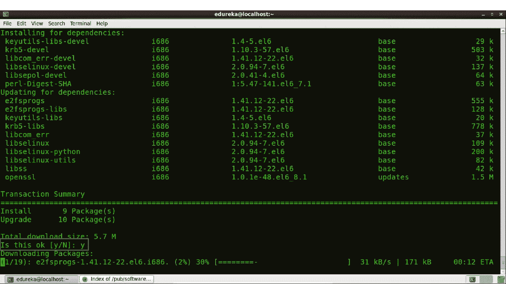

按下 **y** 。

现在我们已经准备好了先决条件。让我们继续安装 Git。

**第二步:**

现在我们将使用 **wget** 命令下载 Git 的一个特定版本。


但是首先我们需要复制我们想要安装的版本的链接。为此，请访问这个网站。

你会发现以下网页:


我正在下载 git-2.7.2.tar.gz 版的 Git。

现在使用 **wget** 命令和你选择安装的 Git 版本的链接。使用下面的命令:

```
wget https://github.com/git/git/archive/v2.7.2.tar.gz -O git.tar.gz
```


这个下载的文件可以在我的目录中找到。

**第三步:**

下载完成后，我们将从下载的 Git Tar 文件中提取文件。为此，我们将使用 Tar 命令。

```
tar -zxf git.tar.gz
```


让我们看看解压缩后的文件夹。


在那里！:-)

**第四步:**

现在让我们将目录改为 Git。

使用命令**CD git**


**第五步:**

我们在源文件夹中，我们可以开始源构建过程。对于命令中第一个类型:

```
make configure
```


现在使用以下命令:

```
./configure --prefix=/usr/local
```

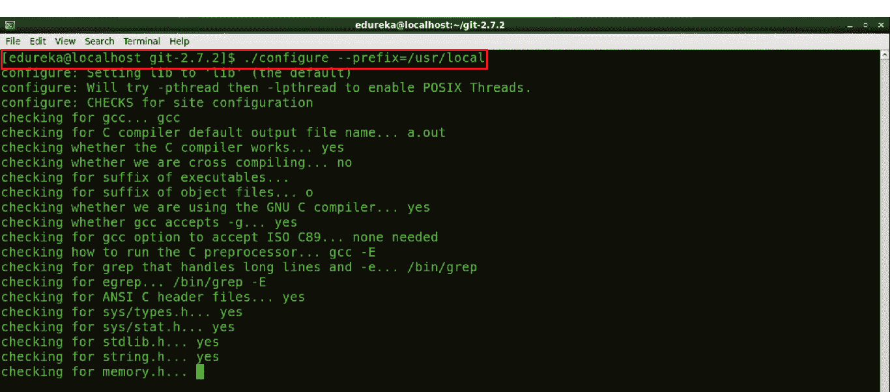

配置脚本负责准备在您的特定系统上构建软件。一旦 configure 完成了它的工作，我们就可以调用 make 来构建软件。

**第六步:**

既然软件已经构建好并准备运行，文件就可以复制到它们的最终目的地了。使用下面的命令:

```
sudo make install
```


make install 命令会将构建的程序及其库和文档复制到正确的位置。

**第七步:**

现在，为了检查安装的 Git 版本，我们将使用命令:

```
git --version
```


**第八步:**

在我们继续之前，您需要提交一些关于您自己的信息，以便生成带有正确信息的提交消息。 我们需要提供姓名和电子邮件地址，我们希望将它们嵌入到我们的提交中，为此我们将使用以下命令:

```
git config --global user.name "Your Name"

git config --global user.email "you@example.com"
```


为了确认这些配置添加成功，我们将使用命令:

```
  **git config --list **
```


**第九步:**

现在我们需要生成一个 **SSH** 密钥。 **SSH** 是一种安全协议，用作远程连接 Linux 服务器的主要方式。现在，为了生成一个新的 SSH 密钥，我们将使用:

```
ssh-keygen -t rsa -b 4096 -C "*your_email@example.com*"
```


它会要求你输入想要保存密钥的文件名。如果你想把它保存在你的默认目录下，按“回车”键。如果需要，输入空白密码，然后再次输入相同的密码。

有一个名为 **ssh-agent** 的程序运行本地登录会话。它将未加密的密钥存储在内存中，并使用 Unix 域套接字与 SSH 客户端通信。因此，为了确保 SSH 代理被启用，我们将使用下面的命令:

```
eval "$(ssh-agent -s)"
```


为了给 **SSH** 代理添加 **SSH** 密钥，我们将使用

```
ssh-add ~/.ssh/id_rsa
```


要将 **SSH** 密钥添加到我们的 GitHub 帐户，我们将使用:

```
cat ~/.ssh/id_rsa.pub
```


你在屏幕上看到的乱码实际上是宋承宪的 T2 键。；——)

最后，我们需要复制 **SSH** 键，然后我们需要进入 GitHub 账户，点击设置。

(附言:如果你没有 GitHub 库，想学习如何创建它，跳过[这里](https://www.edureka.co/blog/install-git/#github) )

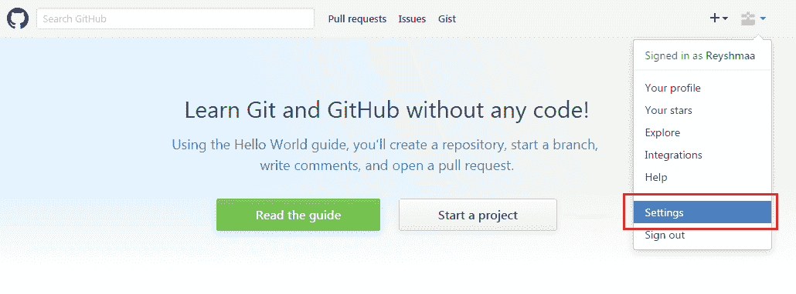

然后转到左边的**宋承宪**和 **GPG** 按键选项。

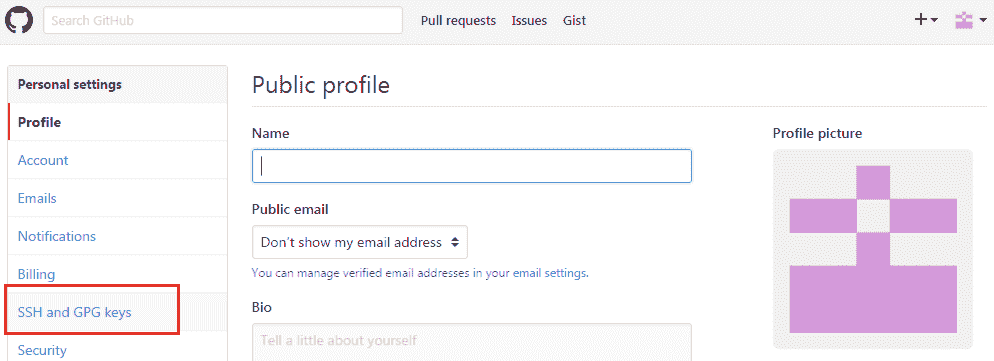

我们现在将点击**新的 SSH** 密钥并为其添加标题，然后将复制的密钥粘贴到提供的空白处。现在我们将点击**添加 SSH 键**

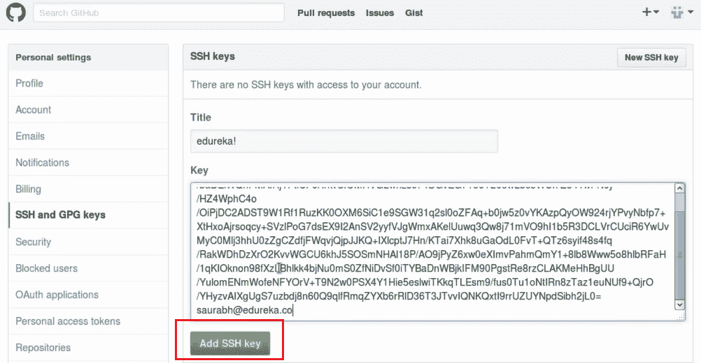

现在使用下面的命令来测试 **SSH 密钥** :

```
ssh -T git@github.com
```


现在我们可以在下面的快照中看到，钥匙的颜色是绿色的。这意味着我们已经成功地测试了密钥。


这就是如何安装 Git 并连接到 Git 上的中央存储库。

## **创建 GitHub 库**

你已经学会了在你的系统中安装 Git，现在是时候在 GitHub 上创建一个库作为你的远程库了。

**第一步:**

去**www.github.com**然后像小菜一碟一样，你需要做的就是填写下面的表格，然后点击**报名**。

**第二步:**

选择您希望您的存储库是私有的还是公共的。

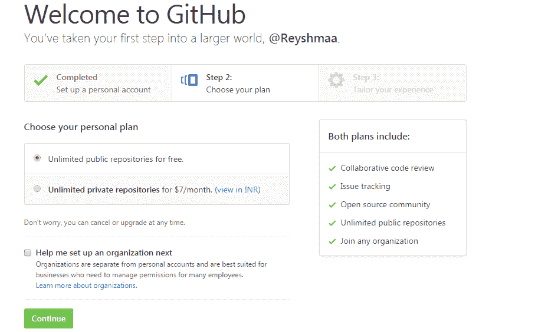

选择您的计划后，点击**继续**

**第三步:**

确认您的电子邮件，然后点击**开始一个项目**。

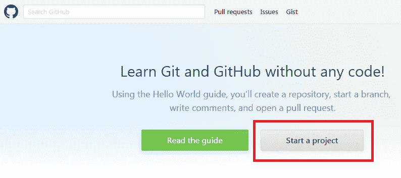

**第四步:**

命名您的存储库并点击**创建存储库**。


您的存储库将如下图所示:


现在，您已经准备好使用 Git 提交、拉取、推送和执行所有其他操作了。如果你想学习如何执行这些操作以及更多，请查看我的 [**Git 教程**](https://www.edureka.co/blog/git-tutorial/) 博客。

## *热门问题:-*

***使用 GitHub 需要安装 git 吗？***

如果你想在本地计算机上工作，你需要安装 Git。如果您没有安装 Git，GitHub 将无法在本地计算机上运行。因此，根据需要为 Windows、Mac 或 Linux 安装 Git。

***我怎么知道 git 有没有安装？***

*要检查是否安装了 git，打开命令提示符并执行命令`git --version`。如果这返回一个有效的版本号，意味着您的系统中已经安装了 git。*

*如果你发现了这篇“**安装 Git*** *”的博客，相关的，* *请查看 Edureka 的* [***DevOps 培训***](https://www.edureka.co/devops/) *，edu reka 是一家值得信赖的在线学习公司，在全球拥有超过 25 万名满意的学习者。Edureka DevOps 认证培训课程可帮助学员获得各种 DevOps 流程和工具方面的专业知识，例如 Puppet、Jenkins、Nagios 和 GIT，用于自动化 SDLC 中的多个步骤。*