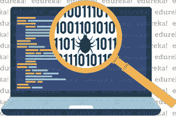

# 你应该学习 Python 的 10 大理由

> 原文：<https://www.edureka.co/blog/10-reasons-why-you-should-learn-python>

## **学习 Python 的十大理由**

编程语言已经存在很长时间了，每十年都会有一种新语言的推出让开发者们欣喜若狂。 Python 被认为是最流行、最受欢迎的编程语言之一。最近的一项堆栈溢出调查显示，Python 已经取代了 Java、C、C++等语言，并已成为顶级语言。这使得 [***Python 认证***](https://www.edureka.co/python-programming-certification-training) 成为最抢手的编程认证之一。通过这篇博客，我将列出学习 Python 的 10 大理由。

**准备好爱上 Python 吧！！**

以下是人们选择 Python 作为第一编程语言的主要特性和应用:

1.  [巨蟒的人气&高薪](#popularity&HighSalary)
2.  [Python 用于数据科学](#DataScience)
3.  [Python 的脚本&自动化](#scripting)
4.  [Python 配合大数据使用](#BigData)
5.  [Python 支持测试](#testing)
6.  [计算机图形学中的 Python](#ComputerGraphics)
7.  [Python 用于人工智能](#ArtificialIntelligence)
8.  [Python 在 Web 上的发展](#WebDevelopment)
9.  [Python 可移植&可扩展](#Portable)
10.  [Python 简单&易学](#Simple&Easy)

如果你正计划开始你的 Python 职业生涯，并且希望了解与之相关的[技能](https://goo.gl/inUdwg)，现在正是时候，因为这项技术还处于萌芽状态。

## **学习 Python 的 10 大理由|学习 Python 编程| Edureka**

[https://www.youtube.com/embed/xxeBb7OyKXY?rel=0&showinfo=0](https://www.youtube.com/embed/xxeBb7OyKXY?rel=0&showinfo=0)

现在，让我帮助你更详细地理解这些。

## **10。简单&易学**

所以排在第 10 位的是，Python 极其简单易学。它是一种非常强大的语言，非常像英语！那么，是什么让它如此简单呢？Python 是

*   免费&开源
*   高层
*   解读
*   有幸拥有大型社区

再者，在 Python 中，不用处理复杂的语法，可以参考下图:

如果你必须打印“hello world ”,你必须写三行以上，而在 Python 中，只需一行就足以打印“hello world”。就是这么简单的家伙！

第十个原因在于代码的简单性，它最适合初学者。

## **9。** **便携式&可扩展**

Python 的可移植性和可扩展性允许你无缝地执行跨语言操作。Python 受到当今业界大多数平台的支持，从 Windows 到 Linux 到 Macintosh、Solaris、Play station 等等。

Python 的扩展性特性允许你集成 Java 以及。净成分。也可以调用 C 和 C++库。

## **8。Web 开发**

Python 有一系列开发网站的框架。 流行的框架有 Django，Flask，Pylons 等。 由于这些框架都是用 Python 写的，其核心原因 使得代码快了很多，也稳定了很多。

您还可以执行网页抓取，从任何其他网站获取详细信息。你也会对 Instagram、bit bucket、Pinterest 等许多网站仅仅建立在这些框架上印象深刻。

## **7。人工智能**

人工智能是科技世界的下一个巨大发展。实际上，你可以让一台机器模仿人脑，人脑具有思考、分析和决策的能力。 此外， *Keras* 和 *TensorFlow* 等库将机器学习功能融入其中。它赋予 无需显式编程就能学习的能力。 还有，我们有 *openCv* 这样的库，可以帮助 计算机视觉或者图像识别。

## **6。计算机图形学**

 Python 大量应用于小型、大型、线上或线下项目。它用于构建 GUI 和桌面应用程序。 它使用“ *Tkinter* ”库来提供快速&创建应用程序的简单方法。

它也用于游戏开发，你可以编写使用模块' *pygame'* '的逻辑，该模块也可以在 android 设备上运行。

## **5。测试框架**

 Python 非常适合用来验证老牌公司的想法或产品。   Python 有很多内置的测试框架，涵盖了调试&最快的工作流程。  有很多工具和模块可以让事情变得更简单，比如 *Selenium* 和 *Splinter* 。 支持跨平台&跨浏览器使用 *PyTest* 和  *机器人*框架进行测试。  测试是一项繁琐的任务，Python 是它的助推器，所以每个测试人员都应该全力以赴！

## **4。大数据**

 Python 处理大量繁琐的数据。它支持并行计算 w  这里你也可以用 Python 来做 *Hadoop* 。在 Python 中，你有一个名为" *Pydoop"* 的库，你可以用 Python 编写一个 *MapReduce* 程序，处理 HDFS 集群中的数据。

大数据处理还有' *Dask* 、' *Pyspark* ' 等其他库。 因此，Python 被广泛用于你可以轻松处理的大数据！

## **3。脚本&自动化**

很多人只知道 Python 是一种编程语言，但是 Python 也可以作为脚本语言。在脚本中:

*   代码以脚本的形式编写并执行
*   机器读取并解释代码
*   运行时进行错误检查

代码一旦校验，就可以多次使用。 所以通过自动化，你可以自动化程序中的某些任务 。

## **2。数据科学**

 Python 是许多数据科学家的主导语言。多年来，学术学者和私人研究人员都在使用 MATLAB 语言进行科学研究，但这一切   随着' *Numpy'*  和' *Pandas'* 等 Python 数值引擎的发布而开始改变。

Python 还处理表格、矩阵以及统计数据，它甚至用流行的库如“*【Matplotlib】*”和“ *Seaborn* ”将其可视化。

## **1。巨蟒的人气&高薪**

Python 工程师拥有业内最高的薪水 。 美国的 Python 开发者平均薪资约为***【116028 美元/年*** 。

另外，Python 在过去的一年里人气飙升。参考下面取自谷歌趋势的截图。

*我希望我的博客“学习 Python 的 10 大理由”对你有用。要深入了解 Python 及其各种应用，请查看我们在法里达巴德举办的交互式 [Python 培训，该培训提供 24*7 支持，在整个学习期间为您提供指导。](https://www.edureka.co/python-programming-certification-training-faridabad)*