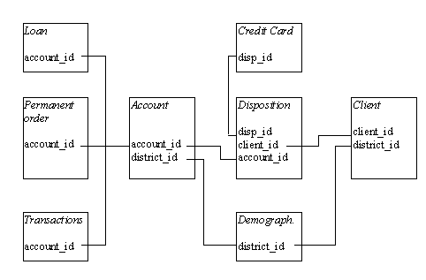

# 在银行领域实施 Hadoop & R 分析技巧

> 原文：<https://www.edureka.co/blog/implementing-hadoop-and-r-analytic-skills-in-banking-domain/>

在这篇博客和接下来的几篇博客中，我们将分析一个银行领域数据集，该数据集包含几个包含其客户详细信息的文件。该数据库由 Petr Berka 和 Marta Sochorova 编制。

Berka 数据集是捷克一家银行的金融信息集合。该数据集处理超过 5，300 家银行客户的大约 1，000，000 笔交易。此外，数据集中表示的银行发放了近 700 笔贷款，发行了近 900 张信用卡，所有这些都在数据中表示。

当你读完这篇博客的时候，你应该已经学会了:

*   如何分析银行数据预测客户质量
*   通过这种分析，我们可以将客户分为三类:

1.  **优秀:**银行记录良好的客户
2.  **良好:**到目前为止收入一般且记录良好的客户
3.  **高风险:**欠银行债务或未按时还款的客户

*   猪 UDF 怎么写
*   如何连接 Hadoop 和 R
*   如何将数据从 Hadoop 加载到 R

**如何分析银行数据预测客户质量**

**先决条件**

软件技术

*   Java 安装的 Hadoop 概念
*   Hadoop 安装的 Java 概念
*   清管器安装清管器概念
*   R-base
*   Rstudio
*   Ubuntu 操作系统

**1。理解数据**

berka 数据集由 Petr Berka 和 Marta Sochorova 编制。在整个分析过程中，我们将该数据集称为 Berka 数据集。Berka 数据集是捷克一家银行的金融信息集合。该数据集处理超过 5，300 家银行客户的大约 1，000，000 笔交易。此外，数据集中表示的银行发放了近 700 笔贷款，发行了近 900 张信用卡，所有这些都在数据中表示。

*   帐户. asc
*   卡片. asc
*   client.asc
*   显示 asc
*   区. asc
*   贷款. asc
*   订单. asc
*   运输 asc



**2。数据清理**

在我们进入分析阶段之前，我们必须了解原始数据。如果原始数据需要格式化，我们可以做预处理来清理它。


在这里，我已经清理了数据，并重新保存为 CSV 文件。

```
 sed 's/"//g' account.asc | sed -e '1d' |sed 's/;/,/g'> acccount.csv
```


同样，我们可以清理其余的数据。

**3。将数据转移到 HDFS**

```
 hadoop dfs -put bank_project /user/abhay
```

**4。写猪猪剧本**

贷款数据:-

仅装载和挑选必填字段

```
loan = load '/user/itsupport/data_berka/loan.csv' using PigStorage(',') ; 
loan_fields = foreach loan generate $1 as ac_id,$0 as loan_id,$3 as amount,$6 as status;
```

根据帐户 Id 分组

```
grp_loan_ac_id = group loan_fields by $0;
```

打破嵌套包以将字段存储为元组

```
grp_loan_ac_id_flatten = foreach grp_loan_ac_id generate FLATTEN(loan_fields);
```

拆卸割台

```
filtered_grp = filter grp_loan_ac_id_flatten by $3 != 'status';
```

将短文件存储回 HDFS

```
store filtered_grp into '/bank_project/loan_required_out' using PigStorage(','); Client data: -
```

注意:出生日期(DOB)信息的格式为 yymm+50dd(女性)yymmdd(男性)

为了根据上述日期格式计算年龄，编写了一个 UDF，其 jar 向 PIG 执行引擎注册。

注册 alljars/pig_age_calculator.jar

仅装载和挑选必填字段

```
client = load '/user/itsupport/data_berka/client.csv' using PigStorage(',') AS (Client_id:int,dob:chararray,dist_id:int) ; 
client_fields = foreach client generate $0 as client_id,$2 as district_id,$1 as birthday_n_sex;
```

根据客户端 id 分组

```
grp_client_id = group client_fields by $0;
```

打破嵌套包以将字段存储为元组

```
grp_client_flat = FOREACH grp_client_id GENERATE FLATTEN(client_fields);
```

拆卸割台

```
B = filter grp_client_flat by $2 != 'birth_number;
```

调用 Java 函数解析日期并找到客户的年龄和性别

```
age = foreach B generate $0,$1, bank.Age_calculator(birthday_n_sex) ; 
 store age into '/bank_project/age_required_out' using PigStorage(',');
```

交易日期

仅装载和挑选必填字段

```
transaction = load '/user/itsupport/data_berka/transaction.csv' using PigStorage(',') as (trans_id:int,ac_id:int,date:chararray,type:chararray,operation:chararray,amount:int,bal:int,k_sym:chararray,bank:int,account:int); 
transaction_fields = foreach transaction generate $1 as ac_id,$2 as date_of_transaction,$3 as transaction_type,$5 as amount,$6 as bal_post_trnsaction;
```

仅挑选过去一年的交易

```
filtered_trans = filter transaction_fields by (int)SUBSTRING($1,0,2) > 97; 
grp_ac = group filtered_trans by $0;
```

总结用户在过去一年中进行的交易

```
MAX_grp_ac = FOREACH grp_ac GENERATE group, SUM(filtered_trans.$3),SUM(filtered_trans.$4); 
store MAX_grp_ac into '/bank_project/transaction_left_bal_required_out' using PigStorage(',');
```

卡详细数据:-

```
 card = load '/user/itsupport/data_berka/card.csv' using PigStorage(',') ;
card_fields = foreach card generate $1 as disposition_id,$2 as card_type; 
 grp_card_disp_id = group card_fields by $0;
 flatten_card = foreach grp_card_disp_id generate FLATTEN(card_fields);
filtered_card = filter flatten_card by card_type != 'type';
store filtered_card into '/bank_project/card_required_out' using PigStorage(',');
```

地区数据:

注册 jar 以计算连续两年 95 和 96 之间的失业差异

```
REGISTER alljars/pig_substractjar.jar 
 district = load '/user/itsupport/data_berka/district.csv' using PigStorage(',') AS (dist_id:int,dist_name:chararray,region:chararray,no_inhabs:long,mun_499:int,mun_1999:int,mun_10k:int,mun_more:int,no_of_cities:int,no_of_urban_inhabs:double
,avg_sal:int,unemp_95:double,unemp_96:double,entre_ratio:int); 
district_fields = foreach district generate $0 as district_id,$1 as district_name,$2 as region,$10 as avg_salary,$11 as unemp_rate_95,$12 as unemp_rate_96,$13 as entrepreneur_per_1000;
 grp_dist_id = group district_fields by $0;
 MAX_grp_dist = FOREACH grp_dist_id GENERATE group,FLATTEN(district_fields);
 B = filter MAX_grp_dist by unemp_rate_95 > 0.0 AND unemp_rate_96 > 0.0;
unem_percentage = foreach B generate $1, district_name,avg_salary,bank.substract(unemp_rate_95,unemp_rate_96),entrepreneur_per_1000 ; 
 store unem_percentage into '/bank_project/district_required_out' using PigStorage(',');
```

处置日期

```
 disposition = load '/user/itsupport/data_berka/disposition.csv' using PigStorage(',') ;
disposition_fields = foreach disposition generate $2 as ac_id,$0 as disposition_id,$3 as disposition_type,$1 as client_id; 
 grp_disposition_disp_id = group disposition_fields by $1;
 flatten_disposition_disp_id = foreach grp_disposition_disp_id generate FLATTEN(disposition_fields);
 filtered_disposition_disp_id = filter flatten_disposition_disp_id by disposition_type != 'type';
```

连接所有数据:-

在我们开始编写脚本之前，我们应该设计应该实现的方法/算法:

*   将 ac_id 上的贷款、交易、帐户、处置作为 ac_id_join 加入
*   将 ac_id_join，district_info，district_id 上的客户端作为 include_district 加入
*   join include_district，disposition_id 上的卡作为 join_done
*   select 贷款 _ 金额，贷款 _ 期限，贷款 _ 状态，类型，交易 _ 金额，日期，所有者 _ 类型，地区 _ 名称，地区，平均 _ 薪金，失业率 _95，失业率 _96，企业家人数/1000，卡类型，生日
*   用于预测优秀、良好和高风险客户的算法:

一年内{

if transaction _ amount>10 lac 和 avg_sal > 10k 和 loan_status=='A' and(年龄> 25 和年龄< =65)

写在一个叫好的文件里的多借可授卡可升级

如果 transaction_amount > 10 lac 和 avg_sal > 6k 和 loan_status=='A '和 loan_status=='C '和(年龄> 25 岁和年龄< =55)和失业率< 0.80

写入一个名为 ok 的文件完成后可以发放更多的贷款完成后可以升级贷款卡

if avg _ sal>6k and loan _ status = = ' B ' and loan _ status = = ' D ' and(年龄>35)and no _ of _ entrepreneur>100

写在一个名为高风险不再贷款卡必须降级的文件中

}

```
Client_age = load '/bank_project/age_required_out' using PigStorage(',') AS (client_id:int,dist_id:int,age:double,sex:chararray);
card_type = load '/bank_project/card_required_out' using PigStorage(',') AS (disp_id:int,type:chararray);
transaction_sum = load '/bank_project/transaction_left_bal_required_out' using PigStorage(',') AS (ac_id:int,trans_sum:long,bal_sum:long);
loan_status = load '/bank_project/loan_required_out' using PigStorage(',') AS (ac_id:int,loan_id:int,amount:int,status:chararray);
district_info = load '/bank_project/district_required_out' using PigStorage(',') AS (district_id:int,dist_name:chararray,avg_sal:int,unemprate:double,entrepreneur:int);
join_disp_client = join filtered_disposition_disp_id by $3,Client_age by $0;
join_disp_client_card = join join_disp_client by $1,card_type by $0;
join_disp_client_card_district = join join_disp_client_card by $5,district_info by $0;
join_disp_client_card_district_trans_loan = join join_disp_client_card_district by $0,transaction_sum by $0,loan_status by $0;
pick_fields = foreach join_disp_client_card_district_trans_loan generate $0 as ac_id,$2 as disp_type,$6 as age,$7 as sex,$9 as card_type,$11 as dist_name,$12 as avg_sal,$13 as unemp_rate,$14 as no_of_entre,$16 as transaction_sum,$20 as loan_amount,$21 as loan_status;
store pick_fields into '/bank_project/combined_out' using PigStorage(',');
Good = filter pick_fields by $9 > 1000000 AND $6 > 10000 AND $11 == 'A' AND (($2 >= 25.0 AND $2 <=65.0));
store Good into '/bank_project/VIP_customer' using PigStorage(',');
Normal = filter pick_fields by $9 < 1000000 AND $9 >150000 AND $6 > 6000 AND ($11=='A' OR $11=='C') AND (($2 <= 55.0) AND ($2 >=25.0)) AND $7 < 0.80;
store Normal into '/bank_project/good_customer' using PigStorage(',');
Risky = filter pick_fields by $6 > 6000 AND ($11 == 'B' OR $11 == 'D')
AND $2 > 35.0 AND $8 > 100; 
store Risky into '/bank_project/risky_customer' using PigStorage(',');
```

现在，我们有三类客户。

银行可以根据他们的业务目标为三个类别准备单独的计划。

在下一篇博客中，我们将分析 Hadoop 的中间输出，即输出文件“/bank_project/combined_out”，并使用 r。

有问题要问我们吗？请在评论区提到它，我们会给你回复。

**相关帖子:**

[聚类-银行-数据-使用-R](https://www.edureka.co/blog/clustering-on-bank-data-using-r/ "clustering-on-bank-data-using-r")

[大数据和 Hadoop 入门](https://www.edureka.co/big-data-and-hadoop "When not to use Hadoop")