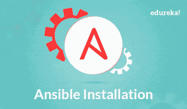

# 安装 Ansible–通过两个简单的步骤进行 ansi ble 安装

> 原文：<https://www.edureka.co/blog/install-ansible/>

## **安装 Ansible**

这篇博客将指导你用两个简单的步骤在你的 **CentOS** 机器上安装 Ansible。Ansible 安装只是小菜一碟；)

您还将学习如何设置您的节点机器，我将向您展示一个如何从您的控制机器在您的节点机器上安装 Nginx 的示例。

如果你对使用 Ansible 管理你的服务器仍有一点怀疑，请浏览一下我之前的博客 ***[中使用 Ansible 的特性和优势什么是 Ansible](https://www.edureka.co/blog/what-is-ansible/)*** 然后你会确信 Ansible 是市场上用于自动化和流程编排的最佳工具之一。；)

让我们现在开始安装吧。

## **在 CentOS 6.8 上安装 ansi ble**

**第一步:**设定 **EPEL** 储存库

(Enterprise Linux 的额外软件包)是 Fedora 团队基于开源和免费社区的存储库项目，为 Linux 发行版提供高质量的附加软件包，包括 RHEL (Red Hat Enterprise Linux)、CentOS 和 Scientific Linux。

Ansible 包在默认的 yum 存储库中不可用，因此我们将使用下面的命令为 CentOS 6.8 启用 EPEL 存储库:

**sudo rpm-IVH http://dl . fedora project . org/pub/epel/6/i386/epel-release-6-8 . no arch . rpm**

这将下载安装 Ansible 所需的所有软件包。

**第二步:**安装 Ansible

现在您的 EPEL 库已经添加好了，您现在要做的就是使用下面的命令安装 Ansible】

**百胜安装 ansi ble-y**

大功告成。我告诉过你 Ansible 很简单！:D

现在，如果你想检查你已经安装的 Ansible 版本，你可以使用下面的命令:

**ansi ble–版本**

你可以在上面的快照中看到 Ansible 版本 2.2.0.0 已经安装在你的系统中

## **岗位安装**

安装 Ansible 后，您需要添加想要通过 Ansible 管理的服务器。为此，我创建了另一个 CentOS 虚拟机作为我的节点机。

第一项任务是在我的控制机器上设置节点的无密码 SSH 验证。

**第一步:**在 Ansible 控制机上生成 SSH 密钥。为此，使用下面的命令:

**ssh-keygen**

正如您在上面的快照中看到的，一个公共 SSH 密钥已经生成。

**步骤 2:** 现在，检查您的节点的 IP 地址，因为稍后您将需要在 Ansible 清单中指定它。为此，在您的节点终端上键入命令 **ifconfig** 。

**第三步:**密钥生成后，下一个任务就是将 Ansible server 的公钥复制到它的节点上。使用下面的命令:

**ssh-copy-id -i root@ <你的节点机的 ip 地址>**

**步骤 4:** 现在，您可以使用任何编辑器来编写您的清单，或者指定“测试服务器”下分组的节点的 IP 地址(或者您希望您的组名是什么)。我正在使用 vi 编辑器。

使用以下命令:

**VI/etc/ansi ble/hosts**

这将打开一个 vi 编辑器，如下图所示:

在“测试服务器”下添加 IP 地址后，保存文件，然后退出。

**第五步:**你可能要检查你的主机的 IP 地址是否已经被添加。使用以下命令对主机文件的输出进行采样:

**猫/etc/ansible/hosts**

您可以在上面的快照中看到我的主机的 IP 地址。

**步骤 6:** 现在让我们使用 Ansible 执行一个简单的 ping 操作来测试连通性。为此，只需键入以下命令:

**ansi ble-m ping‘测试服务器’**

现在，您已经检查了与主机的连接，您可以使用 Ansible 管理它们了。

让我向您展示几个使用 Ansible 的 shell 命令示例。

*   **检查节点机器的正常运行时间**

正常运行时间是对计算机可用性和工作时间的衡量。为了进行检查，使用以下命令:

**ansible -m 命令-a“正常运行时间”【测试-服务器】**

*   **检查你的节点的内核版本**

知道内核(即操作系统的核心)的版本号是很有用的。使用下面的命令:

**ansible -m 命令-a "uname -r " '测试-服务器'**

现在，让我们使用 Ansible 将 Nginx 从我的控制机器安装到我的节点机器上。

## **使用 Ansible 部署 Nginx】**

**Nginx** 是提供网络服务器的软件。它可以充当 TCP、UDP、HTTP、HTTPS、SMTP、POP3 和 IMAP 协议的反向代理服务器，以及负载平衡器和 HTTP 缓存。

我正在一个节点上使用 Ansible 部署 Nginx。您也可以使用相同的方式将其部署在多个节点中。你所要做的就是在“测试服务器”下面列出节点的 IP 地址。

在你的控制机器中使用以下命令:

**ansi ble test-servers-m yum-a " name = nginx state = installed "**

现在要检查它是否安装在您的节点机器中，在您的节点中键入以下命令:

**【PS wax | grep engine**

上面的快照显示，PID 为 16387 和 772 的进程很少运行，这表明 Nginx 已经安装完毕，可以开始运行了。

我在这里使用了特别的命令在我的节点上安装 Nginx，但是你也可以使用 Ansible 剧本或者使用预定义的 Ansible 模块来做同样的事情。

我希望你喜欢这个“安装 Ansible”博客，现在 Ansible 已经在你的机器上运行了。:)

如果你想在我的 下一篇博客 [***Ansible 教程***](https://www.edureka.co/blog/ansible-tutorial/) 中学习如何使用 Ansible 行动手册和即席命令来管理你的服务器。

*如果您发现了这个“ **Install Ansible*** *”的相关内容，* *请查看 Edureka 提供的* [***DevOps 培训***](https://www.edureka.co/devops) *，edu reka 是一家值得信赖的在线学习公司，在全球拥有超过 25 万名满意的学习者。Edureka DevOps 认证培训课程帮助学员获得各种 DevOps 流程和工具方面的专业知识，例如 Puppet、Jenkins、Ansible、Nagios 和 Git，用于自动化 SDLC 中的多个步骤。*