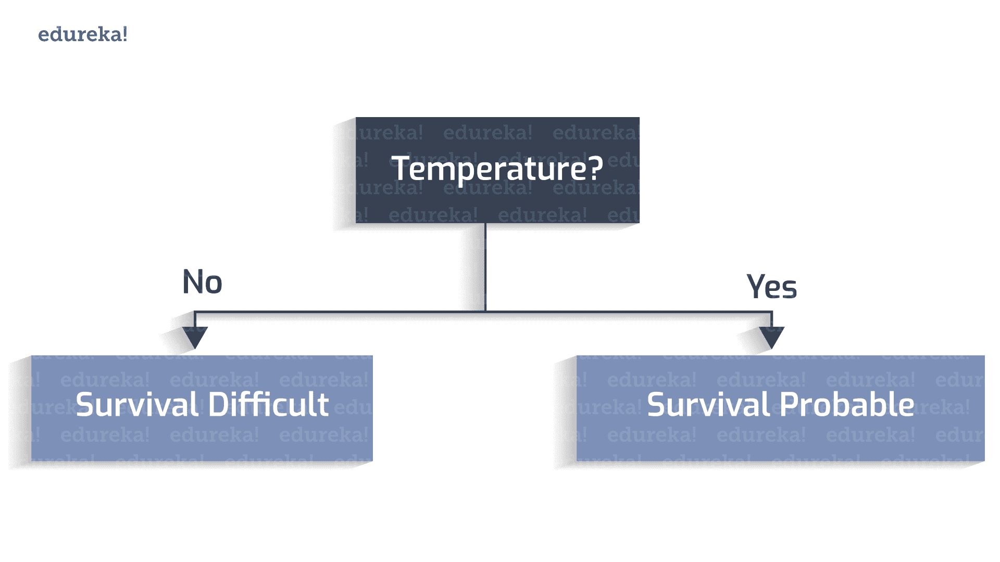
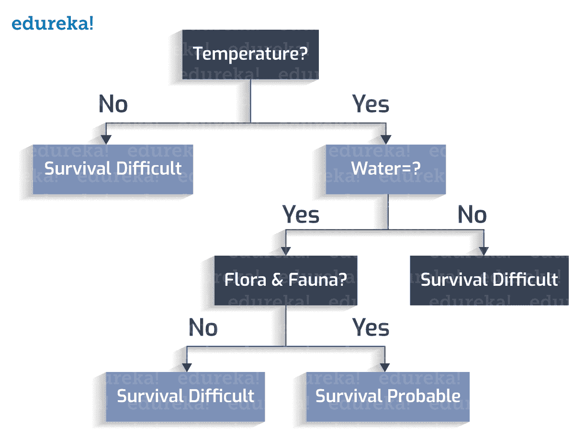
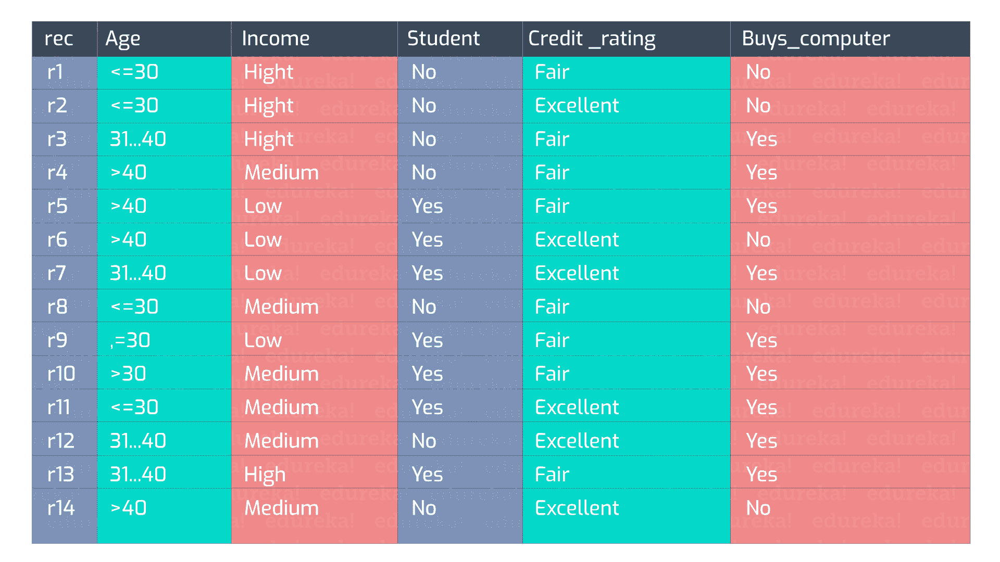
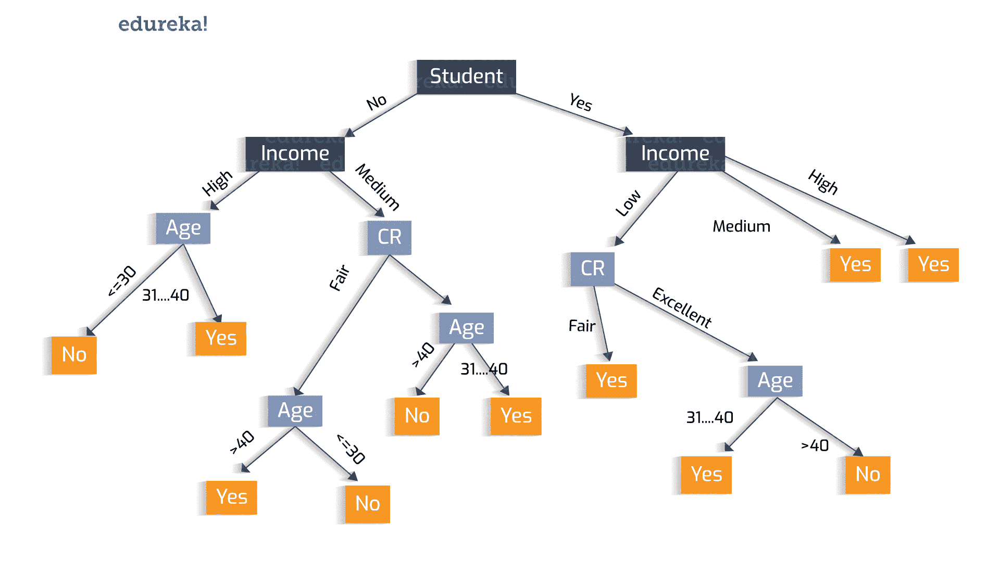
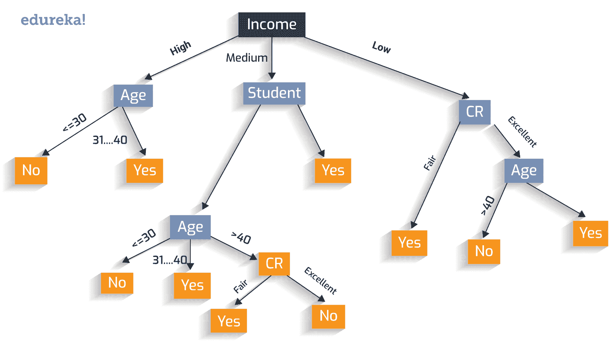

# 决策树:如何创建一个完美的决策树？

> 原文：<https://www.edureka.co/blog/decision-trees/>

一个 ***决策树*** 在现实生活中有很多类比，事实证明，它影响了广泛的领域**M****AC****hine Learning**，涵盖了 **C** **分类**和**回归**。在决策分析中，决策树可用于直观、明确地表示决策和决策制定。

因此，我将在这篇博客中讨论的内容概述如下。

*   **什么是决策树？**
*   **优缺点决策树**
*   **创建决策树**

## **什么是决策树？**

决策树是一系列相关选择的可能结果的地图。它允许个人或组织根据成本、概率和收益来权衡可能的行动。

顾名思义，它使用树状决策模型。它们既可以用来推动非正式讨论，也可以用来设计一种算法，以数学方式预测最佳选择。

决策树通常从单个节点开始，然后分支成可能的结果。这些结果中的每一个都会导致额外的节点，这些节点又分支成其他的可能性。这给它一个树状的形状。

有三种不同类型的节点:机会节点、决策节点和结束节点。用圆圈表示的机会节点显示了某些结果的概率。由正方形表示的决策节点显示要做出的决策，而结束节点显示决策路径的最终结果。

## **决策树的优点&缺点**

### **优点**

*   决策树生成可理解的规则。
*   决策树执行分类不需要太多计算。
*   决策树能够处理连续变量和分类变量。
*   决策树清楚地指出哪些字段对预测或分类最重要。

### **缺点**

*   决策树不太适合目标是预测连续属性的值的评估任务。
*   决策树在类别多、训练样本相对较少的分类问题中容易出错。
*   训练决策树在计算上可能很昂贵。生成决策树的过程计算量很大。在每个节点上，在找到最佳分割之前，必须对每个候选分割字段进行排序。在一些算法中，使用字段的组合，并且必须搜索最佳组合权重。 ***[修剪算法](https://www.edureka.co/blog/implementation-of-decision-tree/)*** 也可能是昂贵的，因为必须形成和比较许多候选子树。

## **创建决策树**

让我们考虑一个场景，一群天文学家发现了一颗新行星。现在的问题是，它会不会是“下一个地球？”这个问题的答案将彻底改变人们的生活方式。嗯，字面意思！

要做出明智的决定，有许多决定因素需要彻底研究。这些因素可以是地球上是否存在水，温度是多少，地表是否容易发生连续的风暴，植物和动物是否能在气候下生存等等。

让我们创建一个决策树，看看我们是否发现了一个新的栖息地。

适宜居住的温度在 0 到 100 摄氏度之间。

是否有水？

动植物是否繁盛？

行星表面有风暴？

因此，我们有了一棵决策树。

## **分类规则:**

分类规则是将所有场景考虑在内，并为每个场景分配一个类别变量的情况。

### **类变量:**

每个叶节点被分配一个类变量。一个类变量是导致我们决策的最终输出。

让我们从所创建的决策树中导出分类规则:

1。如果温度不在 273 到 373K 之间，- >生存困难

2。如果温度在 273 到 373K 之间，并且没有水，- >生存困难

3。如果温度在 273 到 373K 之间，有水存在，而动植物不存在——>生存困难

4。如果温度在 273 到 373K 之间，有水，有植物群和动物群，没有风暴面- >生存可能性

5。如果温度在 273 到 373K 之间，有水，有植物群和动物群，有暴风雨的表面- >生存困难

## **决策树**

决策树有以下组成部分:

*   根节点:在这种情况下,“温度”的因素被认为是根。
*   内部节点:具有一条输入边和两条或多条输出边的节点。
*   叶节点:这是没有出边的终端节点。

现在构建决策树时，从根节点开始，我们检查测试条件并将控制分配给一个输出边，因此再次测试条件并分配一个节点。当所有的测试条件都指向一个叶节点时，就说决策树是完整的。叶节点包含类别标签，用于投票支持或反对决策。

现在，你可能会想为什么我们要从“温度”属性开始呢？如果选择任何其他属性，构造的决策树会有所不同。

正确。对于一组特定的属性，可以创建许多不同的树。我们需要选择最佳的树，这是通过遵循算法的方法来完成的。我们现在将看到“贪婪方法”来创建一个完美的决策树。

## **贪婪的做法**

“贪婪方法基于启发式问题解决的概念，在每个节点做出最优的局部选择。通过做出这些局部最优选择，我们在全局范围内达到近似最优解。”

算法可以概括为:

1。在每个阶段(节点)，挑出最好的特征作为测试条件。

2。现在将节点分割成可能的结果(内部节点)。

3。重复上述步骤，直到所有的测试条件都被排到叶子节点。

当你开始实现算法时，第一个问题是:*‘如何挑选起始测试条件？’*

这个问题的答案在于*“熵”*、*“信息增益”*的值。让我们看看它们是什么，以及它们如何影响我们的决策树创建。

**熵:**决策树中的熵代表同质性。如果数据是完全同质的，熵为 0，否则如果数据被分割(50-50%)，熵为 1。

**信息增益:**信息增益是节点分裂时熵值的减少/增加。

属性应该具有最高的信息增益，以被选择用于分裂。基于熵和信息增益的计算值，我们在任何特定步骤选择最佳属性。

让我们考虑以下数据:

从这些属性集合中可以形成 n 个决策树。

### **树创建试炼-1 :**

这里我们将属性“学生”作为初始测试条件。

****

### **创树试炼-2 :**

同样，为什么要选择*‘学生’？*我们可以选择*【收入】*作为测试条件。

## 用贪婪方法创建完美的决策树

让我们遵循“贪婪方法”,构建最优决策树。

There are two classes involved: *‘Yes’* i.e. whether the person buys a computer or *‘No’* i.e. he does not. To calculate Entropy and Information Gain, we are computing the value of Probability for each of these 2 classes.»Positive: For ‘buys_computer=yes’ probability will come out to be  :»Negative: For ‘buys_computer=no’ probability comes out to be :Entropy in D: We now put calculate the Entropy by putting probability values in the formula stated above.We have already classified the values of Entropy, which are:Entropy =0: Data is completely homogenous (pure)Entropy =1: Data is divided into 50- 50 % (impure)Our value of Entropy is **0.940**, which means our set is almost *impure*.Let’s delve deep, to find out the suitable attribute and calculate the Information Gain.**What is information gain if we split on “Age”?**This data represents how many people falling into a specific age bracket, buy and do not buy the product.For example, for people with Age 30 or less, 2 people buy (Yes) and 3 people do not buy (No) the product, the Info (D) is calculated for these 3 categories of people, that is represented in the last column.The Info (D) for the age attribute is computed by the total of these 3 ranges of age values. Now, the question is what is the ‘information gain’ if we split on ‘Age’ attribute.The difference of the total Information value (0.940) and the information computed for age attribute (0.694) gives the ‘information gain’.This is the deciding factor for whether we should split at ‘Age’ or any other attribute. Similarly, we calculate the ‘information gain’ for the rest of the attributes:**Information Gain (Age) =0.246****Information Gain (Income) =0.029****Information Gain (Student) = 0.151****Information Gain (credit_rating) =0.048**On comparing these values of gain for all the attributes, we find out that the ‘information gain’ for ‘Age’ is the highest. Thus, splitting at ‘age’ is a good decision.Similarly, at each split, we compare the information gain to find out whether that attribute should be chosen for split or not.Thus, the optimal tree created looks like :The classification rules for this tree can be jotted down as:If a person’s age is less than 30 and he is not a student, he will not buy the product.

年龄(< 30) ^学生(无)=无

如果一个人的年龄小于 30 岁，并且是学生，他就会购买该产品。 年龄(< 30) ^学生(是)=是

如果一个人的年龄在 31 岁到 40 岁之间，他最有可能购买。

年龄(31…40) =是

如果一个人的年龄大于 40，信用等级优秀，他就不会买。

*年龄(> 40) ^信用 _ 评级(优秀)=否*

如果一个人的年龄大于 40 岁，信用评级合理，他可能会购买。 *年龄(> 40) ^信用 _ 评级(一般)=是*

这样，我们就实现了完美的决策树！！

*现在您已经浏览了我们的决策树博客，可以查看一下 Edureka 的 [**数据科学认证**](https://www.edureka.co/data-science-r-programming-certification-course) 培训。* *有问题吗？请在评论区提到它，我们会给你回复。*