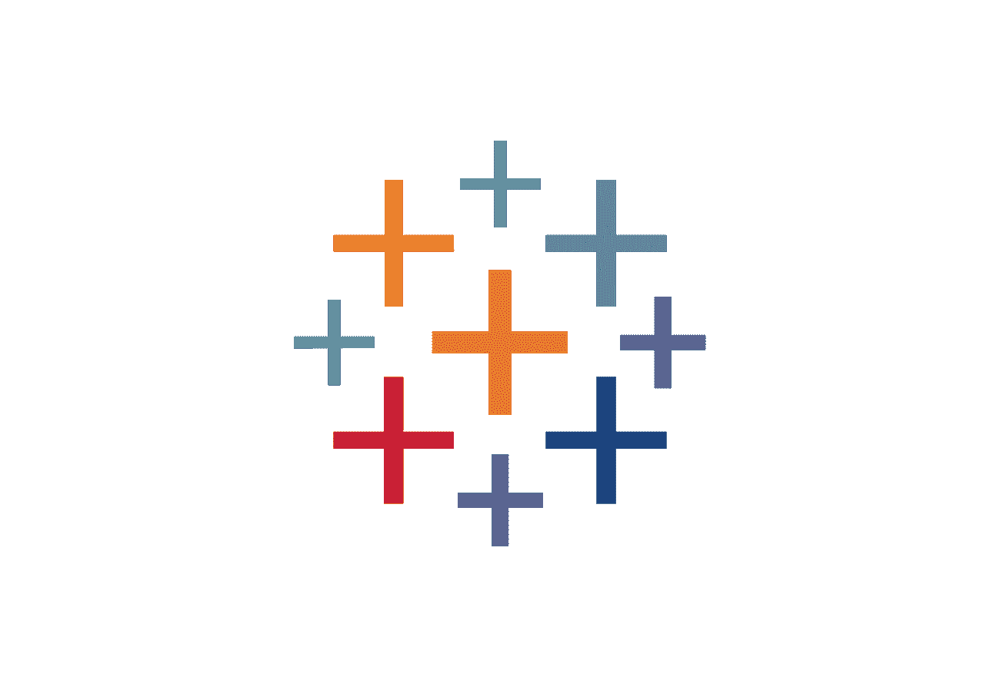
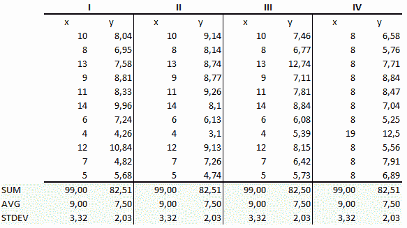
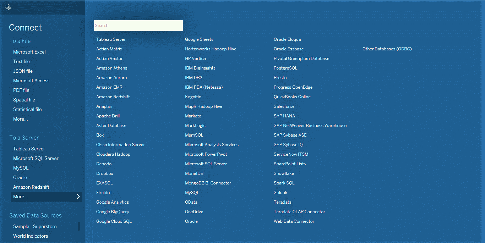
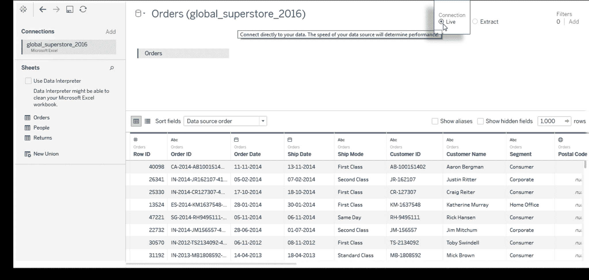
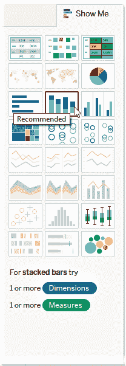
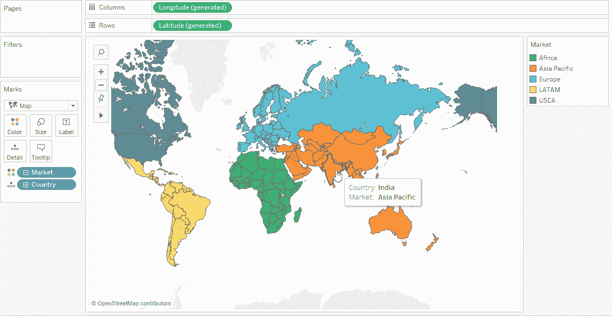
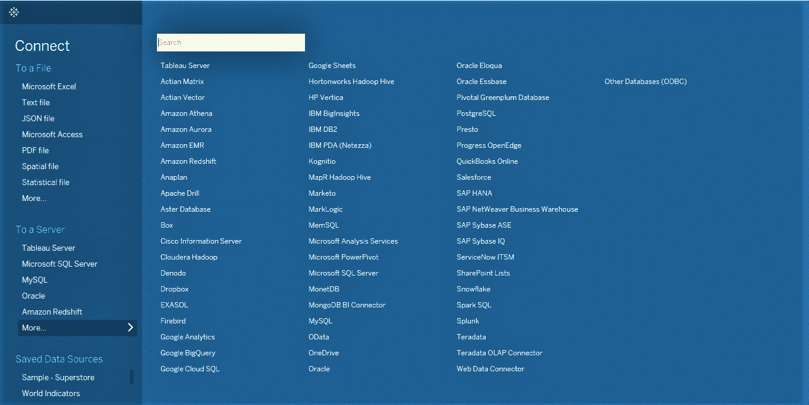
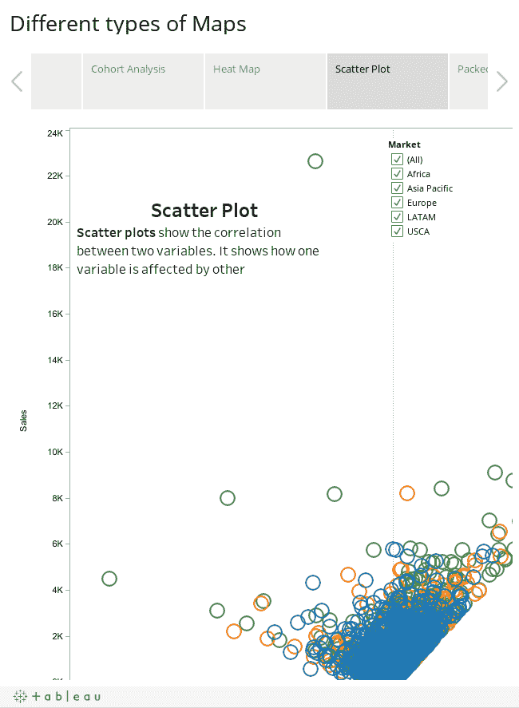

# 什么是 Tableau？使用 Tableau 可视化数据

> 原文：<https://www.edureka.co/blog/what-is-tableau/>

## 什么是 Tableau？

“Tableau 是一款趋势和市场领先的商业智能工具，用于以易于理解的格式可视化和分析您的数据。它允许您处理实时数据集，并将更多时间用于数据分析，而不是数据争论。”这只是一个画面的概述，让我们继续了解什么是画面。

## 用 Tableau 实现数据可视化

这篇博客是 edureka 的 Tableau 教程博客系列的第一篇。 [Tableau 认证](https://www.edureka.co/tableau-certification-training)是数据可视化中最抢手的技能之一。 博客系列的这一部分**“什么是 Tableau？”**，我将向您解释什么是 tableau 以及如何使用它，从而向您展示使用 Tableau 进行数据可视化的真正威力。

[1。数据可视化的力量:安斯科姆的四重奏T3](#DataVisualization)

[2。但是为什么是 Tableau？](#whyTableau)

[3。与 Tableau 建立连接](#EstablishingConnection)

4。桌面 UI 表

[5。了解 Tableau 的用户界面及其术语](#UnderstandingTableauUI)

[6。在画面中创建可视化](#TableauGraphs)

## 数据可视化的力量:安斯科姆的四重奏

这个安斯科姆四重奏的例子将向你展示数据可视化的威力。

现在你会问“安斯康贝的四重奏是什么？”

嗯，安斯科姆的四重奏由四个数据集组成，它们具有几乎相同的简单描述性统计数据，但在绘制时却显得非常不同。每个数据集由十一个(x，y)点组成。

在下图中，你会注意到每个数据集中的数据点非常相似，但是当你为它们创建一个图表时，每个数据集都有自己的可视化。

## 但是为什么是 Tableau？

#### [访问多个数据连接](#1516060395199-d6513ffd-e94a)

*Tableau 可以轻松连接到几乎任何数据源，无论是企业数据仓库、Microsoft Excel 还是基于网络的数据*

**

#### *[现场分析](#1516060395201-9240de14-5c9a)*

**Tableau 允许您连接并分析实时数据。**

****

#### **[ShowMe](#1516060728960-ec4dee5f-e133)**

***Tableau 在推荐使用哪种可视化技术方面非常出色。“示范”突出显示最适合数据中字段类型(属性)的视图类型(图表)。***

******

#### ***[地图](#1516061824639-3223428e-ce22)***

***与其他商业智能工具不同，在 Tableau 中使用地图非常简单。您可以轻松地从 ShowMe 列表中选择它。***

******

## ***建立连接***

******

***使用 Tableau，从文件和服务器连接到不同的数据源。你可以处理各种文件格式，如 CSV、JSON、TXT，甚至可以从 Tableau Server、MySQL、Amazon Redshift &等服务器导入数据。***

******

## ***桌面 UI 表***

***既然我们已经与 Tableau 建立了联系，现在轮到了解 Tableau 的用户界面，并了解来自度量和维度(在数据窗格下)的字段如何在创建可视化中发挥重要作用。您还将了解页面架、过滤器架和标记卡。***

******

## ***理解 Tableau 的用户界面及其术语***

******

## ***措施***

***度量是可以度量、聚合或用于不同计算目的的字段。它可以帮助您回答与业务相关的问题。通常，包含数值的字段放在度量下。***

*****Ex:折扣、利润、销售额等*****

## ***尺寸***

***维度由那些不能聚合的值组成。它用于对事实进行分类。***

*****Ex:类别、国家、城市等*****

******

## ***页面架***

***Page Shelf 允许您根据字段中包含的单个值来分析数据。它创建了一组页面，每个页面上有不同的视图。***

******

## ***过滤器架***

***过滤器架允许你从你的视图中添加或删除数据。您可以将数据窗格中的维和度量添加到过滤器架中，以过滤您的数据。过滤后，字段将显示在过滤器架上。***

******

## ***行/列货架***

***使用行列搁板添加维度和度量完成可视化。行作为 X 轴，列作为 Y 轴。***

******

## ***标记卡片架***

***标记架是 Tableau 中的一个区域，您可以在其中拖动字段来设置标记属性。它通过设置颜色、大小、标签、细节、路径或形状来帮助你增强视觉效果。***

******

******

## ***用 Tableau 创建可视化***

***我想现在你已经很熟悉 Tableau 的术语了。让我们继续前进，探索一些您可以在 Tableau 中轻松创建的可视化。以下是一个交互式可视化，您可以在其中探索不同类型的图表，包括:**条形图、热图、散点图、填充气泡图**和其他一些图表。***

***<object class="tableauViz" style="display: none;" width="300" height="150" data-mce-fragment="1"><param name="host_url" value="https%3A%2F%2Fpublic.tableau.com%2F"><param name="embed_code_version" value="3"><param name="site_root" value=""><param name="name" value="DifferentTypesofMaps/DifferentTypesOfMaps"><param name="tabs" value="no"><param name="toolbar" value="yes"><param name="static_image" value="https://public.tableau.com/statimg/Di/DifferentTypesofMaps/DifferentTypesOfMaps/1.png"><param name="animate_transition" value="yes"><param name="display_static_image" value="yes"><param name="display_spinner" value="yes"><param name="display_overlay" value="yes"><param name="display_count" value="yes"><param name="filter" value="publish=yes"></object>***

***我希望你对“什么是画面”有一个公平的概念从这个博客。还在渴求更多的知识？不要担心下一篇关于 [Tableau 教程](https://www.edureka.co/blog/tableau-tutorial/)的博客会让你更好地理解这个工具。我将在博客中展示许多现实生活中的场景。***

***如果您有兴趣获得 Tableau 认证，请点击下面的按钮，了解更多关于使用 Tableau 培训和 Edureka 认证的数据可视化的信息。你也可以订阅我们的 [YouTube](https://www.youtube.com/playlist?list=PL9ooVrP1hQOH7ni13w776zP_X9ny3Eksv) 频道，从 Edureka 获取更多免费内容。***

***[Get Tableau Certification](https://www.edureka.co/tableau-training-for-data-visualization)***