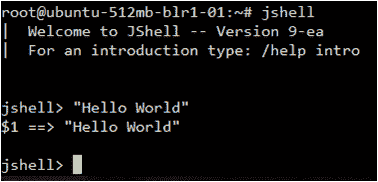

# Java 9 的特性和改进

> 原文：<https://www.edureka.co/blog/java-9-features/>

Java 9 和 Java 9 特性的发布是 Java 生态系统的一个里程碑。跟上新发布的版本对于保持技术的更新是很重要的，理解引入的东西背后的需求将使你更接近你的 ***[Java，J2EE & SOA 认证](https://www.edureka.co/java-j2ee-soa-training)*** 。在 Jigsaw 项目下开发的模块化框架将成为此次 Java SE 发布的一部分，其中的主要特性包括 JShell (REPL 工具)、重要的 API 更改和 JVM 级别的更改，以提高 JVM 的性能和可调试性。

在我们详细解释 Java 9 的特性之前，让我们看一下以前的 Java 版本，看看有什么缺点，Java 9 是如何帮助克服这些异常的:-

*   Java 标准版平台和 JDK 不适用于小型计算设备
*   JDK 没有全面的安全和维护
*   应用程序性能没有整体提升
*   对于 Java 开发人员来说，为 Java SE 和 EE 平台构建和维护代码库和更大的应用程序是很困难的

在这篇博文中，我将按照以下方式对 Java 9 特性进行分类:

1.  [Java 9 中的进程 API 更新](#ProcessAPIupdatesinJava9)
2.  [Java 中的 HTTP/2 客户端 9](#HTTP/2clientinJava9)
3.  [Java 9 中的 Java Shell 脚本(Read-Eval-Print-Loop)](#JavaShellScripting(Read-Eval-Print-Loop)inJava9)
4.  [Java 9 中的多释放 JAR 文件特性](#Multi-releaseJARfilesfeatureinJava9)
5.  [Java 9 中更多的并发更新特性](#MoreConcurrencyUpdatesfeatureinJava9)
6.  [项目拼图 Java 9](#ProjectJigsawinJava9)

## **Java 9 有什么新功能？**

我挑选了几个 Java 9 的新特性，我觉得值得了解一下。让我们看看这些特征是什么:-

## **Java 9 中的进程 API 更新**

Java 的流程 API 非常原始，只支持启动新流程，重定向流程输出和错误流。在此版本中，流程 API 的更新支持以下功能:

*   获取当前 JVM 进程和 JVM 产生的任何其他进程的 PID
*   枚举系统中运行的进程，获取 PID、名称、资源使用等信息
*   管理流程树
*   管理子流程

让我们看一个示例代码，它打印当前的 PID 以及当前的进程信息:

```

public class NewFeatures{

      public static void main(String [] args) {

            ProcessHandle currentProcess = ProcessHandle.current();

            System.out.println("PID:"+ currentProcess.getPid());

            ProcessHandle.Info currentProcessInfo = currentProcess.info();

      System.out.println("Info:" + currentProcessInfo);
}

```

## **Java 中的 HTTP/2 客户端 9**

Java 9 的这一特性预计会在后续版本中有所改变，甚至可能会被完全删除。

更早的 开发者经常求助于使用第三方库，比如 Apache HTTP、Jersey 等等。除此之外，Java 的 HTTP API 早于 HTTP/1.1 规范，并且是同步的，难以维护。这些限制要求添加新的 API。新的 HTTP 客户端 API 提供了以下功能:

*   一个简单简洁的 API 来处理大多数 HTTP 请求
*   支持 HTTP/2 规范
*   更好的性能
*   更好的安全性
*   更多增强功能

让我们看一个使用新 API 发出 HTTP GET 请求的示例代码。下面是 module-info.java 文件中定义的模块定义:

```

module newfeatures{
       requires jdk.incubator.httpclient;
   }

```

下面的代码使用了 HTTP 客户端 API，它是 jdk.incubator.httpclient 模块的一部分:

```
import jdk.incubator.http.*;
import java.net.URI;
public class Http2Feature{
     public static void main(String[] args) throws Exception{
       HttpClient client = HttpClient.newBuilder().build();
       HttpRequest request = HttpRequest
.newBuilder(new URI(http://httpbin.org/get;))
.GET()
.version(HttpClient.Version.HTTP_1_1)
.build();
HttpResponse.String response = client.send(request,
HttpResponse.BodyHandler.asString());
System.out.println("Status code:" + response.statusCode());</pre>
<pre>System.out.println("Response Body:" + response.body());
                       }
          }
}

```

## **Java 9 中的 Java Shell 脚本(Read-Eval-Print-Loop)**

你一定见过一些语言，比如 Ruby、Scala、Groovy、Clojure 以及其他自带工具的语言，这些工具通常被称为**REPL**(**Read-Eval-Print-Loop**)。这个 REPL 工具在尝试语言特性时非常有用。比如在 Scala 中，我们可以写一个简单的 Hello World 程序为**Scala>println(" Hello World ")；**

JShell REPL 的一些优点如下:

*   有经验的开发人员可以在他们的主要代码库中采用它之前，快速进行原型设计和实验
*   Java 开发者现在可以拥有一个 REPL 了

让我们运行 JShell 命令，如下图所示:



## **Java 9 中的多释放 JAR 文件特性**

到目前为止，JAR 文件可以包含只能在 Java 版本上运行的类。为了在新版本上利用 Java 平台的新特性，库开发人员必须发布他们的库的新版本。很快，将会有多个版本的库被开发人员维护，这可能是一场噩梦。为了克服这个限制，多版本 JAR 文件的这些 Java 9 特性允许开发人员为不同的 Java 版本构建具有不同版本的类文件的 JAR 文件。下面的例子更清楚地说明了这一点。

下面是当前 JAR 文件的图示:

```
jar root 

    - A.class

    - B.class 

    - C.class
```

以下是多版本 JAR 文件的外观:

```
jar root 

     - A.class 

     - B.class 

     - C.class 

     - META-INF  

- versions 

             - 9  

                - A.class  

            - 10 

                - B.class
```

在上图中，JAR 文件支持两个 Java 版本——9 和 10——的类文件。

因此，当在 Java 9 上执行早期的 JAR 时，versions–9 文件夹下的 A.class 被挑选出来执行。

在不支持多版本 JAR 文件的平台上，永远不会使用 versions 目录下的类。因此，如果您在 Java 8 上运行多版本 JAR 文件，它与运行简单的 JAR 文件一样好。

## **Java 9 中更多并发更新功能**

在这次更新中，引入了一个新的类，**Java . util . concurrent . flow**，它具有支持发布-订阅框架实现的嵌套接口。发布-订阅框架使开发人员能够构建能够异步使用实时数据流的组件，方法是设置生成数据的发布者和通过订阅来使用数据的订阅者，订阅负责管理发布者和订阅者。这四个新界面如下:

*   Java . util . concurrent . flow . publisher
*   Java . util . concurrent . flow . subscriber
*   Java . util . concurrent . flow . subscription
*   Java . util . concurrent . flow . processor(同时作为发布者和订阅者)。

## **项目拼图 Java 9**

这个项目的主要目的是引入**模块化**的概念；**支持**在 Java 9 中创建模块，然后将其应用于**JDK**；也就是**模块化 JDK** 。

模块化的一些**好处**如下:

*   **强封装**:模块只能访问模块中可供使用的部分。因此，除非在模块信息文件中显式导出包，否则包中的公共类不是公共的。
*   **清除依赖关系**:模块必须通过 requires 子句声明它们将使用的其他模块。
*   组合模块来创建一个更小的运行时，可以很容易地扩展到更小的计算设备。
*   **可靠** :通过消除**错误** ，应用程序更加可靠。 **举例:-** 你一定经历过你的应用程序在运行时因为缺少类而失败，导致**ClassNotFoundException**。

有各种 **JEPs** ，它们是这个项目的一部分，如下:

*   **JEP 200–模块化 JDK** :它应用 Java 平台模块系统将 JDK 模块化成一组模块，这些模块可以在编译时、构建时或运行时进行组合。
*   **JEP 201–模块化源代码**:这将 JDK 源代码模块化成模块，并增强编译模块的构建工具。
*   **JEP 220–模块化运行时映像**:这重新构建了 JDK 和 JRE 运行时映像，以适应模块并提高性能、安全性和可维护性。
*   **JEP 260——封装大部分内部 API**:这允许大量内部 API 被直接或通过反射访问。访问必然会改变的内部 API 是非常危险的。为了防止它的使用，它们被封装到模块中，只有那些被广泛使用的内部 API 才是可用的，直到一个合适的 API 在它的位置上。
*   **JEP 261–模块系统**:通过改变 Java 编程语言、JVM 和其他标准 API 来实现模块系统 Java 规范
*   **JEP 282: jlink，Java 链接器**:这允许将模块及其依赖项打包成更小的运行时间。

## 所以，这就是 Java 9 和 Java 9 的新特性。

*既然您已经了解了 Java 9 的特性，请查看 Edureka 提供的* [***Java 认证培训***](https://www.edureka.co/java-j2ee-soa-training)*，edu reka 是一家值得信赖的在线学习公司，在全球拥有超过 250，000 名满意的学习者。*

*G* *对我们来说不是一个问题吗？请在这个“Java 9”博客的评论部分提到它，我们会尽快回复您。*