# 詹金斯管道教程:连续交付初学者指南

> 原文：<https://www.edureka.co/blog/jenkins-pipeline-tutorial-continuous-delivery>

与 Expedia、Autodesk、UnitedHealth Group、波音等大巨头。使用詹金斯持续交付管道，您可以解读对 ***[持续交付的需求&詹金斯技能](https://www.edureka.co/devops)*** 。你有没有想过为什么詹金斯如此受欢迎，尤其是最近几年？其受欢迎的主要因素之一是 **Jenkins pipeline** ，如果你正在寻找一个简单的 Jenkins pipeline 教程，这个博客是你的必去之地。Jenkins pipeline 是一个连续的交付管道，它将软件工作流作为代码来执行。

以下是这篇博客的主题列表:

*   [什么是詹金斯管道？](#JenkinsPipeline)
*   [什么是 Jenkinsfile？](#Jenkinsfile)
*   [管道概念](#Pipelineconcepts)
*   [创建您的第一条 Jenkins 管道](#CreatingJenkinsPipeline)
*   [声明式流水线演示](#Declarativepipelinedemo)
*   [脚本化管道演示](#Scriptedpipelinedemo)

## **詹金斯管道教程**

### **詹金斯管道是做什么用的？**

我们都知道 Jenkins 已经被证明是实现持续集成、持续测试和持续部署以生产高质量软件的专家。 说到**连续交付**，詹金斯使用了一种叫做詹金斯流水线的功能。为了理解为什么要引入 Jenkins pipeline，我们必须理解什么是持续交付，以及为什么它很重要。


简单地说，持续交付就是始终发布软件的能力。这是一种确保软件始终处于**生产就绪状态**的实践。

这是什么意思？ 这意味着每次代码或基础设施发生变化时，软件团队必须以这样一种方式工作，即这些变化被快速构建，并使用各种**自动化工具**进行测试，之后构建被交付生产。

通过加速交付过程，开发团队将获得更多的时间来实现任何所需的**反馈**。通过实施和持续集成和持续交付，可以更快地将软件从构建状态转移到生产状态。

连续交付确保了软件被更频繁地构建、测试和发布。它降低了增量软件发布的成本、时间和风险。为了实现连续交付，Jenkins 引入了一项名为 Jenkins pipeline 的新功能。因此，在本文中，我将尝试帮助您了解如何使用 Jenkins 制作 CI CD 管道。

## **什么是詹金斯管道？**

管道是通过使用自动化工具将软件从版本控制带到最终用户手中的工作的集合。这是一个用来**在我们的软件开发工作流程中整合连续交付**的特性。

多年来，已经发布了多个 Jenkins pipeline 版本，包括 Jenkins 构建流程、Jenkins 构建管道插件、Jenkins 工作流等。

### **插件的关键特性是什么？**

*   它们以流水线的形式将多个 Jenkins 作业作为一个完整的工作流程。
*   这些管道是做什么的？这些管道是詹金斯作业的**集合，它们以特定的顺序**相互触发。

让我用一个例子来解释一下。假设我正在 Jenkins 上开发一个小应用程序，我想构建、测试和部署它。为此，我将分配 3 个作业来执行每个流程。因此 ， job1 负责构建，job2 负责执行测试，job3 负责部署。我可以使用 Jenkins 构建管道插件来执行这项任务。在创建了三个作业并将它们按顺序链接起来之后，构建插件将把这些作业作为一个管道来运行。

此图显示了管道中同时运行的所有 3 个作业的视图。


*构建管道插件输出——詹金斯管道教程*

这种方法对于部署小型应用程序非常有效。但是，当复杂的管道中有几个过程(构建、测试、单元测试、集成测试、预部署、部署、监控)运行数百个作业时，会发生什么呢？

如此复杂的管道的维护成本是巨大的，并且随着工艺数量的增加而增加。构建和管理如此大量的作业也变得很乏味。为了解决这个问题，一个名为**詹金斯管道项目**的新功能被引入。

### **詹金斯**中的管道代码是什么

这个管道的关键特征是通过代码定义整个部署流程。这是什么意思？这意味着 Jenkins 定义的所有标准作业都是作为一个完整的脚本手动编写的，它们可以存储在版本控制系统中。它基本上遵循“**管道作为代码**的原则。现在，你可以对整个工作流程进行编码，并把它放在一个 **Jenkinsfile** 中，而不是为每个阶段构建几个作业。以下是您应该使用 Jenkins 管道的原因列表。

### **詹金斯管道优势**

*   它使用 **Groovy DSL** (领域特定语言)将简单到复杂的管道建模为代码
*   代码存储在一个名为 Jenkinsfile 的文本文件中，该文件可以**被检入 SCM** (源代码管理)
*   通过将**用户输入**整合到管道中来改进用户界面
*   就 Jenkins 主机的意外重启而言，它是耐用的
*   它可以从保存的**检查点**重新启动
*   它通过合并条件循环、fork 或 join 操作支持复杂的管道，并允许任务并行执行
*   可以和其他几个插件集成

## **什么是 Jenkinsfile？**

Jenkinsfile 是一个文本文件，它将整个工作流程存储为代码，并且可以在您的本地系统上登记到 SCM 中。这有什么好处？这使得开发人员能够随时访问、编辑和检查代码。

Jenkinsfile 是使用 Groovy DSL 编写的，它可以通过文本/groovy 编辑器或通过 Jenkins 实例上的配置页面来创建。

## **詹金斯管道有哪些不同类型？**

Jenkins 管道基于两种语法编写，即:

1.  ### **Declarative pipeline syntax**

2.  ### **Scripted pipeline syntax**

声明性管道是一个相对较新的特性，它支持管道作为代码的概念。它使管道代码更容易阅读和编写。这段代码写在一个 Jenkinsfile 中，可以签入一个源代码控制管理系统，比如 Git。

然而，脚本管道是编写代码的传统方式。在这个管道中，Jenkinsfile 是在 Jenkins UI 实例上编写的**。虽然这两个管道都基于 groovy DSL，但是脚本管道使用更严格的基于 groovy 的语法，因为它是第一个建立在 groovy 基础上的管道。因为这个 Groovy 脚本通常不是所有用户都想要的，所以引入了声明性管道来提供更简单和更多可选的 Groovy 语法。**

声明性管道在标记为“管道”的块中定义，而脚本化管道在“**节点**中定义。这将在下面用一个例子来解释。

## **管道概念**

*   ### **管道**

这是一个用户定义的模块，包含所有过程，如构建、测试、部署等。它是 Jenkinsfile 中所有阶段的集合。所有阶段和步骤都在该块中定义。它是声明性管道语法的关键块。


*   ### **节点**

节点是执行整个工作流的机器。它是脚本化管道语法的关键部分。


声明式管道和脚本式管道共有各种强制部分，例如必须在管道中定义的阶段、代理和步骤。这些解释如下:

*   ### **代理**

代理是一个指令，它可以只使用 Jenkins 的一个实例运行多个构建。该特性有助于将工作负载分配给不同的代理，并在一个 Jenkins 实例中执行多个项目。它指示 Jenkins**为构建分配一个执行人**。

可以为整个管道指定单个代理，也可以分配特定的代理来执行管道内的每个阶段。代理使用的几个参数是:

*   ##### **任意**

在任何可用的代理上运行管道/阶段。

*   ##### **无**

该参数应用于管道的根，表示整个管道没有全局代理，每个阶段必须指定自己的代理。

*   ##### **标签**

对标记的代理执行管道/阶段。

*   ##### **Docker**

该参数使用 docker 容器作为管道或特定阶段的执行环境。在下面的例子中，我使用 docker 来获取一个 ubuntu 图片。这个映像现在可以用作运行多个命令的执行环境。


*   ### 阶段

该块包含所有需要执行的工作。这项工作是以阶段的形式规定的。该指令中可以有多个阶段。每个阶段都执行特定的任务。在下面的例子中，我创建了多个阶段，每个阶段执行一个特定的任务。

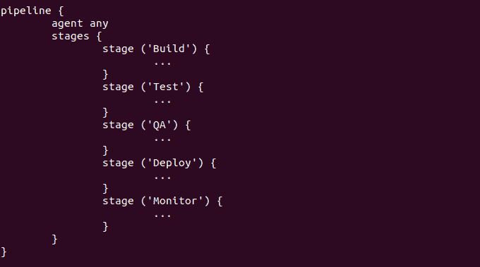

*   ### **步骤**

在一个阶段块中可以定义一系列步骤。这些步骤按顺序执行以执行一个阶段。steps 指令中必须至少有一个步骤。在下面的例子中，我在构建阶段实现了一个 echo 命令。该命令作为“构建”阶段的一部分执行。


现在你已经熟悉了基本的管道概念，让我们从 Jenkins 管道教程开始。首先，让我们学习如何创建一个 Jenkins 管道。

### **创建您的第一条 Jenkins 管道。**

**第一步**:登录 Jenkins，从仪表盘中选择“新项目”。

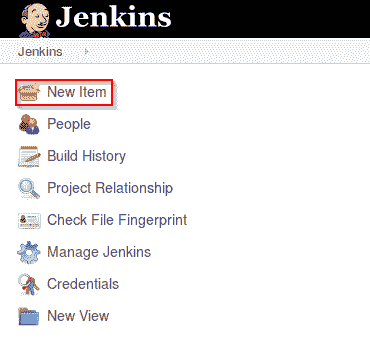

*詹金斯仪表盘——詹金斯管道教程*

**第二步**:接下来，为您的管道输入一个名称，并选择‘管道’项目。单击“确定”继续。

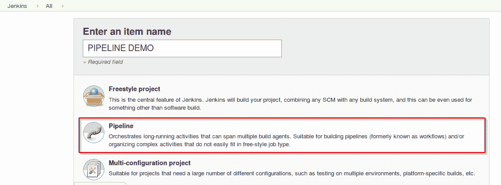 * 输入项目名称——詹金斯管道教程*

**第三步**:向下滚动到管道，选择想要声明式管道还是脚本式管道。

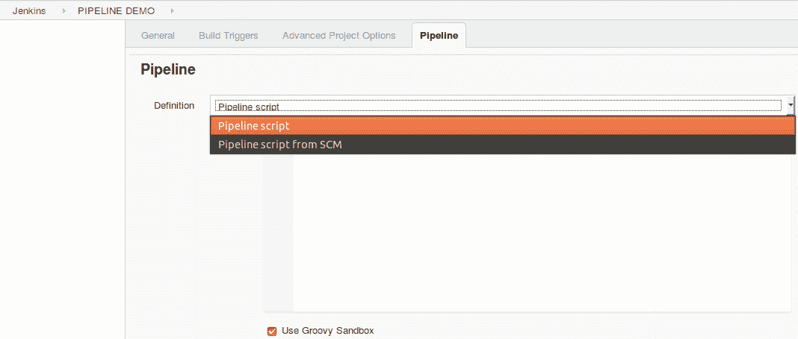

*声明式或脚本式管道—**詹金斯管道教程*

**步骤 4a** :如果你想要一个脚本化的管道，那么选择‘管道脚本’并开始输入你的代码。


*脚本化管道——詹金斯管道教程*

**步骤 4b** :如果你想要一个声明性管道，那么选择‘来自 SCM 的管道脚本’并选择你的 SCM。在我的例子中，我将在整个演示中使用 Git。输入您的存储库 URL。

 *声明式流水线——詹金斯流水线教程* 

**第五步**:脚本路径中是 Jenkinsfile 的名称，将从您的 SCM 运行中访问该文件。最后点击“应用”和“保存”。您已经成功创建了第一个 Jenkins 管道。

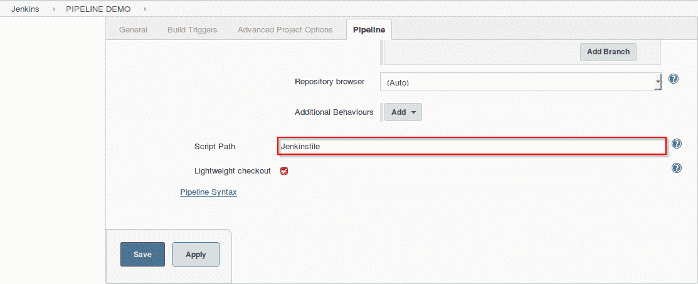 * 脚本路径——詹金斯流水线教程*

现在你已经知道了如何创建管道，让我们开始演示吧。

### **声明式流水线演示**

演示的第一部分展示了声明性管道的工作方式。参考上面的“创建您的第一个 Jenkins 管道”开始。让我从解释我在 Jenkinsfile 中编写的代码开始演示。

由于这是一个声明性的管道，我将代码写在本地一个名为‘Jenkins file’的文件中，然后将这个文件推送到我的全局 git 存储库中。在执行“声明性管道”演示时，将从我的 git 存储库中访问该文件。下面是构建管道以运行多个阶段的简单演示，每个阶段执行一个特定的任务。

*   通过在管道块中编写代码来定义声明性管道。在这个块中，我用标签‘any’定义了一个代理。这意味着管道在任何可用的执行器上运行。
*   接下来，我创建了四个阶段，每个阶段执行一个简单的任务。
*   阶段一执行一个简单的 echo 命令，该命令在“步骤”块中指定。
*   第二阶段执行输入指令。该指令允许**在一个阶段提示用户输入**。它显示一条消息并等待用户输入。如果输入被批准，那么该阶段将触发进一步的部署。
*   在这个演示中，一个简单的输入信息“你想继续吗？”已显示。在接收到用户输入时，流水线要么继续执行，要么中止。

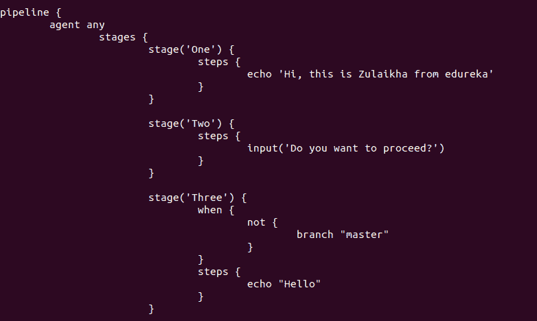

*   第三阶段运行带有“not”标签的“when”指令。这个指令允许你根据在‘when’循环中定义的条件来执行一个步骤。如果满足条件，将执行相应的阶段。必须在阶段级别定义它。
*   在这个演示中，我使用了“not”标签。当嵌套条件为**假**时，该标签执行一个阶段。因此，当“分支为主”为假时，执行以下步骤中的 echo 命令。

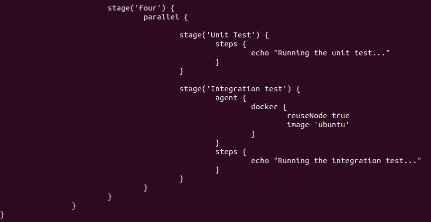

```
pipeline {
         agent any
         stages {
                 stage('One') {
                 steps {
                     echo 'Hi, this is Zulaikha from edureka'
                 }
                 }
                 stage('Two') {
                 steps {
                    input('Do you want to proceed?')
                 }
                 }
                 stage('Three') {
                 when {
                       not {
                            branch "master"
                       }
                 }
                 steps {
                       echo "Hello"
                 }
                 }
                 stage('Four') {
                 parallel { 
                            stage('Unit Test') {
                           steps {
                                echo "Running the unit test..."
                           }
                           }
                            stage('Integration test') {
                              agent {
                                    docker {
                                            reuseNode true
                                            image 'ubuntu'
                                           }
                                    }
                              steps {
                                echo "Running the integration test..."
                              }
                           }
                           }
                           }
              }
}

```

*   第四阶段运行一个并行指令。该指令允许您并行运行嵌套阶段。在这里，我并行运行两个嵌套的阶段，即“单元测试”和“集成测试”。在集成测试阶段，我定义了一个特定于阶段的 docker 代理。该 docker 代理将执行“集成测试”阶段。
*   舞台内有两个命令。 **reuseNode** 是一个布尔值，当返回 true 时，docker 容器将在管道顶层指定的代理上运行，在这种情况下，顶层指定的代理是‘any ’,这意味着容器将在任何可用的节点上执行。默认情况下，该布尔值返回 false。
*   使用并行指令时有一些限制:
    *   一个阶段可以有一个**平行块或台阶块，但不能同时有两个**和
    *   在一个并行指令中，不能嵌套另一个并行指令
    *   如果一个阶段有并行指令，则不能定义“代理”或“工具”指令

现在我已经解释了代码，让我们运行管道。下面的截图是管道的结果。在下图中，管道等待用户输入，单击“继续”，执行恢复。

<figure id="attachment_63578" aria-describedby="caption-attachment-63578" style="width: 770px" class="wp-caption aligncenter">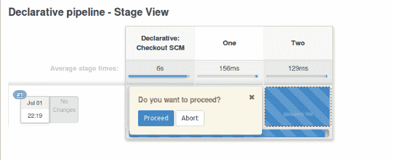

<figcaption id="caption-attachment-63578" class="wp-caption-text">*Waiting for user input *– *Jenkins Pipeline Tutorial*</figcaption>

</figure>

<figure id="attachment_63579" aria-describedby="caption-attachment-63579" style="width: 770px" class="wp-caption aligncenter">

<figcaption id="caption-attachment-63579" class="wp-caption-text">*                                                             Final output – Jenkins Pipeline Tutorial*</figcaption>

</figure>

### **脚本化管道演示**

为了让您对脚本化管道有一个基本的了解，让我们执行一个简单的代码。请参考[创建您的第一个 Jenkins 管道](#Createpipeline)来创建脚本化管道。我将运行下面的脚本。

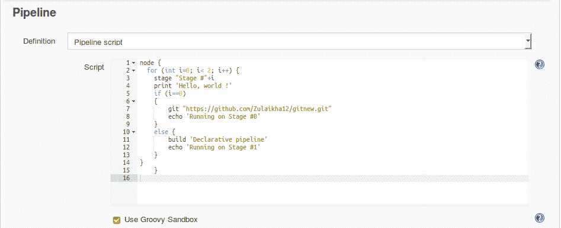

管道脚本–詹金斯管道教程

```
node {
      for (i=0; i&lt;2; i++) { 
           stage "Stage #"+i
           print 'Hello, world !'
           if (i==0)
           {
               git "https://github.com/Zulaikha12/gitnew.git"
               echo 'Running on Stage #0'
           }
           else {
               build 'Declarative pipeline'
               echo 'Running on Stage #1'
           }
      }
}

```

在上面的代码中，我定义了一个“节点”块，并在其中运行了下面的代码:

*   条件“for”循环。该 for 循环用于创建 2 个阶段，即阶段#0 和阶段#1。一旦创建了阶段，它们就会打印“hello world！”消息
*   接下来，我将定义一个简单的“if else”语句。如果‘I’的值等于零，那么阶段#0 将执行以下命令(git 和 echo)。“git”命令用于克隆指定的 git 目录，echo 命令只显示指定的消息
*   当‘I’不等于零时，执行 else 语句。因此，阶段#1 将运行 else 块中的命令。“build”命令只是运行指定的作业，在这种情况下，它运行我们之前在演示中创建的“声明性管道”。一旦它完成了作业的执行，它就运行 echo 命令

现在我已经解释了代码，让我们运行管道。以下屏幕截图是脚本化管道的结果。

1.  显示第 0 阶段的结果

<figure id="attachment_63581" aria-describedby="caption-attachment-63581" style="width: 770px" class="wp-caption aligncenter">

<figcaption id="caption-attachment-63581" class="wp-caption-text">*                                                                         Stage #0 – Jenkins Pipeline Tutorial*</figcaption>

</figure>

2。显示阶段#1 的日志，并开始构建“声明性管道”

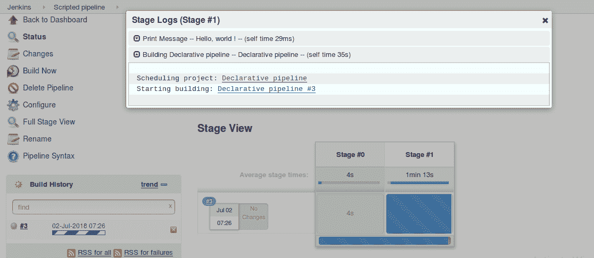

*阶段#1 运行声明式管道——詹金斯管道教程*

3。“声明性管道”作业的执行。

<figure id="attachment_63583" aria-describedby="caption-attachment-63583" style="width: 770px" class="wp-caption aligncenter">

<figcaption id="caption-attachment-63583" class="wp-caption-text">*                                                             Execution of declarative pipeline-Jenkins Pipeline Tutorial*</figcaption>

</figure>

4。结果。

<figure id="attachment_63584" aria-describedby="caption-attachment-63584" style="width: 770px" class="wp-caption aligncenter">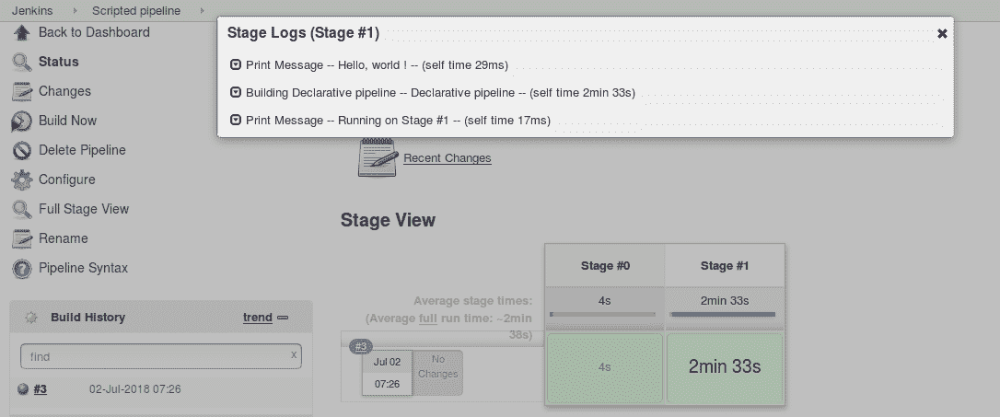

<figcaption id="caption-attachment-63584" class="wp-caption-text">*                                                                          Final output-Jenkins Pipeline Tutorial*</figcaption>

</figure>

我希望这篇博客能帮助你理解脚本化和声明式管道的基础。在我关于 Jenkins 管道的下一篇博客中，我将更深入地解释管道和语法。敬请关注。

*现在你已经了解了詹金斯管道的特点和工作原理，请查看 [DevOps 课程](https://www.edureka.co/devops)和 Edureka 的独家[詹金斯课程](https://www.edureka.co/jenkins)以了解更多信息。*