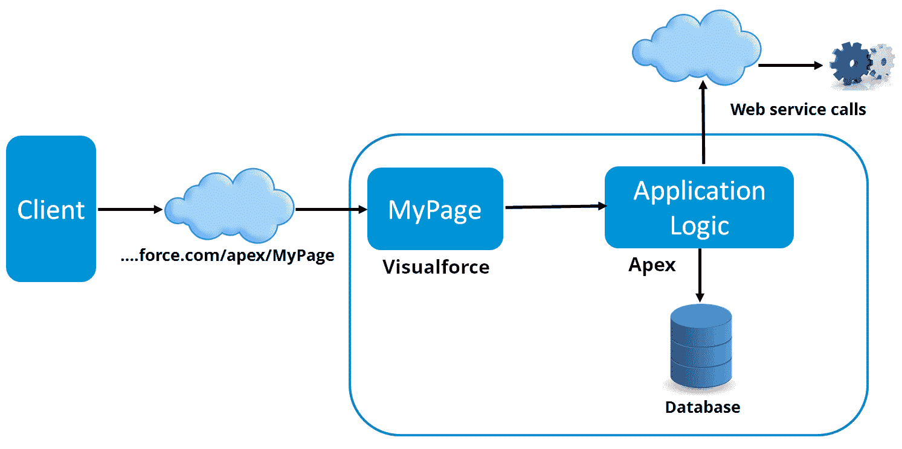
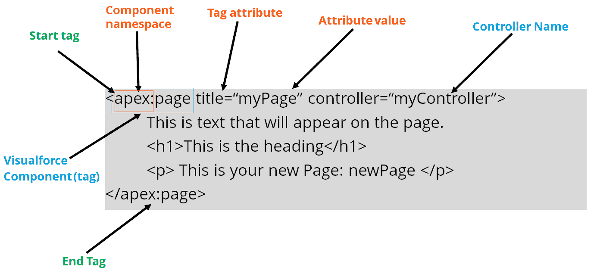
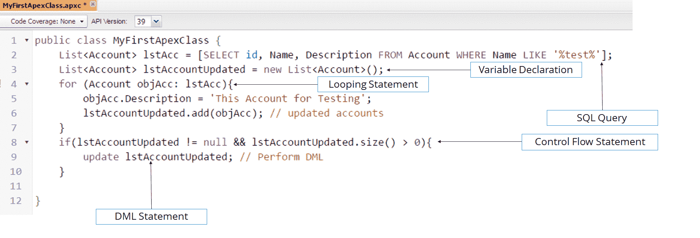
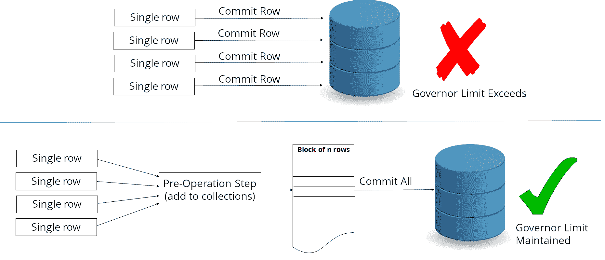

# Salesforce 开发人员教程:Salesforce 编程入门

> 原文：<https://www.edureka.co/blog/salesforce-developer/>

你渴望成为一名软件应用程序开发员吗？你想在 Force.com 平台上构建自己的应用吗？如果你对这些问题的回答是肯定的，那么你一定要考虑成为一名销售人员。

在我之前的博客中，我已经讨论了关于 [Salesforce](https://www.edureka.co/blog/what-is-salesforce/) 、 [Salesforce 认证](https://www.edureka.co/blog/salesforce-certifications/)的内容，并向您展示了如何[使用 Salesforce 中可用的声明性选项构建一个自定义应用程序](https://www.edureka.co/blog/salesforce-tutorial)。在这篇博客中，我将讨论 Salesforce 中可用于开发您的应用程序的编程选项。

## **MVC 架构**

在我开始使用 Visualforce 和 Apex 构建应用程序之前，我将首先讨论 Salesforce 模型-视图-控制器架构。下图概述了 Salesforce 模型-视图-控制器架构以及不同的 Salesforce 组件。

**模型:**模型是您的 Salesforce 数据对象、字段和关系。它由标准对象(客户、机会等)和自定义对象(您创建的对象)组成。

**视图:**视图表示数据的展现，即用户界面。在 Salesforce 中，视图由 visualforce 页面、组件、页面布局和选项卡组成。

**控制器:**控制器是实际应用逻辑的构建模块。只要用户与 visualforce 交互，您就可以执行操作。

## **Salesforce 在行动**

要成为 Salesforce 开发人员，您需要首先了解 Salesforce 应用程序如何工作，获得 Salesforce [PD1 认证](https://www.edureka.co/salesforce-platform-developer-1-certification-training)将是最佳选择。下图 为您展示了 Salesforce 的全貌。客户端或用户向 Salesforce 应用程序请求或提供信息。这通常是使用 Visualforce 完成的。这些信息随后被传递到用 Apex 编写的应用程序逻辑层。根据信息的不同，可以在数据库中插入或删除数据。Salesforce 还为您提供了使用 web 服务直接访问应用程序逻辑的选项。

sales force 开发人员可以使用声明式或编程式选项进行开发。下图为您提供了每个用户界面、业务逻辑和数据模型层可用的声明性和编程性方法的详细信息。要构建您的用户界面，您可以使用使用页面布局和记录类型的声明式方法，也可以使用 visualforce 页面和组件等编程式方法。一般来说，只有在使用声明式方法无法实现必要的用户界面时，才应该使用编程式方法。要开发您的应用程序的业务逻辑层，您可以使用工作流、验证规则和批准流程的 Salesforce 声明性选项，或者使用触发器、控制器和类等编程方法。要访问数据模型，您可以使用对象、字段和关系的声明性方法。您还可以使用元数据 API、REST API 和批量 API 以编程方式访问数据模型。

我们已经了解了 Salesforce 应用程序的工作方式、用于 Salesforce 开发的 MVC 架构以及 Salesforce 开发人员可用的两种不同方法。现在，让我来讨论一下 Visualforce 和 Apex。

## **visual force**

要在 Salesforce 平台上构建应用程序，您需要知道如何开发用户界面和编写应用程序逻辑。作为 Salesforce 开发人员，您可以使用 Visualforce 开发用户界面。Visualforce 是 Force.com 平台的用户界面框架。就像您可以使用 javascript Angular-JS 框架为您的网站构建用户界面一样，您可以使用 Visualforce 为您的 Salesforce 应用程序设计和构建用户界面。

当您需要构建自定义页面时，您可以使用 visualforce。您可以使用 Visualforce 的几个例子是:

*   构建电子邮件模板
*   开发移动用户界面
*   生成存储在 Salesforce 中的数据的 PDF 文件
*   将它们嵌入到你的标准页面布局中
*   覆盖标准 Salesforce 页面
*   为您的应用开发定制选项卡

visual force 页面由两个主要元素组成:

*   Visualforce 标记–Visualforce 标记包括 visual force 标签、HTML、JavaScript 或任何其他支持 web 的代码。
*   Visualforce 控制器——visual force 控制器包含指定用户与组件交互时会发生什么的指令。visualforce 控制器是使用 Apex 编程语言编写的。

您可以看看一个简单的 Visualforce 页面代码以及下面的不同组件:

下面我向您展示了编写一个简单的 visualforce 页面来显示国家及其货币值的步骤:

**第一步:**从设置中，在快速查找框中输入 Visualforce Pages，然后选择 Visualforce Pages 并单击新建。

**第二步:**在编辑器中添加以下代码来显示国家及其货币值:

T2`  <apex:page standardController = “country__c”>`

T2`    <apex:pageBlock title="Countries">`

T0`  <apex:column value="{!country__c.Name}"/>`

T2`        <apex:column value="{!country__c.currency_value__c}"/>`

T0`</apex:pageBlock>`

T2`  </apex:page>`

要深入了解 Salesforce 中的工作流，请注册一个基于行业的 [Salesforce 课程](https://www.edureka.co/salesforce-administrator-and-developer-training)。

## **顶点**

一旦您完成了用户界面的开发，作为一名 Salesforce 开发人员，您需要知道如何向您的应用程序添加自定义逻辑。您可以使用 Apex 编程语言编写控制器代码并将自定义逻辑添加到您的应用程序中。Apex 是一种面向对象的编程语言，允许您在 Force.com 平台上执行流和事务控制语句。如果您以前使用过 java 编程语言，那么您可以轻松地学习 Apex。Apex 语法与 java 的语法有 70%相似。

您可以随时使用 Apex 向您的应用程序添加自定义逻辑。可以使用 Apex 的几种情况如下:

*   当您想在应用程序中添加网络和电子邮件服务时
*   当您想要执行复杂的业务流程时
*   当您想在应用程序中添加复杂的验证规则时
*   当您想要在保存记录等操作上添加自定义逻辑时

下面是 Apex 代码及其不同组件(如循环语句、控制流语句和 SOQL 查询)的截图:

现在我们已经了解了 Apex 是什么，什么时候使用它，下面让我深入探讨 Apex 编程。

## **在顶点编程**

如果您已经理解了上述概念，那么您已经完成了成为 Salesforce 开发人员的一半旅程。在本节中，我将向您提供有关不同数据类型和变量的信息，从数据库检索数据的不同方法，并向您展示如何编写类和方法，从而更深入地了解 Apex。

**数据类型和变量**

Salesforce 为您提供了 4 种不同的数据类型和变量。下表为您提供了 4 种数据类型的信息:

| **数据类型和变量** | **描述** | **例如** |
| 原语 | sales force 中的原始数据类型包括布尔值、日期、整数、对象、字符串和时间。 | Boolean isSunny = true;整数 I = 1；String myString = " Hello World "； |
| 对象 | sObject 指任何可以存储在数据库中的对象。 | Account a = new Account();mycustomobj _ _ c obj = new mycustomobj _ _ c()； |
| 收藏 | 顶点有以下类型的集合:

*   list
*   Map
*   Set

 | List<String> var_lst = new List<String>();设定<弦> setOne =新设定<弦>()；地图<字符串，字符串> var_map =新地图<字符串，字符串>()； |
| 枚举 | 枚举是抽象数据类型，其值采用一组有限的标识符。 | 公共枚举季节{冬、春、夏、秋}； |

**SOQL 和**

开发软件应用程序需要你知道如何从数据库中插入和检索数据。在 Salesforce 中，您可以使用 SOQL 和 SOSL 从数据库中检索数据。如果您想成为 Salesforce 开发人员，那么您必须知道这两种查询语言。下面我已经给你提供了这些语言的详细解释:

*   SOQL 代表 Salesforce 对象查询语言。使用 SOQL 语句，您可以从数据库中检索作为一个 sObjects 列表、单个 sObject 或 count 方法的整数的数据。您可以将 SOQL 视为 SELECT SOQL 查询的等价物。我在下面提供了一个 SOQL 查询的例子:

T2`List<Account> accList = [SELECT Id, Name FROM Account WHERE Name=”YourName”];`

*   SOSL 代表 Salesforce 对象搜索语言。您可以使用 SOSL 语句来检索 sObjects 列表，其中每个列表都包含特定 sObject 类型的搜索结果。你可以把 SOSL 看作是一个数据库搜索查询的等价物。我在下面提供了一个 SOSL 查询的例子:

T2`List<List<sObject>> searchList = [FIND ‘map*’ IN ALL FIELDS RETURNING Account (Id, Name), Contact, Opportunity, Lead];`

当您知道数据驻留在哪个对象中时，您可以使用 SOQL，当您不知道数据驻留在哪个对象中时，您可以使用 SOSL。

**类和方法**

像其他面向对象编程语言一样，你可以使用 Apex 开发类和方法。您可以将类视为一个蓝图，使用它来创建和使用各个对象。您可以将方法视为子程序，它作用于数据并返回值。我已经为你提供了编写下面的类和方法的语法:

我现在将向您展示如何在 Apex 中添加类和方法:

**步骤 1:** 从“设置”中，在“快速查找”框中输入 Apex 类，然后选择 Apex 类并单击“新建”。

**第二步:**在编辑器中添加下面的类定义:

T2`Public class HelloWorld {`

T2`}`

**第三步:** 在类的左右括号之间添加一个方法定义:

T2`Public static void helloWorldMethod(Country__c[] countries) {`

T0`  For ( Country__c country : countries){`

T2`      country.currency_value__c *= 1.5;`

T0`  }`

T0`}`

**第四步:**点击保存，你应该有你的完整类:

T2`Public class HelloWorld {`

T2`  Public static void helloWorldMethod(Country__c[] countries) {`

T0`  For ( Country__c country : countries){`

T2`      country.currency_value__c *= 1.5;`

T0`}`

T2`}`

您可以使用上面显示的语法和示例为您的 Salesforce 应用程序开发您自己的类和方法。要成为 Salesforce 开发人员，您需要知道的不仅仅是编写类和方法。在接下来的几节中，我将讨论使在 Salesforce 平台上开发应用程序变得简单和容易的主题。

## **触发**

每个 Salesforce 开发人员必须知道 Salesforce 触发器的概念。您可能以前在使用其他数据库时遇到过触发器。触发器只是存储的程序，当您在更改 Salesforce 记录之前或之后执行操作时，会调用这些程序。例如，触发器可以在执行插入操作之前或执行更新操作时运行。有两种类型的触发器:

*   **Before 触发器**–您可以使用 Before 触发器在记录值保存到数据库之前更新或验证记录值。
*   **After 触发器**–您可以使用 After 触发器来访问由系统设置的字段值并影响其他记录中的更改。

触发器在以下操作之前或之后执行:

*   插入
*   更新
*   删除
*   合并
*   向上插入
*   取消删除

我将向您展示如何在 apex 中添加触发器，方法是为您在上面的课程中见过的国家对象添加触发器:

**步骤 1:** 从国家/地区的对象管理设置中，转到触发器并单击新建。

**第二步:**在触发器编辑器中，添加如下触发器定义:

T2`Trigger HelloWorldTrigger on Country__c (before insert) {`

T2`  Country__c countries = Trigger.new;`

T2`  HelloWorld.helloWorldMethod(countries);`

T2`}`

以上代码将在每次插入数据库之前更新你所在国家的货币。

## **调速器极限**

您可能知道 Salesforce 在多租户架构上工作，这意味着资源在不同的客户端之间共享。为了确保没有一个客户端独占共享资源，Apex 运行时引擎严格执行调控器限制。在线报名参加 [Salesforce 架构师认证](https://www.edureka.co/masters-program/salesforce-architect-certification-course)培训，了解有关 Salesforce 和多租户架构的更多信息。如果您的 Apex 代码超出了限制，预期的调控器会发出一个无法处理的运行时异常。因此，作为 Salesforce 开发人员，您在开发应用程序时必须非常小心。

## **批量操作**

作为 Salesforce 开发人员，您必须始终确保您的代码保持调控器限制。为了确保 Apex 遵守调控器限制，您必须使用批量调用设计模式。批量操作是指在进行 DML 操作时提交多条记录。在进行 DML 操作之前，您必须始终确保将行添加到集合中。下图为您提供了批量操作设计模式的完整描述。

**了解我们在顶级城市的销售队伍培训课程**

| 印度 | 美国 | 其他国家 |
| [海得拉巴的销售队伍培训](https://www.edureka.co/salesforce-administrator-and-developer-training-hyderabad) | [达拉斯的 Salesforce 培训](https://www.edureka.co/salesforce-administrator-and-developer-training-dallas) | [墨尔本的 Salesforce 培训](https://www.edureka.co/salesforce-administrator-and-developer-training-melbourne) |
| [班加罗尔的销售队伍培训](https://www.edureka.co/salesforce-administrator-and-developer-training-bangalore) | [夏洛特 Salesforce 培训](https://www.edureka.co/salesforce-administrator-and-developer-training-charlotte) | [伦敦的 Salesforce 培训](https://www.edureka.co/salesforce-administrator-and-developer-training-london) |
| [金奈的 Salesforce 培训](https://www.edureka.co/salesforce-administrator-and-developer-training-chennai) | [纽约的销售人员培训](https://www.edureka.co/salesforce-administrator-and-developer-training-new-york-city) | [悉尼的 Salesforce 培训](https://www.edureka.co/salesforce-administrator-and-developer-training-sydney) |

## **DMLs 和数据操作**

您已经看到了如何使用 SOQL 和 SOSL 查询从数据库中检索数据。现在，让我们来看看可用于将数据插入 Salesforce 数据库的不同语句。对于 Salesforce 开发人员来说，必须知道这些语句可以做什么以及如何使用它们。

| **DML 语句** | **描述** |
| 插入 | 将一个或多个对象添加到您组织的数据中 |
| 更新 | 修改一个或多个现有的 sObject 记录 |
| 向上插入 | 创建新记录并更新对象记录 |
| 删除 | 删除一个或多个现有的 sObject 记录 |
| 取消删除 | 恢复一个或多个现有的 sObject 记录 |
| 合并 | 将最多三个相同对象类型的记录合并为一个记录 |

**视觉力和顶点**

在成为 Salesforce 开发人员的过程中，您已经走过了漫长的道路。接下来我将讨论如何集成您的 visualforce 页面和 apex 代码。您可以使用控制器和扩展连接 visualforce 页面和 apex 代码。T3T5

*   **自定义控制器—如果您希望您的 visualforce 页面完全以系统模式运行，即没有权限和字段级安全性，请使用自定义控制器。**

*   **控制器扩展—当您想要添加新的动作或功能来扩展标准或定制控制器的功能时，请使用控制器扩展。**

在下面的代码中，我向您展示了如何在您的 visualforce 页面中包含自定义控制器:

T2`<apex:page controller="myController" tabStyle="Account">`

T2`    <apex:form>`

T2`    </apex:form>`

T2`</apex:page>`

在下面的代码中，我向您展示了如何在您的 visualforce 页面中包含控制器扩展:

T2`<apex:page standardController="Account" extensions="extensionClass">`

T2`    <apex:form>`

T2`    </apex:form>`

T2`</apex:page>`

## **异常处理**

如果你以前开发过应用程序，那么你肯定会遇到异常。异常是一种改变程序正常执行流程的特殊情况。例如，将一个数除以零或访问越界的列表值。如果您不处理这些异常，那么流程的执行将会停止，DMLs 将会回滚。

作为一名 Salesforce 开发人员，您需要知道如何捕捉这些异常，以及一旦捕捉到这些异常该做些什么。要捕捉异常，可以使用 try、catch 和 finally 构造。一旦捕捉到异常，就可以用下面提到的方法来处理它:

| **异常** | **如何处理** |
| DML | 对记录或字段使用 addError()方法 |
| Visualforce | 使用 ApexPages.message 类 |
| 发送异常电子邮件 | 您可以通过电子邮件通知开发商 |
| 登录自定义对象 | 你可以使用 future 方法来捕捉一个自定义对象 |

到目前为止，在这个 Salesforce 开发人员博客中，您已经看到了如何使用 Visualforce 开发您的用户界面，您已经看到了如何使用 Apex 和不同的概念(如触发器、批量操作和异常处理)编写自定义逻辑。最后但同样重要的是，我们将了解一下 Salesforce 测试框架。

## **检测**

作为一名 Salesforce 开发人员，您需要知道如何测试您编写的代码。测试驱动开发是确保软件应用程序长期成功的好方法。您需要测试您的应用程序，以便您可以验证您的应用程序是否按预期工作。特别是，如果你正在为客户开发一个应用程序，那么在交付最终产品之前测试它是非常重要的。Apex 为您提供了一个测试框架，允许您编写单元测试、运行测试、检查测试结果并获得代码覆盖率结果。

你可以用两种方式测试你的应用程序:

1.  通过 Salesforce 用户界面，这种测试方式很重要，但不会涵盖您应用程序的所有用例
2.  您可以测试批量功能，使用 SOAP API 或 visualforce standard set 控制器，最多可在您的代码中传递 200 条记录

测试类不向数据库提交数据，并且用@isTest 注释。我已经向您展示了如何添加一个测试类，通过向下面的 HelloWorld 类添加一个测试类:

T2`@isTest`

T2`  private class HelloWorldTestClass {`

T2`    static testMethod void validateHelloWorld() {`

T2`      Country__c country = new Country__c(Name=”India”, currency_value__c=50.0);`

T2`      Insert country;`

T2`      country = [SELECT currency_value__c FROM Country WHERE Id = country.Id ];`

T2`      System.assertEquals(75, country.currency_value__c);`

T2`    }`

T2`  }`

我希望您已经理解了成为 Salesforce 开发人员所需了解的所有概念。要深入了解更多细节，请查看我们在欧文举办的 [Salesforce 培训，该培训包含讲师指导的现场培训和真实项目体验。](https://www.edureka.co/salesforce-administrator-and-developer-training-irving)