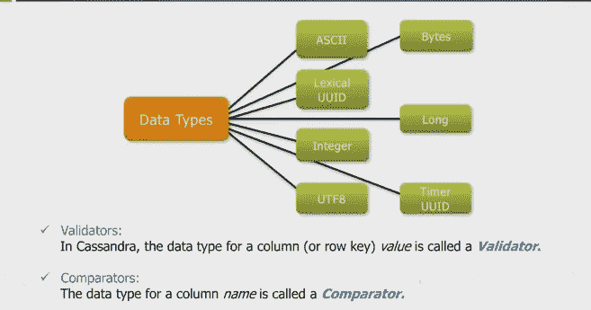

# 卡珊德拉专栏系列简介

> 原文：<https://www.edureka.co/blog/introduction-to-cassandra-column-family/>

## **列科**

列族类似于 RDBMS 或关系数据库管理系统中的表，是关联相似数据的逻辑划分。基本上，在相似的数据中，你倾向于存储某种相似主题的数据。

例如，订单数据存储在单个列族中，因此您可以将订单 ID 作为行键，也可以将各种列(如产品种类)作为订单的一部分存储在特定的订单族中。举一些例子，用户列族由一个用户 id 作为一个键组成。因此，可以自由选择 ID，列可以是“name=Kunal”。列值是 Kunal 和 Bangalore。第二个列族称为 cricketer 列族，它允许在一个列族中存储 Cricketer 统计信息。例如，您可以在一列中显示 Sachin Tendulkar，在另一列中显示世纪数。因此，可以有任意数量的列。

## **栏目类型**

列族只不过是一个表，类似于 RDBMS 世界中的表。它有某些类型，即:

**静态列族**–静态列族是定义名称和数据类型的地方。因此，当创建列族时，命名列名和数据类型的选项是可用的。之所以称之为静态，是因为列保持静态，而可用列的数量是已知的。

**动态列族**–另一方面，动态列族不预先定义列名，Cassandra 可以使用任意应用程序和列名来存储数据。所以动态在某种程度上是有帮助的，因为在非结构化数据中，大多数情况下，动态列族有助于处理后来可能添加的新字段。

如果您有一个静态列族，并且希望在加载数据时在代码中添加一个动态列族，则可以随时将它添加到静态列族中。Cassandra 允许自由选择列名。

## **与 RDBMS 的区别**

Cassandra 列系列是无模式的，可伸缩性很强。Cassandra 列族有两个属性——名称和比较器。所以当你有一个 Cassandra 列族时，给它起一个名字就变得必须了，Comparator 基本上是列名的数据类型。如果你不指定比较器，它会假设它是某个默认的比较器。

卡珊德拉还有一个超级柱族的专栏。它将在内部使用一个超级列。这是一个逻辑分组，也是另一个级别的列分组。因此，在一个用户列系列中，您可以有两个超级列，其中包含用户的个人信息和产品信息。

## **列**

列是 Cassandra 中最小的数据增量。它有 3 个组成部分:

*   **名称**
*   **值**
*   **时间戳**–用于冲突解决，时间戳不可编辑。这是一种内部机制，用于查看数据或列的更新时间。
*   **过期列**–可以给列指定一个过期日期，以便知道该列将会过期。
*   **Counter columns**–Counter columns 就是维护这些列，以便您可以增加和减少这些计数器列。

## **超级栏目**

超级列是根据业务需求和逻辑分组将所有列组合在一起。它为常规柱族结构添加了另一层嵌套。它们组成了一个超级柱族结构。

超级列的主要情况是将其他列族中的多行反规范化为一行，以便进行实体化视图数据检索。

## **用例**

## **超列的局限性**

一个限制是超列族的所有子列都必须反序列化才能读取单个子列族。另一个限制是我们不能在超级列的子列上创建二级索引。

## **列数据类型**

在上图中，有不同的数据类型。列值的数据类型称为验证器。comparator 是列的数据类型。名称和地址成为列名。这样在列名的情况下就可以有一个日期。通过将日期作为列名，还可以获得时间序列数据。

## **行**

可以有宽行，也可以有几行。可能有数百万列和行可用。

瘦行有少量的列，可以选择只有有限的行。

## **复合键**

它由一个或多个主键字段组成。假设一个城市的名字被设置为一个行键，可能有一个城市在两个不同的州被命名，所以你必须提到哪个城市和哪个州。这仅仅意味着必须声明密钥。您可以聚合几个值(也称为几个类型的组成部分)来形成一个唯一的列键，而不是简单的一种类型的列键。

有问题要问我们吗？在评论区提到它们，我们会回复你，或者从 Edureka 获得你的 [Cassandra 认证](https://www.edureka.co/cassandra)。

**相关帖子:**

[卡珊德拉中的告密者简介](https://www.edureka.co/blog/introduction-to-snitches-in-cassandra/)