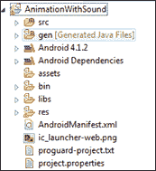
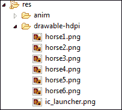
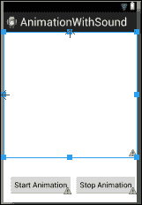
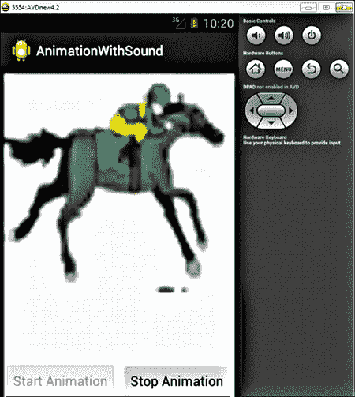

# Android 教程:用帧动画播放声音

> 原文：<https://www.edureka.co/blog/android-tutorial-on-playing-sound-with-frame-animation/>

在课堂上讨论帧动画代码时，一个学生问了一个问题，我们是否可以随动画一起播放声音。我答应她，我会写下一个机器人教程，当动画开始时会播放声音，这就是我写这篇博客的原因！现在，这里好的部分是，我们可以使用我们在以前的课程中学到的概念来开发这个应用程序。:)

### 以下概念用于开发带音频的逐帧动画:

1.  **帧动画**
2.  **媒体播放器**
3.  **事件监听器(OnclickListener)**

*如果你不清楚 Android 的基本概念，请参加这个 [Android 课程。](https://www.edureka.co/android-development-certification-course?)。*

#### 像往常一样，在我们深入研究代码之前，让我们找出开发应用程序的先决条件:–[查看更多:](https://www.edureka.co/blog/?p=2480&preview=true#sthash.Qg0Taqr4.dpuf)

*   **Android 开发环境**–我不敢相信你已经有了这样的设置。
*   在这个应用程序中，我正在制作一匹奔跑的马的动画。我从网上下载了 6 张奔跑的马的图片。这些图像被复制到 drawable-hdpi 文件夹下。
*   **马蹄声**——互联网真是人类的一大发明。我发现了一个提供免费声音剪辑的网站(【http://soundbible.com/1302-Galloping-Horse.html】T2)。我从这个网站下载了奔马的声音。
*   **关于 FrameAnimation、MediaPlayer 和 EventListener 的知识**–我很确定你在这些会议中全神贯注，并且非常清楚地掌握了这些概念。

既然我们已经讨论了先决条件，让我们来浏览一下**‘如何用帧动画**播放声音’的代码。

### **第一步**

使用 Eclipse 创建一个 android 应用程序项目。在我的例子中，我创建了一个应用程序，并将其命名为 AnimationWithSound。



### **第二步**

将图像复制到 drawable 文件夹中( **res/drawable-hdpi** )。



### 第三步

接下来是布局。我添加了一个图像视图和 2 个按钮。图像视图将显示动画图像。点击“开始动画”按钮将开始动画，点击“停止动画”按钮将停止动画。

 * **布局(activity_main.xml)的代码如下:***

**activity _ main . XML**

```

 <button>

</button><button>

```

### 第四步

在这一步中，我创建了一个名为“anim”的文件夹(可以给这个文件夹取任何名称)，并创建了一个 XML 文件来定义动画开始时图像帧的显示方式。


#### ***XML 文件内容如下所示:***

当我们浏览帧动画代码时，我们已经了解了这一点。:)此 XML 包含在通过下面的 duration 关键字指定的时间间隔后，将在图像视图中连续显示的图像列表:

```

<!--?xml version="1.0" encoding="utf-8"?-->

```

### **第五步**

下一步是编写包含动画逻辑的活动。为了开发这个应用程序，我编写了 java 类:

1.  **AnimationwithSound.java**–这是实例化帧动画的主要活动。当点击“开始动画”按钮时，它具有动画开始逻辑；当点击“停止动画”按钮时，它具有动画停止逻辑。带有逻辑解释的代码片段如下所示:

```

package com.example.animationwithsound;

// This activity shows how a sound can be played along with a frameanimation

import android.os.Bundle;
 import android.app.Activity;
 import android.graphics.drawable.AnimationDrawable;
 import android.view.Menu;
 import android.view.View;
 import android.view.View.OnClickListener;
 import android.widget.Button;
 import android.widget.ImageView;

public class AnimationwithSound extends Activity implements OnClickListener {

//Getting a reference of all the views on the UI

 ImageView animationview;
 Button btstart, btstop;

// Getting a reference of the frameanimation and the Animationsound class

 AnimationDrawable frameAnimation;
 AnimationSound asound;

@Override
 protected void onCreate(Bundle savedInstanceState) {
 super.onCreate(savedInstanceState);
 setContentView(R.layout.activity_main);
 animationview = (ImageView) findViewById(R.id.AnimatedIview);
 btstart = (Button) findViewById(R.id.btStart);
 btstop = (Button) findViewById(R.id.btStop);

// To start with , just need the start button to be enabled, user should
 // not be able to click stop until the animation is started

 btstart.setEnabled(true);
 btstop.setEnabled(false);

// Registering the buttons to the onclicklistener

 btstart.setOnClickListener(this);
 btstop.setOnClickListener(this);

// Setting the background of the image view to the animation XML which
// defines how the image frames should be displayed one after the other

 animationview.setBackgroundResource(R.anim.horseanimation);

// Instantiating the frameanimation. Getting an instance of
 // AnimationDrawable

 frameAnimation = (AnimationDrawable) animationview.getBackground();

}

@Override
 public boolean onCreateOptionsMenu(Menu menu) {
 // Inflate the menu; this adds items to the action bar if it is present.
 getMenuInflater().inflate(R.menu.activity_main, menu);
 return true;
 }

 @Override
 public void onClick(View v) {
 // TODO Auto-generated method stub
 int id = v.getId();
 switch (id) {
 case R.id.btStart:

// First create an instance of the AnimationSound class. This will
 // call the AnimationSound constructor in AnimationSound.java and
 // create an instance of the MP3 sound file. Passing the MP3 file
 // which will be used to create the instance of the MediaPlayer

 asound = new AnimationSound(this, R.raw.galop);

// Starting the animation calling the startsound method in
 // AnimationSound class disabling the start button so that user
 // cannot click it until the animation is stopped enabling the stop
// animation button to allow te user to stop the animation

 frameAnimation.start();
 asound.startsound();
 btstart.setEnabled(false);
 btstop.setEnabled(true);
 break;

case R.id.btStop:
 // On click of the stop animation button, stopping the frame
 // animation and also the sound enabling the start animation button
 // so that user can restart the animation disabling the stop
 // animation button, so that user cannot click it until the
 // animation is started

 frameAnimation.stop();
 asound.stopsound();
 btstart.setEnabled(true);
 btstop.setEnabled(false);
 break;
 default:
 break;
 }

}

}

```

1.  **AnimationSound.java**–这个类有实例化媒体播放器的逻辑，它有两个方法
    *   **start sound()**–调用此方法时，声音会随动画一起播放
    *   **stop sound()**–调用此方法时，声音停止

***这个类的内容连同逻辑的解释如下:***

```

package com.example.animationwithsound;

// This class is used to handle playing the sounds when animation is started/stopped

import android.media.MediaPlayer;
 import android.content.Context;

public class AnimationSound {
 MediaPlayer mpsound;

 AnimationSound(Context context, int id) {

// Creates an instance of the mediaplayer using the passed mp3 file

 mpsound = MediaPlayer.create(context, id);

}

// When this method is called, the sound is played in a loop until the stopsound method is called

 public void startsound() {
 mpsound.start();
 mpsound.setLooping(true);
 }

// When this method is called , the playing of the sound is stopped

 public void stopsound() {
 if (mpsound != null) {
 if (mpsound.isPlaying()) {
 mpsound.stop();
 mpsound.setLooping(false);
 }

//Finally release everything and clear out the mediaplayer object

 mpsound.release();
 mpsound = null;
 }

}
 }

```

***希望你喜欢这个 Android 教程！如果你在课堂上专心听讲，我相信你能轻松地用背景音乐制作一帧一帧的动画。当您在 Eclipse 工作区中导出这段代码并在模拟器上运行它时，您会很高兴看到下面的输出！***

再见，我们很快会在课堂上再见的！



***对所讨论的概念有疑问？ ***[请教我们的专家！](# "Have a Doubt? Ask the experts!")******

[dl URL = " # " class = ' eModal eModal-26 ' title = "下载代码" desc = " " type = " " align = " " for = " Download "]

请继续关注更多教程，学习如何创建 Android 小部件！快乐学习！

*以下资源被用于创建这个帖子:[Edureka.co，](http://edureka.co/) [安卓官方开发者](http://developer.android.com/guide/topics/ui/layout/listview.html)*

**你可能也会喜欢这些相关的帖子:**

*   [Android SDK 安装](https://www.edureka.co/blog/android-sdk-installation/ "Android SDK Installation")
*   [Android Widgets:自定义吐司](https://www.edureka.co/blog/android-tutorial-custom-toast/)
*   [安卓项目:21 点游戏](https://www.edureka.co/blog/android-tutorial-on-blackjack/)
*   [Android 初学者教程-5:广播接收机](https://www.edureka.co/blog/android-tutorials-broadcast-receivers/)