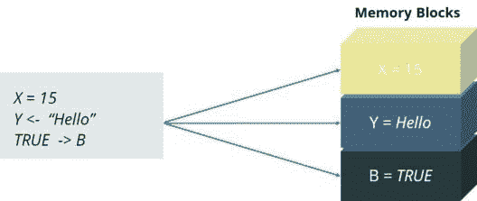
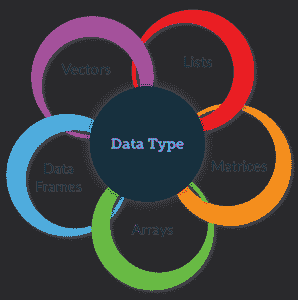
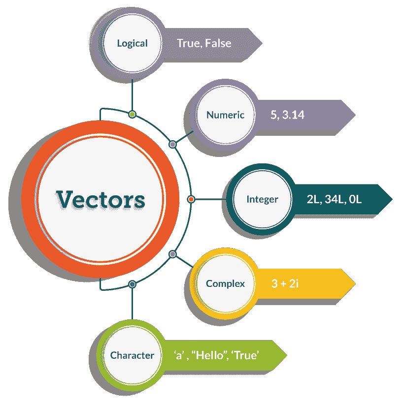
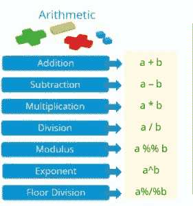
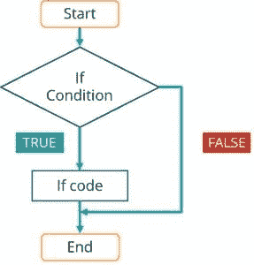
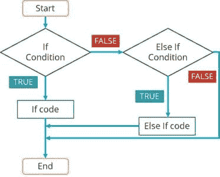
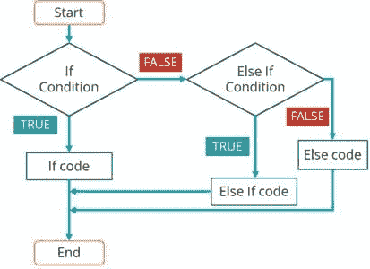
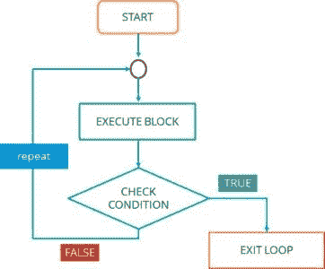
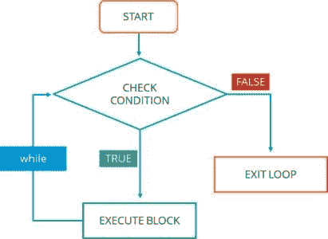

# R 编程——R 编程语言初学者指南

> 原文：<https://www.edureka.co/blog/r-programming-language>

R 是最流行的分析工具之一。但是除了用于分析，R 也是一种编程语言。随着 IT 行业的增长，对熟练的或 ***认证的数据科学家*** 的需求日益增长，他们既了解 R，也了解数据分析工具和编程语言。在这篇博客中，我将帮助你理解数据科学 [R 编程的各种基础知识](https://www.edureka.co/data-science-r-programming-certification-course)。在我们的 ***[p](https://www.edureka.co/blog/r-tutorial/) [上一篇](https://www.edureka.co/blog/r-tutorial/) [博客](https://www.edureka.co/blog/r-tutorial/)*** ， 中我们已经讨论了为什么我们需要数据分析，什么是商业数据分析，为什么以及谁使用 R.

在这篇博客中，我们将按以下顺序理解 R 编程的核心概念:

1.  [变量](#variables)
2.  [数据类型](#datatypes)
3.  [数据运算符](#operators)
4.  [条件语句](#conditional)
5.  [循环](#loops)
6.  [功能](#functions)

*您可以浏览 R 编程语言的网上研讨会录像，我们的讲师已经用示例详细解释了这些主题，这将有助于您更好地理解 R 编程。*

## **R 编程初学者| R 编程语言教程| edu reka**

[https://www.youtube.com/embed/fDRa82lxzaU?rel=0&showinfo=0](https://www.youtube.com/embed/fDRa82lxzaU?rel=0&showinfo=0)

那么让我们向前看，看看 R 编程的第一个概念——变量。

## **R 编程:变量**

变量只不过是包含一个值的内存位置的名称。R 中的一个变量可以存储数值、复数值、单词、矩阵甚至一个表格。令人惊讶，对吧？

<figure id="attachment_46482" aria-describedby="caption-attachment-46482" style="width: 528px" class="wp-caption aligncenter">

<figcaption id="caption-attachment-46482" class="wp-caption-text">*                  Fig:* *Creation of variables*</figcaption>

</figure>

上图向我们展示了变量是如何创建的，以及它们是如何存储在不同的内存块中的。在 R 中，我们不需要在使用变量之前声明它，不像其他编程语言如 Java，C，C++等。

让我们向前看，尝试理解什么是数据类型以及 r 中支持的各种数据类型。

## **R 编程:数据类型**

在 R 中，变量本身没有被声明为任何数据类型，而是被赋予 R 对象的数据类型。所以 R 被称为动态类型语言，也就是说我们在程序中使用它的时候，可以一次又一次的改变同一个变量的数据类型。

数据类型指定变量具有哪种类型的值，以及哪种类型的数学、关系或逻辑运算可应用于该变量而不会导致错误。R 中有许多数据类型，下面是最常用的:

现在让我们从向量开始，分别讨论这些数据类型。

### **向量**

矢量是最基本的 R 数据对象，有六种类型的原子矢量。下面是六个原子向量:



**逻辑**:用于存储逻辑值，如**真**或**假**。

:用于存储正数和负数，包括实数。

```
Eg: 25, 7.1145 , 96547
```

**整数**:保存所有的整数值，即所有的正负整数。

```
Eg: 45.479, -856.479 , 0
```

**复数**:它们的形式是 x + yi，其中 x 和 y 是数字，I 代表-1 的平方根。

```
Eg: 4+3i
```

**字符**:用于存储单个字符、一组字符(单词)或一组单词。字符可以用单引号或双引号来定义。

```
Eg: "Edureka", 'R is Fun to learn'.
```

一般来说，向量的定义和初始化方式如下:

```
Vtr = c(2, 5, 11 , 24) 

Or

Vtr <- c(2, 5, 11 , 24)
```

让我们向前看，理解 r 中的其他数据类型

### **列表**

列表与向量非常相似，但列表是 R 对象，其中可以包含不同类型的元素，如数字、字符串、向量和其他列表。

例如:

```

Vtr <- c("Hello", 'Hi','How are you doing')
mylist <- list(Vtr, 22.5, 14965, TRUE) 
mylist

```

输出:

```
[[1]]
[1] 'Hello"  "Hi"  "How are you doing"
[[2]]
[1] 22.5
[[3]]
[1] 14965
[[4]]
[1] TRUE 
```

### **矩阵**

Matrix 是 R 对象，其中的元素以二维矩形布局排列。

在 R 中创建矩阵的基本语法是

```
**matrix(data, nrow, ncol, byrow, dimnames)** 
```

其中:

*   **数据**是输入向量，它成为矩阵的数据元素。
*   **nrow** 是要创建的行数。
*   **ncol** 是要创建的列数。
*   **byrow** 是逻辑线索。如果为真，则输入向量元素按行排列。
*   **dimname** 是分配给行和列的名称。

举例:

```

Mymatrix <- matrix(c(1:25), nrow = 5,  ncol = 5, byrow = TRUE) 
Mymatrix

```

输出:

```
        [,1]   [,2]   [,3]   [,4]   [,5] 
[1,]    1       2       3     4      5
[2,]    6       7       8     9      10
[3,]    11     12     13    14    15
[4,]    16     17     18    19    20
[5,]    21     22     23    24    25
```

### **阵**

R 中的数组是数据对象，可以用来存储二维以上的数据。它将向量作为输入，并使用 **dim** 参数中的值来创建一个数组。

在 R 中创建数组的基本语法是

```
**array(data, dim, dimnames)** 
```

其中:

*   **数据**是输入向量，它成为数组的数据元素。
*   **dim** 是数组的维数，在这里你传递行数、列数以及所提到的维数要创建的矩阵数。
*   **dimname** 是分配给行和列的名称。

举例:

```

Myarray <- array( c(1:16), dim=(4,4,2))
Myarray

```

输出:

```
, , 1

 [,1] [,2] [,3] [,4]
[1,]  1    5     9    13
[2,]  2    6    10   14
[3,]  3    7    11   15
[4,]  4    8    12   16

, , 2

 [,1] [,2] [,3] [,4]
[1,]  1    5     9    13
[2,]  2    6    10   14
[3,]  3    7    11   15
[4,]  4    8    12   16
```

### **数据帧**

数据帧是一个表格或类似二维数组的结构，其中每一列包含一个变量的值，每一行包含一组值用于每一列的。以下是我们每次使用数据框时需要考虑的一些特征:

*   列名不应为空。
*   每一列应该包含相同数量的数据项。
*   存储在数据框中的数据可以是数字、因子或字符类型。
*   行名应该是唯一的。

举例:

```

emp_id = c(100:104)
emp_name = c("John","Henry","Adam","Ron","Gary")
dept = c("Sales","Finance","Marketing","HR","R & D")
emp.data <- data.frame(emp_id, emp_name, dept)
emp.data

```

输出:

```
 emp_id    emp_name    dept
1 100         John              Sales
2 101         Henry            Finance
3 102         Adam            Marketing
4 103         Ron               HR
5 104         Gary              R & D
```

现在我们已经理解了 R 的基本数据类型，是时候通过理解数据操作符的概念来深入研究 R 了。

**R 编程:数据运算符**

R 中主要有 4 个数据运算符，如下所示:


**算术运算符**:这些运算符帮助我们执行基本的算术运算，如加、减、乘等。



考虑下面的例子:

```

num1 = 15
num2 = 20
num3 = 0
#addition
num3 = num1 + num2
num3

#substraction
num3 = num1 - num2
num3

#multiplication
num3= num1 * num2
num3

#division
num3 = num1 / num2
num3

#modulus
num3 = num1 %% num2
num3

#exponent
num1 = 5
num2 = 3
num3 = num1^num2
num3

#floor division
num3 = num1%/%num2
num3

```

输出:

```
[1] 35

[1] -5

[1] 300

[1] 0.75

[1] 15

[1] 125

[1] 1
```

**关系运算符**:这些运算符帮助我们执行关系运算，比如检查一个变量是否大于、小于或等于另一个变量。关系运算的输出总是一个逻辑值。


考虑以下例子:

```
num1 = 15
num2 = 20

#equals to
num3=( num1 == num2 )
num3

#not equal to
num3= ( num1 != num2 )
num3

#lesser than
num3= ( num1 < num2 ) num3 #greater than num3= ( num1 > num2 )
num3

#less than equal to
num1 = 5
num2 = 20
num3 = ( num1 <= num2 ) num3 #greater than equal to num3 = ( num1 >= num2 )
num3

```

输出:

```
[1] FALSE

[1] TRUE

[1] TRUE

[1] FALSE

[1] TRUE

[1] FALSE
```

**赋值操作符:**这些操作符用于给 r 中的变量赋值，可以使用赋值操作符 ( < -)，也可以使用等于操作符(=)。变量的值有两种赋值方式，左赋值和右赋值。


**逻辑运算符:** 这些运算符比较两个实体，通常与布尔(逻辑)值一起使用，如‘and’，‘or’和‘not’。


## **R 编程:条件语句**

1.  **If 语句:**If 语句帮助您评估作为流程一部分的单个表达式。要执行这种评估，只需编写 If 关键字，后跟要评估的表达式。下面的流程图将给出 If 语句如何控制代码流程的概念:考虑下面的例子: 

```
num1=10
num2=20

if(num1<=num2){
print("Num1 is less or equal to Num2")

```

输出:

```
[1] "Num1 is less or equal to Num2"
```

*   **Else If Statement:** The Else if statement helps you in extending branches to the flow created by the If statement and give you the opportunity to evaluate multiple conditions by creating new branches of flow. The below flow will give you an idea of how the else if statement branches the flow of the code:  Consider the following example:

    ```

    Num1 = 5 
    Num2 = 20
    if (Num1 < Num2) print("Num1 is lesser than Num2") } else if( Num1 > Num2){
      print( "Num2 is lesser than Num1") }
    else if("Num1 == Num2){
            print("Num1 and Num2 are Equal") }

    ```

    输出:

    ```
    [1] "Num1 is lesser than Num2"
    ```

*   **Else 语句:**Else 语句在检查所有其他表达式并发现无效时使用。这将是作为 If–Else If 分支的一部分执行的最后一条语句。下面的流程会让你更好地了解如何改变代码的流程:



考虑下面的例子:

```

Num1 = 5 
Num2 = 20
if (Num1< Num2) print("Num1 is lesser than Num2") } else if( Num1 > Num2){
  print( "Num2 is lesser than Num1") }
else
  print("Num1 and Num2 are Equal") }

```

输出:

```
[1] "Num1 and Num2 are Equal" 
```

## **R 编程:循环**

循环语句允许我们多次执行一条或一组语句。R 中主要有 3 种循环:


1.  **repeat Loop**: It repeats a statement or group of statements while a given condition is TRUE. Repeat loop is the best example of an exit controlled loop where the code is first executed and then the condition is checked to determine if the control should be inside the loop or exit from it. Below is the flow of control in a repeat loop: Let us look at the example below to understand how we can use repeat loop to add n numbers till the sum reaches exceeds 100:

    ```
    x=2
    repeat {
    x= x^2
    print(x)
    if(x>100) {
    break
    }

    ```

    输出:

    ```
    [1] 4

    [1] 16

    [1] 256
    ```

2.  **while Loop**: It helps to repeats a statement or group of statements while a given condition is TRUE. While loop, when compared to the repeat loop is slightly different, it is an example of an entry controlled loop where the condition is first checked and only if the condition is found to be true does the control be delivered inside the loop to execute the code. Below is the flow of control in a while loop: Let us look at the example below to add the sum of squares for the first 10 numbers and understand how the while loop works better:

    ```
    num = 1
    sumn = 0

    while (num<=11){
     sumn =(sumn+ (num^2)
     num = num+1
     print(sumn)
    }

    ```

    输出:

    ```
    [1] 1
    [1] 5
    [1] 14
    [1] 30
    [1] 55
    [1] 91
    [1] 140
    [1] 204
    [1] 285
    [1] 385
    [1] 506
    ```

3.  **for 循环**:用于将一条语句或一组语句重复固定的次数。与 repeat 和 while 循环不同，for 循环用于我们事先知道代码需要执行的次数的情况。它类似于 while 循环，首先检查条件，然后只执行内部编写的代码。现在来看看 for 循环的控制流程:


现在让我们看一个例子，我们将使用 for 循环打印前 10 个数字:

```

for(x in 1:10){
print(x)
}

```

输出:

```
[1] 1
[1] 2
[1] 3
[1] 4
[1] 5
[1] 6
[1] 7
[1] 8
[1] 9
[1] 10
```

## **R 编程:功能**

功能是一组有组织的、可重用的代码，用于执行一个相关的动作。R 中主要有两类函数:

 **预定义函数**:这些是内置函数，用户可以使用它们来完成工作easier . Eg:mean(*x sum(*x)*，sqrt(*x*)，toupper*(*x* 

**用户定义的** **功能:**这些功能是用户为了满足用户的某个特定需求而创建的。下面是在 R: 中创建函数的语法

```
**func****tion_name** <–**function**(arg_1, arg_2, …) { 

//Function body 

}
```

考虑下面一个简单函数的例子，这个函数用于生成 2 个数的平方和:

```
sum_of_square <- function(x,y) {
x^2 + y^2
}
sum_of_sqares(3,4)

```

```
Output:
 [1] 25
```

我希望你喜欢阅读这篇 R 编程博客。我们已经在本教程中介绍了 R 的所有基础知识，所以您现在可以开始练习了。在这篇 R 编程博客之后，我会在 R 上写更多关于分析的博客，敬请关注。

*既然您已经了解了 R 的基础知识，请查看 Edureka 的* **[*R 认证培训*](https://www.edureka.co/r-for-analytics/)** *，edu reka 是一家值得信赖的在线学习公司，拥有遍布全球的 250，000 多名满意的学习者。Edureka 的数据分析与 R 培训将帮助您获得 R 编程、数据操作、探索性数据分析、数据可视化、数据挖掘、回归、情感分析方面的专业知识，并使用 RStudio 进行零售、社交媒体方面的真实案例研究。*

*有问题吗？请在这个“R 编程”博客的评论部分提到它，我们会尽快回复您。*