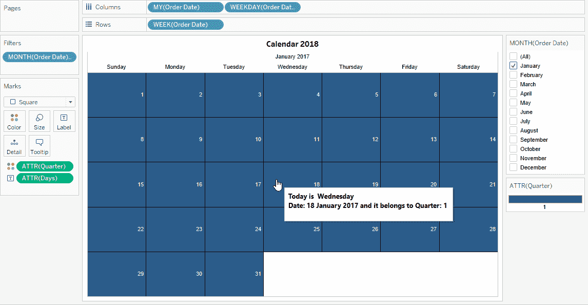
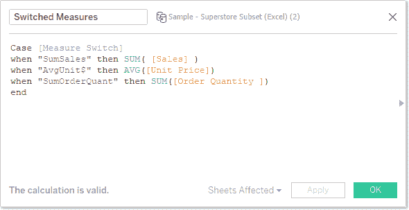
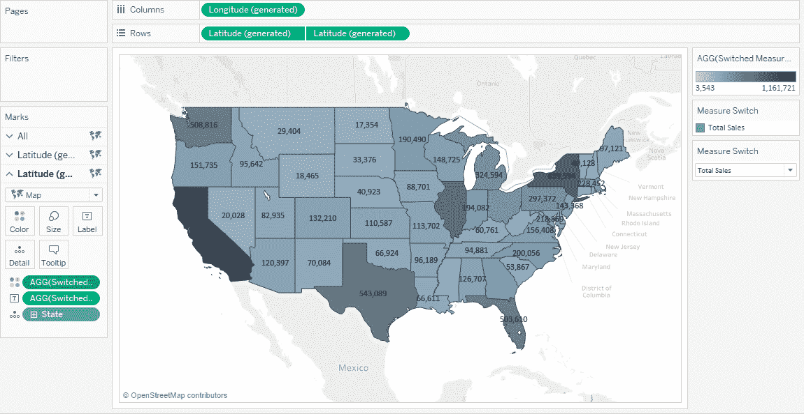
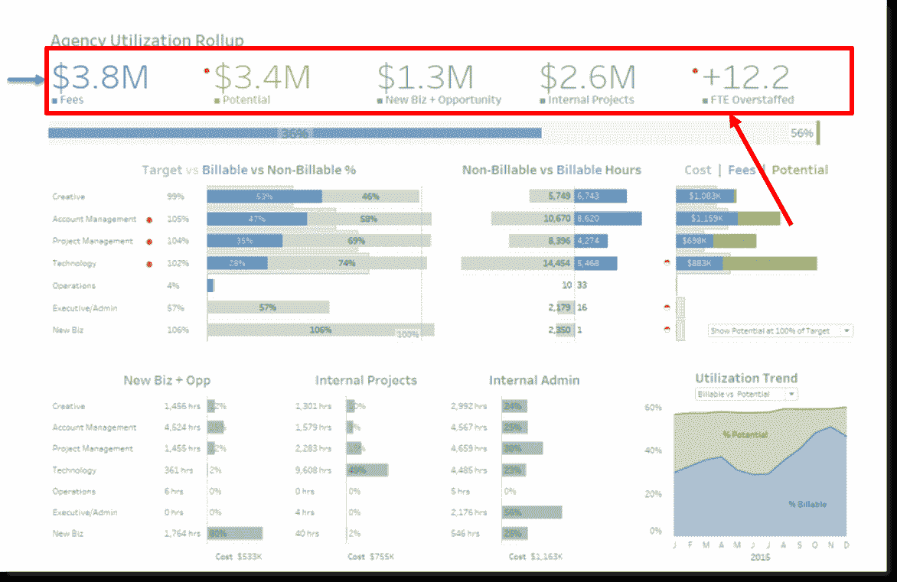

# 数据可视化专家必须知道的顶级技巧和窍门

> 原文：<https://www.edureka.co/blog/tableau-tips-and-tricks/>

你是那个为公司员工设计优秀仪表盘的人吗？如果是的话，那么我的朋友你已经爬到了正确的位置。在这篇文章中，我强调了一些惊人的“桌面技巧和窍门”,你可以马上应用它们，让你的仪表盘更有效地脱颖而出。

您知道吗，您可以在 tableau 中创建日历，甚至制作可视化动画。查看这个 ***[Tableau 在线课程](https://www.edureka.co/tableau-certification-training)*** ，它涵盖了每个&Tableau 的每一个细微差别，并教你如何创建一个有效的仪表板。

<figure class="wpb_wrapper vc_figure"></figure>

*Be the one to stand out in the crowd – Joel Osteen*

## **以下是给你的一些画面技巧和窍门:**

**1。[在](#calendar)画面中创建日历**

**2。[在字段间切换](#SwitchFields)**

**3。[像专业人士一样融合！](#blend)**

**4。[大数字](#BigNumbers)**

**5。[动画可视化](#animated)**

<figure class="wpb_wrapper vc_figure">****</figure>

**1。Tableau 提示和技巧:Tableau 中的日历**

**这是一个简单而新奇的小技巧，你可以用它来打动你的同事。让我们来学习如何通过 4 个步骤创建日历！**

### ****第一步:为年份:** 创建数据集**

**首先，你需要一些包含日期的数据。对于这个博客，我简单地进入 Excel，输入 1/01/2018，然后下拉到 31/12/2018，将文件保存在。xls 格式并将数据集连接到 Tableau。**

<figure class="wpb_wrapper vc_figure">****</figure>

### ****第二步:添加日期到列架****

**将“订单日期”添加到货架栏，并将其更改为(‘月/年’)自定义日期格式**

<figure class="wpb_wrapper vc_figure">****</figure>

### ****第三步:添加星期和工作日到行列货架****

**将“订单日期”更改为工作日和周数，并将其添加到货架的列和行中。**

<figure class="wpb_wrapper vc_figure">****</figure>

### ****第四步:添加滤镜和标记，最终构建日历****

**使用过滤器和标记显示月历**

<figure class="wpb_wrapper vc_figure">****</figure>

## ****最终日历:****

**嗯，这是你最后会得到的最终日历。仅供参考，您还可以添加其他参数，如销售额或利润，并获得它们的日历视图。**

<figure class="wpb_wrapper vc_figure">****</figure>

## **2。Tableau 提示和技巧:在字段之间切换**

**让我们学习 tableau 的另一个技巧，学习如何使用一个参数让最终用户能够切换不同的指标。**

### ****步骤 1:创建参数****

**创建一个字符串参数‘测量开关’。为了能够在不同的度量之间切换，让我们创建一个参数列表。在左侧的值列表中，我们有参数的实际值，在右侧，我们有一个名称，用户单击参数将会看到该名称。所以让我们用下面的方式来填写它。**

<figure class="wpb_wrapper vc_figure">****</figure>

<figure class="wpb_wrapper vc_figure">****</figure>

### ****第二步:创建计算字段****

**下一步是创建计算字段。我们的计算字段将检查参数，并基于该值选择一个可视化并显示该可视化。下面是它的样子:**

### ****步骤三:创建可视化 I****

**创建计算字段完毕？让我们继续创建一个可视化，将“区域”添加到行中，将“部门”添加到列中。此外，将新创建的计算字段“切换度量值”添加到该列中。最后，将相同的计算字段添加到颜色和文本书架。**

<figure class="wpb_wrapper vc_figure">****</figure>

### ****第四步:创建可视化二****

**1。在一张新纸上，将标记更改为“填充地图”，并将“状态”添加到详细信息中。**

**2。我们最终将创建一个双轴地图，所以在行架上添加纬度。**

**3。在标记架上，将我们创建的参数“测量开关”添加到颜色架。**

**4。现在点击下面的地图，将我们制作的计算字段“转换度量”添加到文本和颜色架中。**

**5。最后，右击第二个药丸的行本身，并设置为双轴。下面是它的样子:**

<figure class="wpb_wrapper vc_figure">****</figure>

## **3。Tableau 提示和技巧:像专业人士一样融合！**

**数据混合是一种将来自一个数据源的数据与来自另一个数据源的数据列相结合的方法。**

**通常，您可以使用连接来组合您的数据，但有时需要考虑数据类型及其粒度等因素，在这种情况下，最好使用数据混合。**

**例如，假设您有一部分数据存储在 Salesforce 中，其余数据存储在 Excel 工作簿中。现在，由于要合并的数据存储在两个不同的数据库中，并且每个表中捕获的数据的粒度在两个数据源中也不同，因此数据混合是合并这些数据的最佳方式。**

## **4。Tableau 提示和技巧:大数字**

**这是一个快速而有趣的学习技巧。这是一个非常简单的技巧，但是可以给你的仪表板增加更好的美感。让我给你看一个仪表板的例子:**

<figure class="wpb_wrapper vc_figure">****</figure>

**相当有趣！！对吗？让我告诉你，这是一个非常简单的把戏。**

<figure class="wpb_wrapper vc_figure">****</figure>

## **5。Tableau 提示和技巧:动画可视化**

**是的！你没听错，你可以在你的可视化中添加动画。让我们想象一下在过去的 200 年里世界人口是如何增长的。听起来很酷吧！这就是 Tableau 的页架出现的原因。让我们把日期加到书架上，看看粗出生率是如何逐年下降的。**

<figure class="wpb_wrapper vc_figure">****</figure>

**我希望你喜欢我的博客，并发现了 Tableau 的一些隐藏特征。仅仅阅读不会让你成为一个画面绝地，继续前进，开始探索画面。如果你想了解 Tableau 更多令人兴奋的功能，请点击下面注册参加 Edureka 的 Tableau 培训和认证计划。**

**[Learn Tableau From the Experts](https://www.edureka.co/tableau-training-for-data-visualization)**