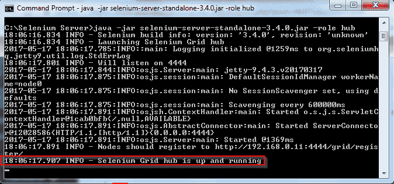
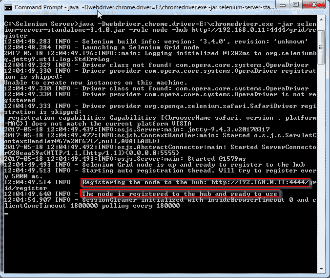

# 为分布式硒测试设置硒网格

> 原文：<https://www.edureka.co/blog/selenium-grid-tutorial>

本 Selenium 教程系列中的其他博客讲述了测试用例的创建以及按顺序和并行执行这些测试用例。因此，最后要讨论的技术是在远程机器上执行测试用例。Selenium Grid 可用于在远程机器/主机上执行这些测试。因此，这就是今天博客讨论的主题。通过 [Selenium 在线课程](https://www.edureka.co/selenium-certification-training)了解更多信息。

1.  [为什么以及何时使用硒格？](#WhyAndWhenUseSelenium)
2.  [硒格是什么？](#WhatIsSeleniumGrid)
3.  [硒栅 1 对硒栅 2](#Grid1vsGrid2)
4.  [架构硒格](#GridArchitecture)
5.  [建造硒栅](#BuildingSeleniumGrid)

## **为什么&什么时候使用硒栅？**

今天有如此多的网络浏览器在使用。用户可能使用 Chrome、Firefox、Safari、Opera 甚至 Internet Explorer 来阅读这个博客。他们可能使用不同版本的浏览器。他们也可以在任何操作系统上运行这些浏览器，无论是 Windows、Mac、Ubuntu 还是任何其他版本的 Linux。

如果用户在互联网上看到重要的东西会怎样？对你的生意很重要的事情。难道你不想多做一点(测试 web 应用程序)来确保你的用户和/或客户获得最好的用户体验吗？你会的，对吗？

嗯，你应该这么做！

但问题是，这有多可行？你能花时间在所有可能的操作系统和所有可用的网络浏览器上测试你的网络应用吗？嗯，听起来有点挑战。这就是 Selenium Grid 符合要求并帮助节省您的时间和精力的地方。

除此之外，还有一个问题，使用本地系统建立 Selenium 网格基础设施是否可行？维护一个包含所有必需的浏览器和操作系统的网格是一个挑战。为此，有多个在线平台提供了一个在线 selenium 网格，您可以访问它来运行 Selenium 自动化脚本。比如可以用 <u>[LambdaTest](http://bit.ly/2SzPV0Y)</u> 。它有 2000 多种浏览器环境，您可以在这些环境中运行您的测试，并真正实现自动化的跨浏览器测试。

## **硒格是什么？**

Selenium Grid 是 Selenium 工具套件中的另一个重要工具。Grid 能够协调 WebDriver 测试/ RC 测试，这些测试可以在多个 web 浏览器上同时运行，也可以在不同的操作系统上启动，甚至可以在不同的机器上运行。

那么，这是怎么回事呢？网格采用中心节点架构，其中有一个中心节点充当主节点，一个或多个节点充当从节点。

这意味着，如果你总共有 100 个任务/测试需要执行，那么测试可以在 5 台机器上同时执行，每台机器将运行 20 个测试。事实上，您可以在不同的操作系统和浏览器组合中执行这些测试。这里的每台机器可以有不同的操作系统，在每个操作系统中，测试可以在不同的浏览器上进行。

这个行为会很容易地节省你在测试执行中的大量时间。如果您考虑上面的例子，那么我们可以将执行时间减少到在单台机器上执行测试所花费的总时间的 1/5 左右。

如果你还记得我以前的博客，我已经无数次提到网格是 Selenium 项目的一部分，自从 Selenium v1 开始。Selenium Grid 也是 Selenium v2 的一部分，现在是 Selenium v3 的一部分。硒格的 v2 和 v3 差别不大。然而，v1 相比之下有很多不同之处。那么，让我们了解一下 v1 和 v2 的区别。

## **硒栅 1 对硒栅 2**

网格 1.0 和 2.0 的根本区别在于，网格 1 使用了 RC，网格 2 使用了 WebDriver。下表详细解释了这些差异。

| **网格 1** | **网格 2** |
| 要求安装 Apache Ant | 不需要安装 Apache Ant |
| 有自己的遥控器(这与 RC 服务器不同) | 与 Selenium 服务器 jar 文件捆绑 |
| 仅支持 Selenium RC 命令 | 支持 Selenium RC 和 WebDriver 脚本 |
| 每个遥控器只能自动化一个浏览器 | 每个遥控器最多可以自动化 5 个浏览器 |

既然我们已经了解了这两个版本之间的根本区别，让我们深入研究硒网格。

## **架构硒栅**

正如我前面提到的，网格基于一个中心和多个节点运行。但是，什么是集线器和节点，它们做什么？

### **枢纽**

在任何网格设置中，只能有一个中枢，它将成为网格设置的中心点。所有需要执行的测试都应该在这里加载。尽管这里加载了测试，但是它们将只在节点上执行。我们可以将任何主机配置为我们的中枢，它将协调其他主机中的测试执行活动。

为了实现这一点，我们需要首先配置 Hub，然后让其他节点注册到 Hub。在我讲述太多细节之前，让我向您展示配置集线器的命令。

### **配置集线器**

你需要首先从 Seleniumhq 的网站下载 Selenium 服务器 JAR 文件。这里的链接是[这里的](http://docs.seleniumhq.org/download/)。您还需要确保系统中安装了 Java，并且设置了环境变量。

下载完 jar 文件后，您需要将它放在一个合适的目录中。为了方便起见，我下载了它，并把它放在 c 盘的 Selenium 文件夹中。建议您也下载 jar 文件，并将其放在所有其他节点的类似目录中。

要配置集线器，需要在 windows 命令提示符下运行命令。该命令出现在下面的代码片段中。

```
C:UsersVardhan> cd ..
C:Users> cd .. 
C:> cd Selenium 
C:Selenium> java -jar selenium-server-standalone-3.4.0.jar -role hub
```

***selenium-server-standalone-3 . 4 . 0 . jar***是我下载的 jar 文件的名字。***-角色*** 标志用于将该特定主机设置为集线器。当你按下回车键时，你会在屏幕上看到下面的输出。



如果你没有注意到上面的截图，那么再看一遍。上面写着'***--节点要注册到 http://192 . 168 . 0 . 11:4444/grid/register***'。既然集线器已经配置好了，我们需要设置节点并将它们连接到这个集线器。

192.168.0.11 是 Hub 的 IP 地址，每个节点都要连接到这个 IP 地址。4444 是默认端口号，Selenium Grid 在这个端口号上被托管并监听请求。如果一些其他服务正在端口 4444 上运行，并且您希望 Selenium Grid 托管在另一个端口上，那么您可以通过指定后跟端口号的 ***-port*** 标志来实现。

### **节点**

节点是运行测试的主机。这些测试将由中心发起。Hub 可以在远程机器或 Hub 本身所在的同一台机器上启动一个或多个节点。在每个节点上，可以引导不同的操作系统，并且在不同的操作系统上，可以启动同一浏览器或不同浏览器的不同版本。

### **配置节点**

与 Hub 类似，您需要首先在节点机器中下载 Jar 文件，并为了方便起见将其放在 c 盘或任何其他公共目录中。然后，您可以在 Windows 命令提示符下运行下面的命令。如果您在与 Hub 相同的机器上启动节点，那么您需要通过启动另一个命令提示符来运行命令。

```
java -Dwebdriver.chrome.driver=E:chromedriver.exe -jar selenium-server-standalone-3.4.0.jar -role node -hub http://192.168.0.11:4444/grid/register
```

与启动中心所需的命令相比，这个命令有一些不同。***-dwebdriver . chrome . driver = E:chrome driver . exe***用于设置浏览器驱动的路径。类似于在您的 WebDriver 代码中设置浏览器驱动程序的路径，您在这里指定它，以便使节点能够执行测试。从 Selenium v3 开始，您需要下载 Firefox 的驱动程序浏览器。Firefox 的浏览器驱动是 Gecko 驱动。但是，在版本 1 和 2 中，您需要为除 Firefox 之外的所有浏览器设置浏览器驱动程序。***-角色节点*** 标志用于将该特定主机设置为节点。***——hub http://192 . 168 . 0 . 11:4444/grid/register***通知节点使用 Hub 的 IP 地址连接 Hub。需要注意的重要一点是，如果您在与 hub 相同的机器上启动任何节点，那么您可以在命令中指定'***-Hub http://******localhost:4444/grid/register***'，而不是 Hub 的 IP 地址。

当你按下回车键时，你会在命令提示符下得到下面的输出。



到现在为止，节点应该已经连接到了集线器。您可以通过返回用于启动中心的命令提示符来验证这一点，您会注意到以下消息:' ***注册了一个节点 http://192 . 168 . 0 . 11:5555***'。

IP 地址和端口号是您的节点的 IP 地址和端口号。因为我的节点和集线器在同一台机器上，所以用于节点的端口是 5555。当您在其他机器上启动它时，将使用默认端口。

当您在 Hub 的机器中启动以下 URL 时，您将获得连接到 Hub 的节点的状态。请参见下面截图中突出显示的部分。


现在您的 Selenium 网格已经配置好了，您可以继续在节点上执行测试脚本了。让我再次强调，我们需要在我们的 Hub 中运行脚本，它们将在我们的节点中执行。用于执行测试的脚本类似于 WebDriver 测试。

## **建造硒栅**

我已经在 Eclipse IDE 中运行了我的脚本。这个脚本的执行依赖于两个重要的库包。它们是 **DesiredCapabilities** 对象和 **RemoteWebDriver** 对象。

DesiredCapabilities 用于设置我们节点的浏览器类型和操作系统。若要导入 DesiredCapabilities 对象，请使用以下代码。

```
import org.openqa.selenium.remote.DesiredCapabilities;

```

RemoteWebDriver 用于选择我们想要执行测试的节点。若要导入 RemoteWebDriver 对象，请使用以下代码行。

```
import java.net.MalformedURLException;
import java.net.URL;
import org.openqa.selenium.remote.RemoteWebDriver;

```

我已经为我的脚本导入了这两个包和 TestNG annotations 包，如下面的代码片段所示。我已经导入了 TestNG 注释，因为我已经将它作为 TestNG 测试来执行，并将为其生成详细的报告。我建议您为您的代码导入相同的一组包。

当你在 Selenium Hub 控制台中的任何浏览器图标上移动时，你会得到你想要自动化的节点的细节，如*浏览器名称*和*平台*。该图像还指示了我可以在我的节点中打开多少个浏览器实例。我最多可以配置 5 个 chrome、5 个 Firefox 和 1 个 Internet Explorer 实例。这些细节显示在下面的截图中。

您可以使用下面代码片段中的代码来设置您的第一个网格。

```
package GridTest;

import org.testng.annotations.AfterTest;
import org.testng.annotations.BeforeTest;
import org.testng.annotations.Test;

import java.net.MalformedURLException;
import java.net.URL;

import org.junit.Assert;
import org.openqa.selenium.Platform;
import org.openqa.selenium.WebDriver;
import org.openqa.selenium.remote.DesiredCapabilities;
import org.openqa.selenium.remote.RemoteWebDriver;

public class TestGrid {
 static WebDriver driver;
 static String nodeUrl;

 @BeforeTest
 public void setup() throws MalformedURLException {
 nodeUrl = "http://192.168.0.11:5555/wd/hub";
 DesiredCapabilities capabilities = DesiredCapabilities.chrome();
 capabilities.setBrowserName("chrome");
 capabilities.setPlatform(Platform.WINDOWS);
 driver = new RemoteWebDriver(new URL(nodeUrl), capabilities);
 }

 @Test
 public void simpleTest() {
 driver.get("https://www.edureka.co/");
 Assert.assertEquals("Instructor Led Online Courses with 24x7 On-Demand Support | Edureka", driver.getTitle());
 }

 @AfterTest
 public void afterTest() {
 driver.quit();
 }
}

```

我已经将整个测试脚本分成了三个测试注释。@BeforeTest、@Test 和@AfterTest。在@BeforeTest 中，我使用了 DesiredCapablities 和 RemoteWebDriver 对象来配置我的节点。在@Test 中，我要求节点导航到 Edureka 的主页，并断言页面的标题。在@AfterTest 中，我要求节点退出浏览器实例。

当您的测试通过执行时，您将得到下面的输出。

```
May 18, 2017 3:09:07 PM org.openqa.selenium.remote.ProtocolHandshake createSession
INFO: Detected dialect: OSS
PASSED: simpleTest

===============================================
 Default test
 Tests run: 1, Failures: 0, Skips: 0
===============================================

===============================================
Default suite
Total tests run: 1, Failures: 0, Skips: 0
===============================================
```

由于这是作为 TestNG 测试来执行的，您将会得到一份类似于下面屏幕截图的详细测试报告。


如果你不知道什么是 TestNG 以及如何使用测试注释，那么请阅读我的关于如何将 [Selenium WebDriver 与 TestNG](https://www.edureka.co/blog/selenium-webdriver-tutorial) 一起使用的博客。

您可以观看下面的视频，观看如何构建 Selenium 网格的演示。发布视频的讲师解释了本博客中解释的相同概念。

## **硒格初学者教程|硒格教程|爱德华卡**

[//www.youtube.com/embed/kAvzKA9wsbo?rel=0&showinfo=0](//www.youtube.com/embed/kAvzKA9wsbo?rel=0&showinfo=0)

所以，这就把我们带到了 Selenium Grid 博客的结尾。如果你对这个博客系列的任何代码/内容有任何疑问或问题，请在下面的评论区留下，我会在第一时间解决你的问题。

*如果您希望学习 Selenium 并在测试领域建立自己的事业，请点击此处查看我们的互动在线直播 [Selenium 认证培训](https://www.edureka.co/selenium-certification-training)，它将为您提供全天候支持，在整个学习期间为您提供指导。*

*有问题吗？请在评论区提到它，我们会给你回复。*