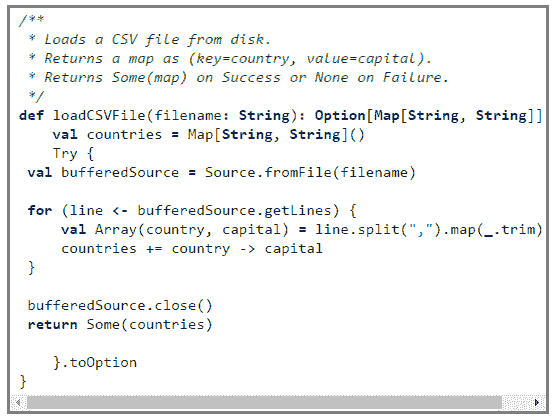
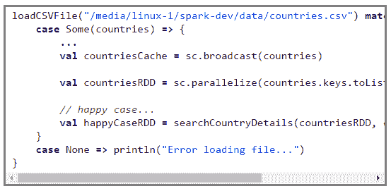

# 使用广播变量的分布式缓存:Apache Spark

> 原文：<https://www.edureka.co/blog/broadcast-variables/>

*供稿:Prithviraj Bose*

当大型数据集需要缓存在执行器中时，广播变量非常有用。这篇博客解释了如何开始。

什么是广播变量？

Apache Spark 中的广播变量是一种在执行器之间共享只读变量的机制。如果没有广播变量，这些变量将被发送到每个转换和动作的每个执行器，这会导致网络开销。然而，对于广播变量，它们被一次性发送给所有的执行器，并被缓存以备将来参考。

## 广播变量用例

想象一下，在进行转换时，我们需要查找一个大的邮政编码/pin 码表。这里，既不能每次都把大的查找表发给执行者，也不能每次都查询数据库。解决方案应该是将这个查找表转换成一个广播变量，Spark 会将它缓存在每个执行器中以供将来参考。

我们举一个简单的例子来理解上面的概念。我们有一个 CSV 文件，上面有各国及其首都的名称。CSV 文件可以在[这里](https://github.com/prithvirajbose/spark-dev/blob/master/data/countries.csv)找到。

假设我们正在处理国家的人口统计数据，我们需要得到那个国家的首都。在这种情况下，我们可以将 CSV 文件中的数据转换为广播变量。

首先，我们将 CSV 文件加载到地图中，如果找到了该文件，那么该方法将返回*一些(国家)*否则将返回*无*。

成功加载 CSV 文件后，我们将地图转换为广播变量，并在我们的程序中使用它。

在上面的代码片段中，我们将 CSV 文件加载到地图*国家*中，然后我们将该地图转换为广播变量*国家缓存*。随后，我们从*国家*的键中创建一个 RDD。在 *searchCountryDetails* 方法中，我们搜索以用户定义的字母开头的所有国家，该方法返回国家的 RDD 及其首都。广播变量 *countrieCache* 用于查找大写字母。通过这种方式，我们无需在每次需要搜索时发送完整的 CSV 数据。

*searchCountryDetails* 的代码如下所示，

完整的源代码可以在[这里](https://github.com/prithvirajbose/spark-dev/blob/master/src/main/scala/examples/TestBroadcastVariables.scala)找到。

有问题要问我们吗？在评论区提到它们，我们会回复你。

**相关帖子:**

[Apache Spark 和 Scala](https://www.edureka.co/apache-spark-scala-training "Get started with Apache Spark and Scala")T3【入门】

[火花累加器解释](https://www.edureka.co/blog/spark-accumulators-explained)

[阿帕奇火花组合](https://www.edureka.co/blog/apache-spark-combinebykey-explained)比奇解释