# Talend 教程-数据集成的未来

> 原文：<https://www.edureka.co/blog/talend-tutorial-data-integration/>

在当今数据驱动的世界中，各种组织、机器和小工具都会产生大量数据，无论其大小如何。比如你的手机，每次你浏览网页，都会产生一定量的数据。你知道一架商用飞机每小时可以产生高达 500GB 的数据吗？希望现在你能想象这个数据有多大！这就是它被称为大数据的原因。但是所有这些数据几乎都是无用的，除非您对其执行 ETL 操作！相信我，这当然不是一件容易的事。此外，当今业务的实时和快节奏特性，增加了对能够快速和容易地集成系统的工具的需求。 好吧，这就是塔伦德来救援的地方。通过这篇关于 Talend 教程的博客，我将解释 Talend 如何帮助构建、测试、部署、调度和监控这些数据。

在我继续之前，让我先列出我今天要讨论的话题:

*   [什么是 Talend？](#WhatIsTalend)
*   [Talend 开放工作室简介](#IntroductionToTOS)
*   [TOS 安装](#TOSInstallation)
*   [TOS GUI](#TOSGUI)
*   [Talend Job](#TalendJob)
*   [t lend 组件和连接器](#TalendComponents&Connectors)
*   [元数据](#Metadata)
*   [上下文变量](#ContextVariables)
*   [在 Talend](#FirstJobInTalend) 的第一份工作

您也可以浏览一下这个 Talend 数据集成教程的录音，我们的 专家 已经用例子详细地解释了这些主题。

## **Talend 数据整合教程| Talend 在线培训| edu reka**

[https://www.youtube.com/embed/ewjPt-fhdMs?rel=0&showinfo=0](https://www.youtube.com/embed/ewjPt-fhdMs?rel=0&showinfo=0)*This Edureka video on Talend Data Integration Tutorial will help you in understanding the basic concepts of Talend and getting familiar with the Talend Open Studio which is an open-source software provided by Talend to develop the ETL Jobs.*

## **什么是 Talend？–Talend 教程**

Talend 是一个开源软件集成平台/供应商，提供数据集成和数据管理解决方案。这家公司为大数据、云存储、数据集成、数据管理、主数据管理、数据质量、数据准备和企业应用提供各种集成软件和服务。其总部位于加利福尼亚州的*红木城。*

以下是 Talend 的一些主要特性:

它被认为是云和大数据集成软件的下一代领导者。它提供的软件通过提高数据的可访问性、改善数据质量并将其快速转移到实时决策所需的位置，来帮助公司实现数据驱动。 你可以认为 Talend 是这个数据驱动世界的关键基础设施。这是一种开源方法，通过提供强大的软件解决方案，打破了传统的专有模式。它能够灵活地满足所有组织的需求。作为开源软件，它得到了一个庞大的开发者社区的支持。Talend 在 GNU 公共许可证或 Apache 许可证下发布其核心模块的代码。从这里开始，社区中的开发人员可以对产品进行修改和改进，从而使其他 Talend 用户受益。

Talend 提供的各种产品有:

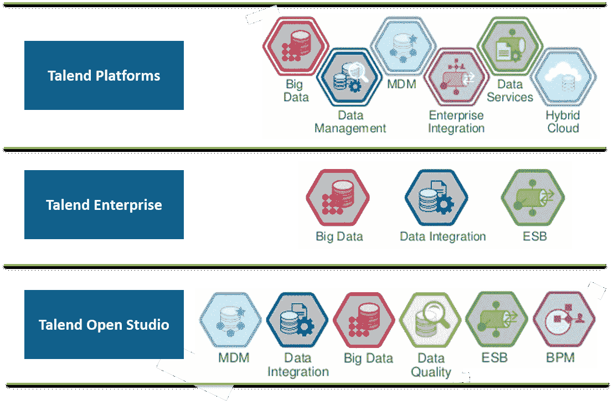

在上述所有产品中，Talend Open Studio (TOS)是最主要和最常用的。在这个 Talend 教程博客中，我将解释如何使用 Talend Open Studio 进行数据集成。

## **Talend 开放工作室(TOS)简介—****Talend 教程**

Talend Open Studio 是一个基于 Eclipse RCP 的开源项目。它支持面向 ETL 的实现，通常用于内部部署。它广泛用于操作系统、ETL 过程和数据迁移之间的集成。talend Open Studio for Data Integration 的设计能够轻松地组合、转换和更新组织中不同位置的数据。它充当代码生成器，生成数据转换脚本和 Java 中的底层程序。它提供了一个交互式和用户友好的 GUI，允许您访问包含在 Talend 中执行的每个流程的定义和配置的元数据存储库。下面是 Talend Open Studio 的基本架构。

现在，让我们尝试在 CentOS 上下载并安装 Talend Open Studio。

## **TOS 安装–Talend 教程**

**第一步:**转到:

**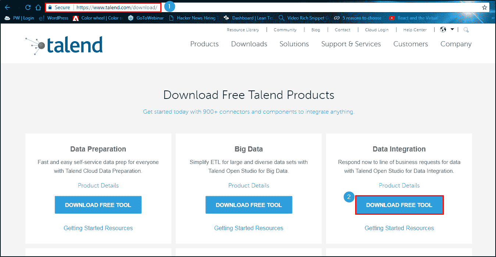 第二步: ** 点击‘下载免费工具’。 

**第三步:**再次点击‘下载免费工具’获取 zip 文件。

**第四步:**现在解压 zip 文件。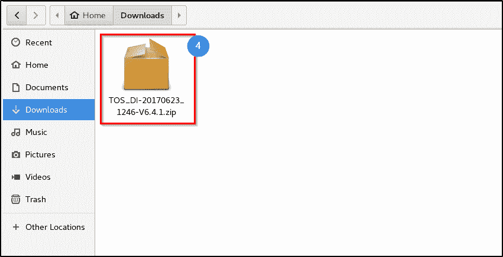

**第五步:**现在进入解压后的文件夹，双击 **TOS_DI-linux-gtk-x86_64** 文件。 

**第六步:**让安装完成。

**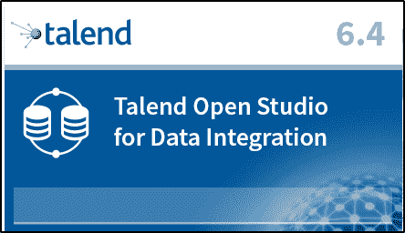 第七步: ** 点击‘创建新项目’并为你的项目指定一个有意义的名字。

** 第八步: ** 点击‘完成’进入打开工作室 GUI。

**第九步:**右键点击*欢迎标签*，选择‘关闭’。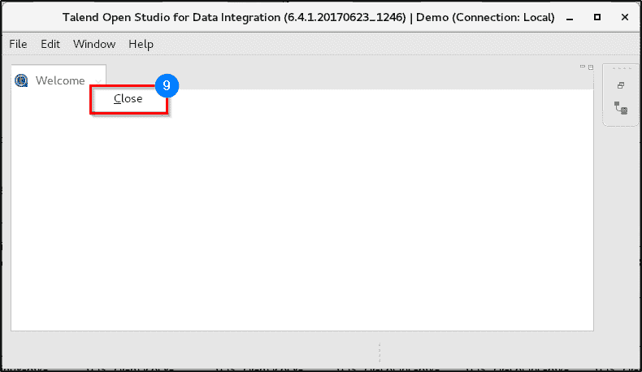

**第十步:** 现在你应该可以看到 TOS 主页面了。 ****

## **TOS GUI–Talend 教程**

现在你已经下载并安装了 Talend Open Studio，让我给你演示一下它的 GUI。Talend Open Studio 由四大部分组成，如下图所示。

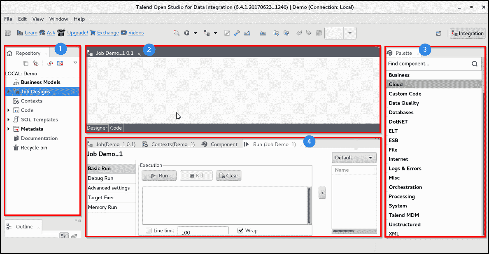

1.  ### **储存库**

    *库*收集了所有可用于描述商业模式或设计 Talend 工作的技术项目，并以树形结构显示出来。从*库*，你可以访问各种商业模式、工作设计、可重用程序、文档以及数据库连接。换句话说，*库*充当了一个项目中任何工作设计或业务建模所必需的所有元素的中央存储。

2.  ### **设计窗口**

    该窗口进一步由以下部分组成:

    1.  ***工作空间:*** 在这里你可以制定你的工作设计以及商业模式。
    2.  ***设计器标签:*** 当您创建一个以图形模式显示作业的作业时，该标签默认打开 。
    3.  ***代码标签:*** 该标签帮助您可视化代码并突出显示可能的语言错误。
3.  ### **调色板**

    组件面板停靠在设计工作区的顶部，帮助您绘制符合您工作流程需求的模型。根据您的工作或业务模型，您可以将各种技术组件或形状拖放到设计工作区中。有超过 800 种*组件*可供您选择。

4.  ### **配置页签**

    配置选项卡出现在设计窗口的下半部分。TOS 中有各种配置选项卡。每个选项卡都打开一个视图，显示工作区中当前元素的属性。最常用的配置页签有:

    1.  #### **作业页签:**

        作业选项卡提供设计器窗口中当前作业的各种信息，包括名称、版本、创建日期和时间等。

    2.  #### **上下文标签**

        上下文选项卡用于设置上下文变量以及它们将被使用的 n 的不同上下文。

    3.  #### **组件页签**

        组件选项卡显示配置组件所需的所有参数。基本上，它收集与设计工作区中选定的图形元素相关的所有信息。

    4.  #### **运行选项卡**

        运行选项卡显示作业的执行进度。此处显示的日志包括任何开始、结束和错误消息。

在这里，你可能会问“什么是工作”，因为到目前为止，我已经多次使用这个术语了。所以，在深入之前，让我先给你简单介绍一下 T2 的一份兼职工作。

## **Talend Job–Talend 教程**

Talend 的“工作”基本上是将客户要求转化为技术流程。从技术上讲，它是使用 Talend 构建的任何流程的基本可执行单元。正如您已经知道的，TOS 在后端将所有东西转换成 Java 代码。对于作业，每个作业都被转换成一个 Java 类。让我告诉你如何在 Talend 中创建一份工作。

### **步骤:**

1.  右击储存库中的“作业设计”,并选择“创建作业”。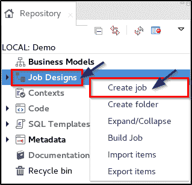
2.  为您的工作指定一个有意义的名称及其目的和描述，然后点击“完成”。
3.  完成创建作业后，您将可以访问调色板中的组件。现在，您可以从组件面板中拖动任何您需要的组件，并将其放到工作区中。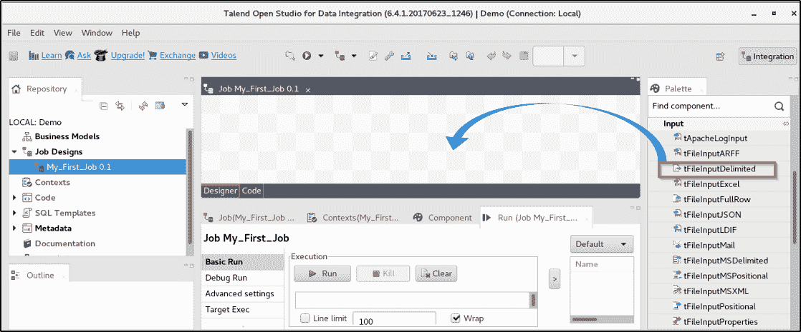

但是为了将组件添加到作业中，首先，你需要知道组件到底是什么，你如何将多个组件一起使用并连接它们。因此，在本 Talend 教程的下一部分，我将向您介绍 Talend 中可用的各种组件和连接器。

## **Talend 组件和连接器——Talend 教程**

先说组件。

组件是用于在 Talend 中执行单一操作的功能块。在调色板上，你能看到的都是组件的图形表示。您可以通过简单的拖放来使用它们。在后端，组件是作为作业的一部分生成的 Java 代码片段(基本上是 Java 类)。这些 Java 代码会在保存作业时自动编译。 根据需求，一个 Talend 作业可能包含一个或多个组件。这里你需要知道的一件事是 Talend 提供了 800 多种组件供你选择。为了便于访问，所有这些组件都被归纳为几个组或族。在这个 Talend 教程博客中，我将向您介绍每个家族中一些最重要和最常用的组件。

*   ### **数据库**

    该系列提供了 Talend 组件，涵盖了各种需求，如打开连接、读写表、提交事务、执行错误处理回滚等。Talend 支持超过 40 个 RDBMS ，其中一些是 MySQL，MS SQL Server，Hive，Amazon，Azure 等。以下是一些主要使用的 MySQL 组件:

    *   ***tmysql connection***:该组件为当前事务打开一个新的数据库连接。
    *   ***tmysql input:***该组件读取数据库并根据查询提取字段。
    *   ***tmysql output:***该组件写入、更新、更改或取消数据库中的条目。
    *   ***tmysql close:***该组件关闭连接数据库中提交的事务。
*   ### **文件**

    这个系列将各种组件组合在一起，这些组件在所有类型的文件中读写数据，如分隔文件、位置文件、XML 文件、Excel 文件等。此外，它还提供了许多组件，帮助执行各种任务，如解压缩，删除，复制，比较等。这个系列又进一步分为子系列，如输入、输出和管理。该系列中几个主要使用的组件是:

    *   ***tFileInputDelimited:***这个组件逐行读取一个给定的文件，文件中的字段用一些指定的字符隔开。
    *   ***tFileInputExcel:***该组件读取一个 Excel 文件(。xls 或者。xlsx)并逐行提取数据。
    *   ***tFileOutputXML:***该组件将数据输出到 XML 类型的文件中。
    *   ***tFileList:*** 该组件基于文件掩码模式检索一组文件或文件夹，并对它们进行迭代。
    *   ***tFileArchive:***该组件根据定义的参数压缩一个或多个文件，并将创建的档案放在选择的目录下。
*   ### **互联网**

    这个家族包括所有帮助从互联网访问信息的组件，通过各种方式，如 Web 服务、RSS 流、SCP、 MOM、电子邮件、FTP 等。该系列中几个主要使用的组件是:

    *   ***tFTPGet:*** 该组件帮助通过 FTP 连接检索指定的文件。
    *   ***tftput:***该组件通过 FTP 连接复制选中的文件。
    *   ***tHttpRequest:***该组件向服务器端发送 HTTP 请求，并接收服务器端相应的响应。
    *   ***tSendMail:*** 该组件用于向定义好的收件人发送邮件和附件。
*   ### **日志&错误**

    该系列将所有专用于捕获日志信息和处理作业错误的组件组合在一起。以下是该系列主要使用的组件:

    *   ***tLogRow:*** 该组件允许您将*行*数据写入作业日志文件，或写入控制台窗口。
    *   ***tlogowcatcher:***该组件收集日志数据并封装后传递给定义的输出。
    *   ***tWarn:*** 该组件触发一个警告，该警告经常被 **tLogCatcher** 组件捕获，用于穷举日志。
    *   ***tDie:*** 该组件向 **tLogCatcher** 发送消息，允许作业终止作业，并带有指定的退出代码
*   ### **杂项**

    这个系列集合了不同的杂项组件，涵盖了各种需求，如创建虚拟数据行集、缓冲数据、加载上下文变量等。这个家族的几个重要组成部分是:

    *   ***tMsgBox:*** 这个组件打开一个对话框，里面有一个可点击的 OK 按钮。
    *   ***trow generator:***该组件用于使用从列表中取出的随机值生成所需数量的行和字段。
*   ### **编排**

    该系列包括各种有助于排序或协调任务以及处理作业或子作业等的组件。该系列中主要使用的部件有:

    *   ***tLoop:*** 该组件有助于根据指定迭代次数的循环自动执行任务或工作。
    *   ***tPrejob:*** 该组件帮助触发执行作业所需的任务。
    *   ***tPostjob:*** 该组件有助于在作业执行后触发所需的任务。
    *   ***t 休假:*** 该组件有助于在作业执行中实现休假。

现在你已经知道了组件，让我们快速看一下在工作中帮助将这些组件连接在一起的连接器或链接。

Talend 提供各种类型的连接，以实现组件之间的通信:

1.  ### **排** 排

    行连接处理实际的数据流。以下是 Talend 支持的行连接类型:

    *   主
    *   查找
    *   过滤器
    *   拒绝
    *   错误拒绝
    *   输出
    *   唯一/重复
    *   多路输入/输出
2.  ### **迭代**

    迭代连接用于对目录中包含的文件、文件中包含的行或数据库条目执行循环。与其他类型的连接不同，这个迭代链接的名称是只读的。

3.  ### **触发**

    触发器连接用于创建作业或子作业之间的依赖关系，这些作业或子作业根据触发器的性质被一个接一个地触发。触发连接归纳为两类:

    1.  #### **child jobs trigger**

        *   OnSubjobOK
        *   OnSubjobError
        *   运行如果
    2.  #### **Components trigger**

        *   OnComponentOK
        *   on component 错误
        *   运行如果
4.  ### **链接**

    Link 连接只能与 ELT 组件一起使用。它用于将表模式信息传输到 ELT mapper 组件，以便在特定的 DB 查询语句中使用。

## **元数据 Talend 教程**

Talend 中的元数据是定义数据，基本上提供了关于所有在 Talend Studio 中管理的其他数据的信息 。您可以在 TOS 的存储库区域找到元数据。在 存储库元数据中，您可以存储关于您可能使用的各种数据源的元数据。这在开发任何项目时都很方便，因为您可以在以后的工作中使用这些数据源，只需将对象从存储库中拖放到工作区中。

在存储库中，您可以存储各种数据源的元数据，如分隔文件、位置文件、XML 文件、数据库、FTP、Azure、Salesforce 等。

## **上下文变量–Talend 教程**

上下文变量是 Talend 使用的用户定义参数，在运行时传递给作业。随着工作从开发升级到测试和生产环境，这些变量可能会改变它们的值。因此，一旦为每个环境正确设置了这些变量，您就可以在这些环境中轻松地执行作业。上下文变量的另一个用途是定义项目中常用的值。你可以用三种方式创建上下文变量:

1.  ### **嵌入上下文变量**

    这些上下文变量嵌入到作业中，并像作业设计器下方的*上下文选项卡*中的任何其他组件参数一样进行配置。

2.  ### **储存库上下文变量**

    当多个作业中使用或需要上下文变量时，会创建这些变量。它们在存储库中集中维护，允许一般访问。

3.  ### **外部上下文变量**

    外部上下文变量是那些保存在外部文件中并在运行时加载到 Studio 作业中的上下文变量。

现在，我想你已经准备好设计你在 Talend 的第一份工作了。

在这个 Talend 教程博客的下一部分，我将向你展示一个简单的 Talend 工作的一步一步的演示，你可以很容易地执行。

## **Talend 第一份工作——Talend 教程**

下面是一个演示，首先你将与数据库建立连接，从 两个不同的外部 excel 文件中读取数据，合并它们，然后将其插入数据库表中。然后在新的 excel 文件中写入新的表格内容。最后，传输完成后关闭连接。

我们来看看如何执行，一步一步来:

**步骤 1:** 在这个演示中，我使用外部上下文文件来获取数据库细节。为此，首先，您需要创建一个包含所有必要数据库细节的上下文文件。

****

**第二步:**创建一个新工作。转到“上下文”选项卡，添加以下详细信息:

**第三步:**现在，在工作区中添加一个‘pre job’和一个‘tmysql connection’组件，并将它们链接在一起，如下图所示。这将在实际作业执行之前建立与数据库的连接。然后转到“tMysqlConnection”组件的“组件”选项卡，添加必要的详细信息:

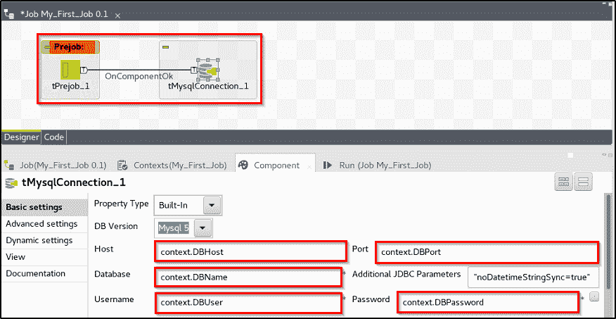

**第四步:**在工作区添加两个‘tFileInputExcel’文件和一个‘tMap’组件，如图所示链接。

*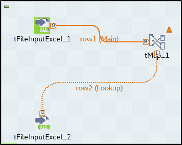***STEP 5:** Now go to the ‘Repository’ and expand ‘Metadata’ section. Right click on ‘File Excel’ and select ‘Create File Excel’ and then provide the necessary details as shown below. Once done click on ‘Next’.**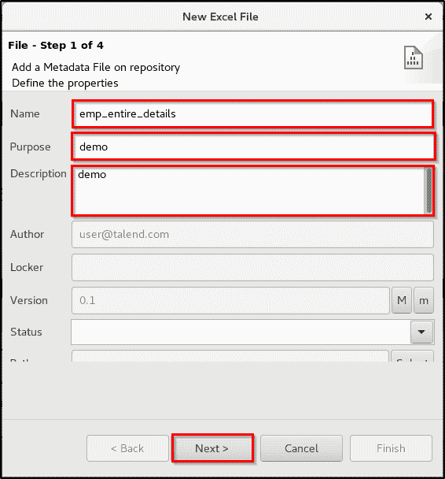****STEP 6:** Provide the source file path and click on ‘Next’.**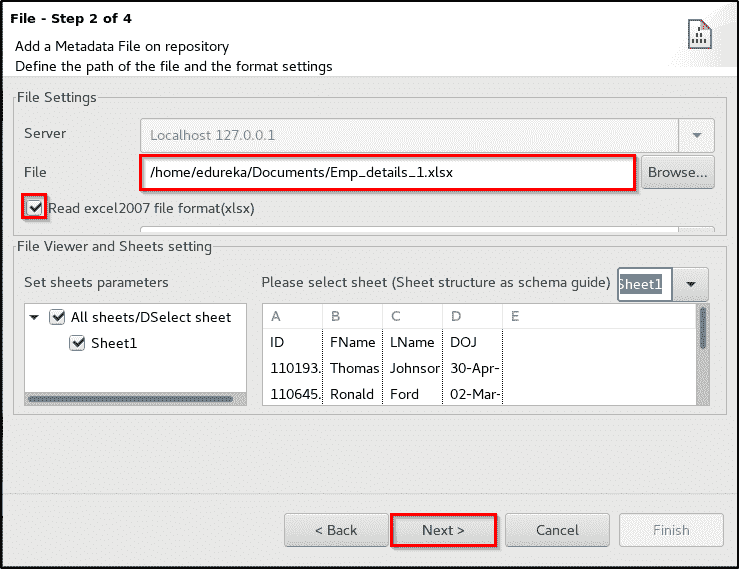****STEP 7:** Check on ‘Header’ to skip the header row (if applicable). Click on ‘Next’.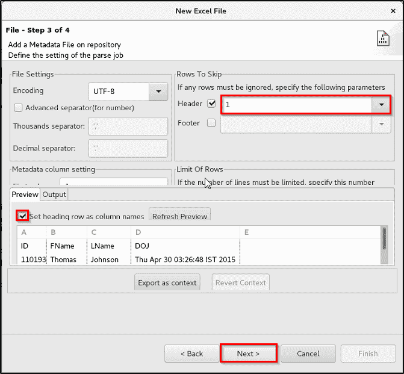**STEP 8:** Finally provide a name for the ‘schema’ and click on ‘Finish’.

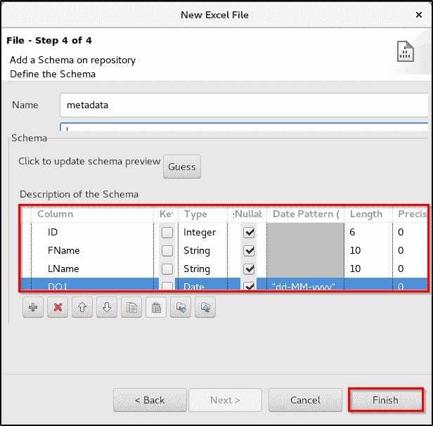

**STEP 9:** Go to the ‘Component’ tab of the ‘tFileInputExcel’ component. Select the ‘Property Type’ as ‘Repository’ and select the metadata, you just created.******STEP 10:** Repeat the same for the other input file.**STEP 11:** Double-click on the ‘tMap’ component and map the input and output tables as shown: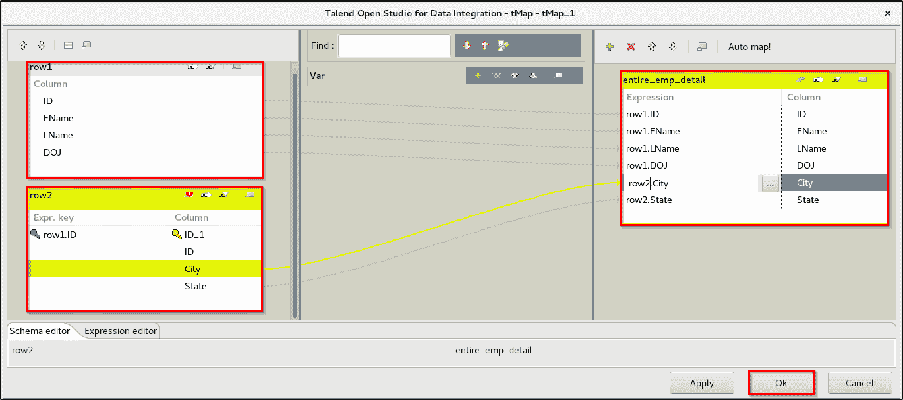**STEP 12:** Add ‘tMysqlOutput’ and ‘tFileOutputExcel’ components and link them as shown:*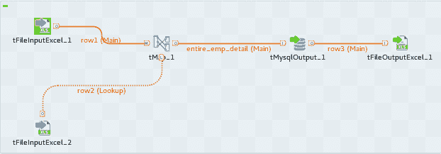***STEP 13:** Go to the component tab of ‘tMysqlOutput’ and enter the details as shown:******STEP 14:** Go to the component tab of ‘tFileOutputExcel’ and provide the details as shown:**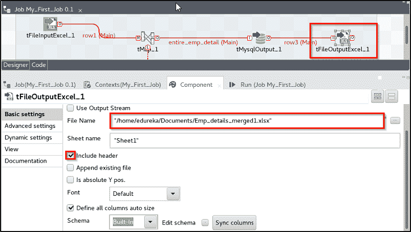****STEP 15:** Finally to finish the job, add a ‘Postjob’ and a ‘tMysqlClose’ component as shown.*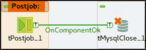***STEP 16:** Go to the ‘Component’ tab of the ‘tMysqlClose’ component and select the connection you need to close.****STEP 17:** Now go to the ‘Run’ tab and execute the job.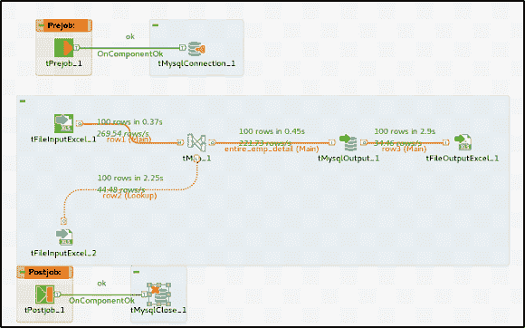So, this brings us to the end of the blog on Talend Tutorial. I tried my best to keep the concepts short and clear. Hope it helped you in understanding Talend and its various features. Regarding the demo, if you need the datasets for the practice, all you need to do is drop a comment.*If you found this Talend tutorial** blog, relevant, **check out the [**Talend Certification**](https://www.edureka.co/talend-for-big-data) Training **by Edureka, a trusted online learning company with a network of more than 250,000 satisfied learners spread across the globe. The Edureka Talend for DI and Big Data Certification Training course helps you to master Talend and Big Data Integration Platform and easily integrate all your data with your Data Warehouse and Applications, or synchronize data between systems.**Got a question for us? Please mention it in the comments section and we will get back to you.*