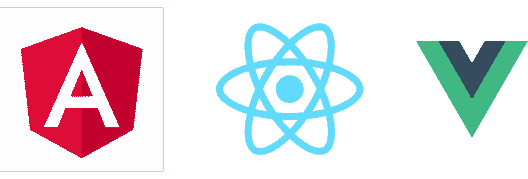

# 2023 年你必须准备的 50 个 JavaScript 面试问题

> 原文：<https://www.edureka.co/blog/interview-questions/javascript-interview-questions/>

今天，**谷歌**和**脸书**使用 JavaScript 构建复杂的、类似桌面的网络应用。随着 [Node.js](https://www.edureka.co/blog/nodejs-tutorial/) 的推出，它也成为构建服务器端软件最流行的语言之一。今天，即使是网络也不足以容纳 JavaScript 的多功能性。我相信你已经意识到了这些事实，这让你想到了这篇 JavaScript 面试问题的文章。

因此，如果你正计划在 [JavaScript](https://www.edureka.co/blog/what-is-javascript/) 开始你的职业生涯，并且你希望了解与之相关的技能，现在是时候投入进去了，因为这项技术正处于蓬勃发展的状态。 **JavaScript 面试问题**和我们的 [JavaScript 培训](https://www.edureka.co/javascript-certification-training)和 [Java 认证](https://www.edureka.co/java-j2ee-training-course)培训将为您提供深入的知识，帮助您准备面试。

JavaScript 面试问题分为三个部分:

*   **[初级](#beginner)**
*   **[中级](#inter)**
*   **[高级水平](#advanced)**

让我们从 JavaScript 面试问题的第一部分开始。

## **2023 年 JavaScript 面试问答|爱德华卡**


[//www.youtube.com/embed/kl2bM9e-jJc?rel=0&showinfo=0](//www.youtube.com/embed/kl2bM9e-jJc?rel=0&showinfo=0)

这个关于“JavaScript 面试问题”的 Edureka 视频将帮助你为 JavaScript 面试做好准备。

## **新生初级 JavaScript 面试问答**

### **Q1。Java & JavaScript 有什么区别？**

| **Java** | **JavaScript** |
| Java 是一种面向对象的编程语言。 | JavaScript 是一种面向对象的脚本语言。 |
| 它创建在虚拟机或浏览器中运行的应用程序。 | 代码只能在浏览器上运行。 |
| Java 代码需要编译。 | JavaScript 代码都是文本形式的。 |

### **Q2。JavaScript 是什么？**

[JavaScript](https://www.edureka.co/blog/what-is-javascript/) 是一种**轻量级**，**解释的**编程语言，具有面向对象的能力，允许你在静态的 HTML 页面中构建交互性。该语言的通用核心已经嵌入到 Netscape、Internet Explorer 和其他 web 浏览器中。

### **Q3。JavaScript 支持哪些数据类型？**

JavaScript 支持的**数据类型**有:

*   未定义
*   Null
*   布尔型
*   字符串
*   符号
*   号
*   物体


### **Q4。JavaScript 有什么特点？**


以下是 JavaScript 的 [**特性**:](https://www.edureka.co/blog/javascript-tutorial/)

*   它是一种轻量级的解释型 T2 编程语言。
*   它是为创建**以网络为中心的**应用而设计的。
*   它是 Java 的补充和**集成**。
*   它是一种**开放的**和**跨平台的**脚本语言。

### **Q5。JavaScript 是区分大小写的语言吗？**

是的，JavaScript 是一种区分大小写的 T2 语言。语言关键字、变量、函数名和任何其他标识符必须始终以一致的大写字母键入。

### **Q6。JavaScript 有什么优势？**

 以下是使用 JavaScript 的**优势**——

*   **更少的服务器交互**—你可以在将页面发送到服务器之前验证用户输入。这可以节省服务器流量，也就是说减少了服务器的负载。
*   **即时反馈给访问者**——他们不必等待页面重新加载来查看他们是否忘记输入了什么。
*   **增加交互性**—您可以创建界面，当用户用鼠标悬停在其上或通过键盘激活时，界面会做出反应。
*   **更丰富的界面**—你可以使用 JavaScript 来包含诸如拖放组件和滑块等项目，从而为你的网站访问者提供丰富的界面。

### **Q7。如何用 JavaScript 创建一个对象？**

JavaScript 很好的支持**对象**概念。您可以使用**对象文字**创建一个对象，如下所示

```

var emp = {
name: "Daniel",
age: 23
};

```

### **Q8。如何用 JavaScript 创建数组？**

你可以使用**数组文字**来定义数组，如下所示-

```

var x = [];
var y = [1, 2, 3, 4, 5];

```

### **Q9。JavaScript 中的名字函数是什么&如何定义？**

一个命名函数一旦被定义就声明了一个名字。可以用**函数**关键字定义为:

```

function named(){
// write code here
}

```

### **Q10。你能把一个匿名函数赋给一个变量，并把它作为一个参数传递给另一个函数吗？**

是的！匿名函数可以赋给变量。它也可以作为参数传递给另一个函数。

如果你在这些 JavaScript 面试问题上面临任何挑战，请在下面的部分评论你的问题。

### **Q11。JavaScript 中的参数对象是什么&如何获取传递给函数的参数类型？**

JavaScript 变量 arguments 代表传递给函数的**参数**。使用**类型的**操作符，我们可以得到传递给函数的参数类型。例如

```

function func(x){
console.log(typeof x, arguments.length);
}
func(); //==> "undefined", 0
func(7); //==> "number", 1
func("1", "2", "3"); //==> "string", 3

```

### **Q12。JavaScript 中变量的作用域有哪些？**

变量的作用域是你的程序的**区域**，在其中定义。JavaScript 变量只有两个作用域。**全局变量**—全局变量具有全局作用域，这意味着它在 JavaScript 代码中随处可见。**局部变量**—局部变量仅在定义它的函数中可见。函数参数总是该函数的局部参数。

### **Q13。JavaScript 中‘This’操作符的用途是什么？**

JavaScript**这个**关键字指的是它所属的对象。这取决于它的使用场合而具有不同的值。在方法中，这指的是所有者对象，在函数中，这指的是全局对象。

### **Q14。什么是回调？**

**回调**是作为参数或选项传递给某个方法的普通 JavaScript 函数。这是一个在另一个函数执行完之后**要执行**的函数，因此得名“**回调**”。在 JavaScript 中，函数是对象。正因为如此，函数可以将函数作为参数，并且可以由其他函数返回。

### ****

### **Q15。什么是终结？举个例子。**

**闭包**每当在**当前作用域**之外定义的变量从某个内部作用域被访问时就会被创建。它允许您从内部函数访问外部函数的范围。在 JavaScript 中，每次创建函数时都会创建闭包。要使用闭包，只需在另一个函数中定义一个函数并公开它。

### **Q16。说出一些内置方法和它们返回的值。**

| **内置方法** | **值** |
|  | 它返回指定索引处的字符。 |
| **Concat()** | 它连接两个或更多的字符串。 |
|  | 它为数组中的每个元素调用一个函数。 |
|  | 它返回第一次出现指定值的调用字符串对象中的索引。 |
| **()** | 返回字符串的长度。 |
| **【流行()】** | 从数组中移除最后一个元素并返回该元素。 |
| **【推()】** | 将一个或多个元素添加到数组的末尾，并返回数组的新长度。 |
| 反转() | 它颠倒了数组元素的顺序。 |

如果你在这些 JavaScript 面试问题上面临任何挑战，请在下面的部分评论你的问题。

### **Q17。JavaScript 中的变量命名约定是什么？**

在 JavaScript 中**命名变量**时，需要遵循以下**规则【T2:**

1.  你不应该使用任何 JavaScript **保留关键字**作为变量名。例如，break 或布尔变量名无效。
2.  JavaScript 变量名不应该以**数字** (0-9)开头。它们必须以字母或下划线字符开头。例如，123name 是无效的变量名，但 _123name 或 name123 是有效的变量名。
3.  JavaScript 变量名**区分大小写**。比如 test 和 Test 是两个不同的变量。

### **Q18。操作员是如何工作的？**

运算符的**类型用于获取其操作数的数据类型。操作数可以是**文字**或 [**数据结构**](https://www.edureka.co/blog/data-structures-in-python/) 如变量、函数或对象。它是一个**一元**运算符，放在它的单个操作数之前，操作数可以是任何类型。它的值是指示操作数的数据类型的字符串。**

### **Q19。如何使用 JavaScript 创建 cookie？**

创建 cookie 最简单的方法是给 **document.cookie** 对象分配一个字符串值，如下所示-

**语法:**

```

document.cookie = "key1 = value1; key2 = value2; expires = date";

```

### **Q20。如何使用 JavaScript 读取 cookie？**

读取 cookie 和编写 cookie 一样简单，因为 document.cookie 对象的值就是 cookie。因此，只要您想访问 cookie，就可以使用这个字符串。

*   **document . cookie**字符串将保存一个由分号分隔的 name = value 对的列表，其中 name 是 cookie 的名称，value 是它的字符串值。
*   你可以使用 strings' **split()** 函数将字符串分解成键和值。

### **Q21。如何使用 JavaScript 删除 cookie？**

如果您想删除一个 cookie，以便在 JavaScript 中读取 [cookie 的后续尝试不返回任何内容，您只需将到期日期设置为过去的某个时间。您应该定义 cookie 路径，以确保删除正确的 cookie。如果不指定路径，有些浏览器不会让你删除 cookie。](https://www.edureka.co/blog/javascript-cookies/)

现在让我们进入下一部分 JavaScript 面试问题。

Want to upskill yourself to get ahead in your career? Check out this video

## **2023 年要学的十大技术| Edureka**


[https://www.youtube.com/embed/M2NyXKxyUGc](https://www.youtube.com/embed/M2NyXKxyUGc)

## **中级 JS 面试问答**

### **Q22。属性和属性的区别是什么？**

**【属性】-** 提供元素的更多细节，如 id、类型、值等。

**属性-** 是分配给属性的值，如 type="text "，value='Name '等。

### **Q23。列出在 JavaScript 代码中访问 HTML 元素的不同方式。**

下面是在 Javascript 代码中访问 HTML 元素的方法列表:(I)**getElementById(' idname '):**通过 Id 名称(ii)**getElementsByClass(' class name '):**获取具有给定类名的所有元素。(iii)**getElementsByTagName(' tagname '):**获取具有给定标记名的所有元素。(iv)**query selector():**该函数采用 css 样式选择器并返回第一个选中的元素。

### **Q24。HTML 文件中包含 JavaScript 代码的方式有多少种？**

HTML 文件中包含 JavaScript 代码有三种不同的方式:

*   **内联**
*   **内部**
*   **外部**

**内联**函数是一个 JavaScript 函数，它被赋给运行时创建的变量。您可以区分内联函数和匿名函数，因为内联函数被赋给了一个变量，可以很容易地重用。当你需要一个函数的 JavaScript 时，你可以将脚本**集成到你正在处理的页面**中，或者你可以将它放在一个单独的**文件中，需要时你可以调用它。这就是**内部**脚本和**外部**外部**脚本的区别。

### **Q25。JavaScript 中定义变量的方法有哪些？**

在 JavaScript 中定义变量的三种可能方式是:

*   **Var**–JavaScript variables 语句用于声明一个变量，我们可以选择初始化该变量的值。例如:var a = 10 变量声明在代码执行前被处理。
*   **常量**–常量函数的思想是不允许它们修改被调用的对象。当一个函数被声明为 const 时，它可以在任何类型的对象上被调用。
*   **让**–这是变量可能被重新分配的信号，比如循环中的计数器，或者算法中的值交换。它还表明变量将只在定义它的块中使用。

### **Q26。什么是类型化语言？**

在类型化语言中，值与**值**相关联，而不与**变量**相关联。有两种类型:

*   **动态:**在此，变量可以容纳多种类型；像在 JS 中一样，变量可以接受数字、字符。
*   **静态:**在这种情况下，变量只能保存一种类型，就像在 Java 中一个声明为 string 的变量只能接受一组字符，其他什么也不能。

### **Q27。本地存储&session**n 存储有什么区别？

****

**本地存储**–数据不会针对每个 HTTP 请求(HTML、图像、JavaScript、CSS 等)发送回服务器，从而减少客户端和服务器之间的流量。它将一直存在，直到通过设置或程序手动清除。

**会话存储**——类似于本地存储；唯一的区别是，虽然存储在本地存储中的数据没有过期时间，但存储在会话存储中的数据会在页面会话结束时被清除。当浏览器关闭时，会话存储将离开。

如果你在这些 JavaScript 面试问题上面临任何挑战，请在下面的部分评论你的问题。

### **Q28。运算符' = = '【T4]' = = = '有什么区别？**

“==”和“===”运算符的主要区别在于，以前比较变量是通过进行**类型修正**来实现的，例如，如果您将一个数字与一个带有数字文字的字符串进行比较，==允许这样做，但===不允许这样做，因为它不仅检查两个变量的值，还检查两个变量的类型，如果两个变量不属于同一类型，“==”返回 false，而“= =”返回 true。

### **Q29。null & undefined 有什么区别？**

未定义意味着一个变量已经被**声明为**，但是还没有被**赋值给**。另一方面，null 是一个赋值。它可以作为无值的表示赋给变量。此外，undefined 和 null 是两种不同的类型:undefined 是类型本身(undefined ),而 null 是对象。

### **Q30。未定义的&有什么区别？**

未声明的变量是那些在程序中不**存在**并且没有被声明的变量。如果程序试图读取一个未声明的变量的值，那么就会遇到一个**运行时错误**。未定义的变量是那些在程序中声明但没有被赋予任何值的变量。如果程序试图读取一个未定义变量的值，将返回一个未定义的值。

### **Q31。列举一些 JavaScript 框架**

 一个 [JavaScript 框架](https://www.edureka.co/blog/top-10-javascript-frameworks/)是用 JavaScript 编写的应用框架。它的控制流不同于 JavaScript 库。有许多可用的 JavaScript 框架，但是一些最常用的框架是:

*   [反应过来](https://www.edureka.co/blog/reactjs-tutorial)
*   视图

### **Q32。JavaScript 中的窗口&文档有什么区别？**

| **窗口** | **文档** |
| JavaScript 窗口是一个保存变量、函数、历史、位置的全局对象。 | 文档也在窗口下，可以认为是窗口的财产。 |

### **Q33。innerHTML & innerText 有什么区别？**

**innerHTML**–如果在字符串中找到一个 HTML 标签，它会处理这个标签

**innerText**–如果在字符串中找到 HTML 标签，它不会处理

### **Q34。JavaScript 中冒泡的事件是什么？**

事件冒泡是 HTML DOM API 中**事件传播**的一种方式，当一个事件发生在另一个元素内的一个元素中，并且两个元素都为该事件注册了句柄。使用冒泡，事件首先由最里面的元素**捕获和处理，然后传播到外部元素。执行从该事件开始，并转到其父元素。然后执行传递到它的父元素，依此类推，直到 body 元素。**

### **Q35。JavaScript 中的 NaN 是什么？**

**【南】**是**的简称，不是数字。**因为 NaN 总是不等于任何数字，包括 NaN，所以它通常用于指示应该返回有效数字的函数的错误情况。当一个字符串或其他东西被**转换**为**数字**而这无法完成时，我们就可以看到 NaN。

如果你在这些 JavaScript 面试问题上面临任何挑战，请在下面的部分评论你的问题。

### **Q36。JavaScript 原语/对象类型如何传入函数？**

两者的区别之一是，原语数据类型通过值传递，对象通过引用传递。

*   **按值**表示创建原件的副本。把它想象成双胞胎:他们生来一模一样，但是第一个双胞胎没有失去一条腿，而第二个双胞胎在战争中失去了一条腿。
*   **引用**的意思是给原作创建一个别名。当你妈妈叫你“南瓜派”的时候，虽然你的名字是玛格丽特，但这并不会突然产生一个克隆的你:你仍然是一个，但你可以被这两个截然不同的名字所称呼。

### **Q37。如何在 JavaScript 中将任意基数的字符串转换成整数？**

**parse int()**函数用于在不同基数之间转换数字。它将待转换的字符串作为其第一个参数，第二个参数是给定字符串的基。

例如-

```

parseInt("4F", 16)

```

### **Q38。2+5+“3”的结果是什么？**

由于 2 和 5 都是整数，所以会用数字相加。由于 3 是一个字符串，它的连接将被完成。所以结果是 73。“”在这里起了很大作用，它将 3 表示为一个字符串，而不是一个数字。

### **Q39。什么是出口&进口？**

导入和导出帮助我们编写模块化的 JavaScript 代码。使用导入和导出，我们可以将代码分成多个文件。例如-

```
//------ lib.js ------</span>
export const sqrt = Math.sqrt;</span>
export function square(x) {</span>
return x * x;</span>
}
export function diag(x, y) {
return sqrt(square(x) + square(y));
}

//------ main.js ------</span>
 { square, diag } from 'lib';
console.log(square(5)); // 25
console.log(diag(4, 3)); // 5

```

至此，我们已经到了 JS 面试问题的最后一部分。

## **资深专业人士高级水平 JavaScript 面试问答**

### **Q40。JavaScript 中的“严格”模式是什么？如何启用它？**

严格模式是在代码中引入更好的错误检查的一种方式。

*   当使用严格模式时，不能使用隐式声明的变量，也不能给只读属性赋值，也不能给不可扩展的对象添加属性。
*   您可以通过在文件、程序或函数的开头添加“使用严格”来启用严格模式。

### **Q41。JavaScript 中的提示框是什么？**

提示框是一个允许用户通过提供一个**文本框**进行输入的框。prompt()方法显示一个对话框，提示访问者进行输入。如果您希望用户在进入页面之前输入一个值，通常会使用提示框。当弹出提示框时，用户必须在输入输入值后点击“确定”或“取消”才能继续。

### **Q42。下面代码的输出会是什么？**

```

var Y = 1;
if (function F(){})
{
y += Typeof F;</span>
}
console.log(y);

```

输出将是 1 未定义。if 条件语句使用 eval 求值，所以 eval(function f(){})返回函数 f(){}(为真)。因此，在 if 语句内部，执行 typeof f 会返回 undefined，因为 if 语句代码是在运行时执行的，而 if 条件内部的语句是在运行时计算的。

### **Q43。叫&有什么区别适用？**

**call()**方法使用给定的值和单独提供的参数调用函数。

**语法-**

```

fun.call(thisArg[, arg1[, arg2[, ...]]])

```

**apply()**方法使用给定的值调用函数，参数以数组的形式提供。

**语法-**

```

fun.apply(thisArg, [argsArray])

```

### **Q44。JavaScript 中如何清空数组？**

有很多方法可以用来清空**数组** :

**方法 1—**

```

arrayList = []

```

上面的代码将变量 arrayList 设置为一个新的空数组。如果您在其他地方没有对原始数组 arrayList 的引用，建议您这样做，因为它实际上会创建一个新的空数组。你应该小心这种清空数组的方法，因为如果你从另一个变量引用了这个数组，那么原始的引用数组将保持不变。

**方法 2—**

```

arrayList.length = 0;

```

上面的代码将通过设置现有数组的长度为 0 来清除它。这种清空数组的方式还会更新指向原始数组的所有引用变量。因此，当您希望更新所有指向 arrayList 的引用变量时，此方法非常有用。

**方法 3—**

```

arrayList.splice(0, arrayList.length);

```

上面的实现也将完美地工作。这种清空数组的方式也将更新对原始数组的所有引用。

**方法 4—**

```

while(arrayList.length)
{
arrayList.pop();
}

```

上面的实现也可以清空数组，但是通常不建议经常使用这种方法。

### **Q45。以下代码的输出会是什么？**

```

var Output = (function(x)
{
Delete X;
return X;
}
)(0);
console.log(output);

```

输出将会是 0。delete 运算符用于从对象中删除属性。这里 x 不是一个对象，而是一个局部变量。删除操作符不会影响局部变量。

如果你在这些 JavaScript 面试问题上面临任何挑战，请在下面的部分评论你的问题。

### **Q46。以下代码的输出会是什么？**

```

var X = { Foo : 1}; 
var Output = (function() 
{ 
delete X.foo; 
return X.foo; 
} 
)(); 
console.log(output);

```

输出将是不确定的。删除运算符用于删除对象的属性。这里，x 是一个具有属性 foo 的对象，由于它是一个自调用函数，我们将从对象 x 中删除 foo 属性。这样做之后，当我们试图引用一个已删除的属性 foo 时，结果是未定义的。

### **Q47。以下代码的输出会是什么？**

```

var Employee =
{
company: 'xyz'
}
var Emp1 = Object.create(employee);
delete Emp1.company Console.log(emp1.company);

```

输出将是 xyz。这里，emp1 对象将 company 作为其原型属性。删除操作符不删除原型属性。emp1 对象没有公司作为自己的属性。但是，我们可以使用 delete Employee.company 直接从 Employee 对象中删除公司属性

### **Q48。下面代码的输出会是什么？**

```

//nfe (named function expression)
var Foo = Function Bar()
{
return 7;
};
typeof Bar();

```

输出将是参考误差。一个函数定义只能有一个引用变量作为其函数名。

### **Q49。把一个 JavaScript 源文件的全部内容包装在一个函数本里是什么原因？**

这是一种越来越普遍的做法，被许多流行的 JavaScript 库所采用。这种技术在文件的整个内容周围创建了一个闭包，这可能是最重要的，创建了一个私有名称空间，从而有助于避免不同 JavaScript 模块和库之间潜在的名称冲突。 这种技术的另一个特点是为全局变量提供了一个简单的别名。这经常在 jQuery 插件中使用。

### **Q50。JavaScript 中的转义字符是什么？**

[JavaScript](https://www.youtube.com/watch?v=o1IaduQICO0) 转义字符使您能够在不破坏应用程序的情况下编写特殊字符。转义字符(反斜杠)在处理单引号、双引号、撇号和&符号等特殊字符时使用。在字符前放置反斜杠使其显示。

**例如-**

```

document.write "I am a "good" boy"
document.write "I am a "good" boy"

```

至此，JavaScript 面试问题博客到此结束。希望这些 **JS 面试问题**对你的面试有所帮助。如果你最近参加过面试，请把这些面试问题贴在评论区，我们会回答。如果你在 JavaScript 面试中有任何问题，你也可以在下面评论。

*如果您希望学习 JavaScript 并构建自己的应用程序，请查看我们的[网络开发人员在线课程](https://www.edureka.co/masters-program/full-stack-developer-training) ，该课程提供有讲师指导的现场培训和真实项目体验。Edureka 的 Java 培训使你精通使用后端和前端 web 技术的技能。包括 Web 开发、jQuery、Angular、NodeJS、ExpressJS 和 MongoDB 方面的培训。*

*有问题吗？请在“JavaScript 面试问题”博客的评论区提出来，我们会回复你，或者你也可以参加我们在班加罗尔的 [Java 培训。](https://www.edureka.co/java-j2ee-training-course-bangalore)*

