# 卷积神经网络教程(CNN)——使用 TensorFlow 在 Python 中开发一个图像分类器

> 原文：<https://www.edureka.co/blog/convolutional-neural-network/>

在这篇博客中，让我们讨论什么是卷积神经网络(CNN)以及卷积神经网络背后的**架构**——卷积神经网络旨在**解决** **图像识别**系统和**分类**问题。 卷积神经网络在**图像和视频识别**，推荐系统**自然语言处理**中有着广泛的应用。

我们将检验以下概念:

*   [计算机如何读取图像？](#z1)
*   [为什么不是完全连通的网络？](#z2)
*   [什么是卷积神经网络？](#z3)
*   [卷积神经网络的由来](#z4)
*   [卷积神经网络是如何工作的？](#z5)
    *   [一个卷积神经网络的例子](#z6)
    *   [一幅图像的卷积](#z7)
    *   [热路层](#z8)
    *   [汇集层](#z9)
    *   [层层叠加](#z10)
    *   [利用卷积神经网络预测图像](#z11)
*   [用例:CIFAR10 图像分类器](#z12)

## **计算机如何读取图像？**

考虑这张**纽约天际线**的图片，乍一看你会看到许多**建筑**和**色彩。**那么计算机**是如何处理**这张图像的呢？


图像被**分解**成三个颜色通道，分别是**红色、**绿色和**蓝色。**这些颜色通道中的每一个都被**映射**到**图像的像素。**

 然后，**计算机识别**与**每个像素**和**相关的值，确定**图像的**大小**。

然而，对于**黑白**图像，只有**一个通道**和**概念**是一样的**。**

## **为什么不是完全连通的网络？**

谈到**卷积神经网络，**我们**不能**利用全连接网络，下面是原因！

考虑下面这个形象: 

这里，我们将**视为**一个**输入**大小为 **28x28x3** 像素的图像。如果我们**将**输入到我们的卷积神经网络，我们将在第一个**隐藏层本身中有大约 **2352 个权重**。**

但是这个案例**并不实际**。现在，看看这个:

## ****

任何**通用**输入**图像**将**至少**具有 **200x200x3 像素**大小。第一个隐藏层的大小就变成了一个**哇哇十二万**。如果这只是第**个**隐藏层，想象一下处理一个**完整的**复杂的**图像集所需的**个神经元**。**

这导致**过度拟合**并且不实际。**因此，我们无法利用完全连接的网络。**

## **什么是卷积神经网络？**

卷积神经网络和神经网络一样，是由**个神经元**和**个可学习的** **个权重**和**个偏差**组成的。每个**神经元**接收几个**输入**，对它们进行加权**求和**，**通过**激活** **功能**传递**并以**输出**响应。

整个网络有一个**损失** **函数**，我们为神经网络开发的所有提示和技巧仍然适用于**卷积神经网络。**

**挺直白的吧？**

**神经网络**，顾名思义，是仿照**大脑**结构的**机器学习技术**。它包括一个由称为神经元的学习单元组成的网络。

这些**神经元**学习如何将**输入信号**(例如一只猫的图片)转换成相应的**输出信号**(例如标签“猫”)，形成自动识别的基础。

我们以**自动图像识别为例。****判断**一张**图片**是否包含一只**猫**的过程涉及到一个**激活函数**。如果图片类似于神经元之前**见过的先前猫图像，**标签**“猫”**将被**激活。**

**因此，****越多的**标记的图像被**暴露给****更好的**它学习如何识别其他未标记的图像。我们称之为**训练**神经元的过程。

## **卷积神经网络的由来**

神经网络的智能是不可思议的。虽然人工神经网络早在**20 世纪 60 年代**由**罗森布拉特**研究**，但使用神经网络**的深度学习只是在 2000 年代**后期**才开始起步。**关键**促成因素**是**计算能力**和**数据集**的规模**谷歌**对深度学习的开创性研究。2012 年 7 月，**谷歌**的研究人员将一个**高级神经网络**暴露给一系列从 **YouTube** 视频中截取的**未标记的、**静态**图像**。**

令他们**惊讶的是，**他们发现神经网络**自主学习了**一个**猫探测**神经元，支持了**“互联网是由猫组成的”这一流行论断。**

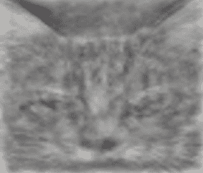

View Upcoming Batches For The AI and Deep Learning Course Now! [<button>Read Now</button>](https://www.edureka.co/ai-deep-learning-with-tensorflow)

## **卷积神经网络是如何工作的？**

卷积神经网络中有**四个**分层**概念**我们应该了解:

1.  卷积，
2.  继电器，
3.  统筹和
4.  全连通(全连通层)。

让我们从一个简单的例子**开始:**

## **CNN 的例子:**

考虑下图:

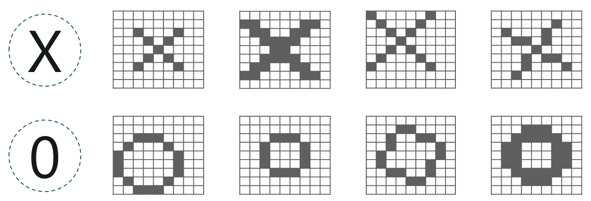

在这里，有 X 和 O 的多种翻译。这使得计算机很难识别。但是目标是，如果**输入信号**看起来像它以前见过的**先前的**图像，则**“图像”参考**信号将被混合到**输入**信号中，或者**与**输入**信号卷积。产生的**输出**信号然后被传递到下一层**。****

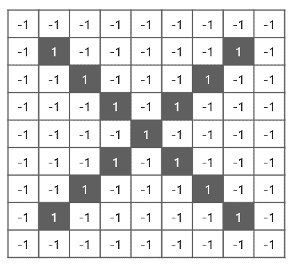

所以，**电脑理解**的每一个像素。在这种情况下，**白色**像素称为 **-1** ，而**黑色**像素称为 **1。**这就是我们实现的在基本二进制分类中**区分像素**的方法。


现在，如果我们仅仅**正常搜索**并且**比较**正常图像和另一个**‘x’再现之间的**值**，**我们将得到**缺失像素的**批次**。**

**那么，我们该如何解决这个问题呢？**


我们取称为**过滤器**的像素的**小块**，并尝试**匹配** 它们在相应的**附近的**位置，看看我们是否得到一个**匹配。**通过这样做，卷积神经网络**在查看**相似度**方面比直接尝试匹配**整个图像要好得多**。**

## **一幅图像的卷积**

卷积具有平移不变性的优良特性。直观地说，这意味着**每个**卷积滤波器代表一个感兴趣的**特征**(例如字母中的**像素)**，卷积神经网络**算法**学习哪个**特征**包括**结果参考**(即字母)。

我们有 **4 步**用于卷积:

*   **对齐**特征和图像
*   **将**每个**图像的**像素乘以相应的**特征**像素
*   **将**的值相加，得到**的总和**
*   **将**除以**总**特征中的像素数


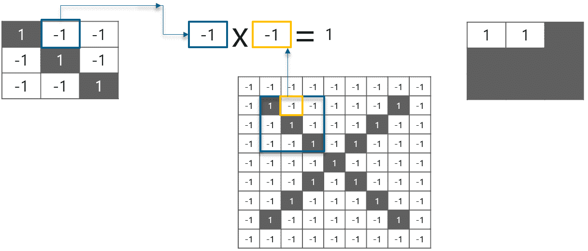

考虑上面的图像——正如你所看到的，我们已经**完成了**的前**两步**。我们考虑一个**特征图像**和距离它一个像素的**。我们**将**与**现有图像**相乘，并将结果存储在另一个**缓冲特征图像**中。**

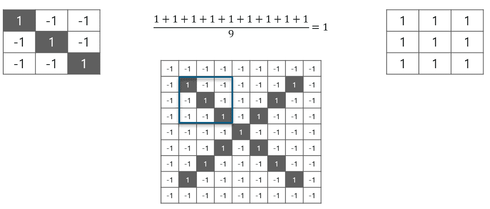

有了这张**，**的图像，我们完成了 l **ast 2 步骤。**我们将**值**相加，得到**和。**然后，**将**这个**数**除以**特征图像中的**总像素数。完成后，得到的**最终值**被放置在**滤波图像**的**中心**，如下图:


现在，我们可以**移动**这个**滤镜**，在图像中的任意像素处做同样的**和**。为了**更清晰，**让我们考虑**的另一个例子:**

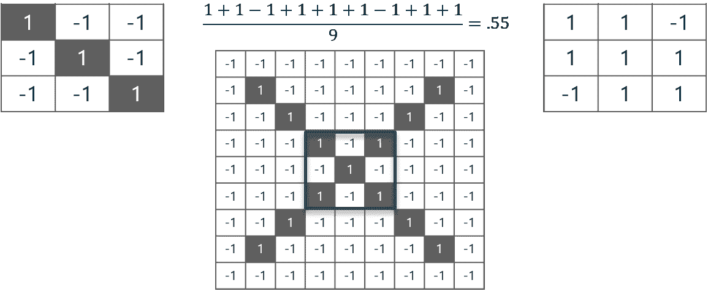

如您所见，在执行前 4 步后，我们得到的值为 0.55！我们取这个值，并把它放在图像中，如前所述。这是在下图中完成的:

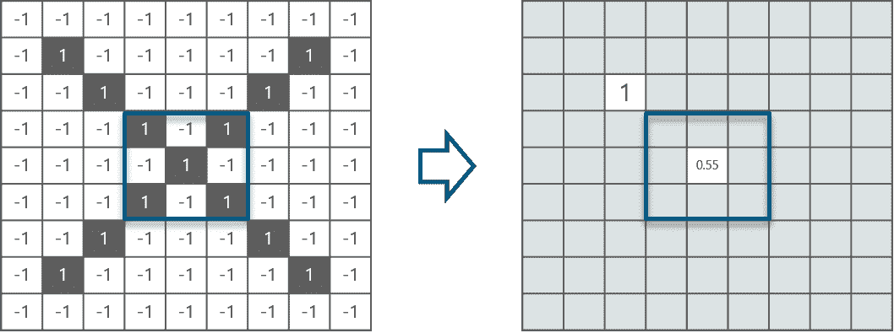

类似地，我们将该特征移动到图像中的每一个其他位置，并观察该特征如何匹配该区域。这样做之后，我们将得到如下输出:

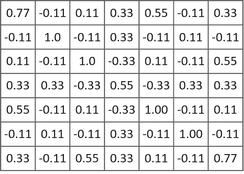

这里我们只考虑了一个过滤器。同样，我们将对每隔一个滤波器执行相同的卷积，以获得该滤波器的卷积。

**输出**信号**强度**不取决于**特征**的位置，而仅仅取决于**特征**是否**存在。**因此，一个字母可以位于 **不同的位置**并且**卷积神经网络**算法仍然能够**识别它。**

## **热路层**

ReLU 是一个激活函数。但是，什么是激活函数呢？

**整流线性单元** (ReLU)变换函数只在输入在一定量以上时才激活一个节点，而输入在零以下时，输出为零，但当输入上升到一定阈值以上时，与因变量成线性关系。

考虑下面的例子:

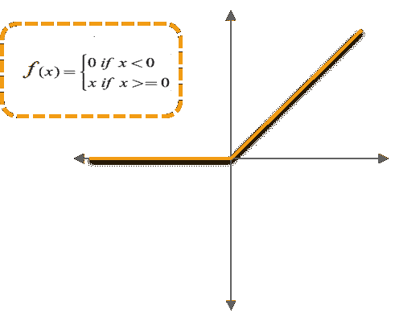

我们已经考虑了一个具有上述值的简单函数。因此，如果该值是由因变量获得的，则该函数只执行一次运算。对于该示例，获得了以下值:

**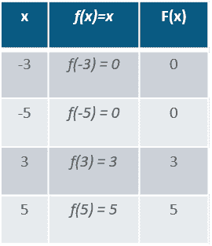**

**为什么我们这里要求 ReLU？**

****

主要目的是从卷积中移除所有负值。所有正值保持不变，但所有负值变为零，如下所示:

**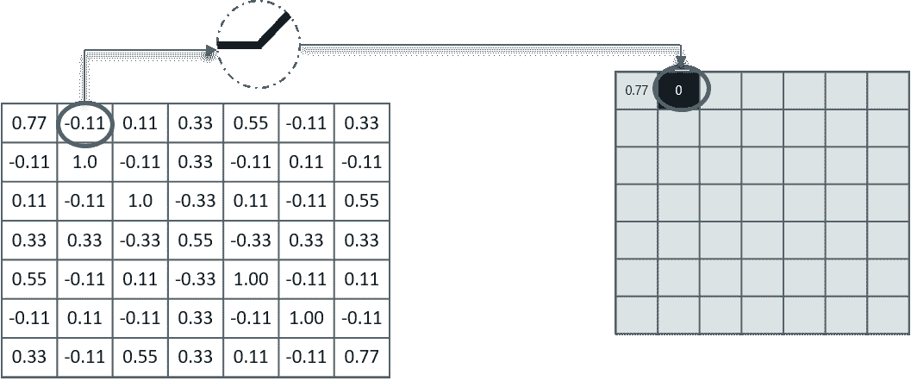**

因此，在我们处理了这个特定的特性之后，我们得到了以下输出:

****

现在，类似地，我们对所有其他特征图像也进行相同的处理:

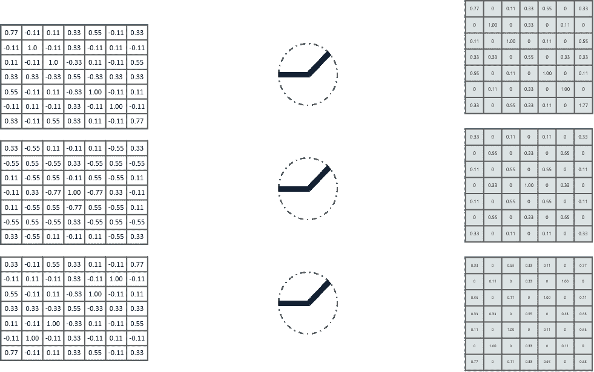

来自卷积层的 **输入**可以被**【平滑】**到**降低**滤波器**的**灵敏度**到**噪声**和**变化。** 这个平滑过程被称为**子采样**，并且可以通过对信号的**样本**取**平均值**或取**最大值**来**实现。****

## **汇集层**

在这一层我们**收缩**把**图像**叠成一个**更小的尺寸。**在通过**激活**层后，池化完成**。我们通过实施以下 4 个步骤来做到这一点:**

*   挑选一个**窗口大小**(通常为 2 或 3)
*   挑一个**步幅**(通常是 2)
*   **走**你的窗**跨**你的**过滤过的**图像
*   从每个**窗口，**取**最大**值

让我们用一个例子来理解这一点。考虑执行窗口大小为 2、步幅也为 2 的池。


所以在这种情况下，我们将**窗口大小**设为 **2** ，我们得到 **4** **值**供选择。从这 4 个值中，**最大值**为 1，因此我们选择 1。此外，请注意，我们**从**开始时使用的是 **7×7** 矩阵，但现在在**合并**后相同的矩阵减少到了 **4×4。**

但是我们需要**移动**窗口**穿过**整个**图像。这个过程和上面完全一样，我们需要对整个图像重复这个过程。**

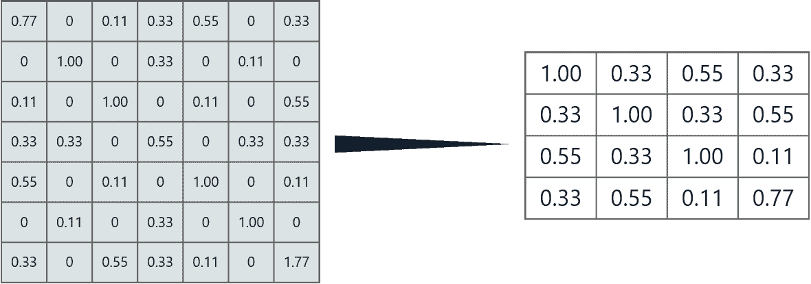

请注意，这是针对**一个过滤器的。**我们还需要为另外两个过滤器做同样的事情。这样做了，我们得到了下面的结果:

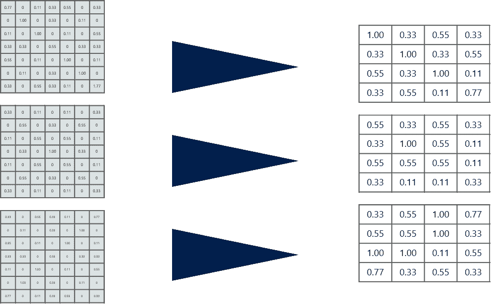

这个**过程**的**容易部分**已经**结束了。**接下来，我们需要**堆叠所有这些层！**

## **层层叠加**

因此，为了在一张图片中获得**时间帧**，我们在这里使用了一个来自一个 **7×7** 矩阵的 **4×4** 矩阵，在将输入通过 3 层之后—**卷积、ReLU** 和**汇集**如下所示:

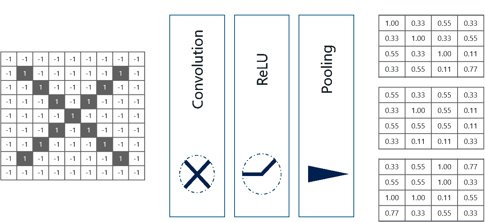

但是我们能不能**进一步把**的图像从 **4×4** 缩小到**更小一些？**

**是的，我们可以！**在第一遍之后，我们需要在迭代中执行 3 个操作。所以在第二遍之后，我们得到一个 2×2 的矩阵，如下所示:

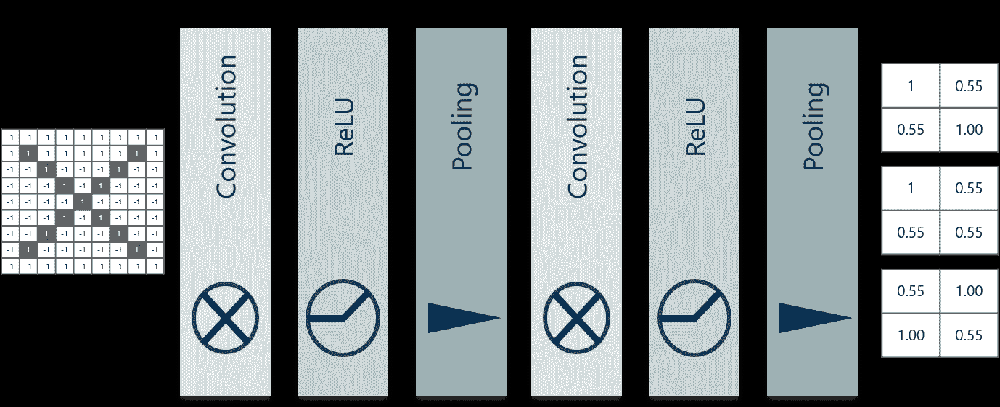

网络中的最后几层是**完全连接的，**意味着前面几层的神经元是**连接的**到**后面**层**中的每个神经元**。

这个**模仿高级推理**，其中考虑了从**输入**到**输出**的所有可能的**路径**。

此外，全连接层是分类实际发生的最后一层。在这里，我们将过滤和收缩后的图像放入一个列表中，如下所示:


所以**接下来，**当我们馈入的时候，**【X】**和**【O】**矢量里会有**一些元素**会**高。**考虑下图，如您所见,“X”有**个不同元素**为**高**和**类似地，**有**个不同元素**为**高:**


从上面的**图片中，我们**了解了**什么？**

当**第 1、第 4、第 5、第 10th】和**第 11th】值为**高时，**我们可以将图像分类为**‘x’。** 这个概念对于其他**字母**也是类似的——当某些**值**按照它们的方式排列时，它们可以被**映射**到一个**实际的**字母或者我们**需要的**数字**，**简单吧？****

## **利用卷积神经网络预测图像——全连接层**

在这个时间点，**我们完成了对**网络的训练，我们可以开始预测和**检查****分类器**的**工作**。让我们来看一个简单的例子:


在上图中，我们有一个 **12 元素**向量，是在**通过**网络的所有**层**将一个**随机字母**的**输入**传递给**后得到的。**

但是，**我们如何**检查知道我们得到的是对还是错？

我们**根据**输出的**数据，通过将**获得的值**与列表中的‘x’和‘o’进行比较，做出预测**！

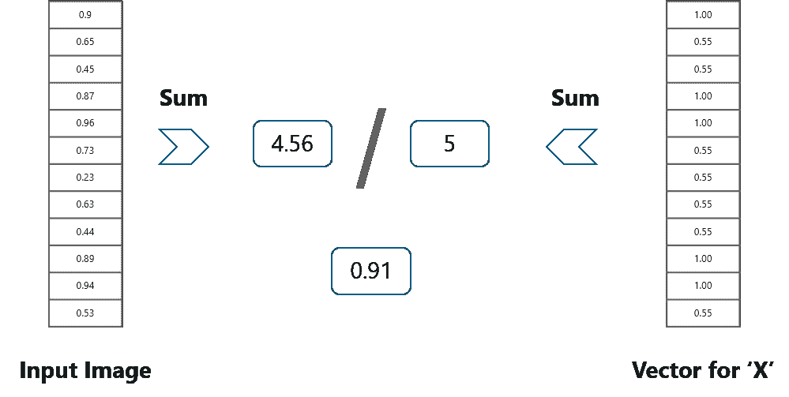

嗯，这真的很简单。我们只是**将 **X** 的**向量表**中找到的最高值(第 1、第 4、第 5、第 10 和第 11)与**相加，我们得到的总和是 **5。**我们对**输入图像**做了**完全相同的事情**，得到的值为 **4.56** 。

当我们**除以**的**值**时，我们有一个**概率匹配**为 **0.91！**现在让我们用**【o】**的**向量表**做**同样的**:

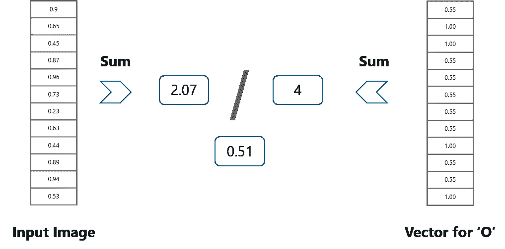

使用此表，我们将**输出**作为 **0.51** 。嗯，概率为 **0.51** 小于 **0.91** 不是吗？

所以我们可以断定**得到的输入图像**是一个**‘x’！**

## **用例:使用 TensorFlow** 用卷积神经网络实现 CIFAR10

让我们**训练**一个**网络**使用 **TensorFlow** 内置的卷积神经网络对来自 **CIFAR10 数据集**的图像进行分类。


考虑下面的**流程图**到**理解**用例的**工作**:

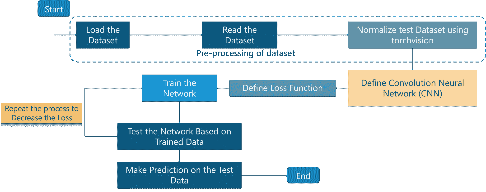

**安装必要的软件包:**

```
pip3 install numpy tensorflow pickle
```

**训练网络:**

```
import numpy as np
import tensorflow as tf
from time import time
import math

from include.data import get_data_set
from include.model import model, lr

train_x, train_y = get_data_set("train")
test_x, test_y = get_data_set("test")
tf.set_random_seed(21)
x, y, output, y_pred_cls, global_step, learning_rate = model()
global_accuracy = 0
epoch_start = 0

# PARAMS
_BATCH_SIZE = 128
_EPOCH = 60
_SAVE_PATH = "./tensorboard/cifar-10-v1.0.0/"

# LOSS AND OPTIMIZER
loss = tf.reduce_mean(tf.nn.softmax_cross_entropy_with_logits_v2(logits=output, labels=y))
optimizer = tf.train.AdamOptimizer(learning_rate=learning_rate,
                                   beta1=0.9,
                                   beta2=0.999,
                                   epsilon=1e-08).minimize(loss, global_step=global_step)

# PREDICTION AND ACCURACY CALCULATION
correct_prediction = tf.equal(y_pred_cls, tf.argmax(y, axis=1))
accuracy = tf.reduce_mean(tf.cast(correct_prediction, tf.float32))

# SAVER
merged = tf.summary.merge_all()
saver = tf.train.Saver()
sess = tf.Session()
train_writer = tf.summary.FileWriter(_SAVE_PATH, sess.graph)

try:
    print("
Trying to restore last checkpoint ...")
    last_chk_path = tf.train.latest_checkpoint(checkpoint_dir=_SAVE_PATH)
    saver.restore(sess, save_path=last_chk_path)
    print("Restored checkpoint from:", last_chk_path)
except ValueError:
    print("
Failed to restore checkpoint. Initializing variables instead.")
    sess.run(tf.global_variables_initializer())

def train(epoch):
    global epoch_start
    epoch_start = time()
    batch_size = int(math.ceil(len(train_x) / _BATCH_SIZE))
    i_global = 0

    for s in range(batch_size):
        batch_xs = train_x[s*_BATCH_SIZE: (s+1)*_BATCH_SIZE]
        batch_ys = train_y[s*_BATCH_SIZE: (s+1)*_BATCH_SIZE]

        start_time = time()
        i_global, _, batch_loss, batch_acc = sess.run(
            [global_step, optimizer, loss, accuracy],
            feed_dict={x: batch_xs, y: batch_ys, learning_rate: lr(epoch)})
        duration = time() - start_time

        if s % 10 == 0:
            percentage = int(round((s/batch_size)*100))

            bar_len = 29
            filled_len = int((bar_len*int(percentage))/100)
            bar = '=' * filled_len + '>' + '-' * (bar_len - filled_len)

            msg = "Global step: {:>5} - [{}] {:>3}% - acc: {:.4f} - loss: {:.4f} - {:.1f} sample/sec"
            print(msg.format(i_global, bar, percentage, batch_acc, batch_loss, _BATCH_SIZE / duration))

    test_and_save(i_global, epoch)

def test_and_save(_global_step, epoch):
    global global_accuracy
    global epoch_start

    i = 0
    predicted_class = np.zeros(shape=len(test_x), dtype=np.int)
    while i < len(test_x): j = min(i + _BATCH_SIZE, len(test_x)) batch_xs = test_x[i:j, :] batch_ys = test_y[i:j, :] predicted_class[i:j] = sess.run( y_pred_cls, feed_dict={x: batch_xs, y: batch_ys, learning_rate: lr(epoch)} ) i = j correct = (np.argmax(test_y, axis=1) == predicted_class) acc = correct.mean()*100 correct_numbers = correct.sum() hours, rem = divmod(time() - epoch_start, 3600) minutes, seconds = divmod(rem, 60) mes = " Epoch {} - accuracy: {:.2f}% ({}/{}) - time: {:0>2}:{:0>2}:{:05.2f}"
    print(mes.format((epoch+1), acc, correct_numbers, len(test_x), int(hours), int(minutes), seconds))

    if global_accuracy != 0 and global_accuracy < acc: summary = tf.Summary(value=[ tf.Summary.Value(tag="Accuracy/test", simple_value=acc), ]) train_writer.add_summary(summary, _global_step) saver.save(sess, save_path=_SAVE_PATH, global_step=_global_step) mes = "This epoch receive better accuracy: {:.2f} > {:.2f}. Saving session..."
        print(mes.format(acc, global_accuracy))
        global_accuracy = acc

    elif global_accuracy == 0:
        global_accuracy = acc

    print("###########################################################################################################")

def main():
    train_start = time()

    for i in range(_EPOCH):
        print("
Epoch: {}/{}
".format((i+1), _EPOCH))
        train(i)

    hours, rem = divmod(time() - train_start, 3600)
    minutes, seconds = divmod(rem, 60)
    mes = "Best accuracy pre session: {:.2f}, time: {:0>2}:{:0>2}:{:05.2f}"
    print(mes.format(global_accuracy, int(hours), int(minutes), seconds))

if __name__ == "__main__":
    main()

sess.close()

```

**输出:**

```
Epoch: 60/60

Global step: 23070 - [>-----------------------------]   0% - acc: 0.9531 - loss: 1.5081 - 7045.4 sample/sec
Global step: 23080 - [>-----------------------------]   3% - acc: 0.9453 - loss: 1.5159 - 7147.6 sample/sec
Global step: 23090 - [=>----------------------------]   5% - acc: 0.9844 - loss: 1.4764 - 7154.6 sample/sec
Global step: 23100 - [==>---------------------------]   8% - acc: 0.9297 - loss: 1.5307 - 7104.4 sample/sec
Global step: 23110 - [==>---------------------------]  10% - acc: 0.9141 - loss: 1.5462 - 7091.4 sample/sec
Global step: 23120 - [===>--------------------------]  13% - acc: 0.9297 - loss: 1.5314 - 7162.9 sample/sec
Global step: 23130 - [====>-------------------------]  15% - acc: 0.9297 - loss: 1.5307 - 7174.8 sample/sec
Global step: 23140 - [=====>------------------------]  18% - acc: 0.9375 - loss: 1.5231 - 7140.0 sample/sec
Global step: 23150 - [=====>------------------------]  20% - acc: 0.9297 - loss: 1.5301 - 7152.8 sample/sec
Global step: 23160 - [======>-----------------------]  23% - acc: 0.9531 - loss: 1.5080 - 7112.3 sample/sec
Global step: 23170 - [=======>----------------------]  26% - acc: 0.9609 - loss: 1.5000 - 7154.0 sample/sec
Global step: 23180 - [========>---------------------]  28% - acc: 0.9531 - loss: 1.5074 - 6862.2 sample/sec
Global step: 23190 - [========>---------------------]  31% - acc: 0.9609 - loss: 1.4993 - 7134.5 sample/sec
Global step: 23200 - [=========>--------------------]  33% - acc: 0.9609 - loss: 1.4995 - 7166.0 sample/sec
Global step: 23210 - [==========>-------------------]  36% - acc: 0.9375 - loss: 1.5231 - 7116.7 sample/sec
Global step: 23220 - [===========>------------------]  38% - acc: 0.9453 - loss: 1.5153 - 7134.1 sample/sec
Global step: 23230 - [===========>------------------]  41% - acc: 0.9375 - loss: 1.5233 - 7074.5 sample/sec
Global step: 23240 - [============>-----------------]  43% - acc: 0.9219 - loss: 1.5387 - 7176.9 sample/sec
Global step: 23250 - [=============>----------------]  46% - acc: 0.8828 - loss: 1.5769 - 7144.1 sample/sec
Global step: 23260 - [==============>---------------]  49% - acc: 0.9219 - loss: 1.5383 - 7059.7 sample/sec
Global step: 23270 - [==============>---------------]  51% - acc: 0.8984 - loss: 1.5618 - 6638.6 sample/sec
Global step: 23280 - [===============>--------------]  54% - acc: 0.9453 - loss: 1.5151 - 7035.7 sample/sec
Global step: 23290 - [================>-------------]  56% - acc: 0.9609 - loss: 1.4996 - 7129.0 sample/sec
Global step: 23300 - [=================>------------]  59% - acc: 0.9609 - loss: 1.4997 - 7075.4 sample/sec
Global step: 23310 - [=================>------------]  61% - acc: 0.8750 - loss: 1.5842 - 7117.8 sample/sec
Global step: 23320 - [==================>-----------]  64% - acc: 0.9141 - loss: 1.5463 - 7157.2 sample/sec
Global step: 23330 - [===================>----------]  66% - acc: 0.9062 - loss: 1.5549 - 7169.3 sample/sec
Global step: 23340 - [====================>---------]  69% - acc: 0.9219 - loss: 1.5389 - 7164.4 sample/sec
Global step: 23350 - [====================>---------]  72% - acc: 0.9609 - loss: 1.5002 - 7135.4 sample/sec
Global step: 23360 - [=====================>--------]  74% - acc: 0.9766 - loss: 1.4842 - 7124.2 sample/sec
Global step: 23370 - [======================>-------]  77% - acc: 0.9375 - loss: 1.5231 - 7168.5 sample/sec
Global step: 23380 - [======================>-------]  79% - acc: 0.8906 - loss: 1.5695 - 7175.2 sample/sec
Global step: 23390 - [=======================>------]  82% - acc: 0.9375 - loss: 1.5225 - 7132.1 sample/sec
Global step: 23400 - [========================>-----]  84% - acc: 0.9844 - loss: 1.4768 - 7100.1 sample/sec
Global step: 23410 - [=========================>----]  87% - acc: 0.9766 - loss: 1.4840 - 7172.0 sample/sec
Global step: 23420 - [==========================>---]  90% - acc: 0.9062 - loss: 1.5542 - 7122.1 sample/sec
Global step: 23430 - [==========================>---]  92% - acc: 0.9297 - loss: 1.5313 - 7145.3 sample/sec
Global step: 23440 - [===========================>--]  95% - acc: 0.9297 - loss: 1.5301 - 7133.3 sample/sec
Global step: 23450 - [============================>-]  97% - acc: 0.9375 - loss: 1.5231 - 7135.7 sample/sec
Global step: 23460 - [=============================>] 100% - acc: 0.9250 - loss: 1.5362 - 10297.5 sample/sec

Epoch 60 - accuracy: 78.81% (7881/10000)
This epoch receive better accuracy: 78.81 > 78.78\. Saving session...
###########################################################################################################
```

**对测试数据集运行网络:**

```
import numpy as np
import tensorflow as tf

from include.data import get_data_set
from include.model import model

test_x, test_y = get_data_set("test")
x, y, output, y_pred_cls, global_step, learning_rate = model()

_BATCH_SIZE = 128
_CLASS_SIZE = 10
_SAVE_PATH = "./tensorboard/cifar-10-v1.0.0/"

saver = tf.train.Saver()
sess = tf.Session()

try:
    print("
Trying to restore last checkpoint ...")
    last_chk_path = tf.train.latest_checkpoint(checkpoint_dir=_SAVE_PATH)
    saver.restore(sess, save_path=last_chk_path)
    print("Restored checkpoint from:", last_chk_path)
except ValueError:
    print("
Failed to restore checkpoint. Initializing variables instead.")
    sess.run(tf.global_variables_initializer())

def main():
    i = 0
    predicted_class = np.zeros(shape=len(test_x), dtype=np.int)
    while i < len(test_x):
        j = min(i + _BATCH_SIZE, len(test_x))
        batch_xs = test_x[i:j, :]
        batch_ys = test_y[i:j, :]
        predicted_class[i:j] = sess.run(y_pred_cls, feed_dict={x: batch_xs, y: batch_ys})
        i = j

    correct = (np.argmax(test_y, axis=1) == predicted_class)
    acc = correct.mean() * 100
    correct_numbers = correct.sum()
    print()
    print("Accuracy on Test-Set: {0:.2f}% ({1} / {2})".format(acc, correct_numbers, len(test_x)))

if __name__ == "__main__":
    main()

sess.close()

```

**简单输出:**

```
Trying to restore last checkpoint ...
Restored checkpoint from: ./tensorboard/cifar-10-v1.0.0/-23460

Accuracy on Test-Set: 78.81% (7881 / 10000)
```

**训练时间**

在这里你可以看到 60 epoch 需要多少时间:

| **装置** | **批量** | **时间** | **[%]** |
| **【NVIDIA gtx 1070】** | **128** | **8m 4s** | **79.12** |
| 英特尔 i7 7700 HQt5 | **128** | **3h 30m** | **78.91** |

## **结论**

卷积神经网络是一种**流行的**深度学习技术，用于当前的**视觉识别任务。**像所有深度学习技术一样，卷积神经网络非常依赖于训练数据的**大小**和**质量**。

给定一个准备充分的**数据集，**卷积神经网络能够在视觉识别任务上**超越人类**。然而，它们对眩光和噪声等视觉伪影仍然不够鲁棒，而人类能够应付这些伪影。

卷积神经网络的**理论**仍在**开发中**，研究人员正致力于赋予它诸如**主动注意**和**在线记忆**的属性，允许卷积神经网络**评估**与它们所接受的训练完全不同的新项目。

T 他的更好的**模仿**的**哺乳动物视觉系统，**从而走向一个**更智能的人工**视觉识别**系统。**

看完这篇关于卷积神经网络的博客后，我很确定你想了解更多关于深度学习和神经网络的知识。要了解更多关于深度学习和神经网络的知识，你可以参考以下博客:

1.  **[什么是深度学习？](https://www.edureka.co/blog/what-is-deep-learning)**

3.  [**张量流教程**](https://www.edureka.co/blog/tensorflow-tutorial/)
4.  [**神经网络教程**](https://www.edureka.co/blog/neural-network-tutorial/)
5.  [](https://www.edureka.co/blog/backpropagation/)

**卷积神经网络(CNN) |爱德华卡**


[https://www.youtube.com/embed/umGJ30-15_A?rel=0&showinfo=0](https://www.youtube.com/embed/umGJ30-15_A?rel=0&showinfo=0)

这段视频将帮助你了解什么是卷积神经网络及其工作原理。它还包括一个用例，其中我们将使用 TensorFlow 创建一个分类器。

Learn Artificial Intelligence And Deep Learning From Experts Now! [<button>Learn Now</button>](https://www.edureka.co/ai-deep-learning-with-tensorflow)