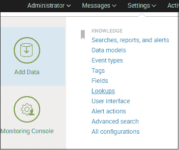
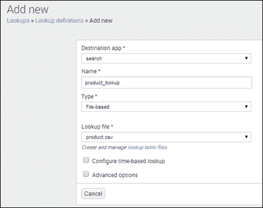
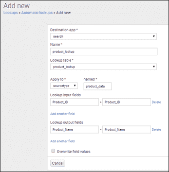
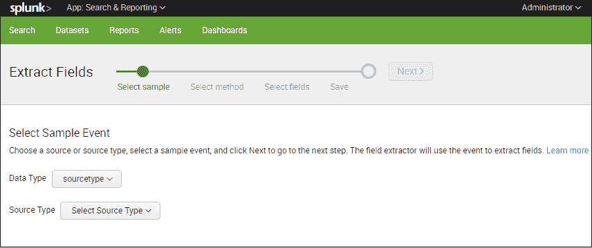
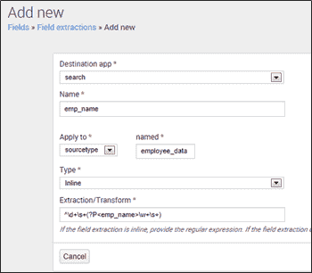

# Splunk 查找和字段:Splunk 知识对象

> 原文：<https://www.edureka.co/blog/splunk-lookup-and-fields/>

在我之前的博客中，我解释了 [Splunk 事件、事件类型和标签](https://www.edureka.co/blog/splunk-events-event-types-and-tags/?preview=true) 有助于简化你的搜索。 在这篇博客中，我将解释以下概念——Splunk 查找、字段和字段提取。 我将讨论为什么查找很重要，以及如何通过匹配唯一键值来关联来自外部数据源的数据。另一方面，Splunk 字段通过为事件提供特定值来帮助丰富您的数据。我还解释了如何以不同的方式提取这些字段。 那么，我们就从 Splunk 查找开始吧。

## **Splunk 查找**

你可能对 Excel 中的查找比较熟悉。Splunk 查找以类似方式工作。例如，您有一个 product_id 值，它与另一个文件(比如 CSV 文件)中的定义相匹配。查找可以帮助您在新的字段中映射产品的详细信息。假设您的 product_id=2，并且该产品的名称存在于不同的文件中，则 Splunk 查找将创建一个新字段“product_name ”,该字段与“product_id”相关联。

*   查找表是键和值的映射。
*   Splunk 查找帮助您根据与事件数据中您的字段相匹配的值从外部源添加字段。
*   It 在比较不同事件字段的同时丰富了数据。
*   Splunk 查找命令可以接受多个事件字段和目的字段。
*   它可以在搜索时将字段翻译成更有意义的信息。

如果您看到下图，这些是不同类型的 Splunk 查找，我将在下面详细解释。

1.  **CSV 查找** :顾名思义，CSV 查找从 CSV 文件中提取数据。它用字段填充事件数据，并在静态数据表中表示它。因此，它也被称为“静态查找”。 必须至少有两列用一组值表示字段。 它们可以有多个相同值的实例。T13T15
2.  **外部查找** :在这种类型的查找中，它从外部源(比如 DNS 服务器)填充您的事件数据。它可以使用 Python 脚本或二进制可执行文件从外部源获取字段值。因此，它也被称为“脚本查找”。【T8
3.  **KV Store 查找** :在这种类型的查找中，它会使用从应用键值存储(KV Store)集合中提取的字段来填充您的事件数据。该查找将事件中的字段与 KV 存储中的字段进行匹配。【T8
4.  **地理空间查找:** 在这种类型的查找中，数据源是 KMZ(compressed keyhole markup language，压缩锁眼标记语言)文件，用于定义美国各州、县等地图区域的边界。它匹配 KMZ 文件中的事件，并将字段输出到以 KMZ 编码的事件，如国家、州或县的名称。

您可以通过配置 Splunk 查找

设置- >查找

点击“查找”后，将显示一个新页面，上面写着“创建和配置查找”。

您可以创建新的代码或编辑现有的代码。

请参考左边的截图，更好地了解如何创建 Splunk 查找。

创建和配置 Splunk 查找有三种方式:

1.  查找表格文件
2.  查找定义
3.  自动查找

让我们进入更多细节，了解这些不同的方式:

**1。查找表文件** :在查找表文件中，你可以简单的上传一个新文件。 当您单击“添加新项”视图时，您可以上传 CSV 文件以在您的字段查找中使用。

创建查找表文件，需要按照以下步骤: 进入查找表页面 打开查找表文件 点击【新增】 上传查找表文件，浏览 CSV 文件(product.csv)进行上传。 在目标文件名下，将文件命名为产品。 csv

参考下面截图更好理解。

**2。查找定义:** 查找定义帮助编辑现有的查找定义或定义一个新的基于文件的查找。定义查找时，可以重复使用同一个文件，并在以后自动运行该查找。【T8

要创建一个查找定义，需要按照以下步骤: 进入查找页面 打开查找定义 点击【新增】 一个新的框将打开，添加字段定义 提供查找名称 设置类型为‘基于文件’

参考下面的截图，以便更好地理解。

**3。自动查找:** 自动查找有助于配置新的查找以自动运行或编辑现有的查找。

要创建一个自动查找，可以通过以下步骤: 进入查找页面 打开自动查找 点击添加新的 将打开一个新的对话框来添加自动查找 为自动查找提供名称 参考下面截图可以更好的理解。

创建 Splunk 查找有两个重要的搜索命令–输入和输出查找。这些解释如下。

**输入查找** : Inputlookup 命令从指定的静态查找表中加载搜索结果。它扫描由文件名或表名指定的查找表。如果“append”设置为 true，查找文件中的数据将被追加到当前的结果集。对于example:读取 product.csv 查找文件。

|输入查找产品. csv

**output lookup**:output lookup 命令将搜索结果写入指定的静态查找表。它将结果保存到由文件名或表名指定的查找表中。如果“createinapp”选项设置为 false 或者没有当前应用程序，则 Splunk 会在系统查找目录中创建文件。对于 e 举例:写入 product.csv 查找文件。

|输出查找产品. csv

至此，您应该已经了解了 Splunk 查找是如何创建的。接下来，我将解释 Splunk 字段以及如何提取这些字段来丰富您的数据。

## **Splunk 字段**

假设您有一家公司的大量数据，您需要一种简单的方法来访问 key=value 对中的信息。假设您想要识别特定员工的姓名，或者想要查找员工 ID。为此，我们可以声明一个 Splunk 字段，如 Emp_name 或 Emp_ID，并为其关联一个值。 例如:Emp_name= "Jack "或 Emp _ ID = ' 00124 '

*   字段是事件数据中可搜索的名称。
*   字段通过向字段提供特定值来过滤事件数据。
*   字段是 Splunk 搜索、报告和数据模型的构建模块。
*   一个字段可以有多个值。它可以出现多次，每次都有不同的值。
*   字段名称区分大小写。

现在让我们了解如何提取字段。T3T5

**Splunk 字段提取:** 从事件中提取字段的过程就是 Splunk 字段提取。有些字段是默认提取的，例如:主机、源、源类型和时间戳。 我将用一个简单的例子来解释，以便正确理解这个过程。

在上例中可以看到，它显示了事件数据。在本例中，我采用了任何示例事件，并将源类型保持为“splunk_web_access”。现在，Splunk Enterprise 将根据 sourcetype 收集的数据提取字段。在上面的例子中，我选择了正则表达式，这有助于匹配样本事件中突出显示的值。现在，我已经提取了值‘537.36’，并将字段名设为‘test’。这将显示一组值和提取的值。 我们来看看这些提取的值是如何显示的。

现在，根据 Splunk 提取字段的时间，有两种类型的字段提取:

1.  指标时间字段提取 (默认字段)
2.  搜索时间字段提取 (遇搜索字段)

让我们更详细地理解它:

| **指标时间字段提取** | **搜索时间字段提取** |
| 1。Splunk 索引数据时，索引时间字段提取发生在索引时间。 | 1。搜索时间字段提取发生在我们搜索数据时的搜索时间。 |
| 2。您可以在建立索引之前定义自定义源类型和主机，以便它可以用它们来标记事件。 | 2。您不能更改主机或源类型分配。 |
| 3。Splunk 为每个事件提取一组默认字段，如主机、源和源类型。它还包括静态或动态主机分配、结构化数据字段提取、自定义索引时间字段提取、事件时间戳等。 | 3。Splunk 可以提取默认字段之外的其他字段，具体取决于其搜索设置。它包括事件类型匹配、搜索时间字段提取、添加来自查找的字段、事件分段、字段别名、标记等。 |

接下来，Splunk 中有 3 种方法可以实现字段提取。

1.  使用现场提取器实用程序
2.  使用 Splunk 网站中的字段提取页面
3.  直接使用现场提取。会议文件

下面详细解释这三个:

**1。使用字段提取器实用程序** :您可以使用字段提取器实用程序创建新字段，它还用于在您的 Splunk 实例中动态创建自定义字段。

*   字段提取器使您能够通过选择一个样本事件并突出显示要从该事件中提取的字段来定义字段提取。
*   提供了两种提取字段的方法——正则表达式和分隔符。正则表达式方法最适用于非结构化事件数据，而分隔符是为结构化事件数据设计的。
*   如果您不熟悉正则表达式的语法和用法，字段提取器实用程序会很有用，因为它会生成提取字段的正则表达式，并允许您测试它们。【T2

参考下面的截图，以便更好地理解。

** 2。使用 Splunk Web ** 中的字段提取页面:我们可以使用“字段提取页面”来管理搜索时的字段提取。   字段提取页面使我们能够: 

*   查看整个搜索时间提取集。
*   创建新的搜索时间字段提取。
*   更新字段提取的权限。
*   删除字段提取

让我们看看如何访问 Splunk Web 中的字段提取页面: 进入设置- >字段- >字段提取

在上面的截图中，我已经解释了如何从 employee_data sourcetype 中提取雇员姓名字段。可以使用下面的正则表达式提取 emp_name 字段: ^d+s+(？P < emp_name > w+s+)

**3。在中直接使用字段提取。conf 文件:** 也可以通过直接编辑 props.conf 和 transforms.conf 文件来提取字段。您可以在:$ SPLUNK _ HOME/etc/system/local/中找到它们

注意:请勿 编辑$ SPLUNK _ HOME/etc/System/default/中的文件，因为它包含 系统设置、认证和授权信息、索引映射和其他各种重要设置。

这就是 Splunk 知识对象。 我希望这些博客能帮助你了解不同的知识 对象 以及它在为你的企业带来运营效率中所扮演的角色。查看下一篇[教程博客](https://www.edureka.co/blog/splunk-tutorial)，其中解释了每个 Splunk 管理员都必须熟知的三个概念——许可、数据老化和配置文件。

*您是否希望学习 Splunk 并将其应用到您的业务中？查看我们的* [*Splunk 认证培训*](https://www.edureka.co/splunk-certification-training) *此处提供了讲师指导的现场培训和真实项目体验。*