# 什么是区块链技术？区块链如何工作

> 原文：<https://www.edureka.co/blog/how-blockchain-works/>

## **区块链是新的互联网吗？嗯，的确是！！**

区块链技术是互联网 3.0，或者说是协议互联网。开始时是一场进化，现在逐渐变成了一场革命。正如我们目前所知，它有潜力改变商业，但理解如何改变并不容易。所以*这里有一张传单，让你感知区块链是如何工作的。*

1.  [什么是区块链技术？](#Blockworks)
2.  [区块链如何工作？](#blockworking) [2.1 交易的独立验证](#independentverify) [2.2 已验证交易的聚合](#aggregatetxn) [2.3 区块的挖掘](#miningblock)
3.  如果有人试图入侵系统怎么办？

## **什么是区块链技术？**

*[区块链](https://www.edureka.co/blog/blockchain-technology/)是一个**的不可变记录的去中心化分布式数据库，其中交易由强* ***密码算法*** *保护，网络状态由* ***共识算法*** *维护。*

<figure id="attachment_59609" aria-describedby="caption-attachment-59609" style="width: 279px" class="wp-caption aligncenter">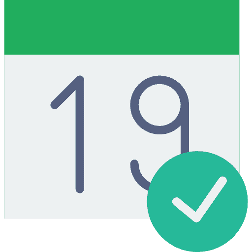

<figcaption id="caption-attachment-59609" class="wp-caption-text">**                Digital Timestamps**</figcaption>

</figure>

简单来说，区块链就是包含信息的区块链。

这项技术最初是在 1991 年被描述的，目的是给数字文档打上时间戳，以避免回溯或篡改任何记录。

无论这项技术多么伟大，直到中本聪用它创造了数字加密货币***[比特币](https://bitcoin.org/bitcoin.pdf)，它的真正潜力才得以实现。***

## **区块链技术|区块链初学者教程| Edureka**

[//www.youtube.com/embed/g5ExoEfnXNU?rel=0&showinfo=0](//www.youtube.com/embed/g5ExoEfnXNU?rel=0&showinfo=0)

现在我们来看看区块链是如何工作的。

## **区块链如何工作？**

让我们试着理解区块链如何通过区块链网络处理一个简单的交易。 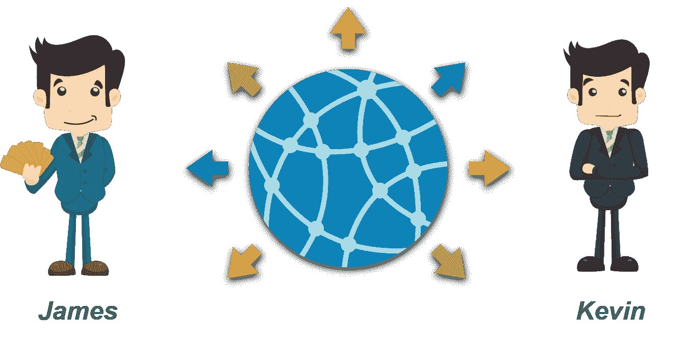

假设詹姆士想把 BTC 送给他的朋友凯文。现在，这个交易是以 ***数字** **消息的形式广播的。T12***

数字信息有独特的签名。就像你的签名提供了文件所有权的证明一样，**数字签名**提供了**交易真实的证明。**

现在，这个生成的事务被广播到网络，在那里它对等地传播 ***。***

<figure id="attachment_59971" aria-describedby="caption-attachment-59971" style="width: 527px" class="wp-caption aligncenter">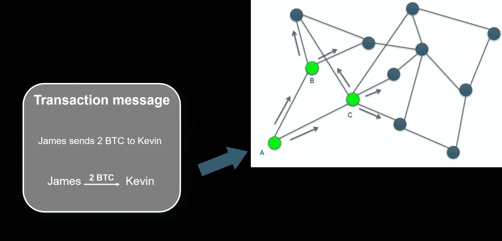

<figcaption id="caption-attachment-59971" class="wp-caption-text">***                   Transaction propagates peer to peer in the network***</figcaption>

</figure>

假设上述交易首先由网络中的**节点 A** 接收。

### **交易的独立验证**

在向其邻居发送交易之前，每个获得交易的比特币节点将对交易进行初步验证。 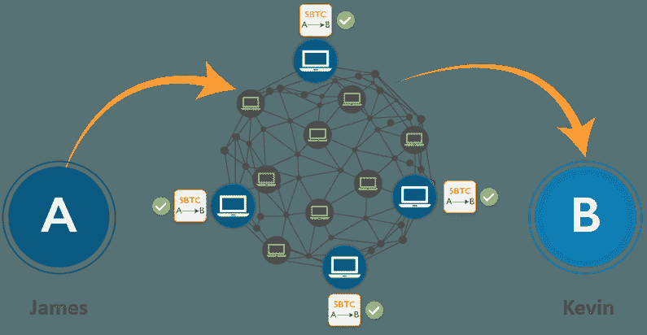 这保证了只有有效的事务在系统中传播，而无效的事务在接收它们的第一个节点被处理。每个节点根据一长串标准确认每笔交易。

### **已核实交易汇总**

*通过挖掘节点将那些事务独立聚合到新的块中，并通过工作验证算法结合展示的计算。【T2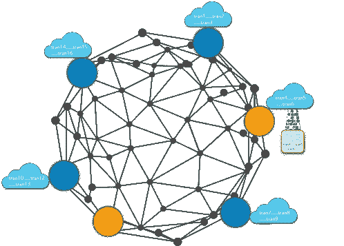*

*   通过自主地确认收到的每个事务，并在传播之前，每个节点构建一个有效(但未确认)的事务池，称为**事务池、内存池或内存池**
*   事务到达**M**in 节点它像其他节点一样收集、验证和中继新的事务
*   与其他节点不同，miner 节点随后会将这些事务聚集成一个 ***候选块***

让我们用一个例子来更好地理解这一点。

*假设安迪是矿工。(一个挖掘节点维护区块链的本地副本，该副本是自 2009 年比特币系统开始以来创建的所有区块的列表)*

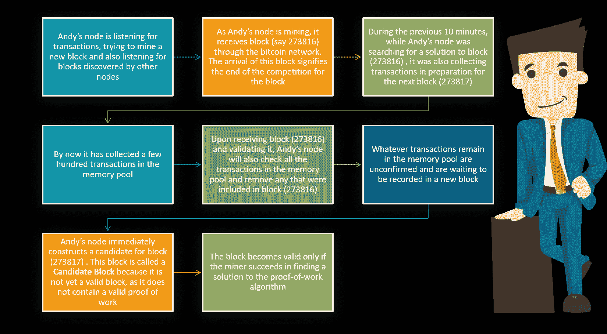

现在，在收集了一个块中的所有交易后，Andy 需要构造块头。现在这一步对于理解区块链是如何工作的很重要

### **构造块头**

为了构造块头，挖掘节点需要填写六个字段，如下表:

| **大小** | **字段** | **描述** |
| 4 字节 | 版本 | 为了构造块头，挖掘节点需要填写六个字段，如所示 |
| 32 字节 | 先前块哈希 | 对链中前一个(父)块的散列的引用 |
| 32 字节 | 默克尔根 | 这个块的事务的 Merkle 树的根的散列 |
| 4 字节 | 时间戳 | 该块的大致创建时间(从 Unix 纪元开始的秒数) |
| 4 字节 | 难度目标 | 该模块的工作验证算法难度目标 |
| 4 字节 | 现时值 | 用于工作验证算法的计数器 |

一旦安迪的节点将所有字段填入块头，安迪就开始*挖掘*该块。

### **开采一个区块**

*   随着所有其他字段的填充，区块标题现已完成，开采过程可以开始
*   现在的目标是找到导致小于难度目标的块头散列的**随机数**的值
*   在发现满足要求的随机数之前，挖掘节点将需要测试数十亿或数万亿个随机数值

***现在，Andy 的节点已经构建了候选块，是时候让 Andy 的硬件挖掘装备“挖掘”该块了，以找到使该块有效的工作证明算法的解决方案。***

***工作证明*** 是一段很难(成本高、耗时)产生但对其他人来说很容易核实且满足一定要求的数据。

### **寻找谜题——为什么很难？**

*   SHA-256 是一个单向函数，因此，**强力**是获得特定输出值的唯一途径
*   平均来说，要找到一个解决方案需要许多随机的猜测，因此挑战是艰巨的
*   平均大约需要 10 分钟才能找到解决方案的特殊钥匙

为了保持硬币分布的可预测性，当更多的人在解谜时，解谜变得越来越困难。

现在，为了根据*工作证明*算法验证区块，安迪的挖掘节点必须达到难度目标。 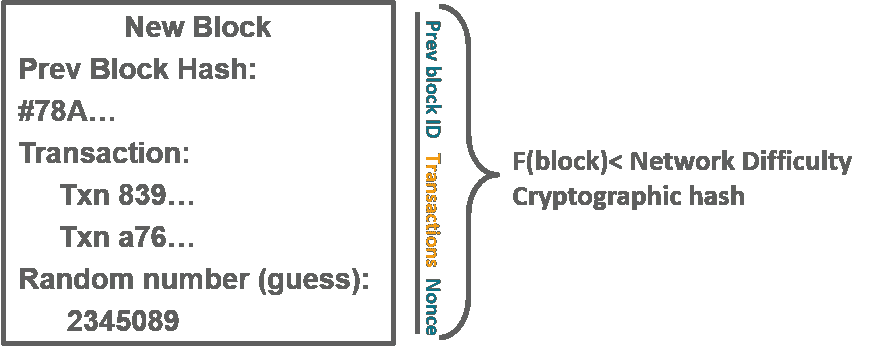

让我们看看难度是如何表示的。

### **难度表示**

*   该块包含难度目标，以一种称为“难度位”或简称“位”的符号表示
*   假设一个区块有 0x1903a30c 作为难度位。该符号将难度目标表示为系数/指数格式，前两个十六进制数字表示指数，接下来的六个十六进制数字表示系数

**由此表象计算难度目标的公式为: **

这就是难度系数，安迪的采矿节点非常努力地达到了难度目标。让我们看看接下来会发生什么。

### **成功开采该区块**

*   安迪有几个硬件采矿设备，每个都以难以置信的速度并行运行 **SHA256** 算法
*   Andy 桌面上运行的挖掘节点将块头传输到他的挖掘硬件，后者开始每秒测试数万亿个随机数
*   在开始开采区块后大约 11 分钟，一台硬件采矿机找到了解决方案，并将其发送回开采节点
*   安迪的挖掘节点立即将该数据块传输给所有对等节点
*   它们接收、验证并传播新数据块。随着数据块在网络中扩散

*N 现在该块在网络中传播，每个完整节点独立验证该块*

### **独立确认各块的**

*   在比特币的共识机制中，每个新块都由网络上的每个节点独立验证
*   这确保了只有有效的块在网络上传播
*   节点通过对照一长串必须全部满足的标准检查块来验证块

### 组装和选择区块链

一旦一个节点验证了一个新的块，它将尝试通过将该块连接到现有的区块链来组装一个链

<figure id="attachment_59998" aria-describedby="caption-attachment-59998" style="width: 267px" class="wp-caption aligncenter">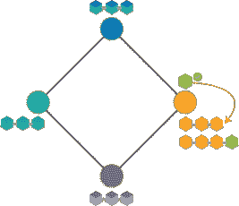

<figcaption id="caption-attachment-59998" class="wp-caption-text">*In the network shown above, once the node (in orange) validates the      block, it assembles the chain by connecting the block to the existing blockchain*</figcaption>

</figure>

一旦方块被网络验证，它就成为区块链的一部分，成功解决方块难题的矿工将获得奖励。

### **矿工奖励**

*   由于矿工利用他们宝贵的资源验证了区块，他们得到了**一笔金钱奖励**
*   如果是比特币，他们会得到一些新创造的比特币作为奖励

现在，问题来了，当一个以上的方块同时被解决时会发生什么？

是的，这的确是可能的！在这种情况下，存在几个分支。

### **几支**

*   虽然这个问题很棘手，但是有可能同时解决多个问题
*   **在这种情况下，区块链的几个分支**是可能的
*   每个人都应该在他们收到的第一块积木的基础上建造积木 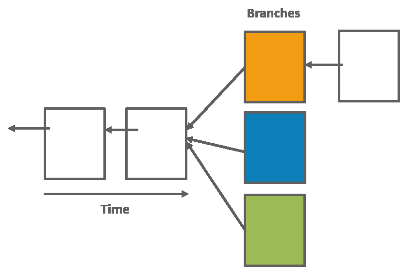
*   其他节点可能已经以不同的顺序接收了块
*   他们将在第一次收到的积木上建造

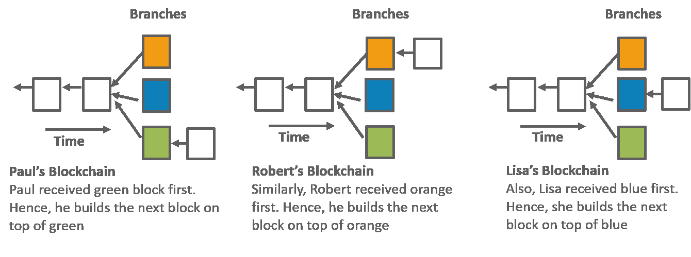

*   当有人解决下一个障碍时，平局被打破，因为这种情况很少连续发生多次

*   区块链在这种情况下迅速稳定
*   一般规则是切换到可用的最长链条

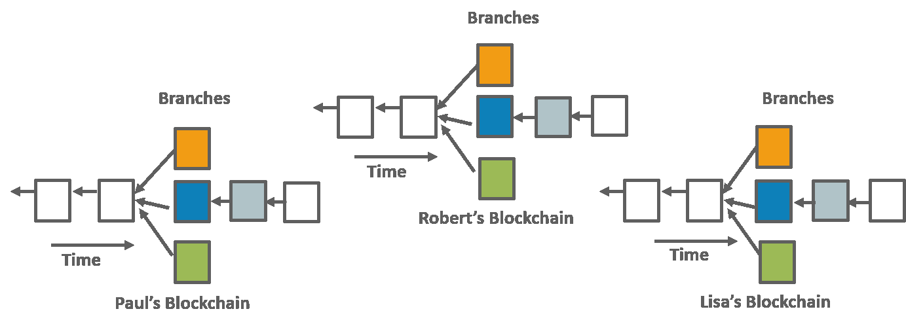

区块链快速稳定。每一个节点都与总账的当前状态一致。

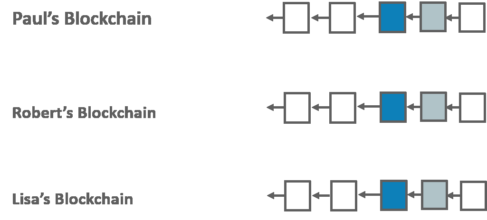

好吧，共识规则让区块链网络免于这种模糊。

现在，另一个问题出现了，如果有人试图改变系统中的任何交易或记录怎么办？

## **有人试图黑系统怎么办？**

一旦一个块被解决，加密散列输出成为该块的标识符。 

由于区块链是一个反向链接的分布式记录数据库。当形成一个块时，加密哈希输出成为该块的标识符，该标识符与下一个块相关联，从而创建一个块链。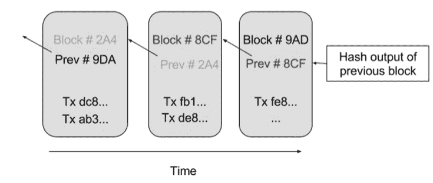

因此，区块链由强密码算法保护，没有办法改变任何记录。

*如果有人试图改变任何块中的任何事务，该块的散列会改变，因此所有先前块的散列也会改变。节点将不会达成**共识，因此，欺诈很容易被检测到***

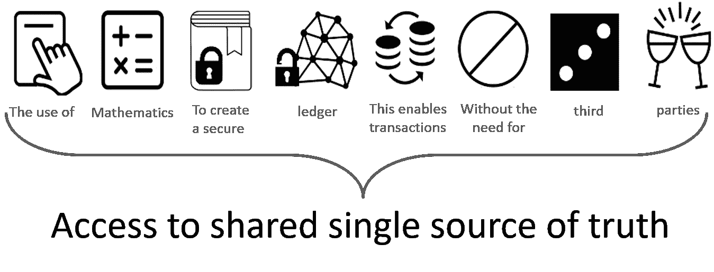

原来如此。骄傲吧，因为现在你知道了这项帅气的技术后，就鹤立鸡群了。

我希望这篇**区块链如何工作**的博客对你有所帮助。

*有问题吗？请在评论区提到它，我们会尽快回复您。*

*如果你希望了解区块链技术，掌握密码学、区块链网络、智能合约、以太坊和超级账本的概念，请在这里查看我们的互动、在线直播 Edureka **[区块链课程](https://www.edureka.co/blockchain-training)** ，它提供 24*7 支持，在整个学习期间为你提供指导。*