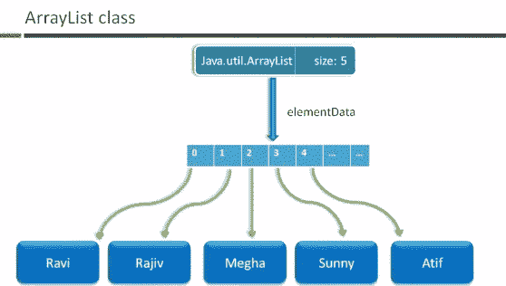

# Java 中的动态数据分配

> 原文：<https://www.edureka.co/blog/dynamic-data-allocation-in-java/>

[//www.youtube.com/embed/zHDF1k9dVBE](//www.youtube.com/embed/zHDF1k9dVBE)

## **什么是 Java HashMaps？**

Java HashMap 是一个类，用于执行诸如在地图中插入、删除和定位元素的操作。我们创建一个映射，在这里我们传递两种类型的值，即“键”和“值”。在使用 HashMap 时，值将被放入 HashMap 中，每当用户检索一个值时，将使用键来使用该值。map 是一个将键映射到元素的接口。地图是无序的。它们允许一个空键和多个空值。这些值存储在键和值中。在整个 HashMap 中，一个键或多个值可能为 null。密钥可以是任何对象。

HashMap 中有几种可用的方法

对象放置(对象键，对象值)

枚举键()-它将获取键

枚举元素()-它将获取元素

Object get(对象键)–传递键并获取与之关联的值

Boolean contains key(对象键)——用于检查 HashMap 中是否存在一个键

布尔包含值(对象键)–传递键

对象移除(对象键)–传递键并移除对象

int size()–用于使用 size

String to String()–用于转换为字符串

每个键都有对应的值，在 HashMap 中值也可以是 null。

散列表的创建。

```
HashMap hashmap = new HashMap();
```

放置元素

```
hashmap.put(“Ankita”, 9634.58);
```

```
hashmap.put(“Vishal”, 1283.48);
```

```
hashmap.put(“Gurinder”, 1478.10);
```

```
hashmap.put(“Krishna”, 199.11);
```

这里，我们传递键和值。

显示值–获取迭代器

```
Iterator iterator = hashmap.entrySet().iterator();
```

这里，值存在于集合中，所以我们使用 entrySet。

除了这句台词:

```
While(iterator.hasNext()){
```

```
Map.Entry entry=(Map.Entry) iterator.next();
```

```
System.out.print(entry.getKey()+”:”);
```

```
System.out.printIn(entry.getValue());
```

```
}
```

什么是数组列表类？

ArrayList 类是 List 接口的具体实现。它允许重复元素。此外，列表可以动态地增长或收缩，这是它的主要优点之一。数组的缺点是一旦创建，它就保持不变。



这里，数组列表的大小是 5。索引从 0 开始。

要遵循的步骤:

1)转到 c 盘

2)转到程序文件/ JAVA/ JDK

3)打开名为“SRC”的 RAR 文件

4)在这里，我们将找到 Java 和 util，在其中我们可以找到 ArrayList。

## **数组列表中的方法**

*   布尔 add(object e)–我们可以使用 add 函数传递对象
*   Void add (int index，object element)–我们传递索引和必须添加的元素
*   布尔 addALL(集合 c)–我们可以传递整个集合
*   object get(int index)–我们传递索引
*   对象集(int index，object element)——我们传递索引和对象来获取值
*   object remove(int index)–我们可以传递索引并删除值
*   迭代器 iterator()-用于获取技术
*   ListIterator listIterator()
*   int index of()–索引器给出特定元素的索引
*   Int lastIndexOf ()
*   Int 索引(对象元素)
*   int size()–给出数组列表的大小
*   void clear()–清除数组列表

## **了解数组列表**

创建数组列表的对象

```
//Create an arraylist
```

```
ArrayList<String> arraylist = new ArrayList<String>();
```

我们使用 add 函数来添加值

```
Arraylist.add(“rose”);
```

```
Arraylist.add(“lily”);
```

```
Arraylist.add(“jasmine”);
```

```
Arraylist.add(“rose”);
```

这里，重复的值已经在 ArrayList 中发布。

此外，我们使用索引 2 来删除元素

```
ArrayList.remove(2);
```

这些元素与编码一起显示

```
Iterator<String> iterator = arrayList.iterator();
```

使用迭代器，我们可以从下面使用的函数 hasNext 中访问元素:

```
While(iterator.hasNext()){
```

```
String element = iterator.next().toString();
```

```
System.out.println(element + “ “);
```

```
}
```

它将值转换为字符串并打印元素。

在声明中:

```
System.out.println(arraylist.indexOf(“Rose”));
```

这会给我们一个输出:

玫瑰百合玫瑰 0

在这里，大小也不例外。它将读取第一个元素，而不是第二个元素(Rose)。

我们再次修改声明:

```
System.out.println(arraylist.get(2)));
```

输出将是:

玫瑰百合玫瑰玫瑰玫瑰

## **如何追踪 ArrayList 的元素？**

我们可以使用诸如

*   For-each 循环
*   迭代程序
*   列表迭代器
*   列举

For-each 循环–其操作类似于 For 循环。它遍历 array 或 ArrayList 的所有元素。

我们使用:

For(字符串 s:数组列表名称)

for–关键字

string–存储在 ArrayList 中的数据类型

数组列表名称–数组列表的名称

我们不需要提及数组列表的大小。但是在简单循环的情况下，我们需要提到大小。

有问题要问我们吗？在评论区提到它们，我们会给你回复。

**相关帖子:**

[面向 Java 专业人士的 Hadoop](https://www.edureka.co/blog/videos/free-webinar-on-hadoop-for-java-professionals/ "Hadoop for Java Professionals")

[学 Java/J2EE&SOA](https://www.edureka.co/java-j2ee-soa-training "Learn Java/J2EE & SOA")