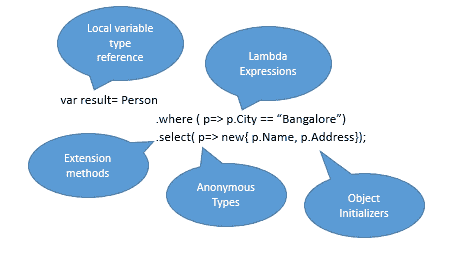

# 释放 LINQ 的力量。网络方式

> 原文：<https://www.edureka.co/blog/unleash-the-power-of-linq-the-net-way/>

代表语言集成查询(发音为“link”)的 LINQ 是一个. NET 语言扩展，它支持从不同的数据源(如 XML 文档、数据库和集合)进行数据检索。它是 20 世纪 70 年代引进的。NET 3.5 框架。VB 和 C#是具有 LINQ 功能的语言。

人们可能会想，当 ADO.NET 在那里进行数据检索时，为什么要开发 LINQ。这背后的主要原因是由于“应用程序如何看待关系数据”的概念如果我们正在使用一个简单的应用程序连接到一个简单的数据库，一切工作都与 ADO.NET。例如，制造商的订购系统中有一个客户表和一个存储客户订单信息的订单表。

然而，如果数据库随着更多的表而变得更大，例如 order 表随着存储相关数据的多个表而变得更大，并且当应用程序变得复杂时，我们会看到应用程序查看数据的方式的差异越来越大。但是程序员仍然希望处理单个概念订单，而不必为每个订单相关的查询执行复杂的连接操作。这称为对象关系阻抗不匹配。

出于这个原因，程序员实现他们的映射层来创建像对象一样的单个实体。例如，order 对象具有用于检索和更新的方法，这些方法执行数据库查询来获取信息。

简而言之，映射层方便地将应用程序与逻辑数据库结构的细节隔离开来。在 LINQ 中，对象和关系域中的数据模式之间存在映射，这使得使用起来更简单。

**一个实时用例:** LINQ 在许多应用中被用于各种需求，但我能提到的一个实时例子是 LINQ 是如何被用于构建 LINQ 到 Twitter 的。LINQ 到推特是推特微博服务的开源第三方 LINQ 提供商。它使用标准的 LINQ 语法进行查询，并包含通过 witter API 进行更改的方法调用。

**LINQ 建筑:**

用户可以通过使用 LINQ 进行查询来查询 XML 文档、关系数据库和内存集合。支持 LINQ 功能的语言有 VB、C#等。数据源通过支持 LINQ 的数据源连接到语言，其中包括 LINQ 风格，如 LINQ 到对象，LINQ 到 ADO。net 和 LINQ 到 XML。

**LINQ 风味:**LINQ 的主要风味有:

*   对象的 LINQ——允许查询内存中的对象，如数组、列表、通用列表和任何类型的集合。
*   LINQ 到 XML–允许通过将文档转换为 XElement 对象来查询 XML 文档，然后使用本地执行引擎进行查询。
*   从 ADO.NET 到 LINQ，包括:

1.  LINQ 到 SQL——它专门用于处理 SQL server 数据库。
2.  “从 LINQ 到数据集”–允许查询任何可以使用 ADO.NET 查询的数据库。
3.  实体的 LINQ——这类似于 SQL 的 LINQ。它允许开发人员查询概念实体数据模型

*   并行 LINQ——这是 LINQ 对具有并行编程库的对象的扩展。利用这一点，我们可以将查询拆分为在不同的处理器上同时执行。

**对开发者有什么好处？**

*   你不需要学习一门新的语言，因为它类似于 SQL。LINQ 简单而整洁。
*   LINQ 是类型安全的，所以查询错误是在编译时进行类型检查的，而不是像以前那样在运行时查找错误。简而言之，它使调试的过程更快。
*   减少您必须编写的代码量，从而为您提供更好的性能，并为您提供其他技术(如并行 LINQ 或 PLINQ，并行处理)的位置。
*   当您键入 LINQ 语句的其余部分时，它为您的范围变量提供智能感知支持。
*   通过使用 LINQ 查询，您可以使用源序列作为输入，并以多种方式修改它以创建新的输出序列(数据转换)。您可以通过排序和分组来修改序列本身，而无需修改元素本身。
*   如果您的应用程序要使用子查询，使用 SQL 查询会变得更困难，查询会变得更长，但通过使用 LINQ，它会简化这一切。

**一个性能助推器:** 由于以下原因，LINQ 更有生产力并提高了计划的性能:

使用 LINQ，您可以将一个查询分解成多个部分，然后在您的应用程序中重用其中的一些部分。

*   您还可以将部分查询转移到负载较低的服务器上进行处理，即重新排序、转换和重新分组结果；从而减轻服务器的负担。
*   LINQ 让您检索形状或层次数据。这避免了重复，使结果更容易处理，并且在大多数情况下，甚至不需要使用连接。
*   在构建 n 层架构应用程序时，使用支持 LINQ 的数据访问层(使用 API，如 LINQ 到 SQL 或实体框架)，可以将数据访问开发时间减少一半以上，并使维护变得更加容易

**LINQ 在。NET-A 家事:** LINQ 查询结构:

LINQ 查询包含为查询指定数据源和迭代变量的子句组合。查询表达式可以包括过滤、分组、排序、连接、计算等。

LINQ 查询操作分为三个部分:

*   获取数据源:指定数组、集合、数据库或 XML
*   创建查询:使用 var 关键字
*   执行查询:使用循环检索或提取

示例:1 显示数组中的项目:

```
static void Main()
 {
// The Three Parts of a LINQ Query: 
// 1\. Data source. 
int[] numbers = newint[7] { 0, 1, 2, 3, 4, 5, 6 };

// 2\. Query creation. 

var numQuery =
from num in numbers select num;

// 3\. Query execution. 
foreach (int num in numQuery)
 {
Console.Write("{0} " + num);
 }

Console.ReadKey();
```

示例:2 显示可被 2 整除的数字(使用过滤)

```
static void Main()
 {
// The Three Parts of a LINQ Query: 
// 1\. Data source. 
int[] numbers = newint[7] { 0, 1, 2, 3, 4, 5, 6 };

// 2\. Query creation. 
// numQuery is an IEnumerable<int> 
var numQuery =
from num in numbers
where (num % 2) == 0
select num;

// 3\. Query execution. 
foreach (int num in numQuery)
 {
Console.Write("{0} " + num);
 }

Console.ReadKey();
 }
```

**支持 LINQ 的 C#特性:**

*   查询表达式:这是一种查询语法，用于从支持 LINQ 的数据源中检索数据。
*   隐式类型变量:变量 var，它使编译器能够推断变量的类型。
*   对象和集合初始值设定项:在不显式调用对象的构造函数的情况下启用对象的初始化。
*   匿名类型:使编译器能够创建对象，而不需要您指定命名数据类型。类型名只对编译器可用。
*   扩展方法:通过将静态方法与类型相关联来启用任何现有类型的扩展。
*   Lambda 表达式:内联表达式或语句块，可以在需要委托类型的任何地方使用。

[](https://cdn.edureka.co/blog/wp-content/uploads/2014/12/25.png)

LINQ 是一个足够选择的理由吗？网？ LINQ 是一种被证明对开发者有益的语言，因为它类似于我们通常在。NET 框架。使用这种语言的主要好处是它带来的性能提升。它还减少了阻抗失配问题；即从存储站点到应用程序中使用的对象的数据表示之间的差距。

所以，如果你想探索和利用最好的数据检索机制，它给开发者的力量和易用性，那么 LINQ 是正确的选择。

有问题要问我们吗？在评论区提到它们，我们会给你回复。

相关帖子:

[微软入门。净](https://www.edureka.co/microsoft-dotnet-framework-self-paced)

[微软。NET 框架:web 开发的智能方式](https://www.edureka.co/blog/videos/microsoft-net-framework-web-development/)