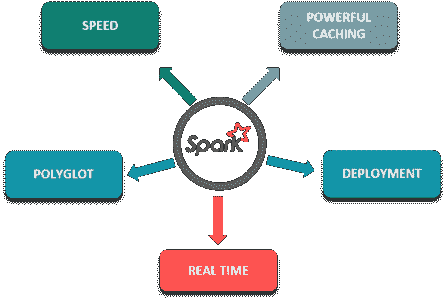
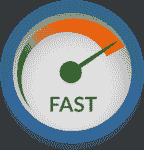

# Python 中的 Spark 简介——PySpark，适合初学者

> 原文：<https://www.edureka.co/blog/spark-with-python-pyspark>

[**Apache Spark**](https://www.edureka.co/blog/spark-tutorial/) 是处理和使用大数据时使用最广泛的框架之一，而 **Python** 是用于数据分析、机器学习等等的最广泛使用的编程语言之一。那么，为什么不一起使用它们呢？这就是 Python**Spark**也称为 **PySpark** 进入画面的地方。

Apache Spark 开发人员的平均工资为 110，000 美元，毫无疑问，Spark 在行业中被广泛使用。由于其丰富的库集，Python 现在被大多数数据科学家和分析专家使用。将 Python 和 Spark 集成在一起是对社区的一份大礼。Spark 是用 Scala 语言开发的，和 Java 非常相似。它将程序代码编译成 JVM 的字节码，用于 spark 大数据处理。为了用 python 支持 Spark，Apache Spark 社区发布了 PySpark。从那以后， [***PySpark 认证***](https://www.edureka.co/pyspark-certification-training) 被认为是整个行业最受欢迎的技能之一，因为它结合了这两个领域的优势，带来了广泛的好处。在这篇关于 Python 的 Spark 博客中，我将讨论以下主题。

## **阿帕奇星火简介**

Apache Spark 是由 Apache 软件基金会开发的用于实时处理的开源集群计算框架。Spark 提供了一个接口，通过隐式**数据并行**和**容错对整个集群进行编程。**

下面是 Apache Spark 的一些特性，这些特性使它比其他框架更有优势:

*   **速度:**比传统大规模数据处理框架快 100 倍。
*   **强大的缓存:**简单的编程层提供强大的缓存和磁盘持久化能力。
*   **部署:**可以通过 Mesos，Hadoop via Yarn，或者 Spark 自带的集群管理器进行部署。
*   **实时:** 实时计算&低延迟是因为内存中的计算。
*   **多语种:**这是该框架最重要的特性之一，因为它可以用 Scala、Java、Python 和 r 进行编程

## 

## **为什么选择 Python？**

虽然 Spark 是在 scala 中设计的，这使得它比 Python 快了将近 10 倍，但是 scala 只有在使用的**内核数量更少**时才更快。由于现在大部分的分析和处理都需要大量的内核，Scala 的性能优势并没有那么大。

对于程序员来说，Python 是相对容易学习的，因为它的语法和标准库。此外，它是一种**动态类型语言，**这意味着 rdd 可以保存多种类型的对象。

尽管 Scala 有 **SparkMLlib** ，但它没有**足够的库和工具用于机器学习和 NLP** 目的。此外，Scala 缺乏数据可视化。

## **PySpark 训练| Apache Spark 配合 Python | edu reka**

#### 订阅我们的 youtube 频道以获取新的更新..！