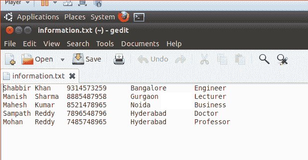
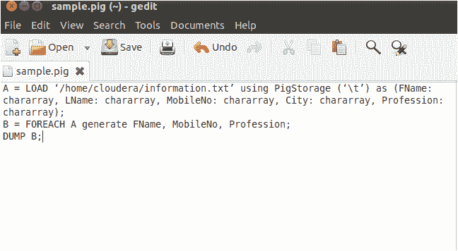
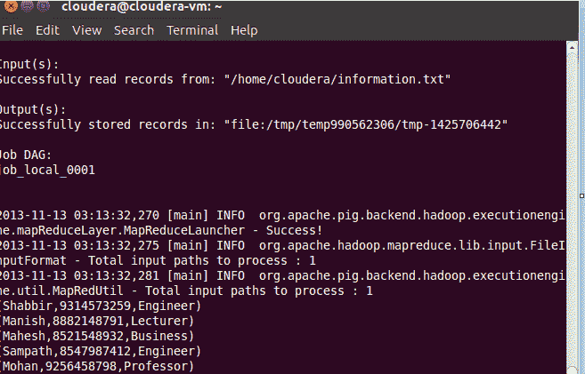

# Pig 编程:本地模式下的 Apache Pig 脚本

> 原文：<https://www.edureka.co/blog/pig-programming-apache-pig-script-in-local-mode/>

在我们之前的 [博文](https://www.edureka.co/blog/pig-programming-create-your-first-apache-pig-script/) 中，我们已经看到了如何从 Pig 编程和脚本开始学习。在那里，我们学习了用 HDFS 模式写一个猪剧本的步骤。在本系列的第二部分中，我们将回顾在本地模式下编写 Pig 脚本的步骤。

## **本地模式下的猪脚本**

**第一步:编写脚本**

*   在 Cloudera 演示虚拟机环境中打开一个编辑器(如 gedit)。
*   编写以下命令，在 cloudera 用户的主目录中创建“sample.pig”文件:

命令:gedit sample.pig

让我们在示例脚本中编写几个 PIG 命令！

假设我们的任务是从数据文件中读取数据，并将所需的内容作为输出显示在控制台上。

示例数据文件包含以下数据:

以“information.txt”的名称保存文本文件

该文件包含由 tab 键分隔的 FirstName、LastName、MobileNo、City 和 Profession 五列。我们的任务是读取该文件的内容，并显示联系人的名字、手机号码和职业。

为了使用 Pig 处理这些数据，这个文件应该存在于本地文件系统中，因为我们是在 Pig 的本地模式下工作的。

编辑 Pig 脚本(sample.pig)以包括以下命令:

这里，数据集文件“information.txt”存在于 cloudera 目录中，因此，我们指定了文件路径“/home/cloudera/information.txt”。

保存并关闭文件。

*   第一个命令使用间接模式 (FName、LName、MobileNo、City 和 Profession)将文件 information.txt 加载到变量 A 中。
*   第二个命令将所需数据从变量 A 加载到变量 b。
*   第三行在终端/控制台上显示变量 B 的内容。

#### **第二步:执行 Pig 脚本**

要在本地模式下执行 pig 脚本，请运行以下命令:

命令:pig–x 本地样本. pig

查看结果。

祝贺 Pig 脚本的成功执行，并在 Pig 编程方面领先一步！

有问题要问我们吗？在评论区提到它们，我们会给你回复。

相关帖子:

[大数据和 Hadoop 入门](https://www.edureka.co/big-data-and-hadoop)