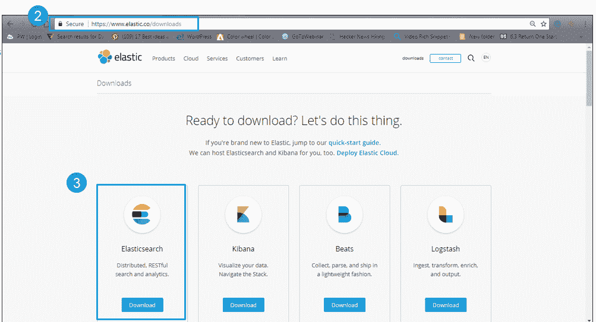
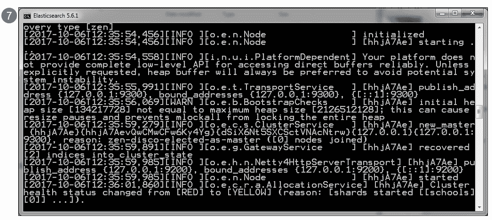
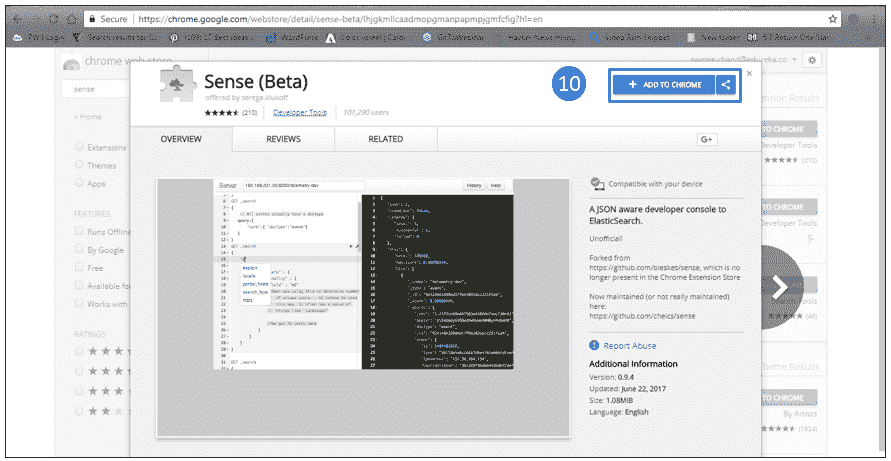

# 什么是弹性搜索——无约束搜索引擎入门

> 原文：<https://www.edureka.co/blog/what-is-elasticsearch/>

在当今的 IT 世界中，每天都会产生大约 2.5 万亿字节的海量数据。这些数据主要来自不同的来源，例如，社交媒体网站、视频共享网站和大中型组织。这些数据被称为数据海洋，或者更一般地称为大数据。这些数据中有相当一部分是无关紧要的、非结构化的和分散的。要理解它，你需要分析工具。市场上有许多可用的分析工具，您可以使用它们来探索、记录、访问、分析和处理非结构化数据。在所有这些工具中，Elasticsearch 最为突出。通过这篇关于什么是 Elasticsearch 的博客，我会解释所有的相关内容。

但是在继续讨论什么是弹性搜索这个博客之前，让我们快速浏览一下我将要解释的主题:

*   [什么是 Elasticsearch？](#1)
*   [弹力搜索优势](#2)
*   [弹力搜索装置](#3)
*   [Elasticsearch 基本概念](#4)
*   [elastic search 中的 API 约定](#5)

这篇 Elasticsearch 教程博客的以下部分将会为你详细介绍 Elasticsearch。

## **什么是 Elasticsearch？**

*Elasticsearch 是基于 Lucene 的搜索引擎。它提供了一个分布式的、支持多租户的全文搜索引擎，带有 HTTP web 接口和无模式的 JSON 文档*。

–维基百科

换句话说，Elasticsearch 是一个用 Java 开发的开源、独立的数据库服务器。基本上，它用于全文搜索和分析。它接受来自各种来源的非结构化数据，并将其存储在一种复杂的格式中，这种格式针对基于语言的搜索进行了高度优化。如上所述，Elasticsearch 使用 Apache Lucene 作为索引和搜索的核心。因为 Lucene 只是一个库，使用它是一件非常复杂的事情。但是你不必担心，因为 Elasticsearch 通过提供对 API 的访问隐藏了所有的复杂性。该 API 以 HTTP RESTful API 的形式出现，使用 JSON 作为数据交换格式。使用 Elasticsearch，您可以快速有效地存储、搜索和分析大量数据。它在处理半结构化数据(即自然语言)时特别有用。

现在你知道了什么是 Elasticsearch，让我们深入了解一下它的历史。

Elasticsearch 是一家名为 ***Elastic*** 的公司的产品，该公司成立于 2012 年。ElasticSearch 是与 Logstash、Kibana 和 Beats 一起的主要开源产品之一。Elastic 提供了其他几个商业产品，如漫威、盾牌、守望者、发现等。

Shay Banon 在 2004 年创造了弹性搜索的先驱，叫做 Compass。它其余的演变在下面的时间线中描述:

在本博客关于什么是 Elasticsearch 的下一部分，你会发现 Elasticsearch 的哪些特性使它脱颖而出。

## **弹力搜索的优势**

以下是它的一些优点:

*   **可伸缩性:** Elasticsearch 非常容易伸缩，也非常可靠。这是一个非常重要的功能，有助于简化复杂的体系结构，并在项目实施过程中节省时间。
*   **速度:** Elasticsearch 使用分布式倒排索引为您的全文搜索找到最佳匹配。这使得它即使在搜索非常大的数据集时也非常快。
*   **易于使用的 API:** Elasticsearch 提供简单的 RESTful APIs，并使用无模式的 JSON 文档，这使得索引、搜索和查询数据变得非常容易。
*   **多语言:【Elasticsearch 最显著的特点之一就是多语言。它支持各种不同语言编写的文档，如阿拉伯语、巴西语、中文、英语、法语、印地语、韩语等。**
*   **面向文档:** Elasticsearch 将现实世界的复杂实体存储为结构化的 JSON 文档，并默认索引所有字段，使数据可搜索。因为没有数据的行和列，所以可以轻松地执行复杂的全文搜索。
*   **自动补全:** Elasticsearch 也提供自动补全功能。通过使用很少的字符预测单词，自动补全加快了人机交互。
*   **无模式:** Elasticsearch 是无模式的，因为它接受 JSON 文档。它试图检测数据结构，索引数据，从而使数据可搜索。

现在让我们继续，在什么是 Elasticsearch 博客的下一节中，看看如何在 windows 上安装 Elasticsearch。

## **安装**

**第一步-**安装最新的 Java 版本，或者如果您已经安装了 Java，那么使用 cmd 中的**Java–version**命令检查其版本。

*注意:Java 版本必须是 7 以上*

**第二步——**转到[https://www.elastic.co/downloads.](https://www.elastic.co/downloads)

**第三步—**点击下载获取 zip 文件。

**第四步—**文件下载完成后，解压并提取内容。

**第五步-**转到 **elasticsearch-x.y.z > bin。**

**第六步—**在 bin 文件夹中，找到***elasticsearch . bat***文件，双击它启动 elastic search 服务器。

**步骤 VII—**等待服务器启动。

**第八步—**打开浏览器，输入 *** localhost:9200 *** 检查服务器是否运行。

** 第九步—**如果您能在浏览器上看到上述消息，则表示一切正常。

**步骤 X—**你需要做的最后一件事是，添加 Sense(beta)插件，作为 Elasticsearch 的开发者界面。

## ****

## **弹性搜索基本概念**

在深入研究 Elasticsearch 之前，有几个概念你必须熟悉。

*   ### **近实时**

      Elasticsearch 是一个新的  ar 实时搜索平台，这意味着它可以定期安排可搜索文档的新鲜状态。默认情况下，它是每秒一个状态。因此，从您对文档进行索引开始，到文档变得可搜索之前，会有一点延迟。

*   ### 指标

A   n 索引是具有相似特征的文档的集合。它使用 SQL 类比将数据存储在一个或多个索引中。它用于存储和读取其中的文档。在 Elasticsearch 中，索引由唯一的名称标识，并且必须全部小写。然后，在对索引中的文档执行各种活动时，使用这个名称来引用特定的索引。在一个集群中，可以有 n 个索引。

*   ### **文档**

    

在 Elasticsearch 中，文档是我们可以索引的基本信息单元。这些文档由不同字段的 组成，这些字段中的每一个都由其名称来标识，并且可以包含一个或多个值。这些文档与模式无关，可能有一组不同的字段。这个文档是一个 **JSON** (JavaScript 对象符号)。在一个索引中，可以存储 n 个文档。

*   ### 式

在 Elasticsearch 中，为具有一组公共字段的文档定义了一种类型。它是索引的逻辑类别/分区，其语义完全由用户决定。您也可以在一个索引中定义多种类型。

*   ### 节点

节点是存储数据的 Elasticsearch 服务器的单个实例。它参与集群的索引和搜索功能。节点由名称标识。默认情况下，启动时会为节点分配一个随机的通用唯一标识符(UUID)。该名称用于管理目的。使用这些名称，您可以确定网络中的哪些服务器对应于 Elasticsearch 集群中的哪些节点。

*   ### **集群**

    

集群是一个或多个协同工作的弹性搜索节点(服务器)的集合。它保存全部数据，并提供跨所有节点的简单索引和搜索功能。这种分布式特性使得单个节点无法独立处理太大的数据变得容易。像节点一样，集群也由唯一的名称标识。默认情况下，名称为“elasticsearch”。如果节点被设置为通过其名称加入集群，则该节点只能是集群的一部分，这就是集群名称非常重要的原因。

*   ### 碎片

使用集群，您可以存储超过单个服务器能力的大量信息。为了解决这个问题，Elasticsearch 允许你将你的索引细分成多个部分，这些部分被称为碎片。创建索引时可以定义所需的碎片数量。每个碎片都是一个全功能的独立“索引”，可以托管在集群中的任何节点上。

*   ### **Copy**

为了避免任何种类的意外故障，比如某个分片或节点由于某种原因而离线，其总是建议拥有一个故障转移机制。因此，作为一种解决方案，Elasticsearch 提供了副本。副本只是碎片的附加副本，可以像原始碎片一样用于查询。

## **API 约定**

使用 JSON over HTTP 访问 Elasticsearch REST APIs。Elasticsearch 在整个 REST API 中使用以下约定:-

1.  ***多指标:*** 一般 API 的 中的操作都是针对多指标的。这有助于用户通过执行一次相关查询来通过整个 API 执行各种操作。这些查询使用的一些符号是:
    1.  逗号分隔的符号(demo1，demo2，demo3)
    2.  通配符符号(demo*，de*o2，+demo3，-demo3)
    3.  _ 所有索引的所有关键字
    4.  URL 查询字符串参数(ignore_unavailable，allow _ no _ indices，expand_wildcards)
2.  ***索引名称中的日期数学支持:*** 您可以使用日期数学索引名称解析来搜索一系列时间序列索引。这种类型的搜索限制了被搜索的索引数量，从而减少了集群的负载并提高了执行性能。您需要以特定的格式指定日期和时间，如:**<static _ name{date _ math _ expr{date _ format|**time _ zone} }>
    1.  static_name:表示名称的静态文本部分。
    2.  date_math_expr:表示动态计算日期的动态日期数学表达式。
    3.  date_format:表示应呈现计算日期的可选格式。
    4.  time_zone:代表可选时区。
3.  ***常见选项:*** 常见选项有:
    1.  漂亮的结果
    2.  人类可读输出
    3.  日期数学
    4.  响应过滤
    5.  平面设置
    6.  参数
    7.  没有值
    8.  时间单位
    9.  字节大小单位
    10.  无单位数量
    11.  距离单位
    12.  模糊性
    13.  启用堆栈跟踪
    14.  查询字符串中的请求体
4.  ***基于 URL 的访问控制:*** 用户还可以使用基于 URL 的访问控制代理来保护对 Elasticsearch 索引的访问。Elasticsearch 提供了一个选项，可以在 URL 和请求正文中的每个请求上指定一个索引，例如:
    1.  多重搜索
    2.  多重获取
    3.  批量

关于什么是 Elasticsearch 的博客到此结束。我希望通过这篇关于什么是 Elasticsearch 的博客，我能够清楚地解释什么是 Elasticsearch 及其基本组成部分。关于更高级的概念和实践演示，你可以参考我的下一篇博客 [Elasticsearch 教程](https://www.edureka.co/blog/elasticsearch-tutorial/)。

*如果你想接受 Elasticsearch 的培训，并希望轻松搜索和分析大型数据集，那么就去看看 Edureka 的 [**ELK Stack Training**](https://www.edureka.co/elk-stack-training-sp) ，这是一家值得信赖的在线学习公司，拥有遍布全球的 250，000 多名满意的学习者。*

*有问题吗？请在评论区提到它，我们会给你回复。*