# OpenCV Python 教程:Python 中 OpenCV 的计算机视觉

> 原文：<https://www.edureka.co/blog/python-opencv-tutorial/>

## **OpenCV Python 教程**

在这个 OpenCV Python 教程博客中，我们将使用 OpenCV Python 来涵盖计算机视觉的各个方面。长期以来，OpenCV 一直是软件开发中至关重要的一部分。学习 OpenCV 对开发人员来说是一笔很好的资产，有助于提高编码水平，也有助于建立软件开发职业生涯！报名参加 Edureka 的 **[Python 课程](https://www.edureka.co/python-programming-certification-training)** 学习真正酷的 Python 应用。

我们将检验以下概念:

*   [什么是计算机视觉？](#z1)
*   [计算机如何读取图像？](#z2)
*   [OpenCV 是什么？](#z3)
*   [OpenCV](#z4)基础知识
*   [图像检测使用 OpenCV](#z5)
*   [运动检测器使用 OpenCV](#z6)

## OpenCV Python 教程|使用 OpenCV 创建人脸识别系统和运动检测器


[https://www.youtube.com/embed/-ZrDjwXZGxI?rel=0&showinfo=0](https://www.youtube.com/embed/-ZrDjwXZGxI?rel=0&showinfo=0)

这个视频解释了 OpenCV 的所有基础知识。

## **什么是计算机视觉？**

为了简化这个问题的答案，让我们考虑一个场景。

我们都用脸书，对吗？假设你和你的朋友去度假，你点击了很多照片，你想把它们上传到脸书，你做到了。但是现在，找到你朋友的脸并在每张照片上做上标记，难道不会花很多时间吗？脸书很聪明，可以帮你标记人。

那么，你认为自动标记功能是如何工作的？简单来说，它的工作原理是计算机视觉。

计算机视觉是一个跨学科领域，研究如何让计算机从数字图像或视频中获得高层次的理解。

这里的想法是将人类视觉系统可以完成的任务自动化。因此，计算机应该能够识别诸如人脸、灯柱甚至雕像之类的物体。

## **计算机如何读取图像？**

考虑下图:

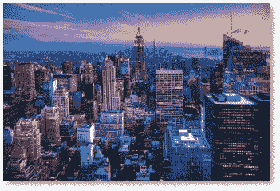我们可以弄清楚，这是纽约天际线的形象。但是，计算机能自己找出答案吗？答案是否定的！

计算机读取 0 到 255 范围内的任何图像。

对于任何彩色图像，都有 3 个原色通道——红色、绿色和蓝色。它的工作原理非常简单。

为每个原色形成一个矩阵，然后这些矩阵组合起来为各个 R、G、B 颜色提供一个像素值。

矩阵的每个元素提供关于像素亮度的数据。

考虑下面的图像:

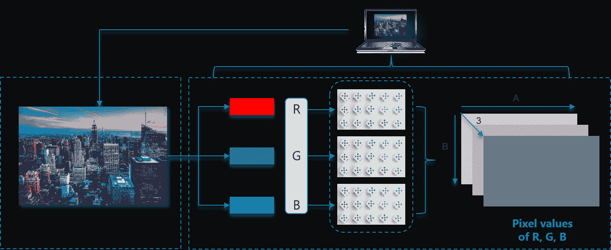

如图所示，这里图像的大小可以计算为 B×A×3。

注意:对于黑白图像，只有一个单通道。

接下来，在这个 OpenCV Python 教程博客上，让我们看看 OpenCV 到底是什么。

## **OpenCV 是什么？**

OpenCV 是一个 Python 库，旨在解决计算机视觉问题。 OpenCV 最初由英特尔于 1999 年开发，但后来得到了 Willow Garage 的支持。

OpenCV 支持多种编程语言，如 C++、Python、Java 等。支持多种平台，包括 Windows、Linux 和 MacOS。

OpenCV Python 只不过是一个用于 Python 的原始 C++库的包装类。使用这种方法，所有 OpenCV 数组结构都可以与 NumPy 数组相互转换。

这使得它更容易与其他使用 NumPy 的库集成。比如 SciPy、Matplotlib 等库。

接下来，在这个 OpenCV Python 教程博客上，让我们看看我们可以用 OpenCV 执行的一些基本操作。

## **基本操作** **用 OpenCV？**

让我们看看从加载图像到调整图像大小等各种概念。

## **使用 OpenCV 加载图像:**

```

Import cv2

# colored Image

Img = cv2.imread (&ldquo;Penguins.jpg&rdquo;,1)

# Black and White (gray scale)

Img_1 = cv2.imread (&ldquo;Penguins.jpg&rdquo;,0)

```

从上面的代码中可以看出，第一个要求是导入 OpenCV 模块。

稍后我们可以使用 **imread** 模块读取图像。参数中的 1 表示它是彩色图像。如果参数是 0 而不是 1，这意味着导入的图像是黑白图像。这张图片的名字是“企鹅”。很简单，对吧？

## **图像形状/分辨率:**

我们可以利用形状子功能打印出图像的形状。请看下图:

```

Import cv2

# Black and White (gray scale)

Img = cv2.imread (&ldquo;Penguins.jpg&rdquo;,0)

Print(img.shape)

```

对于图像的形状，我们指的是 NumPy 数组的形状。从执行代码中可以看出，矩阵由 768 行和 1024 列组成。

## **显示图像:**

使用 OpenCV 显示图像非常简单明了。考虑下图:

```

import cv2

# Black and White (gray scale)

Img = cv2.imread (&ldquo;Penguins.jpg&rdquo;,0)

cv2.imshow(&ldquo;Penguins&rdquo;, img)

cv2.waitKey(0)

# cv2.waitKey(2000)

cv2.destroyAllWindows()

```

如你所见，我们首先使用 **imread 导入图像。**我们需要一个窗口输出来显示图像，对吗？

我们使用 **imshow** 函数通过打开一个窗口来显示图像。 **imshow** 函数有两个参数，即窗口名称和要显示的图像对象。

稍后，我们等待一个用户事件。**等待键**使窗口静止，直到用户按下一个键。传递给它的参数是以毫秒为单位的时间。

最后，我们使用 **destroyAllWindows** 根据 waitForKey 参数关闭窗口。

## **调整图像大小:**

同样，调整图像大小也很容易。下面是另一段代码:

```

import cv2

# Black and White (gray scale)

img = cv2.imread (&ldquo;Penguins.jpg&rdquo;,0)

resized_image = cv2.resize(img, (650,500))

cv2.imshow(&ldquo;Penguins&rdquo;, resized_image)

cv2.waitKey(0)

cv2.destroyAllWindows()

```

这里， **resize** 功能用于将图像调整到所需的形状。这里的参数是新的调整大小的图像的形状。

稍后，请注意图像对象从 **img** 变为 **resized_image，**，因为现在图像对象发生了变化。

其余的代码与前面的代码相比非常简单，对吗？

我相信你们很想看看企鹅，对吧？这就是我们一直想要输出的图像！

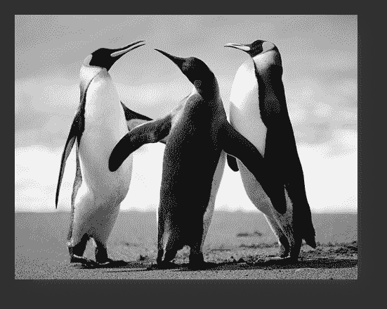

还有另一种方法将参数传递给 resize 函数。看看下面的表现:

```

Resized_image = cv2.resize(img, int(img.shape[1]/2), int(img.shape[0]/2)))

```

这里，我们得到的新图像形状是原始图像的一半。

接下来，在这个 OpenCV Python 教程博客上，让我们看看我们如何使用 OpenCV 执行人脸检测。

## **人脸检测使用 OpenCV**

乍看起来这似乎很复杂，但其实很容易。让我带你经历整个过程，你会有同样的感觉。

**第一步:**考虑到我们的先决条件，我们首先需要一个图像。稍后，我们需要创建一个级联分类器，它将最终给出我们的脸的特征。

**第二步:**这一步包括利用 OpenCV 读取图像和特征文件。因此，在这一点上，在主数据点上有 NumPy 数组。

我们需要做的就是搜索 face NumPy ndarray 的行和列值。这是面矩形坐标的数组。

**第三步:**这最后一步包括用矩形面部框显示图像。

看看下面的图片，为了便于阅读，我以图片的形式总结了这三个步骤:

很简单，对吗？

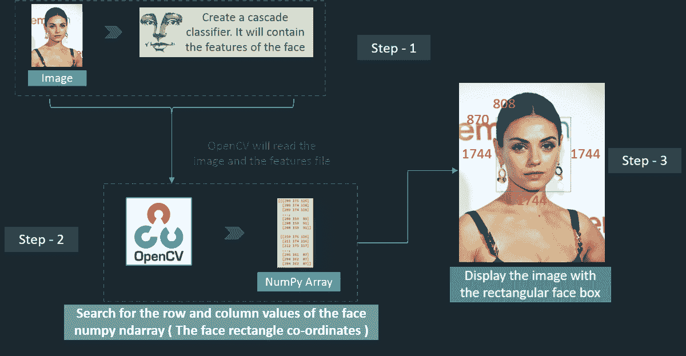

首先，我们创建一个 **CascadeClassifier** 对象来提取面部特征，如前所述。包含面特征的 XML 文件的路径是这里的参数。

下一步是读取上面有人脸的图像，并使用 **COLOR_BGR2GREY** 将其转换成黑白图像。接下来，我们搜索图像的坐标。这是使用**探测多尺度**完成的。

你问什么坐标？这是面部矩形的坐标。**比例因子**用于减少 5%的形状值，直到找到人脸。因此，总的来说，值越小，精确度越高。

最后把脸印在窗户上。

## **添加矩形面框:**

这个逻辑非常简单，就像使用 for 循环语句一样简单。看看下面的图片

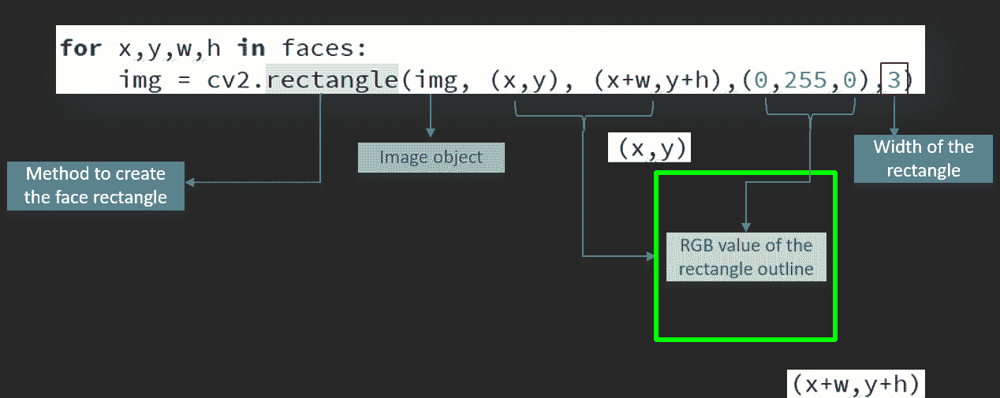我们定义了使用 **cv2.rectangle** 创建矩形的方法，通过传递参数，如图像对象、方框轮廓的 RGB 值和矩形的宽度。

让我们来看看人脸检测的全部代码:

```

import cv2

# Create a CascadeClassifier Object
face_cascade = cv2.CascadeClassifier("haarcascade_frontalface_default.xml")

# Reading the image as it is
img = cv2.imread("photo.jpg")

# Reading the image as gray scale image
gray_img = cv2.cvtColor(img,cv2.COLOR_BGR2GRAY)

# Search the co-ordintes of the image
faces = face_cascade.detectMultiScale(gray_img, scaleFactor = 1.05,
&nbsp;&nbsp;&nbsp;&nbsp;&nbsp;&nbsp;&nbsp;&nbsp; &nbsp;&nbsp;&nbsp;&nbsp;&nbsp;&nbsp;&nbsp;&nbsp;&nbsp;&nbsp;&nbsp;&nbsp;&nbsp;&nbsp;&nbsp;&nbsp;&nbsp;&nbsp;&nbsp;&nbsp;&nbsp;&nbsp;&nbsp;&nbsp;&nbsp;&nbsp;&nbsp;&nbsp;&nbsp;minNeighbors=5)
for x,y,w,h in faces:
&nbsp;&nbsp;&nbsp; img = cv2.rectangle(img, (x,y), (x+w,y+h),(0,255,0),3)

resized = cv2.resize(img, (int(img.shape[1]/7),int(img.shape[0]/7)))

cv2.imshow("Gray", resized)

cv2.waitKey(0)

cv2.destroyAllWindows()

```

接下来，在这个 OpenCV Python 教程博客中，让我们看看如何使用 OpenCV 通过计算机网络摄像头捕捉视频。

## **使用 OpenCV** 捕捉视频

使用 OpenCV 捕捉视频也非常简单。下面的循环会给你一个更好的想法。来看看:


逐个读取图像，由于帧的快速处理使得各个图像移动，因此产生了视频。

## **捕捉视频:**

看看下面的图片:

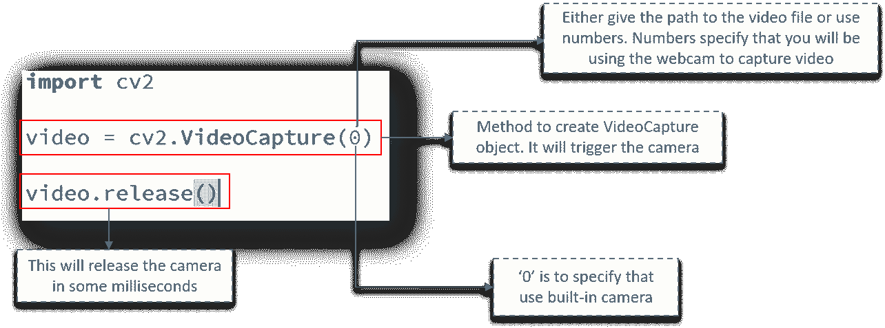

首先，我们像往常一样导入 OpenCV 库。接下来，我们有一个名为 **VideoCapture** 的方法，用于创建 VideoCapture 对象。此方法用于触发用户机器上的摄像头。该函数的参数表示程序应该使用内置摄像头还是附加摄像头。在这种情况下,“0”表示内置摄像头。

最后，**释放**方法用于在几毫秒内释放相机。

当你继续输入并尝试执行上面的代码时，你会注意到相机灯亮了一会儿，过一会儿又关了。为什么会这样？

发生这种情况是因为没有时间延迟来保持相机的功能。

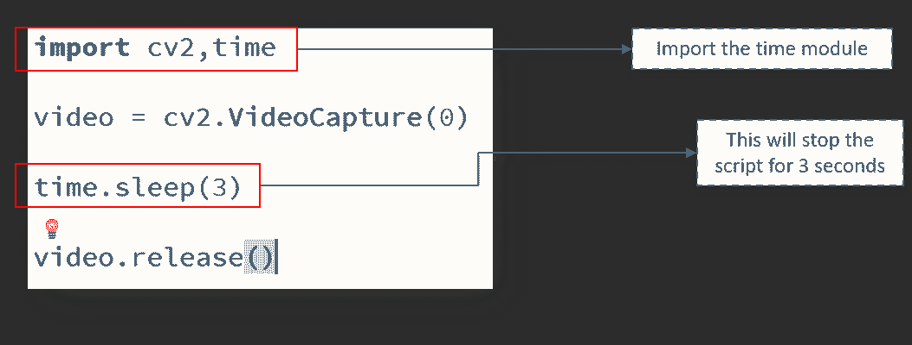

看上面的代码，我们有一个新的行叫做**time . sleep(3)**——这使得脚本停止 3 秒钟。请注意，传递的参数是以秒为单位的时间。因此，当代码执行时，网络摄像头将打开 3 秒钟。

## **添加窗口:**

添加一个窗口来显示视频输出非常简单，可以与用于图像的相同方法相比较。但是，有一点小小的变化。看看下面的代码:

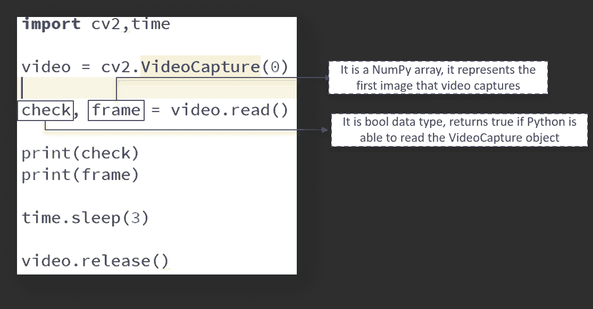

除了一两行代码之外，我很确定你能从上面的代码中得到最大的理解。

这里，我们定义了一个 NumPy 数组，用来表示视频捕获的第一幅图像——它存储在**帧**数组中。

我们还有**检查**——这是一个布尔数据类型，如果 Python 能够访问和读取 **VideoCapture** 对象，它将返回 **True** 。

查看下面的输出:

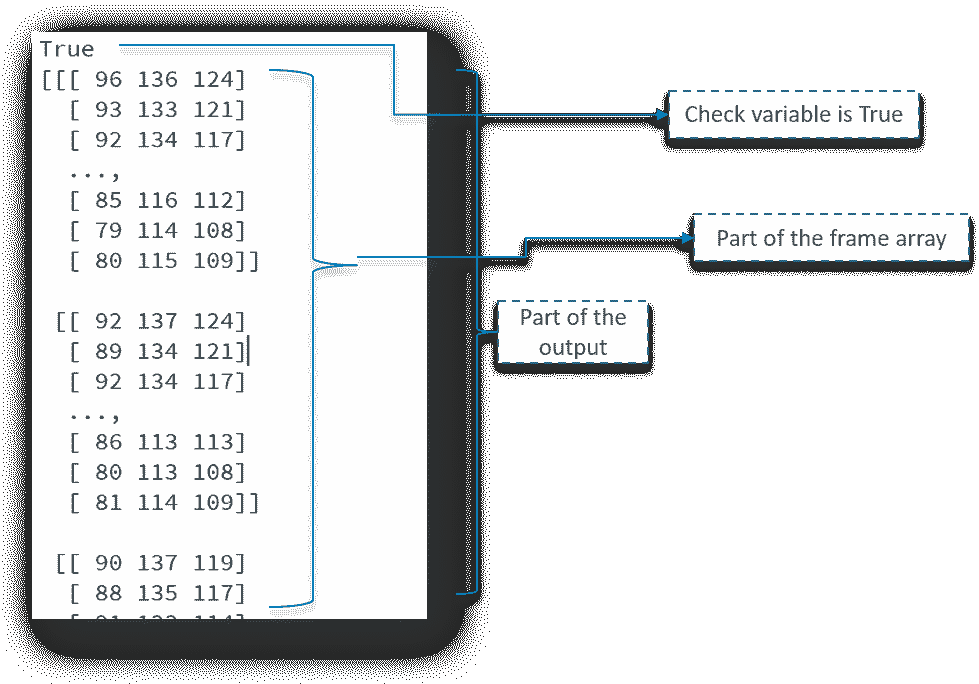

正如你所看到的，我们得到的输出为**真**，帧数组的一部分被打印出来。

但是我们需要阅读视频的第一帧/图像才能开始，对吗？

为了做到这一点，我们需要首先创建一个 frame 对象，它将读取 **VideoCapture** 对象的图像。


如上所述， **imshow** 方法用于捕捉视频的第一帧。

一直以来，我们都试图捕捉视频的第一个图像/帧，但是直接捕捉视频。

那么，我们如何在 OpenCV 中捕捉视频而不是第一张图像呢？

## **直接捕捉视频:**

为了捕捉视频，我们将使用 **while** 循环。而条件将是这样，直到除非**【检查】**为**真。如果是，Python 将显示这些帧。**

下面是代码片段图片:

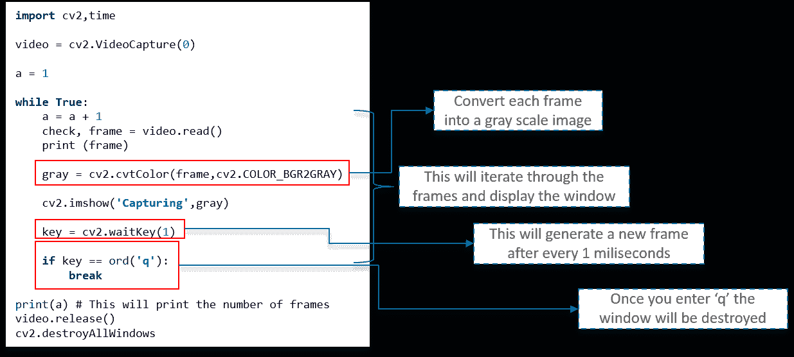

如前所述，我们利用 **cvtColor** 函数将每一帧图像转换成灰度图像。

**【wait key(1)**将确保在每毫秒的间隙后生成一个新帧。

这里需要注意的是， **while** 循环完全是为了帮助遍历帧并最终显示视频。

这里还有一个用户事件触发器。一旦用户按下“q”键，程序窗口关闭。

OpenCV 很容易掌握，对吧？我个人非常喜欢 OpenCV 的可读性，以及初学者使用 OpenCV 的速度。

接下来，在这个 OpenCV Python 教程博客中，让我们看看如何使用 OpenCV 来使用一个非常有趣的运动检测器用例。

## **用例:使用 OpenCV** 的运动检测器

## **问题陈述:**

一家研究人类行为的公司找到了你。你的任务是给他们一个摄像头，可以检测到运动或任何运动在它面前。这应该会返回一个图表，这个图表应该包含人/物体在摄像机前的时间。

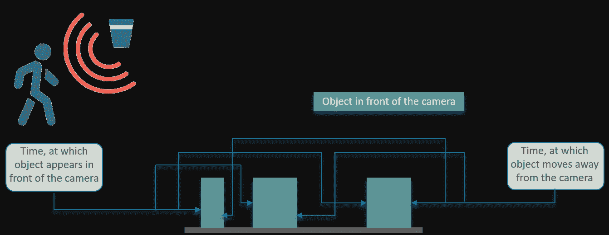

现在，我们已经定义了问题陈述，我们需要建立一个解决方案逻辑，以结构化的方式处理问题。

考虑下图:

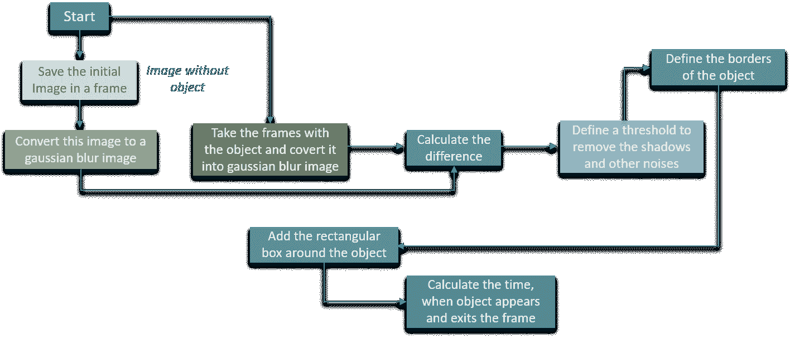

最初，我们将图像保存在特定的帧中。

下一步是将图像转换成高斯模糊图像。这样做是为了确保我们计算出模糊图像和实际图像之间的明显差异。

此时，图像仍然不是物体。我们定义一个阈值来消除图像中的瑕疵，如阴影和其他噪声。

稍后定义对象的边界，我们在对象周围添加一个矩形框，就像我们之前在博客中讨论的那样。

最后，我们计算物体出现和离开画面的时间。

很简单，对吧？

下面是代码片段:

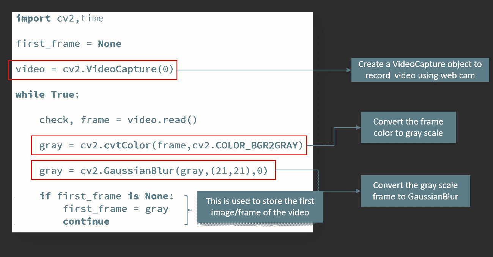

这里也遵循同样的原则。我们首先导入包并创建 **VideoCapture** 对象，以确保我们使用网络摄像头捕捉视频。

while 循环遍历视频的各个帧。我们将彩色帧转换为灰度图像，然后将灰度图像转换为高斯模糊。

我们需要存储视频的第一个图像/帧，对吗？为此，我们只使用了 **if** 语句。

现在，让我们深入一点代码:

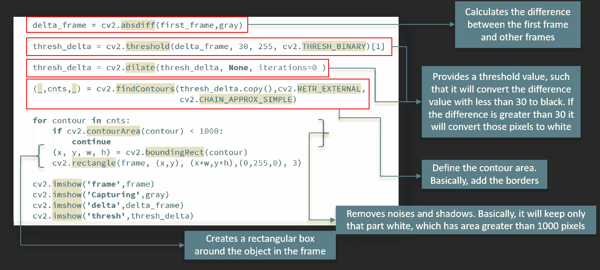

我们利用 **absdiff** 函数来计算第一个出现的帧和所有其他帧之间的差异。

**阈值**功能提供了一个阈值，它会将小于 30 的差值转换为黑色。如果差值大于 30，它会将这些像素转换为白色。 **THRESH_BINARY** 用于此目的。

之后，我们利用 **findContours** 函数为我们的图像定义轮廓区域。我们在这个阶段也添加了边框。

**轮廓区域**功能，如前所述，可去除噪声和阴影。为了简单起见，它将只保留白色部分，其面积大于 1000 像素，正如我们为其定义的那样。

之后，我们在工作框架中围绕我们的对象创建一个矩形框。

接下来是这个简单的代码:


如前所述，画面每 1 毫秒改变一次，当用户输入**‘q’，**时，循环中断，窗口关闭。

我们已经在这个 OpenCV Python 教程博客上讨论了所有的主要细节。我们的用例还剩下一件事，那就是我们需要计算物体在摄像机前的时间。

## **计算时间:**

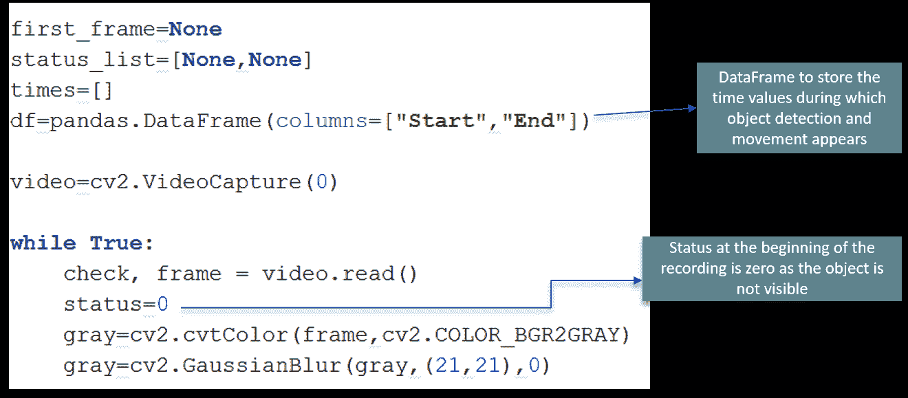

我们利用**数据帧**来存储时间值，在此期间目标检测和移动出现在帧中。

接着是前面解释过的**视频捕捉**功能。但在这里，我们有一个标志位，我们称之为**状态。**我们在记录开始时使用这个状态为**零**，因为物体最初**不可见**。


如上图所示，当检测到物体时，我们将状态标志改为 1。很简单，对吧？

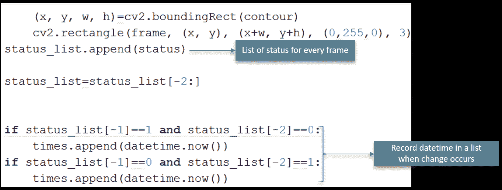

我们将列出每个扫描帧的状态，并在列表中记录使用**日期时间**的日期和时间，如果和哪里发生变化。


我们将时间值存储在**数据帧**中，如上图所示。最后，我们将把**数据帧**写入一个 CSV 文件，如图所示。

## **绘制运动检测图形:**

用例中显示结果的最后一步。我们正在显示表示双轴运动的图形。考虑下面的代码:

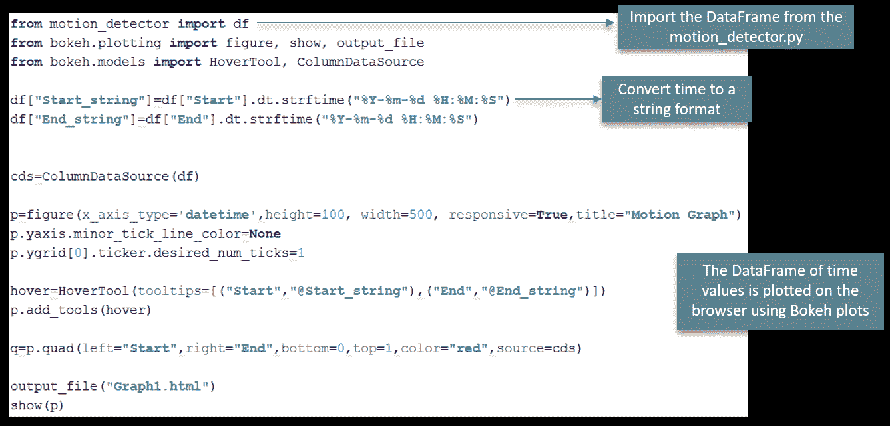

首先，我们从 **motion_detector.py** 文件中导入**数据帧**。

下一步是将时间转换成可读的字符串格式，以便解析。

最后，使用**散景图在浏览器上绘制时间值的**数据帧**。**

**输出:**


## **结论**

我希望这篇 OpenCV Python 教程能帮助你学习使用 Python 入门 OpenCV 所需的所有基础知识。

当您试图开发需要图像识别和类似原理的应用程序时，这将非常方便。现在，借助 Python 中的 OpenCV，您也应该能够使用这些概念轻松地开发应用程序。

看完这篇关于 OpenCV Python 教程的博客后，我很确定你想了解更多关于 Python 的知识。想要了解更多关于 Python 的知识，你可以参考下面的博客:

1.  **[Python 教程——Python 编程初学者](https://www.edureka.co/blog/python-tutorial/)**
2.  **[用于数据科学的 Python](https://www.edureka.co/blog/learn-python-for-data-science/)**
3.  [**你应该学习 Python 的 10 大理由**](https://www.edureka.co/blog/10-reasons-why-you-should-learn-python)
4.  [**Python 请求教程**](https://www.edureka.co/blog/python-requests-tutorial/)
5.  [**Python Tkinter 教程**](https://www.edureka.co/blog/tkinter-tutorial/)

*要深入了解 Python 及其各种应用程序，您可以在此注册参加实时在线培训，24/7 全天候支持和终身访问。*

有问题吗？请在这个“OpenCV Python 教程”博客的评论部分提到它，我会尽快回复你。