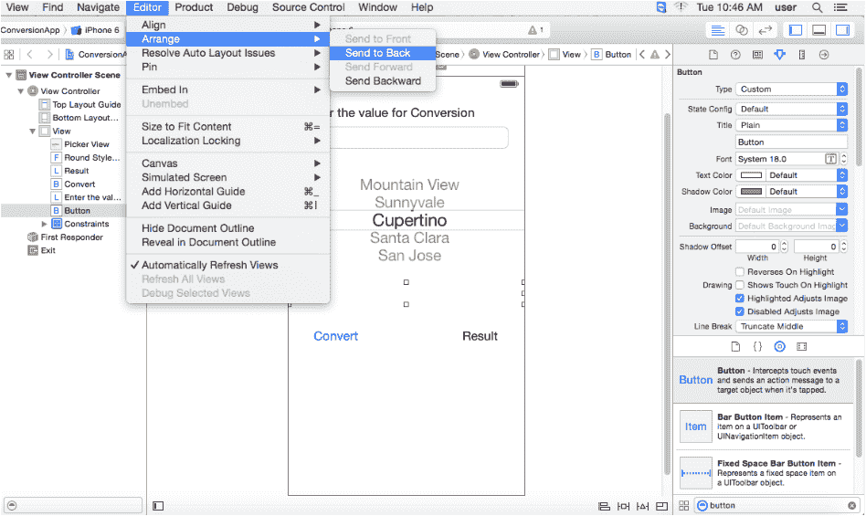
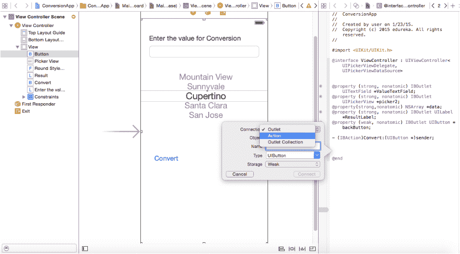
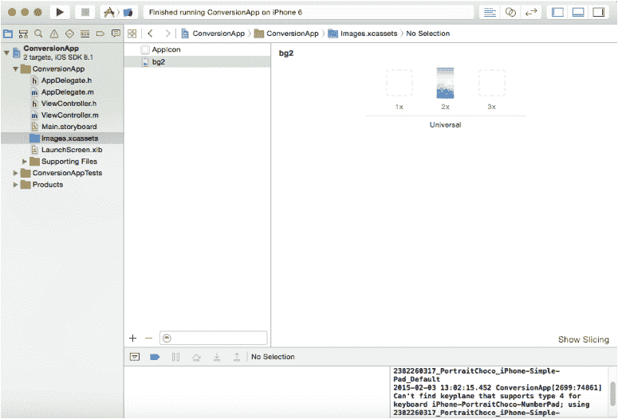
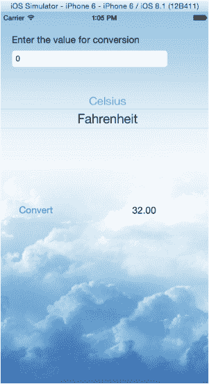
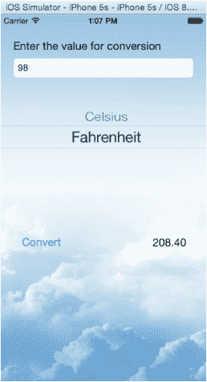
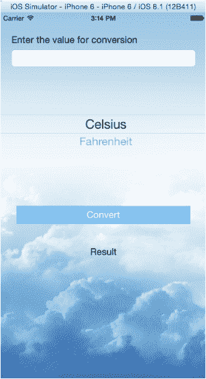
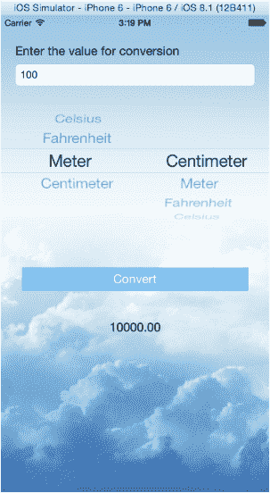
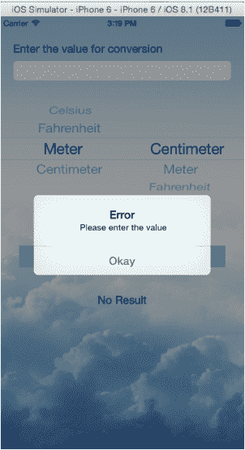

# iOS 应用程序:使用多组件选择器

> 原文：<https://www.edureka.co/blog/an-ios-app-a-click-away-working-with-multicomponent-picker/>

若要深入了解，请阅读 [一个 iOS 应用一键离开](https://www.edureka.co/blog/an-ios-app-a-click-away/) 。这是 ios 应用系列的第二篇博客。

如果你是一个有经验的开发者，并且对多组件选择器的工作很好奇，那么你来对了博客。在这篇博客中，我将讨论如何通过实现一个多组件选择器来扩展我们的转换应用程序，以及如何使用警报来执行异常处理。

在的上一篇博客中，我们已经看到**当我们在文本栏中键入一些东西时，键盘会弹出。要转换的值在文本字段中键入，然后我们看到键盘没有消失。**

为了解决这个问题，我们必须添加一个覆盖整个视图的按钮。**当用户触摸背景上的任何地方时，键盘应该会消失。**

现在，让我们开始吧。拖移一个按钮，从属性检查器中将按钮的类型设定为“自定”,将文本颜色设定为“透明色”。

[](https://www.edureka.co/blog/wp-content/uploads/2015/02/0.51.png)

然后选择编辑器>排列>置于底层

[](https://www.edureka.co/blog/wp-content/uploads/2015/02/22.png)

并以适合整个视图的方式调整按钮的大小。

[](https://www.edureka.co/blog/wp-content/uploads/2015/02/3.5.png)

这个按钮现在充当背景不可见按钮，单击它键盘就会消失。我们来写 IBAction 同样，选择助理编辑器模式，control +拖动到 ViewController.h，设置连接为 Action，名称为 BackgroundButton，点击连接。

[](https://www.edureka.co/blog/wp-content/uploads/2015/02/41.png)

视图控制器代码现在看起来像这样。

```
#import <UIKit/UIKit.h>

@interface ViewController : UIViewController<UIPickerViewDelegate, UIPickerViewDataSource>
@property (strong, nonatomic) IBOutlet UITextField *ValueTextField;
@property (strong, nonatomic) IBOutlet UIPickerView *picker2;
@property(strong,nonatomic) NSArray *data;
@property (strong, nonatomic) IBOutlet UILabel *ResultLabel;

- (IBAction)Convert:(UIButton *)sender;
- (IBAction)backgroundButton:(id)sender;

@end
```

切换到 ViewController.m，然后编写以下代码。

```
- (IBAction)backgroundButton:(id)sender {
    [_ValueTextField resignFirstResponder];
    [_picker2 resignFirstResponder];
    [_ResultLabel resignFirstResponder];
}
```

这里的代码告诉所有其他对象在检测到触摸时产生第一响应者状态。现在，运行应用程序，看看。你将能够发现，当你触摸背景时，键盘就消失了。现在，当您完成键入时，要使用键盘，请在选取器的 didselectRow()方法中调用 backgroundButton 方法。因此方法代码如下。

```
-(void)pickerView:(UIPickerView *)pickerView didSelectRow:(NSInteger)row inComponent:(NSInteger)component
{
    selectedValue = _data[row];
    [self backgroundButton:0];

}
```

现在，你可以在应用程序的美化部分工作，比如添加背景，甚至可能给一个花哨的按钮图像。然而，在我的，我将设置一个背景图像。要做到这一点，首先要找到一个合适的图像。然后将其添加到 Images.xcassets 文件夹中，并在 universal 中将图像从 1x 屏幕更改为 2x 屏幕。

[](https://www.edureka.co/blog/wp-content/uploads/2015/02/51.png)

运行应用程序，看看它是否工作正常。

[](https://www.edureka.co/blog/wp-content/uploads/2015/02/1-1.png)

如果我把设备换成 iphone 5s。

[](https://www.edureka.co/blog/wp-content/uploads/2015/02/71.png)

并运行应用程序。

[](https://www.edureka.co/blog/wp-content/uploads/2015/02/2-2.png)

在这里我们可以看到，一切都像预期的那样正常。现在，如果我想给我的按钮添加一个背景，并使外观更像一个按钮呢？为此，我将首先为 ViewController.h 的 convert 按钮添加一个 IBOutlet

```
@property (strong, nonatomic) IBOutlet UIButton *convert;
```

然后在 viewDidLoad()方法中添加以下代码

```
self.convert.backgroundColor = [UIColor colorWithRed:0.4 green:0.8 blue:1.0 alpha:1.0];
[_convert setTitleColor:[UIColor whiteColor] forState:UIControlStateNormal];
```

让我们运行我们的应用程序，看看它是否是我们喜欢的方式。

[](https://www.edureka.co/blog/wp-content/uploads/2015/02/first1.png)

好极了。你一定注意到我也改变了结果标签的位置，改变的原因我将在后面解释。

我们知道我们的应用程序只能从摄氏温度转换到华氏温度，反之亦然。那么，再增加几个函数或单元来进行转换怎么样？为此，我们需要在 UIPickerView 中再添加一个组件，当在 picker 的第一个组件中选择了一个单元时，它会给出适当的选择。

要将 picker 分成两个组件，我们需要添加一个新的 NSArray data2，它将保存第二个组件的数据。此外，定义两个常量来表示我们的两个组件。这里，为了简化编程，左边的组件被声明为 0，右边的组件被声明为 1。

您的 ViewController.h 文件如下所示

```
#import <UIKit/UIKit.h>

# define data1comp 0
# define data2comp 1

@interface ViewController : UIViewController<UIPickerViewDelegate, UIPickerViewDataSource,UIAlertViewDelegate>

@property (strong, nonatomic) IBOutlet UITextField *ValueTextField;
@property (strong, nonatomic) IBOutlet UIPickerView *picker2;
@property(strong,nonatomic) NSArray *data1;
@property (strong, nonatomic)NSArray *data2;
@property (strong, nonatomic) IBOutlet UILabel *ResultLabel;
@property (strong, nonatomic) IBOutlet UIButton *convert;

- (IBAction)Convert:(UIButton *)sender;
- (IBAction)backgroundButton:(id)sender;

@end
```

现在在 ViewDidLoad()方法中定义数组 data2。现在我们有了两个数据源，我们必须能够以这样一种方式为选取器编写代码，当我们从选取器的第一个组件中选择一个项目时，第二个组件应该自动更改为相应的值。第二个组件取决于第一个组件的选择。为此，我们需要定义一个字典来存储键和值。键包含与选取器的第一个组件相对应的数据，值包含与选取器的第二个组件相对应的数据。

```
- (void)viewDidLoad {
[super viewDidLoad];
// Do any additional setup after loading the view, typically from a nib.

   _data1=[NSArray arrayWithObjects:@"Celsius",@"Fahrenheit",@"Meter",@"Centimeter", nil];
   data2=[NSArray arrayWithObjects:@"Centimeter",@"Meter",@"Fahrenheit",@"Celsius",nil ];

   dictionary= [NSDictionary dictionaryWithObjectsAndKeys:@"Celcius",@"Farenheit",@"Farenheit",@"Celcius",@"Meter",@"Centimeter",@"Centimeter",@"Meter", nil];

   self.view.backgroundColor=[UIColor colorWithPatternImage:[UIImage imageNamed:(@"bg2.png")]];
}
```

现在，我们必须将当前选取器的数据源和委托方法更改为以下内容，以便我们在两个组件中都填充了数据。

```
-(NSInteger)numberOfComponentsInPickerView:(UIPickerView *)pickerView
{
   return 2;
}
-(NSInteger)pickerView:(UIPickerView *)pickerView numberOfRowsInComponent:(NSInteger)component
{
   if(component == data1comp)
   {
     return [self.data1 count];
   }
     return [self.data2 count];
}
-(NSString *)pickerView:(UIPickerView *)pickerView titleForRow:(NSInteger)row forComponent:(NSInteger)component
{
   if(component == data1comp)
   {
    return [self.data1 objectAtIndex:row];
   }
    return [self.data2 objectAtIndex:row];
}
-(void)pickerView:(UIPickerView *)pickerView didSelectRow:(NSInteger)row inComponent:(NSInteger)component
{
   [self backgroundButton:0];

   if(component == data1comp)
   {
     NSString *data11=[_data1 objectAtIndex:row];
     NSArray *a= [dictionary objectForKey:data11];

     secondrow = [self.data2 indexOfObject:a];
     [_picker2 selectRow:secondrow inComponent:data2comp animated:YES];
     [_picker2 reloadComponent:data2comp];

     selectedValue = data11;
     selectedRow= row;
   }
}
```

在我们的 didSelectRow()方法中，我们获取第一个组件的选定值，然后将它作为参数传递给字典的 objectForKey()方法，并获取键的相应值。为了找到值在第二个数组(即 data2)中的相应位置，我们使用数组的 indexOfObject()方法，并将结果存储在一个整数值中。然后，我们将这个整数值传递给选择器方法 select row:row in component:component()方法。并使用 reloadComponent()重新加载选取器的组件。完成此操作后，当我们从第一个组件中选择一个项目时，相应的项目将在提货器的第二个组件中被选中。

didSelectRow()的代码

```
-(void)pickerView:(UIPickerView *)pickerView didSelectRow:(NSInteger)row inComponent:(NSInteger)component
{
    [self backgroundButton:0];

    if(component == data1comp)
    {
      NSString *data11=[_data1 objectAtIndex:row];
      NSArray *a= [dictionary objectForKey:data11];

      secondrow = [self.data2 indexOfObject:a];
      [_picker2 selectRow:secondrow inComponent:data2comp animated:YES];
      [_picker2 reloadComponent:data2comp];

      selectedValue = data11;
      selectedRow= row;
     }
}
```

现在运行应用程序，看看拣选器是否如预期的那样工作。

[](https://www.edureka.co/blog/wp-content/uploads/2015/02/secnd.png)

瞧啊。有用！

所以让我们继续编写我们的转换按钮。早期的选择器只有两个匹配值，即摄氏度和华氏度，然后计算结果。但是现在我们有四个值，摄氏度，华氏度，米和厘米。所以我使用了一个 switch 语句，它根据所选的行变量计算值。

```
- (IBAction)Convert:(UIButton *)sender {
    float val=[_ValueTextField.text floatValue];
    NSLog(@"value %f",val);
    switch(selectedRow)
    {
      case 0:// Celsius to Fahrenheit
             res=(val*1.8)+32;break;
      case 1: // Fahrenheit to Celsius
             res=(val-32)/1.8;break;

      case 2: // Meter to Centimeter
             res= val*100; break;

      case 3://Centimeter to Meter
             res=val*0.01; break;
      default: res=0.0;
    }

    NSString *final= [NSString stringWithFormat:@"%.02f",res];
    _ResultLabel.text = final;
}
```

如果你运行应用程序，我们可以看到一切正常。

[](https://www.edureka.co/blog/wp-content/uploads/2015/02/forth.png)

现在，我们可以检查应用程序中可能出现的异常。例如，文本框中没有值。或者我们试图从摄氏度转换到米或厘米，这实际上是不可能的。这些类型的情况被称为异常，我们必须通过编写代码来处理这样的错误来避免它。

让我们解决运行应用程序时可能出现的第一种错误。也就是说，我们没有在文本字段中写入要转换的值。对于这个场景，我们必须提醒用户输入值，然后继续。

为此，我们可以使用 UIAlertView。我们可以编写一个名为 showAlertWithMessage(ns string *)message 的方法。在这个方法中，我们可以声明一个 alertView，然后最终使用 show()方法显示它。该方法的代码如下所示。

```
- (void)showAlertWithMessage:(NSString *) message {

     UIAlertView *alertView = [[UIAlertView alloc] initWithTitle:@"Error" message:message delegate:self cancelButtonTitle:nil otherButtonTitles:@"Okay", nil];
     alertView.tag = 100;

     _ResultLabel.text=@"No Result";
     [alertView show];

}
```

现在，当用户单击 convert 按钮时，这个方法必须作为 conversion 调用。在没有输入值的情况下，不应进行转换。所以在 convert 的方法定义中，我们必须检查 textfield 的长度是否大于或等于零。如果是，则进行转换，否则显示警告。因此,“转换”按钮代码如下所示:

```
- (IBAction)Convert:(UIButton *)sender {

   if([_ValueTextField.text length] <= 0)
   {
     [self showAlertWithMessage:@" Please enter the value"];
   }
   else
   {

     float res=0.0;
     float val=[_ValueTextField.text floatValue];
     NSLog(@"value %f",val);
     switch(selectedRow)
     {
        case 0:// Celsius to Fahrenheit
               res=(val*1.8)+32;break;
        case 1: // Fahrenheit to Celsius
               res=(val-32)/1.8;break;

        case 2: // meter to centimeter
               res= val*100; break;

        case 3://centimeter to meter
               res=val*0.01; break;
        default: res=0.0;
     }

     NSString *final= [NSString stringWithFormat:@"%.02f",res];
     _ResultLabel.text = final;
    }
}
```

现在运行应用程序，尝试在不在文本字段中输入值的情况下单击转换按钮。

[](https://www.edureka.co/blog/wp-content/uploads/2015/02/fifth.png)

第二种可能发生的异常是 UIPickerView 的第一个组件中的值与第二个组件中的值不匹配。为此，我们检查第二个组件的当前选定组件行值是否等于该方法的 didSelectRow()委托返回的行值的值。如果条件不匹配，则转换不可能，如果值匹配，则可以进行转换。

我们可以如下实现这个逻辑，

```
- (IBAction)Convert:(UIButton *)sender {

  if([_ValueTextField.text length] <= 0)
  {
    [self showAlertWithMessage:@" Please enter the value"];

  }
  else
  {
    _ResultLabel.textColor= [UIColor blackColor];

    float res=0.0;
    NSInteger n =[_picker2 selectedRowInComponent:data2comp];

    if(n==secondrow)
    {

      float val=[_ValueTextField.text floatValue];
      NSLog(@"value %f",val);
      switch(selectedRow)
      {
        case 0:// Celsius to Fahrenheit
               res=(val*1.8)+32;break;
        case 1: // Fahrenheit to Celsius
               res=(val-32)/1.8;break;

        case 2: // meter to centimeter
               res= val*100; break;

        case 3://centimeter to meter
               res=val*0.01; break;
        default: res=0.0;
      }

      NSString *final= [NSString stringWithFormat:@"%.02f",res];
      _ResultLabel.text = final;
    }
    else
    {
      // code for displaying error.
      _ResultLabel.textColor= [UIColor redColor];
      _ResultLabel.text = @"Result cannot be calculated";
    }
}
```

现在运行应用程序，在第一个组件中做出选择后，通过更改第二个组件中的值来查看。

[](https://www.edureka.co/blog/wp-content/uploads/2015/02/sisth.png)

您可以看到错误消息，即无法计算结果。您会注意到错误消息打印在相同的结果标签中，并且消息很长。这就是为什么标签从之前的方向下移了。

这样，我们的转化 app 就完成了。你可以根据自己的选择给 app 增加更多的功能，根据自己的创意让它变得更漂亮。

有问题要问我们吗？在评论区提到它们，我们会给你回复。

**相关帖子:**

[iOS 开发入门](https://www.edureka.co/ios-development)