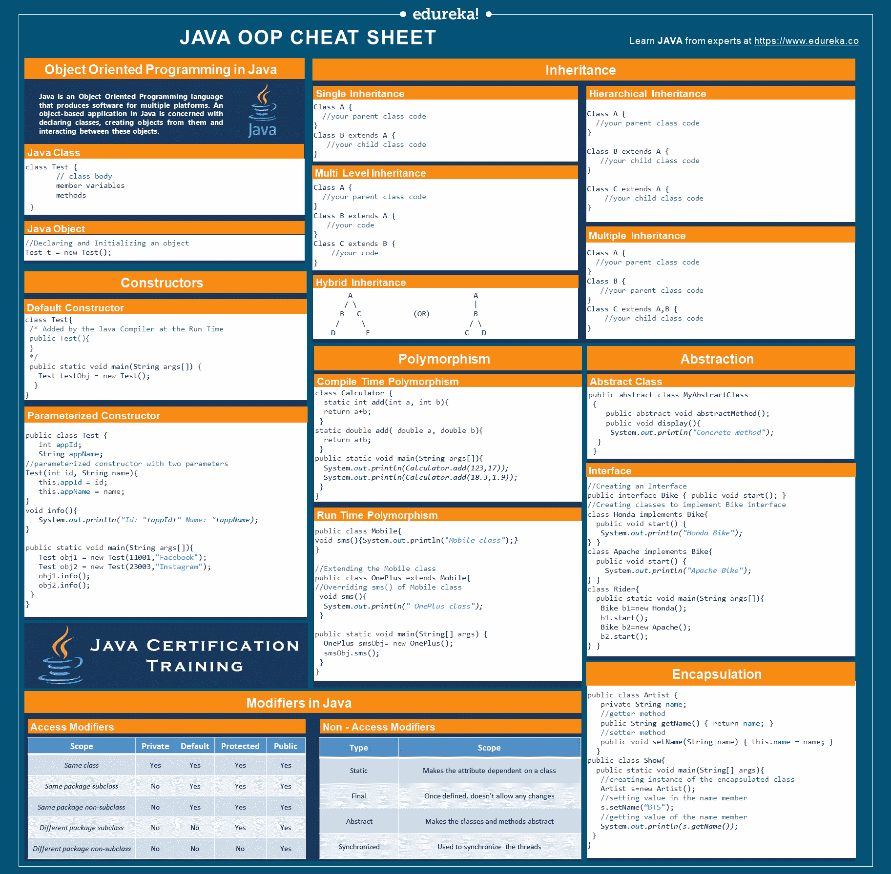

# Java OOP 备忘单——Java 面向对象编程快速指南

> 原文：<https://www.edureka.co/blog/cheatsheets/java-oop-cheat-sheet/>

面向对象编程或更广为人知的 OOPs 是 Java 的主要支柱之一，它充分利用了其强大的功能和易用性。如果你是一名有抱负的 Java 开发人员，你肯定需要完美地掌握 **[Java OOPs 概念](https://www.edureka.co/blog/object-oriented-programming/)** 。为了帮助你，我给你带来了 **Java OOP 备忘单**。这个 Java OOP 备忘单将作为 Java 初学者的速成课程，帮助你获得 Java OOP 概念的专业知识。

## Java 面向对象编程备忘单

**[Java](https://www.edureka.co/blog/what-is-java/)** 是一种面向对象的语言，因为它是围绕 **对象** 而不是动作建模和组织的；和数据而不是逻辑。它通过提供一些非常有趣的特性简化了软件开发和维护。Java 中的面向对象编程旨在实现现实世界中的实体，如对象、类、抽象、继承、多态等等。

<figure class="wpb_wrapper vc_figure"></figure>

<figure class="wpb_wrapper vc_figure">[](http://bit.ly/2QV5lrE)</figure>

## 类别和对象

## Java 类

Java 中的一个 [**类**](https://www.edureka.co/blog/java-tutorial/#obj) 就是一个包含你所有数据的蓝图。一个类包含字段( [**变量**](https://www.edureka.co/blog/java-tutorial/#variables) )和方法来描述一个对象的行为。

```
class Test {
       member variables // class body
       methods
}
```

## Java 对象

An**[object](https://www.edureka.co/blog/java-tutorial/#obj)**是类中具有状态和行为的主要元素。它是一个可以访问你的数据的类的实例。“new”关键字用于创建*对象*。

```
//Declaring and Initializing an object
 Test t = new Test();
```

## Java 构造函数

## 构造器

构造函数是初始化新创建的对象的代码块。它类似于 Java 中的一个方法，但没有任何返回类型，其名称与类名相同。有 3 种类型的构造函数:

1.  默认构造函数(无参数构造函数)
2.  参数化构造器

## 默认构造函数

如果在类中没有声明其他构造函数，这个构造函数默认由 java 编译器在创建类时创建。有时它也被称为无参数构造函数，因为它不包含任何参数。

```
 class Test{
 // Added by the Java Compiler at the Run Time
 public Test(){ 
 }
 public static void main(String args[]) {
   Test testObj = new Test();
  }
}
```

## 参数化构造函数

这个构造函数被称为参数化的，因为它包含一个或多个参数。它用于在创建不同的对象时向它们提供不同的值。

```
public class Test {
 int appId; 
 String appName;  
 //parameterized constructor with two parameters
 Test(int id, String name) {
 this.appId = id; this.appName = name; 
} 
void info() {
 System.out.println("Id: "+appId+" Name: "+appName);
} public static void main(String args[]){ 
 Test obj1 = new Test(11001,"Facebook"); 
 Test obj2 = new Test(23003,"Instagram"); 
 obj1.info(); 
 obj2.info(); 
 }
}
```

## Java 中的修饰符

## 访问修饰符

Java 访问修饰符指定了数据成员、方法、构造函数或类的可访问性范围。

| **范围** | **私人** | **默认** | **被保护的** | **公共** |
| *同类* | 是 | 是 | 是 | 是 |
| *相同的包子类* | 不 | 是 | 是 | 是 |
| *相同的包非子类* | 不 | 是 | 是 | 是 |
| *不同的包子类* | 不 | 不 | 是 | 是 |
| *不同的包非子类* | 不 | 不 | 不 | 是 |

## 非访问修饰符

Java 中的非访问修饰符，并不改变 **[变量](https://www.edureka.co/blog/java-tutorial/#variables)** 和方法的可访问性，相反它们提供了特殊的属性。这些修改器也可以改变元素的行为。

| **式** | **范围** |
| *静态* | 使属性依赖于类 |
| *决赛* | 一旦定义，不允许任何更改 |
| *摘要* | 使类和方法抽象 |
| *同步* | 用于同步线程 |

## 遗产

## Java 中的继承类型

[**继承**](https://www.edureka.co/blog/object-oriented-programming/#inheritance) 是子/派生/子类的属性，允许它从其父/基/超类继承属性(数据成员)和功能(方法)。

*   所有对象都将 对象 类作为其顶级父对象。
*   方法可以被覆盖，但属性 不能。
*   要调用父类构造函数，需要使用 super()。

Java 支持 5 种类型的继承:

1.  单一遗传
2.  多层次继承
3.  分层继承
4.  混合遗传
5.  多重遗传

## 单一遗传

在这里，一个类继承了一个父类的属性。

```
Class A{
  //your parent class code
}
Class B extends A {
   //your child class code
}
```

## 多层次继承

在多级继承中，一个类有不止一个父类，但处于不同的继承级别。

```
Class A{
  //your parent class code
}
Class B extends A {
   //your code
}
Class C extends B {
    //your code 
}
```

## 分层继承

在层次继承中，一个父类可以有一个或多个子类/子类/派生类。

```
Class A{
  //your parent class code
}
Class B extends A {
   //your child class code
}
Class C extends A {
    //your child class code 
}
```

## 混合遗传

混合继承是在一个程序中多种类型继承的结合，例如，你可以将多级继承和层次继承结合起来。

```
 **A**
       / 
    **B     C**
    /         
  **D          E**
```

## 多重遗传

Java 不支持 Mu 多重继承，因为这会导致**钻石问题**。菱形问题是一个模糊性，编译器不知道在超类有同名方法的情况下执行哪个超类方法。

```
 **A**
                 /     
 {abc()} **B ****C** {abc()}
                      /
                    **D** {**?**}
```

*但是 Java 中的多重继承可以使用接口来实现。

## 多态性

[**多态性**](https://www.edureka.co/blog/object-oriented-programming/#polymorphism) 是一个变量、函数或一个对象采取多种形式的能力。 允许定义一个接口 或方法 并有多个实现。Java 中有两种类型的多态性。

1.  编译时多态性
2.  运行时多态性

## 编译时多态性

也称为静态绑定，因为对象的类型是由编译器自己在编译时确定的。示例:方法重载

```
class Calculator {
static int add(int a, int b){
return a+b;
}
static double add( double a, double b){
return a+b;
}
public static void main(String args[]){
System.out.println(Calculator.add(123,17));
System.out.println(Calculator.add(18.3,1.9));
}
}
```

## 运行时多态性

也被称为动态绑定，因为被覆盖的方法在运行时而不是编译时被解析。在这种情况下，引用变量用于在运行时调用超类的重写方法。示例:方法覆盖。

```
public class Mobile{
void sms(){
System.out.println("Mobile class");
}
}
//Extending the Mobile class
public class OnePlus extends Mobile{
//Overriding sms() of Mobile class
void sms(){
System.out.println(" OnePlus class");
}
public static void main(String[] args)
{
OnePlus smsObj= new OnePlus();
smsObj.sms();
}
}
```

## 抽象

## 实现抽象的方法

[**抽象**](https://www.edureka.co/blog/object-oriented-programming/#abstraction) 就是隐藏细节，只向用户展示必要的东西的过程。在 Java 中可以通过两种方式实现抽象:

1.  使用抽象类(0-100%)
2.  使用界面(100%)

## 抽象类

抽象类是用 Abstract 关键字声明的类，不能实例化。创建抽象类的几个指针:

*   它可以包含抽象和非抽象方法。
*   它也可以包含构造函数和静态方法。
*   它可以包含强制子类不改变方法体的最终方法。

```
public abstract class MyAbstractClass 
 {
    public abstract void abstractMethod();
    public void display(){ System.out.println("Concrete method");  }
 }
```

## 连接

java 中的接口是包含静态常量和抽象方法的类的蓝图。它代表的是一种关系。您需要实现一个接口来使用它的方法或常量。

```
//Creating an Interface
public interface Bike { public void start(); }
//Creating classes to implement Bike interface
class Honda implements Bike{
public void start() { System.out.println("Honda Bike"); }
}
class Apache implements Bike{
public void start() { System.out.println("Apache Bike"); }
}
class Rider{
public static void main(String args[]){ 
Bike b1=new Honda(); 
b1.start();
Bike b2=new Apache();
b2.start(); 
}
}
```

## 包装

[**封装**](https://www.edureka.co/blog/object-oriented-programming/#encapsulation) 是使用 getter 和 setter 方法将数据和代码绑定在一起作为一个单元的过程。

您需要执行两个步骤来实现封装:

*   将类的变量声明为私有。
*   提供公共的 setter 和 getter 方法来修改和查看变量值。

```
public class Artist {
private String name;
//getter method
public String getName() { return name; }
//setter method
public void setName(String name) { this.name = name; }
}
public class Show{
public static void main(String[] args){
//creating instance of the encapsulated class
Artist s=new Artist(); 
//setting value in the name member 
s.setName("V"); 
//getting value of the name member 
System.out.println(s.getName()); 
} }
```

## 联合

关联是两个不同类之间通过它们的对象建立的关系。关联可以有多种形式:

*   一对一
*   一对多
*   多对一
*   多对多。

## 聚合

聚合是一种特殊形式的关联，它代表了 Has-A 关系。这是一个单向关联，两个条目都可以独立存在。

## 作文

组合是一种限制性更强的聚合形式，它使两个实体高度依赖于彼此。它代表了关系的**部分，其中组合对象**在没有其他实体的情况下不能存在**。**

## **[下载初学者核心 Java 备忘单](http://bit.ly/2QV5lrE)**

*这样，我们就结束了 **Java OOP 备忘单**。您可以查看 Edureka 的 [**Java 培训**](https://www.edureka.co/java-j2ee-training-course) ，edu reka 是一家值得信赖的在线学习公司，拥有遍布全球的 25 万多名满意的学习者。Edureka 的[**Java****课程**](https://www.edureka.co/java-j2ee-training-course) 是为想成为 Java 开发者的学生和专业人士设计的。本课程旨在让您在 Java 编程方面有一个良好的开端，并训练您掌握核心和高级 Java 概念以及各种 Java 框架，如 Hibernate Spring。*