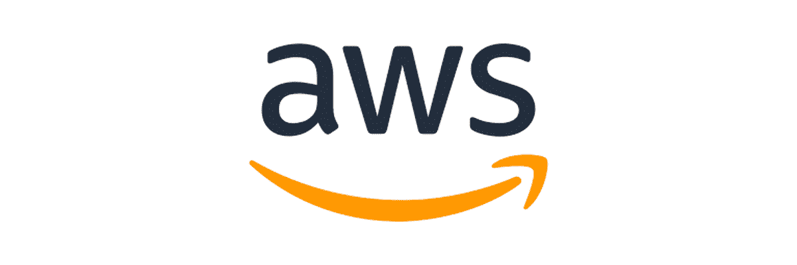

# 亚马逊 CloudWatch 简介

> 原文：<https://www.edureka.co/blog/introduction-to-amazon-cloudwatch/>

[//www.youtube.com/embed/SrjNIiaHZHE](//www.youtube.com/embed/SrjNIiaHZHE)

Amazon CloudWatch 是针对 AWS 云资源和您在 AWS 上运行的应用程序的监控服务。它用于收集和跟踪指标，收集和监控日志文件，以及设置警报。

在开始使用 Amazon CloudWatch 之前，了解它让用户能够监控的项目很重要:

*   亚马逊 EC2 实例
*   亚马逊 EBS 卷
*   弹性负载平衡器
*   自动缩放组
*   Amazon RDS 实时数据库实例
*   亚马逊 SQS 队列，社交网络话题，
*   EMR 作业流，存储网关，DynamoDB 表
*   预计 AWS 费用

通过亚马逊云手表，用户可以获得:

*   最新统计数据
*   查看图表
*   为您的度量数据设置警报
*   根据 CloudWatch 指标，使用自动扩展来添加/删除资源

亚马逊 CloudWatch 为什么有用？

*   资源利用率的可见性
*   运算性能
*   总体需求模式，包括 CPU 利用率、磁盘读写和网络流量等指标。

## **使用 CloudWatch**

要开始使用 CloudWatch，用户需要注册亚马逊 EC2 服务；一旦完成，Amazon CloudWatch 的注册就自动完成，可以使用 AWS 管理控制台访问该功能。

EC2 有两种类型

**基本监控**–每 5 分钟提供一次数据监控，也是免费的。

**详细监控**——分分钟给你充电。

需要理解的一个关键点是，亚马逊 CloudWatch 是为了监控亚马逊服务，而不是用户的服务。如果用户在 EC2 内部部署了服务器，默认情况下，Amazon CloudWatch 不会监控它。需要注意的重要一点是，在亚马逊，我们并不控制硬件。它监控软件，但仅限于亚马逊服务。

以下是亚马逊云观察  的入门步骤

*   登录 AWS 管理控制台
*   单击 Amazon EC2 选项卡上的启动实例按钮
*   选择 AMI 以启动实例，选择密钥对并配置防火墙
*   单击“为此实例启用详细的 CloudWatch 监控”复选框。点击启动按钮
*   几分钟后，您启动的实例将显示为正在运行
*   从列表中选择正在运行的实例，然后单击底部的 monitoring 选项卡
*   将显示所选实例的 CPU、磁盘和网络度量的图形

## **亚马逊如何对 CloudWatch 收费？**

它将按指标收费。在 EC2 中，有 7 个指标。如果是基本的监测，将是免费的。如果是用于详细的监控，那么每个指标将收取 50 美分的费用。

## **工作原理:**

使用 AMI 时，我们启动实例，该实例中启用了监控。CloudWatch 会持续监控资源，并设置警报。警报在这里是一个触发器。例如，如果 CPU 利用率超过 50%，它会向用户发出警报。还设置了每个警报的阈值水平。然后它会通知自动缩放。从那里，我们可以触发某些策略来添加或删除新的实例。然后，它将被添加到负载平衡器，并完成扩展活动。

CloudWatch 只不过是一个数据仓库。它可以从两个来源接收数据，即 AWS 产品和自定义数据。有一些可用的脚本，我们可以在任何机器上进行配置，这样它就可以捕获当前数据并将其发送到 CloudWatch。

## **在哪里能派上用场？**

例如，如果一个人有一个巨大的制冷车间，其中有多个冰柜可用，并且用户希望在每次冰柜温度下降时得到通知。在这里，用户可以连接设备，以恒定的间隔收集温度，并将数据发送到亚马逊 CloudWatch，同时发出警报。

报警器将能够采取 3 种行动

*   自动缩放
*   SNS(简单通知服务)–通过电子邮件/短信/http 端点进行通知。为了使用 web 服务器，必须收集数据。例如，我们运行并输入“perfmon”。它会给出细节，如 CPU 利用率和其他参数，可以发送到亚马逊。默认情况下，它不会进行监控。
*   EC2 行动

这里，用户的基础设施没有托管在 Amazon 中。需要注意的一点是，如果用户持续监视 CPU 利用率、网络 I/O，他将捕获数据并持续向 CloudWatch 发送通知。用户设置了一个警报，条件是每当 CPU 利用率超过 70%时，它必须通过 SNS(电子邮件+ http 端点)进行通知。http 端点已连接到传感器设备。所以每当有信息传到传感装置时，灯就会变红。除此之外，我们还可以使用 AWS 控制台查看通知，或者创建一个统计消费者，可以从 CloudWatch 下载数据并创建自己的工具。亚马逊 CloudWatch 只存储两周的数据。如果需要历史数据，应手动下载。

## **CloudWatch 监控:**

*   **对 Amazon EC2 实例的基本监控:**十个预先选择的指标，五分钟一次，免费
*   **对 Amazon EC2 实例的详细监控:**一分钟一次的七个预先选择的指标，需要额外付费
*   **Amazon EBS volumes:** 十个预先选择的指标，每五分钟一次，免费
*   **弹性负载平衡器:**一分钟一个频率的十个预先选择的指标，免费
*   **自动扩展组:**一分钟一次的七个预选指标，可选，按标准价格收费
*   **Amazon RDS DB 实例:**一分钟一次的十三个预选指标，免费。

## **指标**

*   **名称空间:**是一个分组，知道这个度量属于什么。例如:AWS/EC2，AWS/AutoScaling/ AWS/ELB
*   **Dimensions:** Dimension 是一个名称/值对，您可以唯一地标识一个指标。例如:AutoScalingGroupName，ImageId，InstanceID，InstanceType，Volume ID。
*   **时间戳:**了解它捕获了什么时间戳。
*   **单位:**单位表示统计的度量单位。例如:EC2 NetworkIn 度量单位为字节。

有问题要问我们吗？在评论区 *提到他们，我们会给你回复。*

**相关帖子:**

[6 AWS 云案例哪些是革命性的商业](https://www.edureka.co/blog/top-6-aws-cloud-use-cases/)

[用云计算学习 AWS](https://www.edureka.co/blog/introduction-to-cloud-computing-with-aws-1/)