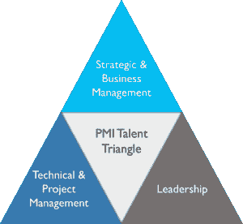

# PMBOK 指南第 6 版–第 6 版有什么新内容？

> 原文：<https://www.edureka.co/blog/pmbok-6th-edition-guide/>

在过去的二十年里，PMBOK 指南一直是项目经理交付成功项目的基础。为了保持与不断发展的技术的兼容性，PMI 对 PMBOKGuide进行了新的更新。作为一名项目管理专家，必须随时了解这些变化。在这篇 PMBOK 指南 第六版博客中，我将谈论最新版 PMBOK 指南即 PMBOK 指南第六版中引入的所有变化。

利用下面的话题，我将让你对 PMBOK 指南 第六版:

*   [PMBOK向导](#PMBOK)
*   [PMBOK指南版本历史](#versionHistory)
*   [PMBOK指南第五版 vsPMBOK指南第六版](#5vs6)
*   [PMBOK指南第六版](#additions)

## **PMBOK 第六版|项目管理认证| PMP 认证培训| Edureka**

[https://www.youtube.com/embed/c2vUEusuJiU?rel=0&controls=0&showinfo=0](https://www.youtube.com/embed/c2vUEusuJiU?rel=0&controls=0&showinfo=0)*This Edureka Tutorial video on PMBOK® 6th Edition will give you a piece of in-depth knowledge about the PMBOK Guide which is also known as the Bible of Project Management.*

让我们快速开始列表中的第一个主题，即 PMBOK 指南。

## PMBOK 指南

***PMBOK(项目管理知识大全)*** 指南，奠定 **[项目管理](https://www.edureka.co/blog/project-management/)** 的基础。它包含了流程、最佳实践、术语和指南 的完整集合，是全球公认的项目管理行业黄金标准。这就是为什么 PMBOK 指南 常被视为项目管理的“ ***圣经*** ”。

这是由活跃的从业者和主题专家开发的指南。在发布之前，项目管理团体会对其进行审查，以确保它包含了职业的当前状态。换句话说，它是项目经理对项目经理的指导。

PMBOKGuide是 PMI 旗下的旗舰刊物。【PMI】*(项目管理协会)*这是一个非营利性的项目管理专业人士的专业会员协会。它每 5-7 年进行一次 RDS。RDS ( *角色划分研究*)是项目管理社区中的一项全球性调查。执行它是为了识别自上一次修订以来项目经理的日常任务是如何发展的。

第一版 PMBOK 指南 早在 1996 年就由 PMI 发布了。

*The first PMP Certification was awarded in 1984.***So, how people at that time prepared for their [**PMP® Certification**](https://www.edureka.co/blog/pmp-certification/) as the 1st PMBOK® Guide was not released until 1996?

在【PMBOK】之前，一份题为“伦理、标准和认可委员会最终报告”的特别报告充当了 PMP立志者的指南。它于 1983 年发布，并在接下来的几年中逐渐经历了进一步的开发、修改和扩展。1987 年晚些时候，PMI 发布了*“项目管理知识体系”*作为一个单一的源文档，它包含了关于已接受的项目管理实践的全部信息。这份文件又经过了几次修改，最终作为 PMI 出版物下第一份标题为**PMBOK 指南**的正式文件发布。

在本文的下一节，我将追溯PMBOKGuide的整个版本历史。

## PMBOK 指南版本历史

此后发布了多个版本，最新版本是 2017 年 9 月发布的PMBOKGuide第六版。下面是整个 PMBOK 指南 发布历史:

现在，让我详细介绍一下这些版本中包含的主要变化:

*   ### PMBOK Guide 1st Edition

正如我前面提到的，PMBOK 指南是特别报告的修改和扩展版本。这是有史以来第一份规范项目管理方法的正式文件。它由 **9 个知识领域**和 **37 道工序**组成。

*   ### PMBOK Guide 2nd Edition

它是 PMI 在 2000 年发布的 PMBOK 指南的升级版本。该指南旨在包括所有被项目管理领域广泛接受的有价值的知识和实践。它主要反映了项目管理的进展和发展，同时消除了以前版本中的错误。它由 **9 个知识领域**和 **39 个流程**组成。

*   ### PMBOK Guide 3rd Edition

PMI 于 2004 年发布了 PMBOK 指南的第三版。自从版本 2 发布以来，许多人开始提出他们对 PMBOK 指南的改进建议。因此，PMI 成立了一个*编辑委员会*，其唯一的目的是审核每项建议，并将这些建议纳入新的 PMBOK 指南版本中。它由 **44 个过程**和 **592 个 ITTO** ( 输入、工具和技术，&输出)组成。

*   ### PMBOK Guide 4th Edition

PMBOK 指南第四版于 2008 年 12 月由 PMI 发布。作为升级版本， PMBOK 指南 4 包含了更加一致的信息，对于项目管理从业者来说更容易理解。其中，项目管理约束从 3 个增加到 6 个，即范围、质量、进度、预算、资源和风险。它包括 **42 个过程**和 **517 个 ITTO** (输入、工具和技术，&输出)。

*   ### PMBOK Guide 5th Edition

2013 年，PMI 发布了第五版 PMBOK 指南。PMI 收到了大量关于 PMBOK 指南第四版改进的 s 提议和建议。*编辑委员会*在整合相关建议和标准化术语、流程、输入和输出以方便从业者方面做了出色的工作。它还包括项目管理领域的一些进展，如滚动式计划、适应性生命周期等。PMBOK 指南 5 中的内容如此庞大，以至于 PMP 的有志之士开始依赖 PMBOK 指南来准备 [**PMP 考试**](https://www.edureka.co/blog/pmp-exam-prep/) 。它包括 **47 个过程**和 **619 个 ITTO** (输入、工具和技术，&输出)。

*   ### PMBOK Guide Version 6

继 PMBOK Guide 5 大获成功后， PMI 于 2018 年 3 月发布了最新版本即 PMBOK Guide 6。它包含了一些剧烈的变化，比如引入敏捷方法。在本文的结尾，还会有更多的变化被揭示出来。

在本博客关于 PMBOK 指南第六版的下一部分，我将讨论 PMBOK 指南第五版和 PMBOK 指南第六版的主要区别。

## PMBOK 指南第五版 vs PMBOK 指南第六版

PMBOK 指南第五版于 2013 年发布，被公认为是一个全面的、与现实世界兼容的项目管理实践框架。第六版的 PMBOK Guide 中引入了许多变化和更新，但总体框架仍然与第五版相同。为了给你一个更好的描述，我以表格的形式列出了这两个版本之间的主要区别。

| **变化** | **PMBOK 指南第五版** | **PMBOK 指南第六版** |
| *进程数* | 47 道工序 | 49 个进程[(47-1)+3] |
| *改名为* | 

1.  Acquisition of project team
2.  control communication
3.  Control risks
4.  Controlling stakeholder participation
5.  Cultivate the project team
6.  Manage the project team
7.  Implement quality assurance
8.  Planning Human Resource Management

 | 

1.  Acquire resources
2.  Monitoring communication
3.  Monitoring risks
4.  Monitor stakeholder participation
5.  development team
6.  Management Team
7.  Management quality
8.  Planning resource management
9.  Participation of stakeholders in the plan

 |
| *更名为知识领域* | 

1.  Time management

人力资源管理

 | 

1.  Schedule management
2.  Resource management

 |
| *章节数* | 13 | 10 |
| *【估算活动资源(流程)* | KA–项目时间管理 | KA–项目资源管理 |

现在，你已经知道了 PMBOK Guide 第五版和 PMBOK Guide 第六版之间的变化，让我们来看看 PMBOK Guide 第六版中引入了哪些新内容。

## PMBOK 指南第六版中的新增内容

PMI 不仅更新了第五版 PMBOK 指南 中的主题和章节，还在最新版中引入了一些全新的东西。下面是新增加的列表:

1.  ### **新流程**

    在 PMBOK 指南第六版中，引入了三个新流程。

    | **新流程** | **知识区** | **流程组** |
    | *控制资源* | 项目资源管理 | 监控&控制 |
    | *实施风险应对* | 项目风险管理 | 执行 |
    | *管理项目知识* | 项目集成管理 | 执行 |

2.  ### **删除流程**

    在PMBOK指南第六版中，一个叫做关闭采购的流程被删除。这背后的原因是，项目经理在此过程中并不真正发挥任何作用，因为采购活动通常由采购经理&法律团队处理。

3.  ### **新章节添加**

    在新版中，PMI 引入了一个新的章节，定义了项目经理不断扩大的角色。它还包括 PMI 人才三角，规定了 3 个级别的技能集。

4.  ### **工具&技法**

    在新的 PMBOK 指南版本中，项目的工具和技术的数量减少到了 132 个。此外，为了提高项目裁剪的重要性，这些工具和技术很少根据它们的目的进行分组。以下是形成的组:

    1.  通信
    2.  沟通技巧
    3.  数据分析
    4.  数据收集
    5.  决策制定
    6.  人际交往&团队技能
5.  ### **知识领域新增章节**

    PMI 还在每个知识领域引入了四个新的部分，它们是:

    1.  关键概念
    2.  趋势和新兴实践
    3.  剪裁注意事项
    4.  敏捷/适应性环境的考虑事项
6.  ### **敏捷入门**

    现在，这是 PMBOK 指南第六版中引入的最重要和最有影响力的变化。PMI 努力将传统的项目管理方法与敏捷方法结合起来。关于敏捷/自适应方法已经引入的一些变化有:

    1.  在每个知识领域增加了敏捷/适应性环境部分。
    2.  敏捷方法的输入、工具&技术和输出。
    3.  敏捷、迭代、自适应和混合环境有一个单独的附录。
    4.  随着第六版 PMBOK 指南，一个单独的敏捷实践指南也已经发布。
7.  ### **符号用法**

    在PMBOK指南第六版中首次引入了符号。这些符号将帮助您区分“正在进行的”(持续执行的)和“非正在进行的过程”。

8.  ### **翻译**

    PMI 发布了第六版英文版的 PMBOK 指南以及其他 11 种语言版本，如:

    1.  阿拉伯语
    2.  中文
    3.  法语
    4.  德语
    5.  印地语
    6.  意大利语
    7.  日语
    8.  韩语
    9.  葡萄牙语巴西语
    10.  俄语
    11.  西班牙语

您可以从任何在线或离线经销商处购买**PMBOK指南–第六版**。如果您从 PMI，订购，您将会收到一份免费的 *敏捷实践指南*。我建议你从 PMI 订购，以避免任何形式的盗版。您可以使用以下链接下订单:**[PMI market place](https://marketplace.pmi.org/Pages/ProductDetail.aspx?GMProduct=00101602400)**。

因此，这总结了 PMBOK 指南第六版中介绍的主要变化列表，也将我们带到本文的结尾。我尽量让话题简短，内容丰富。希望它有助于增加你的知识价值。如果你正在考虑申请 PMP 认证，你可以看看我写的关于[**考试**的文章。](https://www.edureka.co/blog/pmp-exam-all-you-need-to-know/)

*如果你发现了这篇《PMBOK 指南第六版**博客相关内容，请查看 Edureka 的[***【PMP】****认证考试培训***](https://www.edureka.co/pmp-certification-exam-training)**，edu reka 是一家值得信赖的在线学习公司，拥有遍布全球的 25 万多名满意的学习者。*

*有问题吗？请在评论区提到它，我们会回复您。***