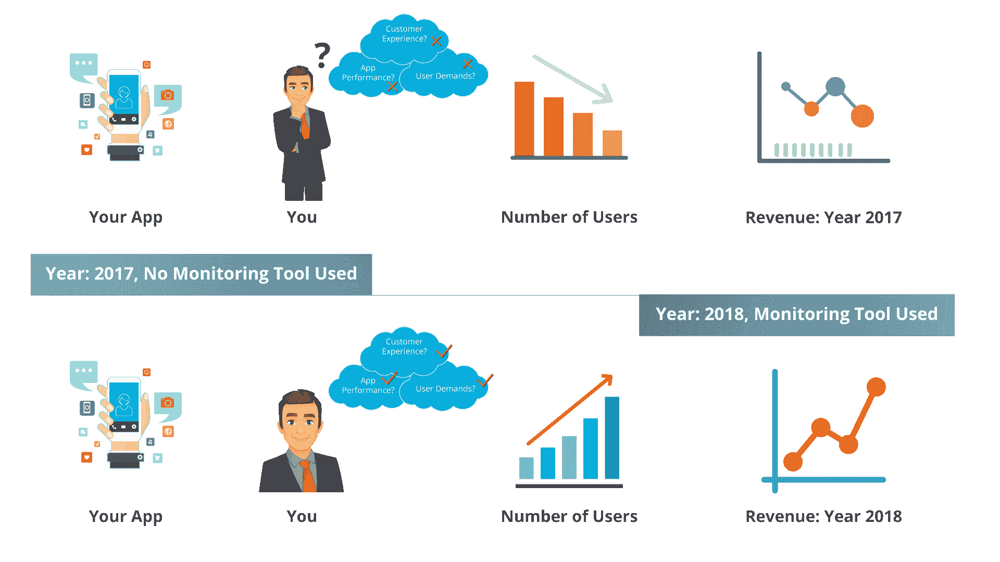
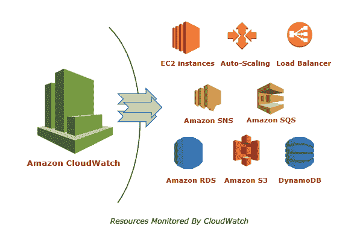
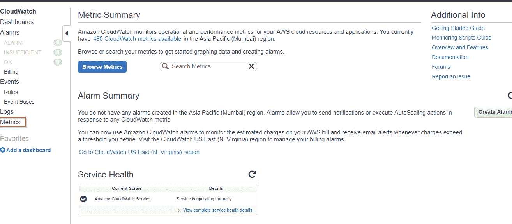
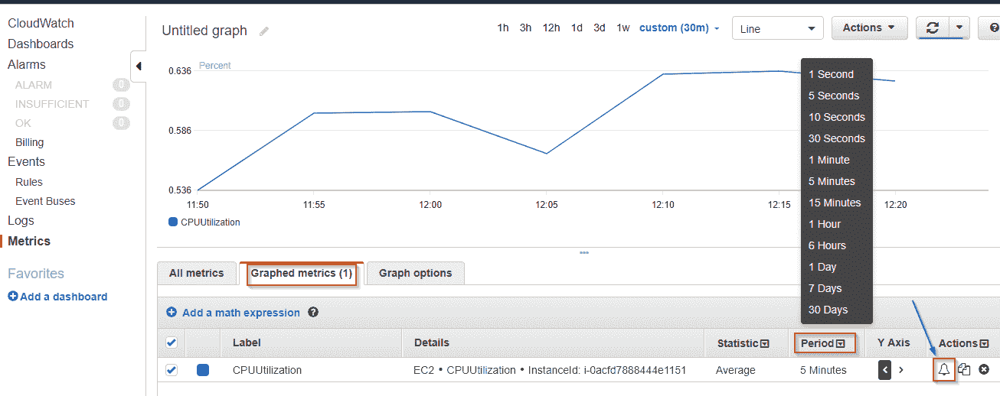
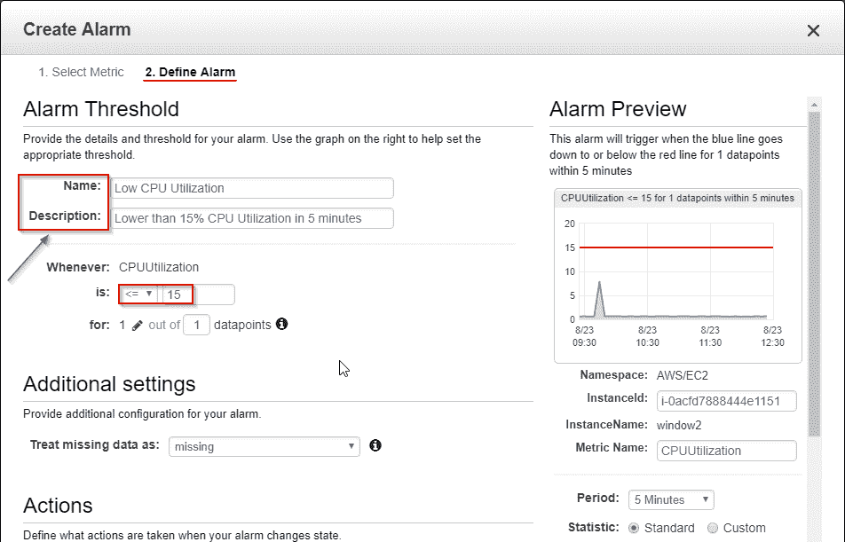

# 亚马逊云观察——亚马逊的监控工具

> 原文：<https://www.edureka.co/blog/amazon-cloudwatch-monitoring-tool/>

**亚马逊云手表教程**

目前，越来越多的组织正试图通过迁移到云来实现业务的数字化转型。这并不奇怪，但它确实对负责“有效”交付云服务的 it 团队以及这些服务受损时对业务的影响构成了挑战。那么，他们如何确保服务不受影响呢？简单的答案是使用云监控工具:Amazon CloudWatch。

在这篇博客中，我们将讨论一款名为 Amazon CloudWatch 的多功能监控工具。我将在这个博客中涉及的主题如下:

1.  [为什么我们需要基于云的监控？](#CloudM)
2.  [介绍亚马逊云手表](#CloudW)
3.  [亚马逊云手表在行动](#CloudWaction)
4.  [什么是 CloudWatch 事件？](#CloudWE)
5.  [什么是 CloudWatch 日志？](#CloudWL)
6.  [亚马逊云手表的好处](#CloudWB)

## 亚马逊 CloudWatch 教程| AWS 认证|云监控工具| AWS 教程| Edureka

[https://www.youtube.com/embed/__knpcBRLHg?rel=0&showinfo=0](https://www.youtube.com/embed/__knpcBRLHg?rel=0&showinfo=0)

## **我们为什么需要基于云的监控？**

云监控是一个宽泛的范畴，包括对 web 和云应用、基础设施、网络、平台、应用和[微服务](https://www.edureka.co/blog/what-is-microservices/)的监控。监控对于确保你在云上使用的所有服务平稳高效地运行至关重要。

请看下图。你对这张照片有什么想法？

这幅图描绘了两种情况。

**场景 1** :你在云上部署了一个 messenger 应用，你有一套解决方案。问题 如下:

*   我的应用程序每天使用多少带宽？
*   我的网站流量怎么样？
*   我的应用在云上的性能如何？
*   客户对我的应用程序的当前功能是否满意，或者我是否需要做一些改进？

但是你没有上述任何问题的答案，因为你没有使用任何类型的监控平台。所以你不知道你的应用是否需要改进。因此你们产品的销售和收入迅速下降。

**场景 2:** 您已经在云上部署了一个应用程序，您又遇到了同样的问题。您正在使用一个监控工具来跟踪您的应用程序的健康状况。

这样你就知道你的应用在云上的表现有多好。Y 您现在可以更好地跟踪和解决瓶颈，提高应用程序的正常运行时间和性能。这反过来鼓励你的用户更多地参与你的业务！

*一点点的监控对帮助你的企业成长大有帮助！*

虽然仍然可以构建高级工具来跟踪和监控 [AWS](https://www.edureka.co/blog/amazon-aws-tutorial/) 环境的整体状态，但是随着系统变得越来越大，执行手动监控变得复杂。 因此亚马逊提供了一款名为 Amazon CloudWatch 的多功能监控工具，为我们实现了对 AWS 基础设施的强大监控。现在让我们详细探索一下 CloudWatch。

想让你的‘云’知识更上一层楼？ [<button>今天获得云认证！</button>](https://www.edureka.co/masters-program/cloud-architect-training)

## **亚马逊 CloudWatch 是什么？**

*亚马逊云观察(Amazon CloudWatch)是亚马逊网络服务的组件，提供对亚马逊基础设施上运行的 AWS 资源和客户应用的实时监控。*

下图显示了亚马逊 CloudWatch 监控的不同 AWS 资源。

## ****

Amazon CloudWatch 允许管理员通过执行以下任务，从一个控制台轻松监控多个实例和资源:

*   支持对资源的可靠监控，例如:

*   监控、存储并提供对系统和应用程序日志文件的访问
*   提供标准报告目录，您可以使用这些报告来分析趋势和监控系统性能
*   提供各种警报功能，包括规则和触发高分辨率警报并发送通知
*   以 CPU 利用率、磁盘存储等关键指标的形式收集并提供运营数据的实时呈现。

Now we know why users choose CloudWatch, which is, for its automatic integration with [AWS services](https://www.edureka.co/blog/amazon-aws-tutorial/), its flexibility, and its ability to scale quickly. But how does Amazon CloudWatch achieve this?

## **亚马逊云手表在行动**

在学习 Amazon CloudWatch 如何运作之前，你需要了解一些基本概念。让我们看看那些概念。

### **指标**

*   ***指标*** 表示发布到 CloudWatch 的一组按时间排序的数据点
*   您可以将指标与被监控的变量相关联，数据指向该变量在一段时间内的值
*   指标由名称、命名空间和零个或多个维度唯一定义
*   每个数据点都有一个时间戳。

### **尺寸**

*   ***维度*** 是唯一标识指标 的名称/值对
*   维度可以认为是描述一个度量的特征类别
*   因为维度是指标的唯一标识符，所以每当您将唯一的名称/值对添加到您的指标之一时，您就在创建该指标的新变体。

### **统计**

*   ***统计*** 是指定时间段内的度量数据聚合
*   在您指定的时间段内，使用名称空间、度量名称、维度进行聚合
*   少数可用的统计数据是最大值、最小值、总和、平均值和样本数。

### **报警**

*   一个 ***报警*** 可以用来代表你自动启动动作
*   它在指定的时间段内观察单个指标，并执行一个或多个指定的操作
*   这个动作只是一个发送到 Amazon SNS 主题的通知。

现在我们来看看亚马逊 CloudWatch 是如何工作的。下图显示了 CloudWatch 如何提供可靠监控的概念视图。

Amazon CloudWatch 可以对您的 AWS 资源和应用进行全系统的监控。它将监控您的资源文件，并根据您的应用程序的日志文件生成关键指标。关键指标包括 CPU 使用率、CPU 延迟、网络流量、磁盘存储等。基于这些指标，它提供了系统活动和单个资源的实时摘要。

CloudWatch 还提供了 AWS 基础设施的全面概览视图 以跟踪应用性能、发现趋势并解决运营问题。此外，亚马逊 CloudWatch 配置了高分辨率警报，并在 AWS 环境发生突然操作变化时发送实时通知。

现在您已经熟悉了 Amazon CloudWatch 的概念及其操作，让我们看看如何使用 Amazon CloudWatch 来监控您的 Amazon EC2 实例。

**用例**:配置 Amazon CloudWatch 在一个实例的 CPU 利用率低于 15%时发送通知。

让我们来看一下相关的各个步骤。

### **步骤 1:创建 CPU 利用率指标**

*   转到 Amazon CloudWatch 管理控制台，从导航窗格中选择指标。

*   在指标页面的搜索栏中输入 CPU 利用率。
*   从显示的实例列表中选择您想要 为其创建度量的实例。

### **第二步:当实例的 CPU 利用率指标低于 15%时，创建警报进行通知**

*   现在选择同一页面上的图表指标选项。然后根据自己的需要设定时间段。并选择位于所选实例旁边的警报图标。

*   在显示的对话框中配置警报。给你的警报一个名称和描述。设置阈值条件。

您希望 AWS 在警报条件满足时向您发送电子邮件通知。通知通过 Amazon SNS 主题发送。

*   如果想要添加新的电子邮件收件人，请选择新列表选项，或者如果想要选择现有的收件人，请选择输入列表并输入 SNS 主题的名称。

*   点击创建报警。

**恭喜您，您已经成功配置亚马逊云手表警报**来监控您的实例。当警报条件满足时，您将通过您指定的 mail-id 上的电子邮件收到通知。

想成为认证 AWS 架构师？ [<button>现在报名</button>](https://www.edureka.co/cloudcomputing)

现在我们来说说亚马逊 CloudWatch 最重要的两个板块，分别是:

*   亚马逊云观察事件
*   亚马逊云观察日志

## **亚马逊云手表事件**

*亚马逊云观察事件从 AWS 资源向 AWS Lambda 函数、亚马逊 SNS 主题、亚马逊 SQS 队列和其他目标类型提供系统事件的实时流。*

通过 CloudWatch 事件，您可以创建一组规则来匹配特定事件。然后，您可以将这些事件路由到一个或多个目标，如 Lambda 函数、SNS 主题等。每当您的 AWS 环境中出现操作变化时，CloudWatch 事件就会捕获这些变化，并通过发送通知、激活 Lambda 函数等来执行补救措施。

我们来谈谈在使用 CloudWatch Events 之前你需要了解的某些话题。

### **事件**

事件表明 AWS 环境发生了变化。AWS 资源在其状态改变时生成事件。Amazon 允许您生成自己的自定义应用程序级事件，并将其发布到 CloudWatch Events。

### **规则**

规则只不过是约束。他们评估每个传入的事件，以确定是否存在超出范围的情况。如果是，则该事件被路由到目标进行处理。一个规则可以路由到多个目标，所有这些目标都是并行处理的。

### **目标**

目标处理事件。目标可以包括 Amazon EC2 实例、AWS Lambda 函数、Kinesis 流、Amazon ECS 任务、Amazon SNS 主题、Amazon SQS 队列和内置目标。目标接收 JSON 格式的事件。

现在让我们来看看可以使用 Amazon CloudWatch 事件的情况。

**用例 1** :在 AWS Lambda 函数的辅助下，通过使用 CloudWatch 事件，可以记录一个 Amazon EC2 实例的状态变化。

**用例 2** :您可以使用 CloudWatch 事件记录您的 S3 桶上的对象级 API 操作。但是在此之前，您应该使用 AWS CloudTrail 来设置一个配置为接收这些操作的 Trail。

嗯，这只是我在这里指定的两个用例，这样你就会对 Amazon CloudWatch Events 的功能有所了解。用一句话来描述 Amazon CloudWatch Events，它是一种允许您以更少的开销和更高的效率跟踪 AWS 资源变化的服务。

## **亚马逊云观察日志**

*亚马逊* *CloudWatch Logs* *用于监控、存储和访问来自 AWS 资源的日志文件，如亚马逊 EC2 实例、亚马逊 CloudTrail、Route53 等。*

我们来看看亚马逊 CloudWatch 日志的几个基本概念。下表给出了这些概念的概述。

| 记录事件 | 日志事件是由被监控的应用或资源记录的一些活动的记录 |
| 日志流 | 日志流是共享同一来源的一系列日志事件。它表示来自应用程序实例的事件序列 |
| 日志组 | 日志组代表共享相同的保留、监控和访问控制设置的日志流组。每个日志流必须属于一个日志组。 |

使用 Amazon CloudWatch 日志，您可以对系统错误进行故障排除，并自动维护和存储相应的日志文件。您可以配置警报，以便在系统日志中出现错误时发送通知。然后，您可以通过访问 CloudWatch 日志存储的原始日志数据，在几分钟内排除错误。此外，您可以使用亚马逊 CloudWatch 日志来:

*   将您的日志数据存储在高度耐用的存储器中
*   实时监控应用程序日志文件中的特定短语、值或模式
*   记录 53 路收到的 DNS 查询信息
*   通过选择 10 年到 1 天之间的保留期，调整每个日志组的保留策略。

现在我们已经有了 Amazon CloudWatch 的基础，接下来让我们看看它为什么是最著名的云监控工具的几个原因。

## **亚马逊云手表的好处**

*   Amazon CloudWatch 允许您从一个平台访问所有数据。它本机集成了 70 多种 AWS 服务。 *沃达丰公司使用带有自动扩展组的 Amazon CloudWatch 来监控 CPU 使用情况，并在高峰期自动从三个 Amazon EC2 实例扩展到九个。*

*   提供实时洞察，以便您可以优化运营成本和 AWS 资源。 *凯洛格公司使用亚马逊 CloudWatch 进行监控，这有助于公司围绕其所需的容量做出更好的决策，从而避免浪费。*

*   全面了解您的应用、基础架构堆栈和 AWS 服务。 *Atlassian 使用亚马逊 CloudWatch 来监控 RAM 使用情况和带宽，因此他们可以更轻松地优化他们的应用程序。*

这只是使用 CloudWatch 的一些好处。

## **AWS CloudTrail vs 亚马逊 CloudWatch | AWS 监控服务| AWS 培训| Edureka**

[//www.youtube.com/embed/sQX9C9MvPZA?rel=0&showinfo=0](//www.youtube.com/embed/sQX9C9MvPZA?rel=0&showinfo=0)This “CloudWatch vs CloudTrail” video by Edureka will give you an idea about what exactly is Amazon CloudWatch and CloudTrail and also explain some major differences between them.

*原来如此！我希望这篇博客能提供信息，增加你的知识。 现在，您已经了解了什么是 Amazon CloudWatch，以及如何使用它来监控您当前在云上活动的应用程序和资源。如果你有兴趣将你的亚马逊网络服务知识提升到一个新的水平，那么就报名参加 Edureka 的 AWS 架构师认证培训课程。*

*有问题吗？请在“AWS CloudWatch 教程”博客中提及它，我们会给你回复。*