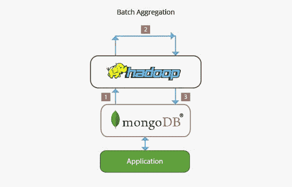
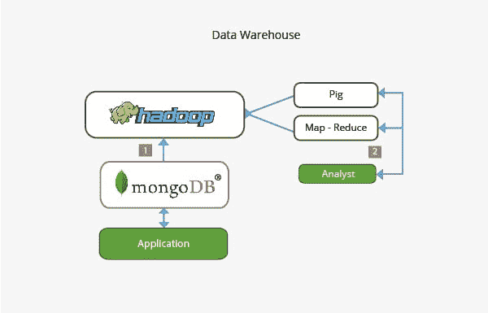

# 采用 Hadoop 和相关大数据技术的 MongoDB

> 原文：<https://www.edureka.co/blog/mongodb-with-hadoop-and-related-big-data/>

长期以来，关系数据库足以处理小型或中型数据集。但是数据增长的惊人速度使得传统的数据存储和检索方法变得不可行。可以处理大数据的更新技术正在解决这个问题。Hadoop、Hive 和 Hbase 是操作这类大数据集的流行平台。NoSQL 或不仅是 SQL 数据库(如 MongoDB)提供了一种在 loser 一致性模型中存储和检索数据的机制，具有以下优点:

*   水平缩放
*   更高的可用性
*   更快的访问

MongoDB 工程团队最近更新了用于 Hadoop 的 MongoDB 连接器，以实现更好的集成。这使得 Hadoop 用户更容易:

*   将 MongoDB 中的实时数据与 Hadoop 相集成，以进行深入的离线分析。
*   连接器将 Hadoop 的 MapReduce 的分析能力展示给来自 MongoDB 的实时应用程序数据，从而更快、更高效地从大数据中获取价值。
*   连接器将 MongoDB 呈现为一个 Hadoop 兼容的文件系统，允许 MapReduce 作业直接从 MongoDB 中读取，而无需先将其复制到 HDFS (Hadoop 文件系统)，从而消除了通过网络移动 TB 级数据的需要。
*   MapReduce 作业可以将查询作为过滤器传递，因此无需扫描整个集合，并且还可以利用 MongoDB 丰富的索引功能，包括地理空间、文本搜索、数组、复合和稀疏索引。
*   从 MongoDB 读取，Hadoop 作业的结果也可以写回到 MongoDB，以支持实时操作流程和即席查询。

## **Hadoop 和 MongoDB 用例:**

让我们来看一个关于 MongoDB 和 Hadoop 如何在一个典型的大数据堆栈中融合的高级描述。我们主要有:

*   MongoDB 用作**“运营”实时数据存储**
*   Hadoop 用于**离线批量数据处理和分析**

继续阅读，了解为什么 [**MongoDB 是大数据处理的数据库**](https://www.edureka.co/blog/mongodb-the-database-for-big-data-processing/) 和**[MongoDB 是如何被 Aadhar、Shutterfly、Metlife 和易贝等公司和组织使用的](https://www.edureka.co/blog/real-world-use-cases-of-mongodb/)。**

## **MongoDB 配合 Hadoop 在批量聚合中的应用:**

在大多数场景中，MongoDB 提供的内置聚合功能足以分析数据。然而，在某些情况下，可能需要更复杂的数据聚合。这就是 Hadoop 可以为复杂分析提供强大框架的地方。

在这种情况下:

*   数据从 MongoDB 中提取，并通过一个或多个 MapReduce 作业在 Hadoop 中处理。数据也可以来自这些 MapReduce 作业中的其他位置，以开发多数据源解决方案。
*   然后，这些 MapReduce 作业的输出可以写回到 MongoDB，以便在以后的阶段进行查询和任何特别的分析。
*   因此，构建在 MongoDB 之上的应用程序可以使用来自 batch analytics 的信息来呈现给最终客户端或启用其他下游功能。

## **在数据仓库中的应用:**

在典型的生产设置中，应用程序的数据可能驻留在多个数据存储中，每个数据存储都有自己的查询语言和功能。为了降低这些场景中的复杂性，Hadoop 可以用作数据仓库，并充当来自各种来源的数据的集中存储库。

在这种情况下:

*   定期的 MapReduce 作业将数据从 MongoDB 加载到 Hadoop 中。
*   一旦来自 MongoDB 和其他来源的数据在 Hadoop 中可用，就可以查询更大的数据集。
*   数据分析师现在可以选择使用 MapReduce 或 Pig 来创建查询包含 MongoDB 数据的大型数据集的作业。

MongoDB 背后的团队已经确保，凭借其与 Hadoop 等大数据技术的丰富集成，它能够很好地集成到大数据堆栈中，并帮助解决一些复杂的数据存储、检索、处理、聚合和仓储架构问题。请继续关注我们即将发布的关于使用 MongoDB 学习 Hadoop 的人的职业前景的帖子。如果你已经在使用 Hadoop 或者刚刚接触 MongoDB，请点击这里查看我们为 MongoDB 提供的课程

探索有关 Hadoop 概念的更多信息。看看这个 **[在线大数据课程](https://www.edureka.co/big-data-hadoop-training-certification)** ，由顶级工业工作专家打造。