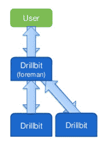
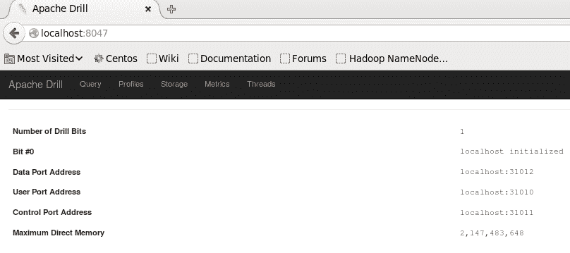

# 深入研究 Apache Drill，新时代的查询引擎

> 原文：<https://www.edureka.co/blog/drilling-down-on-apache-drill-the-new-age-query-engine>

Apache Drill 是业界第一个无模式 SQL 引擎。Drill 不是世界上第一个查询引擎，但它是第一个在灵活性和速度之间取得微妙平衡的引擎。Drill 旨在扩展到数千个节点，并以 BI/分析环境所需的交互速度查询 Pb 级数据。

它可以集成多个数据源，如 Hive、HBase、MongoDB、文件系统、RDBMS。此外，Avro、CSV、TSV、PSV、Parquet、Hadoop 序列文件等输入格式也可以轻松地用于 Drill。

## 为什么要进行阿帕奇演习？

Apache Drill 的最大优点是，当您查询任何数据时，它可以动态地发现模式。此外，它可以与 Tableau、Qlikview、MicroStrategy 等 BI 工具配合使用，以实现更好的分析。

这是一位行业分析师的话，总结了 Apache Drill 的价值:

“Drill 不仅仅是关于 Hadoop 上的 SQL。它是关于 SQL-on-pretty-much-any 的，直接的，没有形式的。”

*–2015 年 1 月 Gigaom Research 的 Andrew Burst*

Drillbit 是 Apache Drill 的守护程序，在集群中的每个节点上运行。它使用 ZooKeeper 进行集群中的所有通信，并维护集群成员资格。它负责接受来自客户端的请求，处理查询，并将结果返回给客户端。接受客户要求的钻头被称为“领班”。它生成执行计划，执行片段被发送到在集群中运行的其他钻头。

另一个优点是 drill 的安装和设置非常简单。让我们学习如何安装 Apache Drill。

第一步是下载 drill 包。

**命令:**wget https://archive . Apache . org/dist/drill/drill-1 . 5 . 0/Apache-drill-1 . 5 . 0 . tar . gz

命令:tar-xvf apache-drill-1.5.0.tar.gz

**命令:** ls

接下来，在中设置环境变量。bashrc 文件。

**命令:** sudo gedit。bashrc

导出 DRILL _ HOME =/HOME/edu reka/Apache-DRILL-1 . 5 . 0

导出路径= $ PATH:/home/edu reka/Apache-drill-1 . 5 . 0/bin

该命令将更新更改:

**命令:**来源。bashrc

现在转到 drill conf 目录，使用集群 id 和 zookeeper 主机&端口编辑 drill-override.conf 文件，我们将在本地集群上运行它。

**命令:** cd apache-drill-1.5.0

命令:sudo gedit conf/drill-override . conf

默认情况下，DRILL_MAX_DIRECT_MEMORY 在 drill-env.sh 中会是 8 GB，我们需要根据自己拥有的内存来保持。

命令: sudo gedit conf/drill-env.sh

要仅在单个节点中安装 drill，可以使用嵌入式模式，在这种模式下，drill 将在本地运行。当您运行此命令时，它将自动启动 drillbit 服务。

**命令:**。/bin/drill-嵌入式

您可以运行一个简单的查询来检查安装。

**命令:** select * from sys.options 其中 type = 'SYSTEM '，名称如' security % '；

要检查 Apache Drill 的 web 控制台，我们需要在 web 浏览器中转到 localhost:8047。

您也可以从“查询”选项卡运行查询。

要在分布式模式下运行 drill，您需要编辑集群 ID 并在 drill-override.conf 中添加 ZooKeeper 信息，如下所示。

然后我们需要在每个节点上启动 ZooKeeper 服务。之后，您必须使用此命令在每个节点上启动 drillbit 服务。

**命令:**。/bin/drillbit.sh 开始

**命令:** jps

现在，我们使用下面的命令来启动钻壳。

现在，我们可以在分布式模式下在集群上执行查询。

这是由两部分组成的 Apache Drill 博客系列的第一篇博文。该系列的第二篇博客即将发布。

有问题要问我们吗？在评论区提到它们，我们会回复你。

**相关帖子:**

[Apache Spark 和 Scala](https://www.edureka.co/apache-spark-scala-training "Get started with Apache Spark and Scala")

[大数据和 Hadoop 入门](https://www.edureka.co/big-data-and-hadoop "Get started with Big Data & Hadoop")

[下钻阿帕奇第二部分](https://www.edureka.co/blog/drilling-down-on-apache-drill-the-new-age-query-engine-part-2)

[Apache Spark Vs Hadoop MapReduce](https://www.edureka.co/blog/apache-spark-vs-hadoop-mapreduce "Apache Spark Vs Hadoop MapReduce")