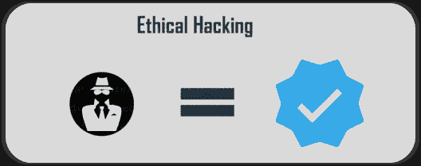
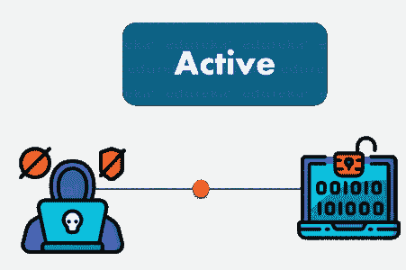
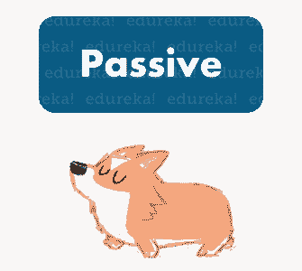
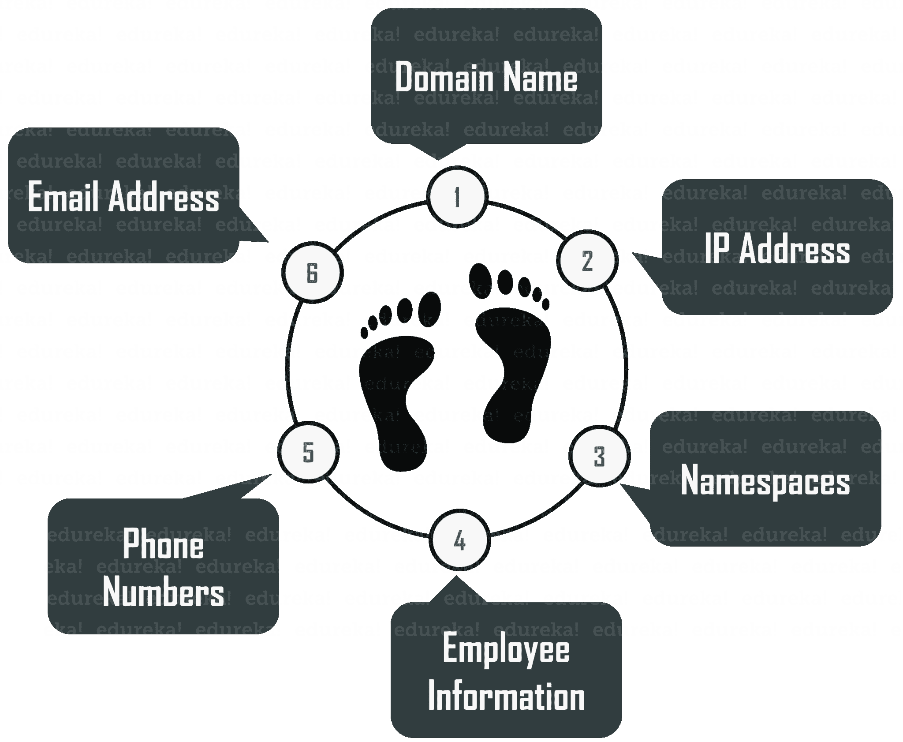

# 什么是道德黑客？道德黑客入门

> 原文：<https://www.edureka.co/blog/what-is-ethical-hacking/>

黑客这个术语已经存在很长时间了。第一次有记录的黑客攻击可以追溯到 20 世纪 60 年代初的麻省理工学院，当时“黑客”和“骇客”这两个术语都被创造出来。从那时起，黑客已经发展成为计算社区广泛遵循的规则。在这篇“什么是道德黑客”的文章中，我们将讨论道德黑客的基本原理！

本博客讨论了以下主题:

*   [什么是道德黑客？](#What-is-Ethical-Hacking)
*   [黑客有哪些类型？](#Types-of-Hackers)
*   [黑客攻击的类型有哪些？](#Types-of-Hacking)
*   [伦理黑客阶段](#Phases-of-Hacking)
*   [侦察](#reconnaissance)
*   [什么是足迹？](#footpronting)
*   [什么是指纹识别？](#fingerprinting)

## 什么是道德黑客？面向初学者的道德黑客| Edureka

[//www.youtube.com/embed/2VSNn7UIXn8?rel=0&showinfo=0](//www.youtube.com/embed/2VSNn7UIXn8?rel=0&showinfo=0)

*这个关于“什么是道德黑客”的 Edureka 视频会给你一个道德黑客的介绍。这是一个初学者教程，涵盖了道德黑客的所有基础知识。*

## **什么是道德黑客？**

黑客攻击是在系统中发现漏洞，并利用这些发现的漏洞获得对系统的未授权访问，以执行从删除系统文件到窃取敏感信息的恶意活动的过程。黑客行为是非法的，如果你当场被抓，可能会导致极端的后果。人们因为黑客行为被判处多年监禁。

尽管如此，如果得到许可，黑客行为可能是合法的。计算机专家经常被公司雇佣来入侵他们的系统，找到漏洞和薄弱的端点，以便修复它们。这样做是为了防范那些怀有恶意的合法黑客。这样的人，在没有任何恶意的情况下，经过许可侵入系统，被称为 e *道德黑客*，这个过程被称为 e *道德黑客。*

现在我们知道了什么是道德黑客，谁是道德黑客。浏览我们的[道德黑客课程](https://www.edureka.co/ceh-ethical-hacking-certification-course)，探索更多关于道德黑客的知识。本课程将向您传授黑客使用的最新黑客技术、工具和方法。

让我们来看看不同类型的黑客。

## **黑客有哪些类型？**

黑客可以根据他们的意图被隔离。

**白帽黑客**

 它是一个有道德的黑客的别称。他们在事先许可的情况下侵入系统，找出漏洞，以便在怀有恶意的人发现漏洞之前修复漏洞。

**黑帽黑客**

[它总是非法的，因为它的恶意意图，包括窃取公司数据，侵犯隐私，破坏系统等。](/blog/wp-content/uploads/2018/11/Black-Hat-Hacker-What-is-Ethical-Hacking-Edureka.png)

**灰帽黑客**

 他们是黑帽和白帽黑客的混合体。他们大多以黑客为乐，在所有者不允许或不知情的情况下，利用计算机系统或网络的安全漏洞。他们的目的是让这个弱点引起主人的注意&,从而获得一些 bug 奖励。

**自杀黑客**

 自杀黑客是一种意图搞垮大公司和基础设施的人。这些类型的黑客并不害怕他们行为的后果，因为他们大多是带着复仇的心态工作的。这些人也被称为黑客行动主义者。

## **黑客攻击有哪些不同的类型？**

既然我们已经讨论了各种类型的黑客，让我们回顾一下不同类型的黑客攻击。我们可以根据黑客试图达到的目的将黑客行为分成不同的类型。

**网站黑客**

** **  黑客入侵网站是指未经授权控制网络服务器及其相关软件，如数据库和其他界面。

**网络黑客**

****

黑客入侵网络是指使用 Telnet、NS lookup、Ping、Tracert、Netstat 等工具收集网络信息。意图损害网络系统并妨碍其运行。

**邮件窃听**

** **  这包括未经授权访问电子邮件帐户，以及未经其所有者同意使用该帐户发送垃圾邮件链接、第三方威胁和其他此类有害活动。

**密码黑客**

** **  这是从计算机系统存储或传输的数据中恢复秘密密码的过程。

**电脑黑客**

** **  这是通过应用黑客手段窃取计算机 ID 和密码并获得对计算机系统的未授权访问的过程。

## **伦理黑客阶段**

像世界上所有的学科一样，道德黑客行为也分为不同的阶段。道德黑客有 6 个不同的阶段。这些阶段不是严格的规则，而更像是要遵循的指南。

**侦察**

侦察是收集信息的过程。在这个阶段，黑客收集关于目标系统的相关信息。这些包括检测服务、操作系统、到达系统的包跳数、IP 配置等。各种工具如 Nmap、Hping、Google Dorks 等被用于侦察目的

**扫描**

在扫描阶段，黑客开始主动探测目标机器或网络中可被利用的漏洞。黑客在这个过程中广泛使用 Nessus、Nexpose 和 NMAP 等工具。

**获得权限**

在这一阶段，利用各种方法利用扫描过程中发现的漏洞，黑客试图在不发出任何警报的情况下进入目标系统。这个过程中使用的主要工具是 Metasploit。

**维护权限**

这是最重要的阶段之一。在这个阶段，黑客在目标系统上安装各种后门和有效负载。如果您不知道，有效负载是一个术语，指的是在获得未经授权的访问后在系统上执行的活动。后门有助于黑客在未来更快地进入目标系统。

**清理铁轨**

这个过程是不道德的行为。它必须删除黑客攻击过程中发生的所有活动的日志。尽管如此，有道德的黑客仍然必须执行这个阶段来演示黑帽黑客将如何进行他的活动。

**汇报**

举报是整理道德黑客程序的最后一步。在这里，道德黑客用他的发现和完成的工作，如使用的工具、成功率、发现的漏洞和利用过程，编写一份报告。

## **侦察**

好了，让我们再多谈谈侦察。我已经提到它是收集关于目标系统的信息的过程，但是我们要收集什么样的信息呢？嗯，把它们列出来是一项任务，但是它们可以归结为下面的

*   收集初始信息
*   确定网络范围
*   识别活动的机器
*   发现开放的端口和接入点
*   操作系统的指纹
*   发现端口上的服务
*   绘制网络图

**主动侦察**

主动侦察是指你这个黑客直接与计算机系统交互获取信息的过程。该信息可能是相关且准确的。但是如果你未经许可就计划主动侦察，就有被发现的风险。如果你被发现，系统管理员可以对你采取严厉的行动，并跟踪你的后续活动。

****

**被动侦察**

另一方面，被动侦察并不直接与计算机互动。该过程用于收集基本信息，而无需与目标系统进行交互。

## **什么是足迹？**

足迹基本上是黑客收集尽可能多的信息的第一步，以便找到侵入目标系统的方法，或者至少决定哪种类型的攻击更适合目标。

足迹是侦察过程的一部分，用于收集有关目标计算机系统或网络的可能信息。足迹可以是被动的，也可以是主动的。浏览公司网站是被动足迹的一个例子，而试图通过社会工程获取敏感信息是主动信息收集的一个例子。

在此阶段，道德黑客可以收集以下信息

足迹——什么是道德黑客——尤里卡

一般的足迹真的很简单，甚至一个普通的用户都可以使用像*whois.com、ip2location.com、archive.org*等网站来完成

## **什么是指纹识别？**

指纹识别，在道德黑客中，指的是用于确定目标计算机上运行的操作系统的任何方法。指纹，很像足迹，既有主动的也有被动的

**主动指纹识别**

主动指纹识别是通过向目标机器发送特制的数据包，然后记下其响应并分析收集的信息来确定目标操作系统来实现的。在下一节中，我们给出了一个例子来解释如何使用 NMAP 工具来检测目标域的操作系统。

**被动指纹识别**

被动指纹识别基于远程系统的嗅探器跟踪。根据数据包的嗅探器跟踪(如 Wireshark ),您可以确定远程主机的操作系统。在攻击一个系统之前，你需要知道什么操作系统是一个网站的主机。一旦知道了目标操作系统，就很容易确定可能存在哪些漏洞来利用目标系统。指纹识别是通过分析数据包的各种因素完成的

*   **TTL**—操作系统设置出站数据包的生存时间。
*   **窗口大小**—操作系统设置的窗口大小。
*   **DF**—操作系统是否设置了不分段位。
*   **TOS**—操作系统是否设置了服务的类型，如果是，是什么类型。

通过分析数据包的这些因素，你也许能够确定远程操作系统。这种方法并不是 100%准确，而且对于某些操作系统来说比其他操作系统更有效。

好了，伙计们，这让我们结束了“什么是道德黑客？”博客。这是我将要发表的一长串道德黑客博客中的第一篇。关于网络安全的更多信息，你可以看看我的其他[博客](https://www.edureka.co/blog/?s=cybersecurity)。如果你对这篇文章有任何疑问，请在下面的评论区留下你的评论！

如果您希望学习网络安全，并在网络安全领域建立丰富多彩的职业生涯，那么请查看我们的 [***网络安全认证培训***](https://www.edureka.co/cybersecurity-certification-training) ，该培训带有讲师指导的现场培训和真实项目体验。本培训将帮助您深入了解网络安全，并帮助您掌握该主题。

*您还可以看看我们新推出的关于 [**CompTIA Security+认证**](https://www.edureka.co/comptia-security-plus-certification-training) 的课程，这是 Edureka & CompTIA Security+首次与官方合作。它为您提供了一个获得全球认证的机会，该认证侧重于安全和网络管理员不可或缺的核心网络安全技能。*