# 了解如何以及何时使用不同的 Tableau 图表

> 原文：<https://www.edureka.co/blog/tableau-charts/>

今天，你有很多数据，甚至更多关于它的问题。你知道有一个图表或图形会向你显示你想要看到的数据，但不经过一些尝试和错误就知道哪个图表或图形是最好的并不总是容易的。

这个博客将不同的 ***[表格](https://www.edureka.co/blog/tableau-tutorial/)图表*** 与你正在分析的数据类型和你想要回答的问题放在一起，帮助你找到适合你需要的图表。

## **Tableau 图表:** **条形图**

条形图无疑是所有 BI 平台上最常见的数据可视化方式之一。您可以快速突出类别之间的差异，显示趋势和异常值，并一目了然地揭示历史高点和低点。条形图简单而有效，尤其是当您的数据可以分成许多类别时。

要创建条形图，

*   转到新工作表。
*   将*类别*拖到*列*中。
*   将*利润*拖到*行*中。

默认情况下，它会创建一个条形图。

****

## **Tableau 图表:** **折线图**

折线图是另一种常见的显示数据的方法。它连接了几个不同的数据点，将它们呈现为一个连续的演变。结果是一种简单、直接的方式来可视化一个值相对于另一个值的变化。

*   转到新工作表
*   将*订单日期*拖到*列*中。

*   将*销售*拖到*行*中。

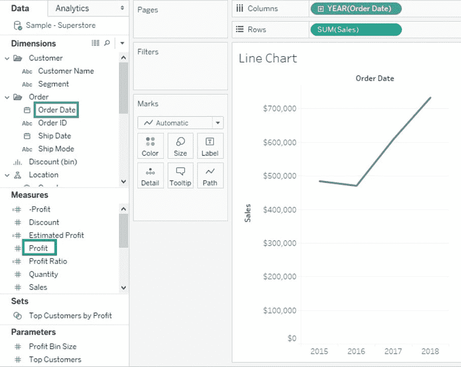默认创建折线图。

*   如果折线图没有自动出现，可以到*标记*卡，选择*线*选项。

**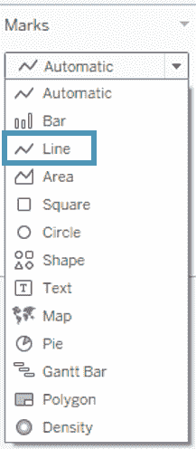**

## **Tableau 图表:** **排列图**

您还可以使用表格计算来创建一个帕累托图，显示多个类别的累积。帕累托图由条形图和折线图组成，使用相同的度量来创建图形，但是对*度量*货架值的处理方式不同。使用此图表的基本目的是确定某一领域成员的贡献。用 Tableau 制作这个图表的步骤如下。

*   转到新工作表
    *   将*子类别*拖到*列*中。
    *   将利润拖入*行*。
    *   右击*子类*药丸，从下拉列表中选择*排序*选项。

*   它会打开一个排序窗口。

1.  按排序顺序点击*降序*。
2.  在*排序依据*部分选择*字段*。选择字段为*利润*，选择*总和*作为汇总。
3.  点击*确定*。

它会给你这样的东西。

*   将*利润*再次拖入*行*。

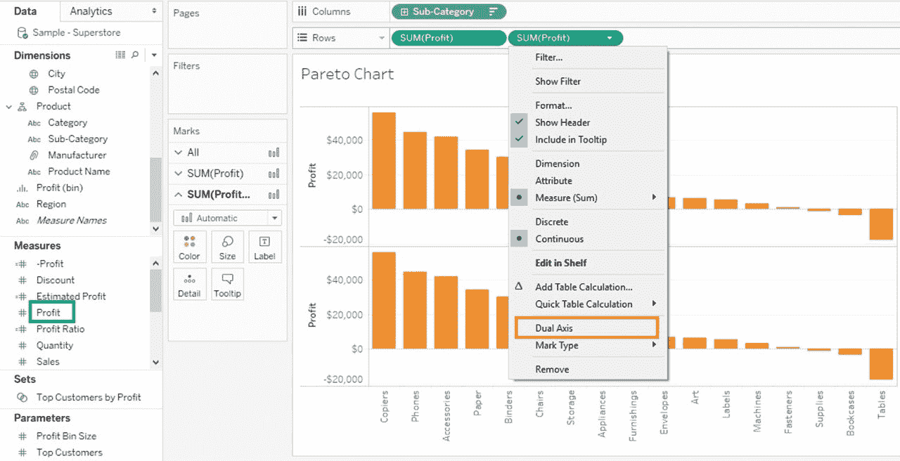

*   右键点击新添加的*利润*，选择*双轴*选项。它会给你一个如下图所示的点状图。

*   转到*标记卡*

1.  在*标识卡*列表中选择*金额(利润)*。
2.  单击如图所示的下拉按钮。
3.  选择*条*作为*图表类型*。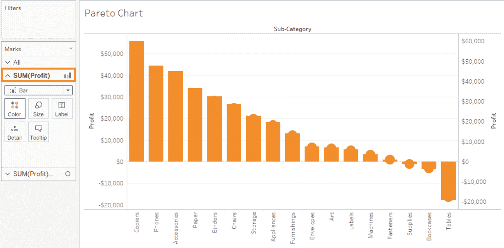
4.  从列表中选择 *SUM(Profit)(2)* 。
5.  点击列表中的*行*。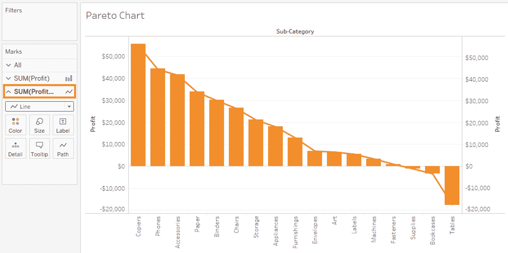

*   选择你喜欢的任何颜色。这将改变图表中线条的颜色。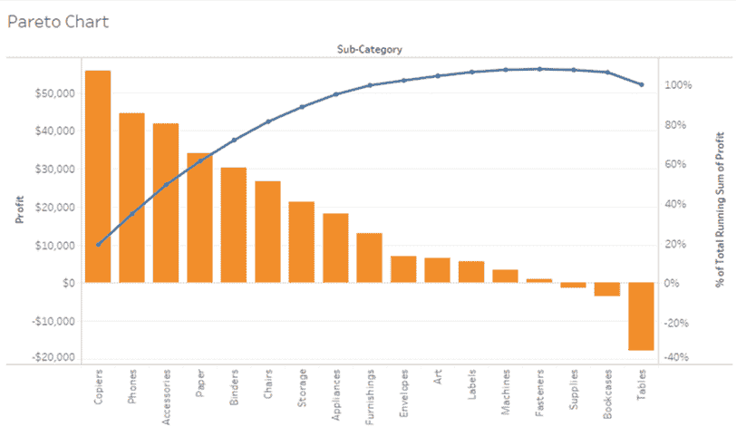

## **Tableau 图表:** **面积图**

面积图代表不同时期的任何定量数据。它基本上是一个线图，线和轴之间的区域通常用颜色填充。实现这一点的步骤如下。

*   这将创建一个面积图。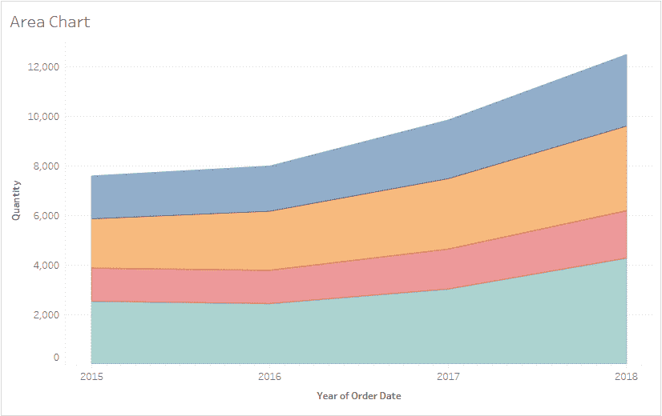

## **Tableau 图表|使用 Tableau 的数据可视化| edu reka**

[//www.youtube.com/embed/5-H1UltjSHk?rel=0&showinfo=0](//www.youtube.com/embed/5-H1UltjSHk?rel=0&showinfo=0)

Tableau 可以为目标受众定制交互式可视化效果。在本视频中，您将了解度量、图表类型及其功能。

## **Tableau 图表:** **柱状图**

直方图显示您的数据如何分布在不同的组中。通过将数据分组到特定的类别(也称为“箱”)，然后将类别中的记录数绘制成竖条，您可以快速查看大部分数据属于哪个箱。直方图是可视化数据分类的最佳选择。例如，按公司规模划分的客户数量、学生的考试成绩以及产品缺陷的频率。

创建直方图的程序如下所示。

*   选择*直方图*图标，如图所示。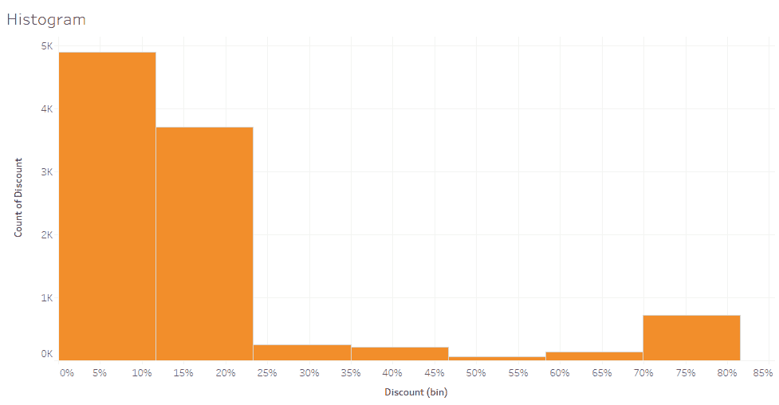

它在 Tableau 中创建一个直方图。

## **Tableau 图表:** **饼状图**

饼图对于向其他可视化效果添加细节非常有用。饼图的角度决定了测量值。可以为饼图分配不同的颜色来表示维度中的成员。

*   转到新工作表
*   从数据窗格中选择*细分*和*销售*。
*   点击工作表右上角的 *ShowMe* 按钮。
*   从列表中选择*饼图*。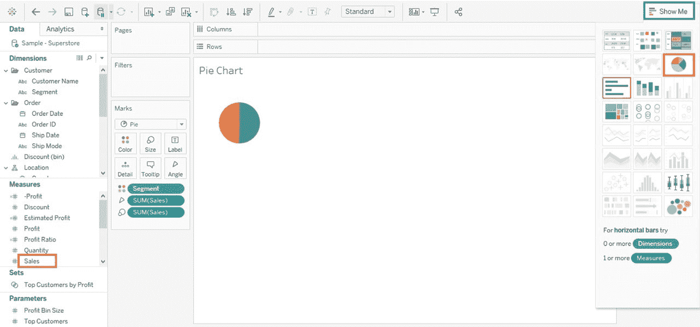

它创建了一个如上图所示的饼图。

***提示:**单独一张饼状图并不能给浏览者一个快速准确比较信息的方法。由于浏览者必须自己创建上下文，你的数据中的关键点会被忽略。不要让饼图成为你的[仪表板](https://www.edureka.co/blog/tableau-dashboards/)的焦点，试着用它们来深入其他可视化。这种方法利用饼图的简单性来添加信息，而不会分散对全局的注意力。*

## **Tableau 图表:** **树状图**

树形图将数据的不同部分与整体联系起来。通过将矩形嵌套在其他矩形中，树形图显示了各个数据点在层次结构中的位置。正如图表的名字所暗示的，每个矩形根据其占整体的比例被细分成更小的矩形或子分支。它们有效地利用了空间来显示每个类别的总百分比。当数据集可以用许多不同的方式分解时，树形图可能是显示大部分数据属于哪个类别的最佳方式。例如，跨计算机的存储使用，管理技术支持案例的数量和优先级，以及比较不同年度的财政预算。

为了实现这一目标，以下是步骤。

*   将尺寸*运输模式*拖放到标签架上。从*演示*中选择图表类型*树形图*，出现下图。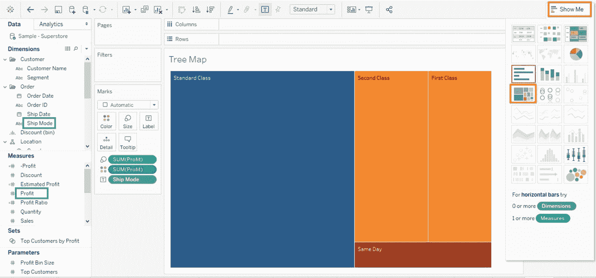

## **Tableau 图表:** **散点图**

散点图是一种有效的方式，可以让您了解趋势、集中度和异常值，从而有助于对数据进行更深入的调查。散点图在单个图表上显示许多不同的数据点。然后可以使用聚类分析或趋势线等分析方法来增强图表。散点图用于显示一个变量是否能很好地预测另一个变量，或者它们是否倾向于独立变化。这种类型的图表很容易进行多种类型的分析。

例如，男性和女性在不同年龄患肺癌的可能性、技术早期采用者和落后者购买智能手机的模式，以及不同产品类别到不同地区的运输成本。

可以按照下面给出的程序设计散点图。

*   转到新工作表。

1.  将*折扣*拖到*列中。*
2.  将*销售*拖到*行*中。

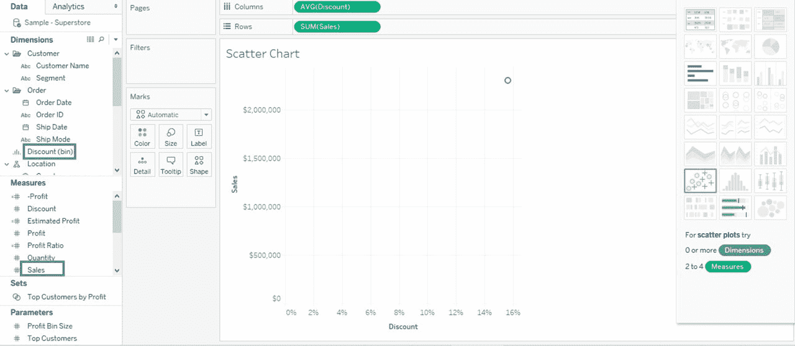

*   默认情况下，这会创建一个散点图。但是你可以做更多的事情。

3.将*子类别*拖动到标记卡中的*颜色*图标中。

*   它创建了一个散点图，显示每个子类别的折扣和销售额之间的关系。

## **Tableau 图表:** **气泡图表**

虽然气泡在技术上不是它们自己的可视化类型，但作为一种技术来使用它们可以为散点图或地图添加更多细节。改变圆圈的大小和颜色可以创建视觉上引人注目的图表，一次呈现大量数据。气泡可以为传统的双轴图表添加更多细节，突出三个或更多变量之间的关系，而不会让查看者不知所措。

创建气泡图的步骤如下。

*   选择如图所示的*包装气泡*图标，然后创建一个气泡图。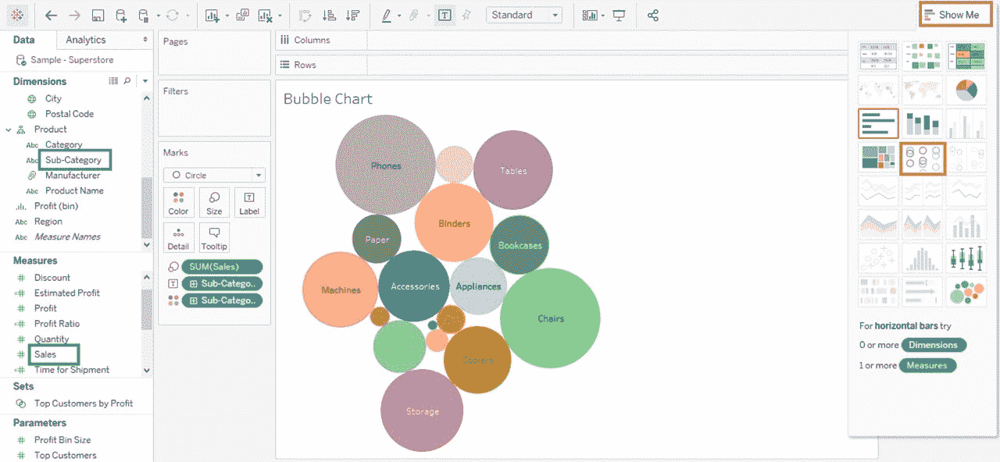

## **Tableau 图表:** **热图**

热图是使用颜色比较两个或更多类别的数据的好方法。模式引导浏览者浏览图表，快速显示类别交叉最强和最弱的地方。热图最适合呈现包含大量类别的数据集。这种图表类型可以将数百个比较打包到一个小区域中，并且仍然一目了然。例如，销售配额评估、实际支出与预算以及绩效范围(好/差)。

创建热图的步骤如下所示:

*   将*区域*拖到列中。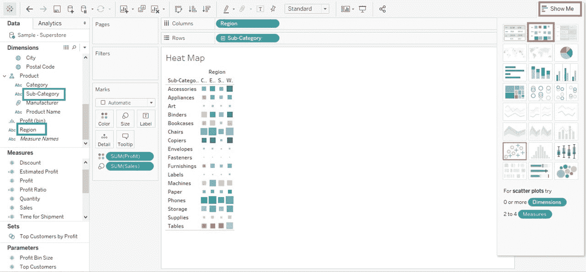

这将创建一个热图。

## **Tableau 图表:** **地图**

对于可视化任何类型的位置信息来说，这些都是显而易见的，无论是邮政编码、州缩写、国家名称，还是您自己定制的地理编码。地图以每个人都知道和理解的格式突出地理趋势。如果您有与数据相关的地理信息，地图是显示位置与数据趋势之间关系的一种简单而有说服力的方式。例如，按州划分的保险索赔、按国家划分的产品出口目的地、按邮政编码划分的车祸以及自定义销售区域。

*   导航至工作表。
*   在数据窗格中的*维度*下，双击*状态*。
*   从*尺寸*，拖动*销量*到标识卡上的*尺寸*。地图上的数据点会更新以按比例显示销售数量。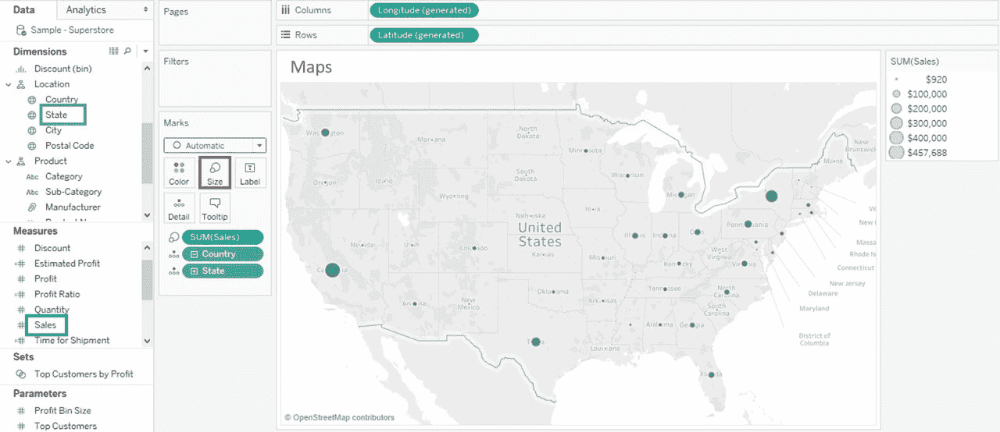
*   选择*地图，*之后是*地图图层*。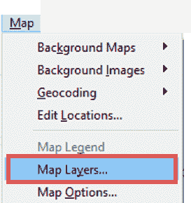
*   In the *Map Layers* pane, do the following:

    背景贴图将使用新设置进行更新。

## **Tableau 图表:** **子弹图表**

项目符号图通过比较指标来显示目标的进度。本质上，项目符号图是条形图的变体。项目符号图旨在取代仪表板计量器、仪表和温度计，它可以在占用较少空间的情况下显示更多信息。项目符号图显示了某个指标在某个时间点的表现。因为它不显示历史，这个图表最适合于快速的“我们做得怎么样”仪表板，而不是深入的分析。

为了实现这一目标，以下是步骤。

*   将维度*子类别*从数据窗格拖放到列架中。
*   将指标*利润*拖放到行货架上。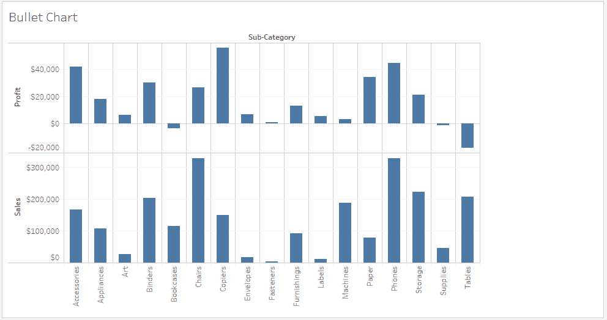

此图表将两个度量显示为两个独立的条形图类别，每个类别代表子类别的值。

*   下图显示了项目符号图。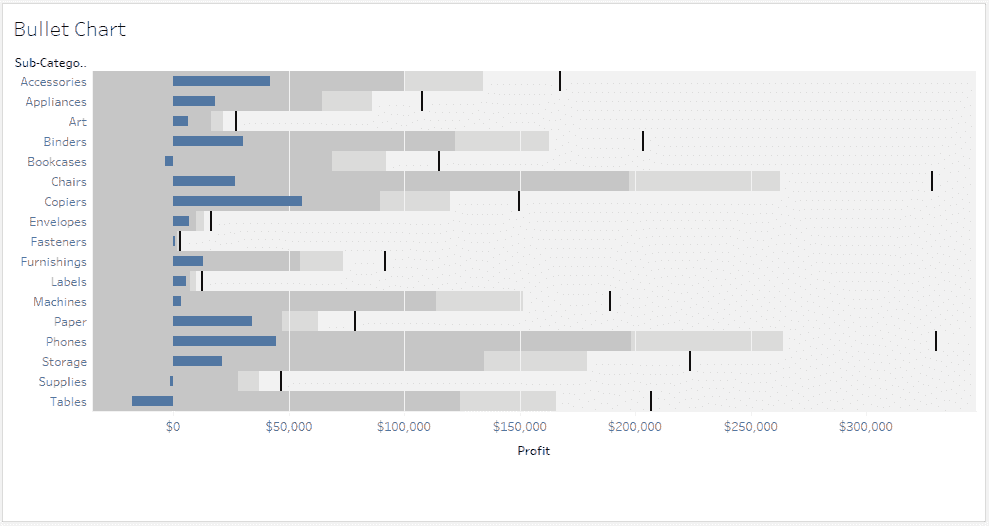

## **表格图:** **甘特图**

甘特图是专门为说明流程或项目中各步骤的开始和完成日期而构建的。这个图表可以很容易地说明关键交付物、所有者和截止日期。时间序列数据以自然、易于理解的格式呈现在甘特图上。例如，机器使用的持续时间，或者团队成员的可用性。甘特图显示在其他步骤开始之前需要完成的步骤，或者哪些资源被过量使用。不过，甘特图并不局限于项目:用这种图表类型表示任何时间序列数据。试着用这些来展示一个多步骤的过程是如何进行的。颜色可用于显示哪些步骤执行不足或执行过度。

创建甘特图的步骤如下。

*   转到新工作表。
    1.  点击标记卡中的下拉按钮。
    2.  从列表中选择*甘特条形图*。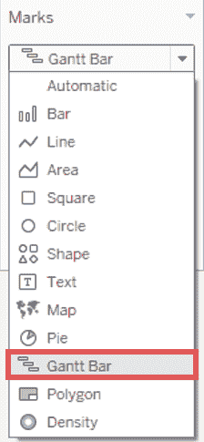

这将创建一个甘特图。它显示了不同运输方式下每次运输所用的时间。

## **画面图:** **方框图和触须图**

盒须图是显示数据分布的一种常用方法。该名称指的是图表的两个部分:方框，它包含数据的中值以及第一和第三个四分位数(比中值大和小 25%)，以及触须，它通常表示 1.5 倍四分位数范围内的数据(第一和第三个四分位数之间的差值)。触须也可用于显示数据中的最大值和最小值。使用盒须图看一眼就能理解你的数据。查看数据如何向一端倾斜，并识别数据中的异常值。例如，比较不同站点之间的得分，分析流程变更前后的数据，或者检查生产相同产品的重复机器的数据。

*   打开一个新工作表。
    1.  拖动  *段* 维到  *列* 。
    2.  拖动度量到  *行* 。Tableau 创建一个垂直轴并显示一个条形图—当在  列 架上有一个维度并且在  行 架上有一个度量时的默认图表类型。
    3.  将  *区域* 维度拖动到  列，并将其放到  段的右侧。现在，视图中从左到右有了两级维度层次结构，区域(沿底部列出)嵌套在段(沿顶部列出)中。
    4.  点击工具栏中的，然后选择盒须图图表类型。
    5.  拖动 *区域* 从标志卡回到 列 ，到 段 的右边。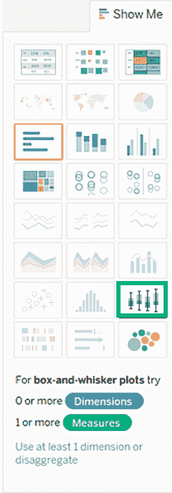

Tableau 显示一个方框图。水平线是扁平的盒状图，这是盒状图基于单个标记时发生的情况。盒状图旨在显示数据的分布，当数据被聚集时，这可能是困难的，如在当前视图中。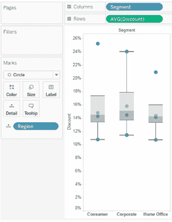

## **Tableau 图表:** **瀑布图表**

瀑布图因其类似的方向和流向而得名。在这里，我们绘制了超市多年来的销售情况，显示了销售实际下降的情况，以及下降的幅度。这意味着此类图表用于分析一项措施的累积效应，并查看其总体上如何增加和减少。为了更好地理解这一点，让我们把它形象化。

*   右键点击绿色*利润*药丸，选择*快表* *计算>累计*。
*   将标记类型从*自动*更改为*甘特条形图*:
*   像这样创建一个名为*负利润*的*计算字段*。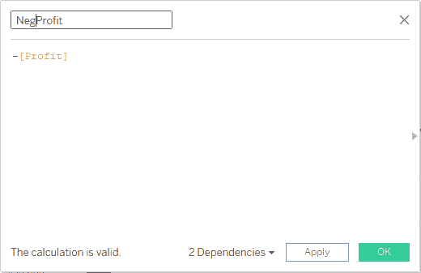
*   将此*负利润*拖过*标志*架中的*尺寸*即可获得:

计算字段用于填充甘特图中的空间。负的利润值将向下延伸，而正的利润值将向上延伸。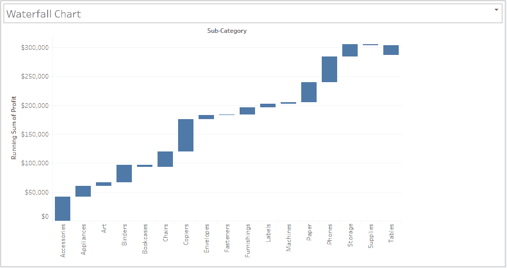

图表中每个小条形的长度代表一个月到下一个月的利润变化量。

*   最后，将标记卡中的*利润*拖到*颜色*处。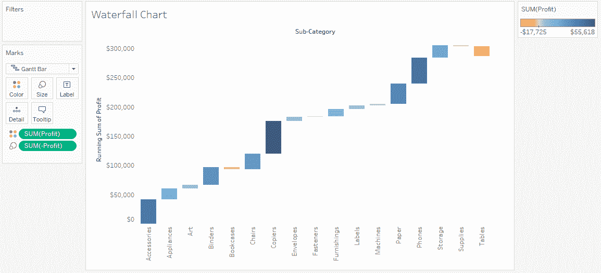
*   你也可以将颜色改为两步变化，清楚地观察上升和下降。

你将得到的图表也可以很容易地以条形图的形式表示出来。但我相信您会同意，使用瀑布图是一种更直观的数据表示方式，尤其是在查看多年来销售额和利润等指标的变化时。

## **画面图:动作图**

好了，现在这个图表实际上很简单，但我发现它足够吸引人，可以写进我的博客。它的灵感来自于汉斯·罗斯林的世界经济报告。如果你还没看过，我建议你在这个环节之后花一分钟时间看一看。

现在，制作如下趋势线对你来说应该很容易。但是我们要做的是创造运动。像 GIF，但是更好。

所以，让我们开始吧！

*   创建一个趋势图，以 X 轴为*订单日期*(以月为单位)，以*销售额*和*利润* t 为*度量*
*   要制作运动图，您只需将*订单日期*拖到页面架上，并再次更改格式以匹配 X 轴。
*   将标记类型从*自动*改为*圆形*。
*   转到*显示历史*并选择*轨迹*查看趋势变化。瞧！你的运动图表已经准备好了。
*   按箭头按钮查看动作，更改*显示历史*定制，速度等。

将数据放在孤立的静态图表中会限制您可以回答的问题的数量和深度。让您的分析成为您组织的核心，用它来推动探索。组合相关图表。添加地图。提供过滤器以深入挖掘。影响？[即时商业洞察](https://www.edureka.co/blog/do-magic-with-tableau)以及实际推动商业决策的问题答案。

<section class="section section--padding-two">

那么，哪张图表适合你呢？

如果你是一个有抱负的 Tableau 开发者，理解 Tableau 是必不可少的。查看我们的 [Tableau 培训](https://www.edureka.co/tableau-certification-training)课程，获取关于这款强大软件的所有信息。

</section>